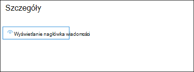
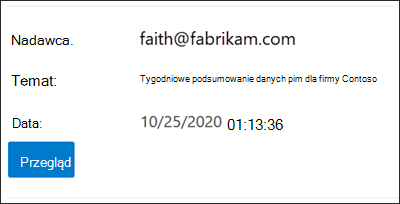

# <a name="quarantine-policies"></a>Zasady kwarantanny

> [!NOTE]
> Funkcje opisane w tym artykule są obecnie dostępne w wersji Preview, nie są dostępne dla wszystkich i mogą ulec zmianie.

Zasady kwarantanny (wcześniej nazywane tagami kwarantanny) w u administratorach programu Exchange Online Protection (EOP) pozwalają administratorom kontrolować, co użytkownicy mogą robić w ich wiadomościach poddanych kwarantannie, na podstawie tego, jak wiadomość dotarła do kwarantanny.

Program EOP zazwyczaj zezwolił na określone poziomy interakcji w przypadku wiadomości poddanych [](find-and-release-quarantined-messages-as-a-user.md) kwarantannie i w powiadomieniach użytkowników [końcowych o spamie](use-spam-notifications-to-release-and-report-quarantined-messages.md). Na przykład użytkownicy mogą wyświetlać i zwalniać wiadomości poddane kwarantannie przez filtrowanie spamu jako spam lub zbiorczo, ale nie mogą wyświetlać ani zwalniać wiadomości poddanych kwarantannie jako próby wyłudzenia informacji o wysokiej pewności (tylko administratorzy mogą to zrobić).

W [przypadku obsługiwanych funkcji](#step-2-assign-a-quarantine-policy-to-supported-features) ochrony zasady kwarantanny określają, co użytkownicy mogą robić w wiadomościach z powiadomieniami użytkowników końcowych o spamie i w ich kwarantannie w kwarantannie (wiadomości, w których użytkownik jest adresatem). Domyślne zasady kwarantanny są przypisywane automatycznie w celu wymuszania funkcji historycznych dla użytkowników w wiadomościach poddanych kwarantannie. Można też utworzyć i przypisać niestandardowe zasady kwarantanny, aby zezwolić użytkownikom na wykonywanie określonych akcji w wiadomościach poddanych kwarantannie lub uniemożliwić im wykonywanie określonych akcji.

Poszczególne uprawnienia są łączone z następującymi wstępnie ustawionymi grupami uprawnień:

- Brak dostępu
- Ograniczony dostęp
- Pełny dostęp

Dostępne poszczególne uprawnienia oraz uprawnienia zawarte lub nieuejmowane w wstępnie ustawionych grupach uprawnień opisano w poniższej tabeli:

<br>

****

|Uprawnienie|Brak dostępu|Ograniczony dostęp|Pełny dostęp|
|---|:---:|:---:|:---:|
|**Zezwalaj nadawcy** (_PermissionToAllowSender_)||||
|**Blokowanie nadawcy** (_PermissionToBlockSender_)||||
|**Delete** (_PermissionToDelete_)||||
|**Podgląd** (_permissionToPreview_)||||
|**Zezwalanie adresatom na wydanie wiadomości z kwarantanny** (_PermissionToRelease_)||||
|**Zezwalaj adresatom na żądanie przesłania wiadomości** do kwarantanny (_PermissionToRequestRelease_)||||
|

Jeśli nie podoba Ci się domyślne uprawnienia w wstępnie ustawionych grupach uprawnień, możesz użyć uprawnień niestandardowych podczas tworzenia lub modyfikowania niestandardowych zasad kwarantanny. Aby uzyskać więcej informacji o tym, do czego mają uprawnienia, [zobacz sekcję](#quarantine-policy-permission-details) Szczegóły uprawnień do kwarantanny zasad w dalszej części tego artykułu.

Zasady kwarantanny tworzy się i przypisuje w portalu usługi Microsoft 365 Defender lub w programie PowerShell (Exchange Online PowerShell dla organizacji Microsoft 365 ze skrzynkami pocztowymi programu Exchange Online; autonomiczny program PowerShell usługi EOP w organizacjach usługi EOP bez Exchange Online skrzynki pocztowe).

## <a name="what-do-you-need-to-know-before-you-begin"></a>Co należy wiedzieć przed rozpoczęciem?

- Otwierasz portal Microsoft 365 Defender w witrynie <https://security.microsoft.com>. Aby przejść bezpośrednio do strony Zasady **kwarantanny** , otwórz stronę <https://security.microsoft.com/quarantineTags>.

- Aby nawiązać połączenie Exchange Online PowerShell, zobacz Połączenie [aby Exchange Online PowerShell](/powershell/exchange/connect-to-exchange-online-powershell). Aby nawiązać połączenie z autonomicznym programem EOP PowerShell, [Połączenie się z Exchange Online Protection PowerShell](/powershell/exchange/connect-to-exchange-online-protection-powershell).

- Aby wyświetlać, tworzyć, modyfikować lub usuwać zasady kwarantanny, musisz być członkiem ról Zarządzanie  organizacją lub **Administrator** zabezpieczeń w portalu Microsoft 365 Defender zabezpieczeń. Aby uzyskać więcej informacji, [zobacz Uprawnienia w portalu Microsoft 365 Defender witryny](permissions-microsoft-365-security-center.md).

## <a name="step-1-create-quarantine-policies-in-the-microsoft-365-defender-portal"></a>Krok 1. Tworzenie zasad kwarantanny w portalu Microsoft 365 Defender poczty

1. W portalu Microsoft 365 Defender przejdź do sekcji Reguły & poczty **e-mail** \> \>  \> zasady zagrożeń, kwarantanny, **a następnie wybierz** pozycję **Zasady kwarantanny**.

2. Na stronie **Zasady kwarantanny** kliknij pozycję Dodaj  **Dodaj zasady niestandardowe**.

3. Zostanie **otwarty kreator Nowych** zasad. Na stronie **Nazwa zasad** wprowadź krótką, ale unikatową nazwę w **polu Nazwa zasad** . W kolejnych krokach należy zidentyfikować i wybrać zasady kwarantanny według nazwy. Po zakończeniu kliknij przycisk **Dalej**.

4. Na stronie **Dostęp do wiadomości adresata** wybierz jedną z następujących wartości:
   - **Brak dostępu**
   - **Ograniczony dostęp**
   - **Pełny dostęp**

   Poszczególne uprawnienia zawarte w tych grupach uprawnień są opisane wcześniej w tym artykule.

   Aby określić uprawnienia niestandardowe, wybierz **pozycję Ustaw określony dostęp (Zaawansowane)** i skonfiguruj wyświetlone następujące ustawienia:

     - **Wybierz preferencję akcji zwolnienia**: Wybierz jedną z następujących wartości:
       - **Brak akcji wydania**: jest to wartość domyślna.
       - **Zezwalanie adresatom na wypuszczenie wiadomości z kwarantanny**
       - **Zezwalaj adresatom na żądanie wypuszczeniu wiadomości z kwarantanny**
     - **Wybierz dodatkowe akcje, które adresaci mogą podjąć w przypadku** wiadomości poddanych kwarantannie: Zaznacz niektóre, wszystkie lub żadną z następujących wartości:
       - **Usuń**
       - **Wersja zapoznawcza**
       - **Blokowanie nadawcy**

   Te uprawnienia i ich wpływ na wiadomości poddanych kwarantannie i powiadomienia użytkowników końcowych o spamie są opisane w sekcji Szczegółów uprawnień do zasad kwarantanny [w](#quarantine-policy-permission-details) dalszej części tego artykułu.

   Po zakończeniu kliknij przycisk **Dalej**.

5. Na **wyświetlonej stronie** Przeglądanie zasad przejrzyj ustawienia. Możesz wybrać pozycję **Edytuj** w każdej sekcji, aby zmodyfikować ustawienia w sekcji. Możesz też kliknąć przycisk **Wstecz** lub wybrać określoną stronę w kreatorze.

   Po zakończeniu kliknij pozycję **Prześlij**.

6. Na wyświetlonej stronie potwierdzenia kliknij pozycję **Gotowe**.

Teraz możesz przypisać zasady kwarantanny do funkcji kwarantanny zgodnie z opisem w [sekcji Krok 2](#step-2-assign-a-quarantine-policy-to-supported-features) .

### <a name="create-quarantine-policies-in-powershell"></a>Tworzenie zasad kwarantanny w programie PowerShell

Jeśli wolisz tworzyć zasady kwarantanny za pomocą programu PowerShell, połącz się z programem PowerShell Exchange Online lub Exchange Online Protection PowerShell i użyj polecenia cmdlet **New-QuarantineTag**. Dostępne są dwie różne metody do wyboru:

- Użyj _parametru EndUserQuarantinePermissionsValue_ .
- Użyj _parametru EndUserQuarantinePermissions_ .

Te metody opisano w poniższych sekcjach.

#### <a name="use-the-enduserquarantinepermissionsvalue-parameter"></a>Użyj parametru EndUserQuarantinePermissionsValue

Aby utworzyć zasady kwarantanny przy użyciu _parametru EndUserQuarantinePermissionsValue_ , użyj następującej składni:

```powershell
New-QuarantineTag -Name "<UniqueName>" -EndUserQuarantinePermissionsValue <0 to 236>
```

Parametr _EndUserQuarantinePermissionsValue_ używa wartości dziesiętnej przekonwertowanej z wartości binarnej. Wartość binarna odpowiada dostępnym uprawnieniam użytkownika końcowego do kwarantanny w określonej kolejności. Dla każdego uprawnienia wartość 1 jest równa wartości Prawda, a wartość 0 równa się Fałsz.

Wymaganą kolejność i wartości dla poszczególnych uprawnień w wstępnie ustawionych grupach uprawnień opisano w poniższej tabeli:

<br>

****

|Uprawnienie|Brak dostępu|Ograniczony dostęp|Pełny dostęp|
|---|:---:|:---:|:---:|
|PermissionToAllowSender|0|0|1|
|PermissionToBlockSender|0|1|1|
|PermissionToDelete|0|1|1|
|PermissionToDownload<sup>\*</sup>|0|0|0|
|PermissionToPreview|0|1|1|
|PermissionToRelease<sup>\*\*</sup>|0|0|1|
|PermissionToRequestRelease<sup>\*\*</sup>|0|1|0|
|PermissionToViewHeader<sup>\*</sup>|0|0|0|
|Wartość binarna|00000000|01101010|11101100|
|Wartość dziesiętna do użycia|0|106|236|
|

<sup>\*</sup> Obecnie ta wartość jest zawsze 0. W przypadku nagłówka PermissionToViewHeader wartość 0 nie ukrywa przycisku Wyświetl  nagłówek wiadomości w szczegółach wiadomości poddanej kwarantannie (ten przycisk jest zawsze dostępny).

<sup>\*\*</sup> Nie ustawiaj wartości obu tych wartości na 1. Ustaw jedną wartość na 1, a drugą na 0 lub wartość 0 obu na 0.

W tym przykładzie jest dzieloną nową nazwę zasad kwarantanny NoAccess z przypisaną wartością Brak uprawnień dostępu zgodnie z opisem w poprzedniej tabeli.

```powershell
New-QuarantineTag -Name NoAccess -EndUserQuarantinePermissionsValue 0
```

W przypadku uprawnienia Ograniczony dostęp użyj wartości 106. W przypadku uprawnień Pełny dostęp użyj wartości 236.

W przypadku uprawnień niestandardowych użyj poprzedniej tabeli, aby uzyskać wartość binarną odpowiadającą wymaganym uprawnieniam. Przekonwertuj wartość binarną na wartość dziesiętną i użyj wartości dziesiętnej dla parametru _EndUserQuarantinePermissionsValue_ .

Aby uzyskać szczegółowe informacje o składni i parametrach, zobacz [Nowy-Tag Kwarantanny](/powershell/module/exchange/new-quarantinetag).

#### <a name="use-the-enduserquarantinepermissions-parameter"></a>Użyj parametru EndUserQuarantinePermissions

Aby utworzyć zasady kwarantanny przy użyciu _parametru EndUserQuarantinePermissionsValue_ , wykonaj następujące czynności:

Odp. Przechowuj obiekt uprawnień kwarantanny w zmiennej za pomocą polecenia cmdlet **New-QuarantinePermissions** .

<p>

B. Użyj zmiennej jako wartości _EndUserQuarantinePermissions_ w **poleceniu New-QuarantineTag** .

##### <a name="step-a-store-a-quarantine-permissions-object-in-a-variable"></a>Krok A. Przechowywanie obiektu uprawnień kwarantanny w zmiennej

Należy stosować następującą składnię:

```powershell
$<VariableName> = New-QuarantinePermissions [-PermissionToAllowSender <$true | $False>] [-PermissionToBlockSender <$true | $False>] [-PermissionToDelete <$true | $False>] [-PermissionToPreview <$true | $False>] [-PermissionToRelease <$true | $False>] [-PermissionToRequestRelease <$true | $False>]
```

Wartość domyślna dla nieużywanych parametrów to `$false`, więc wystarczy użyć parametrów, dla których ma zostać ustawiona wartość `$true`.

W poniższych przykładach podano, jak utworzyć obiekty uprawnień odpowiadające wstępnie ustawionym grupom uprawnień:

- **Brak dostępu**:

  ```powershell
  $NoAccess = New-QuarantinePermissions
  ```

- **Ograniczony dostęp**:

  ```powershell
  $LimitedAccess = New-QuarantinePermissions -PermissionToBlockSender $true -PermissionToDelete $true -PermissionToPreview $true -PermissionToRequestRelease $true
  ```

- **Pełny dostęp**:

  ```powershell
  $FullAccess = New-QuarantinePermissions -PermissionToAllowSender $true -PermissionToBlockSender $true -PermissionToDelete $true -PermissionToPreview $true -PermissionToRelease $true
  ```

Aby zobaczyć ustawione wartości, uruchom nazwę zmiennej jako polecenie (na przykład uruchom polecenie `$NoAccess`).

W przypadku uprawnień niestandardowych nie ustawiaj dla parametrów _PermissionToRelease_ i _PermissionToRequestRelease_ wartości `$true`. Ustaw jeden z nich `$true` na i pozostaw drugi jako `$false`, lub pozostaw oba jako `$false`.

Można także zmodyfikować istniejącą zmienną obiektu uprawnień po utworzeniu, ale przed jej użyciem przy użyciu polecenia cmdlet **Set-QuarantinePermissions** .

Aby uzyskać szczegółowe informacje o składni i parametrach, zobacz [Polecenia New-QuarantinePermissions](/powershell/module/exchange/new-quarantinepermissions) i [Set-QuarantinePermissions](/powershell/module/exchange/set-quarantinepermissions).

##### <a name="step-b-use-the-variable-in-the-new-quarantinetag-command"></a>Krok B. Używanie zmiennej w poleceniu New-QuarantineTag

Po utworzeniu i zapisaniu obiektu uprawnień w zmiennej użyj zmiennej dla wartości parametru _EndUserQuarantinePermission_ w następującym poleceniu **New-QuarantineTag** :

```powershell
New-QuarantineTag -Name "<UniqueName>" -EndUserQuarantinePermissions $<VariableName>
```

W tym przykładzie są tworzone nowe zasady kwarantanny o nazwie LimitedAccess `$LimitedAccess` przy użyciu obiektu uprawnień opisanego i utworzonego w poprzednim kroku.

```powershell
New-QuarantineTag -Name LimitedAccess -EndUserQuarantinePermissions $LimitedAccess
```

Aby uzyskać szczegółowe informacje o składni i parametrach, zobacz [Nowy-Tag Kwarantanny](/powershell/module/exchange/new-quarantinetag).

## <a name="step-2-assign-a-quarantine-policy-to-supported-features"></a>Krok 2. Przypisywanie zasad kwarantanny do obsługiwanych funkcji

W _obsługiwanych_ funkcjach ochrony, które poddasz kwarantannie wiadomości lub pliki (automatycznie lub jako konfigurować akcję), możesz przypisać zasady kwarantanny do dostępnych akcji kwarantanny. Funkcje kwarantanny wiadomości i dostępność zasad kwarantanny są opisane w poniższej tabeli:

<br>

****

|Funkcja|Czy zasady kwarantanny są obsługiwane?|Domyślne zasady kwarantanny używane|
|---|:---:|---|
|[Zasady ochrony przed spamem](configure-your-spam-filter-policies.md): <ul><li>**Spam** (_SpamAction_)</li><li>**Spam o dużej pewności** (_HighConfidenceSpamAction_)</li><li>**Wyłudzanie** informacji (_phishSpamAction_)</li><li>**Wyłudzanie informacji** o wysokiej pewności (_HighConfidencePhishAction_)</li><li>**Bulk** (_BulkSpamAction_)</li></ul>|Tak|<ul><li>DefaultSpamTag (Pełny dostęp)</li><li>DefaultHighConfSpamTag (Pełny dostęp)</li><li>DefaultPhishTag (Pełny dostęp)</li><li>DefaultHighConfPhishTag (Brak dostępu)</li><li>DefaultBulkTag (Pełny dostęp)</li></ul>
|Zasady ochrony przed wyłudzaniem informacji: <ul><li>[Ochrona przed fałszerami](set-up-anti-phishing-policies.md#spoof-settings) (_UwierzytelnianieFailucja_)</li><li>[Ochrona personifikacji](set-up-anti-phishing-policies.md#impersonation-settings-in-anti-phishing-policies-in-microsoft-defender-for-office-365):<sup>\*</sup> <ul><li>**Jeśli wiadomość zostanie wykryta jako personifikowany użytkownik** (_TargetedUserProtectionAction_)</li><li>**Jeśli wiadomość zostanie wykryta jako spersonifikowana domena** (_TargetedDomainProtectionAction_)</li><li>**Jeśli inteligencja skrzynek pocztowych wykryje i personifikuje** użytkownika (_MailboxIntelligenceProtectionAction_)</li></ul></li></ul></ul>|Nie|n/a|
|[Zasady ochrony przed złośliwym oprogramowaniem](configure-anti-malware-policies.md): Wszystkie wykryte wiadomości są zawsze poddane kwarantannie.|Nie|n/a|
|[Sejf załączników do SharePoint, OneDrive i Microsoft Teams](mdo-for-spo-odb-and-teams.md)|Nie|n/a|
|[Reguły przepływu poczty](/exchange/security-and-compliance/mail-flow-rules/mail-flow-rules) (nazywane także regułami transportu) z akcją: **Dostarczanie** wiadomości do hostowanej kwarantanny (_Kwarantanna_).|Nie|n/a|
|

<sup>\*</sup>Ustawienia ochrony przed personifikacji są dostępne tylko w zasadach ochrony przed wyłudzaniem informacji w programie Microsoft Defender dla Office 365.

Jeśli cieszysz się z uprawnień użytkownika końcowego, które są zapewniane przez domyślne zasady kwarantanny, nie musisz nic robić. Jeśli chcesz dostosować możliwości użytkowników końcowych (dostępne przyciski) w powiadomieniach użytkowników końcowych o spamie lub w szczegółach wiadomości poddanych kwarantannie, możesz przypisać niestandardowe zasady kwarantanny.

### <a name="assign-quarantine-policies-in-anti-spam-policies-in-the-microsoft-365-defender-portal"></a>Przypisywanie zasad kwarantanny w zasadach ochrony przed spamem w Microsoft 365 Defender poczty

Pełne instrukcje dotyczące tworzenia i modyfikowania zasad ochrony przed spamem opisano w tece Konfigurowanie zasad ochrony [przed spamem w uciekaniu usługi EOP](configure-your-spam-filter-policies.md).

1. W portalu Microsoft 365 Defender przejdź  \>  \> do sekcji Ochrona przed spamem & **e-mail** & **zasad** dotyczących reguł\>. Możesz też otworzyć program <https://security.microsoft.com/antispam>.

2. Na stronie **Zasady ochrony przed spamem** wykonaj jedną z następujących czynności:
   - Znajdź i wybierz istniejące zasady **przychodzącej** ochrony przed spamem.
   - Utwórz nowe zasady **przychodzącej** ochrony przed spamem.

3. Wykonaj jedną z następujących czynności:
   - **Edytuj istniejące zasady ochrony przed spamem**: W wysuwanych szczegółach zasad przejdź do sekcji **Akcje** , a następnie kliknij **pozycję Edytuj akcje**.
   - **Tworzenie nowych zasad ochrony przed spamem**: W kreatorze nowych zasad przejdź do **strony Akcje** .

4. Na **stronie Akcje** . Każdy werdykt z akcją **kwarantanny** wiadomości będzie również miał pole **Wybierz** zasady kwarantanny, aby wybrać odpowiednie zasady kwarantanny.

   **Uwaga**: Gdy tworzysz nowe zasady, wartość pustych  zasad Wybierz kwarantannę wskazuje domyślne zasady kwarantanny dla tego werdyktu. Podczas późniejszego edytowania zasad puste wartości są zamieniane na rzeczywiste domyślne nazwy zasad kwarantanny zgodnie z opisem w poprzedniej tabeli.

   

5. Po zakończeniu kliknij przycisk **Zapisz**.

#### <a name="assign-quarantine-policies-in-anti-spam-policies-in-powershell"></a>Przypisywanie zasad kwarantanny w zasadach ochrony przed spamem w programie PowerShell

Jeśli wolisz używać programu PowerShell do przypisywania zasad kwarantanny w zasadach ochrony przed spamem, połącz się z programem Exchange Online PowerShell lub Exchange Online Protection PowerShell i użyj następującej składni:

```powershell
<New-HostedContentFilterPolicy -Name "<Unique name>" | Set-HostedContentFilterPolicy -Identity "<Policy name>">  [-SpamAction Quarantine] [-SpamQuarantineTag <QuarantineTagName>] [-HighConfidenceSpamAction Quarantine] [-HighConfidenceSpamQuarantineTag <QuarantineTagName>] [-PhishSpamAction Quarantine] [-PhishQuarantineTag <QuarantineTagName>] [-HighConfidencePhishQuarantineTag <QuarantineTagName>] [-BulkSpamAction Quarantine] [-BulkQuarantineTag <QuarantineTagName>] ...
```

**Uwagi**:

- Wartość domyślna parametru _HighConfidencePhishAction_ to Kwarantanna, więc nie musisz ustawiać akcji Kwarantanny, aby wykrywanie prób wyłudzenia dużej pewności było wykrywane w nowych zasadach ochrony przed spamem. W przypadku wszystkich innych werdyktów filtrowania spamu w nowych lub istniejących zasadach ochrony przed spamem zasady kwarantanny są skuteczne tylko wtedy, gdy wartość akcji to Kwarantanna. Aby wyświetlić wartości akcji w istniejących zasadach ochrony przed spamem, uruchom następujące polecenie:

  ```powershell
  Get-HostedContentFilterPolicy | Format-Table Name,*SpamAction,HighConfidencePhishAction
  ```

  Aby uzyskać informacje o domyślnych wartościach akcji i wartościach akcji zalecanych dla ustawień Standardowe i Ścisłe, zobacz Ustawienia zasad ochrony [przed spamem firmy EOP](recommended-settings-for-eop-and-office365.md#eop-anti-spam-policy-settings).

- Werdykt filtrowania spamu bez odpowiedniego parametru zasad [](#step-2-assign-a-quarantine-policy-to-supported-features) kwarantanny oznacza, że są używane domyślne zasady kwarantanny dla tego werdyktu.

  Wystarczy zamienić domyślne zasady kwarantanny na niestandardowe zasady kwarantanny, jeśli chcesz zmienić domyślne funkcje użytkowników końcowych w wiadomościach poddanych kwarantannie.

- Nowe zasady ochrony przed spamem w programie PowerShell wymagają zasad (ustawień) filtrowania spamu przy użyciu polecenia cmdlet **New-HostedContentFilterPolicy** i nowej reguły filtru spamu (filtrów adresatów) przy użyciu polecenia cmdlet **New-HostedContentFilterRule** . Aby uzyskać instrukcje, [zobacz Tworzenie zasad ochrony przed spamem za pomocą programu PowerShell](configure-your-spam-filter-policies.md#use-powershell-to-create-anti-spam-policies).

W tym przykładzie są owane nowe zasady filtrowania spamu o nazwie Dział badań z następującymi ustawieniami:

- Akcja dla wszystkich werdyktów filtrowania spamu jest ustawiona na Kwarantannę.
- Niestandardowe zasady kwarantanny o nazwie NoAccess, które  przypisują uprawnienia Brak dostępu, zastępują domyślne zasady kwarantanny, które domyślnie nie przypisują jeszcze **żadnych** uprawnień dostępu.

```powershell
New-HostedContentFilterPolicy -Name Research Department -SpamAction Quarantine -SpamQuarantineTag NoAccess -HighConfidenceSpamAction Quarantine -HighConfidenceSpamQuarantineTag NoAction -PhishSpamAction Quarantine -PhishQuarantineTag NoAction -BulkSpamAction Quarantine -BulkQuarantineTag NoAccess
```

Aby uzyskać szczegółowe informacje o składni i parametrach, [zobacz New-HostedContentFilterPolicy](/powershell/module/exchange/new-hostedcontentfilterpolicy).

W tym przykładzie zmodyfikowane są istniejące zasady filtrowania spamu o nazwie Zasoby ludzkie. Akcja dla werdyktu kwarantanny antyspamowej jest ustawiona na kwarantannę i zostanie przypisana niestandardowa zasada kwarantanny o nazwie NoAccess.

```powershell
Set-HostedContentFilterPolicy -Identity "Human Resources" -SpamAction Quarantine -SpamQuarantineTag NoAccess
```

Aby uzyskać szczegółowe informacje o składni i parametrach, [zobacz Set-HostedContentFilterPolicy](/powershell/module/exchange/set-hostedcontentfilterpolicy).

## <a name="configure-global-quarantine-notification-settings-in-the-microsoft-365-defender-portal"></a>Konfigurowanie ustawień powiadomień globalnej kwarantanny w Microsoft 365 Defender poczty e-mail

Globalne ustawienia zasad kwarantanny umożliwiają dostosowanie powiadomień użytkowników końcowych o spamie wysyłanych do adresatów wiadomości poddanych kwarantannie. Aby uzyskać więcej informacji na temat tych powiadomień, zobacz [Powiadomienia użytkowników końcowych o spamie](use-spam-notifications-to-release-and-report-quarantined-messages.md).

1. W portalu Microsoft 365 Defender przejdź do sekcji Reguły & poczty **e-mail** \> \>  \> zasady zagrożeń, kwarantanny, **a następnie wybierz** pozycję **Zasady kwarantanny**.

2. Na stronie **Zasady kwarantanny** wybierz pozycję **Ustawienia globalne**.

3. W **czacie wysuwanych ustawień** powiadomień kwarantanny skonfiguruj niektóre lub wszystkie z następujących ustawień:

   - **Nazwa wyświetlana**: dostosuj nazwę wyświetlaną nadawcy, która jest używana w powiadomieniach użytkowników końcowych o spamie.

     Dla każdego dodanego języka wybierz język w drugim polu języka (nie klikaj znaku X) i wprowadź wartość tekstową w polu Nazwa **wyświetlana** .

     Poniższy zrzut ekranu przedstawia niestandardową nazwę wyświetlaną w powiadomieniu użytkownika końcowego o spamie:

     

   - **Zastrzeżenie**: Dodaj niestandardowe zastrzeżenie w dolnej części powiadomień użytkowników końcowych o spamie. Zlokalizowany tekst ( **Zastrzeżenie z Twojej organizacji:** jest zawsze uwzględniany jako pierwszy), a po nim określony tekst.

     Dla każdego dodanego języka wybierz język w drugim polu języka (nie klikaj znaku X) i wprowadź wartość tekstową w polu Zastrzeżenie.

     Poniższy zrzut ekranu przedstawia dostosowane zastrzeżenie w powiadomieniu użytkownika końcowego o spamie:

     

   - **Wybierz język**: Powiadomienia użytkowników końcowych o spamie są już zlokalizowane na podstawie ustawień językowych adresata. Dla wartości Nazwa wyświetlana i Zastrzeżenie można określić tekst niestandardowy w różnych  **językach**.

     Wybierz co najmniej jeden język w pierwszym polu języka, a następnie kliknij przycisk **Dodaj**. Możesz wybrać wiele języków, klikając pozycję **Dodaj** po każdym z nich. W polu Język sekcji są wszystkie wybrane języki:

     

   - **Użyj logo firmy**: wybierz tę opcję, aby zastąpić domyślne logo firmy Microsoft, które jest wyświetlane u góry powiadomień użytkowników końcowych o spamie. Zanim to zrobisz, należy postępować zgodnie z instrukcjami w temacie Dostosowywanie motywu Microsoft 365 [organizacji](../../admin/setup/customize-your-organization-theme.md) w celu przekazania niestandardowego logo.

     Poniższy zrzut ekranu przedstawia niestandardowe logo w powiadomieniu użytkowników końcowych o spamie:

     

## <a name="view-quarantine-policies-in-the-microsoft-365-defender-portal"></a>Wyświetlanie zasad kwarantanny w Microsoft 365 Defender poczty

1. W portalu Microsoft 365 Defender przejdź do sekcji Reguły & poczty **e-mail** \> \>  \> zasady zagrożeń, kwarantanny, **a następnie wybierz** pozycję **Zasady kwarantanny**.

2. Strona **Zasady kwarantanny** zawiera listę zasad według pól **Nazwa** **i Data ostatniej** aktualizacji.

3. Aby wyświetlić ustawienia wbudowanych lub niestandardowych zasad kwarantanny, wybierz zasady kwarantanny z listy, klikając nazwę.

4. Aby wyświetlić ustawienia globalne, kliknij pozycję **Ustawienia globalne**

### <a name="view-quarantine-policies-in-powershell"></a>Wyświetlanie zasad kwarantanny w programie PowerShell

Jeśli wolisz wyświetlać zasady kwarantanny za pomocą programu PowerShell, wykonaj dowolną z następujących czynności:

- Aby wyświetlić listę podsumowania wszystkich wbudowanych lub niestandardowych zasad, uruchom następujące polecenie:

  ```powershell
  Get-QuarantineTag | Format-Table Name
  ```

- Aby wyświetlić ustawienia wbudowanych lub niestandardowych zasad kwarantanny kwarantanny, \<QuarantinePolicyName\> zastąp je nazwą zasad kwarantanny i uruchom następujące polecenie:

  ```powershell
  Get-QuarantineTag -Identity "<QuarantinePolicyName>"
  ```

- Aby wyświetlić ustawienia globalne, uruchom następujące polecenie:

  ```powershell
  Get-QuarantineTag -QuarantineTagType GlobalQuarantineTag
  ```

Aby uzyskać szczegółowe informacje o składni i parametrach, [zobacz Get-HostedContentFilterPolicy](/powershell/module/exchange/get-hostedcontentfilterpolicy).

## <a name="modify-quarantine-policies-in-the-microsoft-365-defender-portal"></a>Modyfikowanie zasad kwarantanny w Microsoft 365 Defender poczty

1. W portalu Microsoft 365 Defender przejdź do sekcji Reguły & poczty **e-mail** \> \>  \> zasady zagrożeń, kwarantanny, **a następnie wybierz** pozycję **Zasady kwarantanny**.

2. Na stronie **Kwarantanna** zasad wybierz zasady, klikając nazwę.

3. Po wybraniu zasad kliknij wyświetloną  Edytuj zasady **: Edytuj zasady** .

4. Otwarty **kreator edytuj** zasady jest praktycznie identyczny z kreatorem nowych  zasad zgodnie z opisem w sekcji Tworzenie zasad kwarantanny w Microsoft 365 Defender [portalu](#step-1-create-quarantine-policies-in-the-microsoft-365-defender-portal) we wcześniejszej części tego artykułu.

   Główna różnica polega na tym, że nie można zmienić nazwy istniejących zasad.

5. Po zakończeniu modyfikowania zasad przejdź do strony **Podsumowanie** i kliknij pozycję **Prześlij**.

### <a name="modify-quarantine-policies-in-powershell"></a>Modyfikowanie zasad kwarantanny w programie PowerShell

Jeśli wolisz użyć programu PowerShell do modyfikowania niestandardowych zasad kwarantanny, \<QuarantinePolicyName\> zamień je na nazwy zasad kwarantanny i użyj następującej składni:

```powershell
Set-QuarantineTag -Identity "<QuarantinePolicyName>" [Settings]
```

Dostępne ustawienia są takie same jak w przypadku tworzenia zasad kwarantanny we wcześniejszej wersji tego artykułu.

Aby uzyskać szczegółowe informacje o składni i parametrach, zobacz [Set-QuarantineTag](/powershell/module/exchange/set-quarantinetag).

## <a name="remove-quarantine-policies-in-the-microsoft-365-defender-portal"></a>Usuwanie zasad kwarantanny z Microsoft 365 Defender poczty

**Uwagi**:

- Nie można usunąć wbudowanych zasad kwarantanny.
- Przed usunięciem niestandardowych zasad kwarantanny sprawdź, czy nie są używane. Na przykład uruchom następujące polecenie w programie PowerShell:

  ```powershell
  Get-HostedContentFilterPolicy | Format-List Name,*QuarantineTag
  ```

  Jeśli zasady kwarantanny są używane, [zastąp przypisane](#step-2-assign-a-quarantine-policy-to-supported-features) zasady kwarantanny przed ich usunięciem.

1. W portalu Microsoft 365 Defender przejdź do sekcji Reguły & poczty **e-mail** \> \>  \> zasady zagrożeń, kwarantanny, **a następnie wybierz** pozycję **Zasady kwarantanny**.

2. Na stronie **Zasady kwarantanny** wybierz niestandardowe zasady kwarantanny, które chcesz usunąć, klikając nazwę.

3. Po wybraniu zasad kliknij wyświetloną  Usuń **zasady Usuń zasady** .

4. Kliknij **pozycję Usuń zasady** w wyświetlonym oknie dialogowym potwierdzenia.

### <a name="remove-quarantine-policies-in-powershell"></a>Usuwanie zasad kwarantanny w programie PowerShell

Jeśli wolisz używać programu PowerShell do usuwania niestandardowych zasad kwarantanny, \<QuarantinePolicyName\> zastąp je nazwą zasad kwarantanny i uruchom następujące polecenie:

```powershell
Remove-QuarantineTag -Identity "<QuarantinePolicyName>"
```

Aby uzyskać szczegółowe informacje o składni i parametrach, [zobacz Remove-QuarantineTag](/powershell/module/exchange/remove-quarantinetag).

## <a name="quarantine-policy-permission-details"></a>Szczegóły uprawnień do kwarantanny zasad

W poniższych sekcjach opisano efekty wstępnie ustawionych grup uprawnień i poszczególnych uprawnień w szczegółach wiadomości poddanych kwarantannie i w powiadomieniach użytkowników końcowych o spamie.

### <a name="preset-permissions-groups"></a>Wstępnie ustawione grupy uprawnień

Poszczególne uprawnienia zawarte w wstępnie ustawionych grupach uprawnień znajdują się w tabeli na początku tego artykułu.

#### <a name="no-access"></a>Brak dostępu

Jeśli zasady kwarantanny przypiszeją uprawnienia **Brak** dostępu (bez uprawnień), użytkownicy nadal mają pewne funkcje bazowe:

- **Szczegóły wiadomości poddane kwarantannie**: Przycisk **Wyświetl nagłówek wiadomości** jest zawsze dostępny.

  

- **Powiadomienia użytkowników końcowych o spamie**: przycisk **Recenzja** , który przenosi użytkownika do wiadomości w kwarantannie, jest zawsze dostępny.

  

#### <a name="limited-access"></a>Ograniczony dostęp

Jeśli zasady kwarantanny **przypiszeją** uprawnienia Ograniczony dostęp, użytkownicy otrzymają następujące możliwości:

- **Szczegóły wiadomości poddanej kwarantannie**: Dostępne są następujące przyciski:
  - **Zażądaj wydania**
  - **Wyświetlanie nagłówka wiadomości**
  - **Podgląd wiadomości**
  - **Blokowanie nadawcy**
  - **Usuwanie z kwarantanny**

  

- **Powiadomienia użytkowników końcowych o spamie**: Dostępne są następujące przyciski:
  - **Blokowanie nadawcy**
  - **Recenzja**

  

#### <a name="full-access"></a>Pełny dostęp

Jeśli zasady kwarantanny **przypiszeją** uprawnienia Pełny dostęp (wszystkie dostępne uprawnienia), użytkownicy otrzymają następujące funkcje:

- **Szczegóły wiadomości poddanej kwarantannie**: Dostępne są następujące przyciski:
  - **Komunikat o wersji**
  - **Wyświetlanie nagłówka wiadomości**
  - **Podgląd wiadomości**
  - **Blokowanie nadawcy**
  - **Zezwalaj nadawcy**
  - **Usuwanie z kwarantanny**

  

- **Powiadomienia użytkowników końcowych o spamie**: Dostępne są następujące przyciski:
  - **Blokowanie nadawcy**
  - **Wydanie**
  - **Recenzja**

  

### <a name="individual-permissions"></a>Indywidualne uprawnienia

> [!NOTE]
> Pamiętaj, że użytkownicy zawsze mogą uzyskać przyciski opisane w [sekcji Brak](#no-access) dostępu. Te przyciski nie są uwzględniane w poszczególnych opisach uprawnień.

#### <a name="allow-sender-permission"></a>Zezwalaj na uprawnienia nadawcy

Opcja **Zezwalaj nadawcy** na uprawnienie (_PermissionToAllowSender_) steruje dostępem do przycisku, który umożliwia użytkownikom wygodne dodawanie nadawcy pod kwarantanną do listy Sejf nadawców.

- **Szczegóły wiadomości poddanej kwarantannie**:
  - **Zezwalaj nadawcy** na uprawnienia włączone: Przycisk **Zezwalaj nadawcy** jest dostępny.
  - **Zezwalaj nadawcy** na wyłączone: Przycisk **Zezwalaj nadawcy** jest niedostępny.

- **Powiadomienia użytkowników końcowych o spamie**: Brak efektu.

Aby uzyskać więcej informacji na temat listy Sejf nadawców, zobacz Zapobieganie blokowaniu zaufanych nadawców i Konfigurowanie kolekcji listy bezpiecznych adresów w skrzynce pocztowej za pomocą programu [Exchange Online PowerShell](configure-junk-email-settings-on-exo-mailboxes.md#use-exchange-online-powershell-to-configure-the-safelist-collection-on-a-mailbox).[](https://support.microsoft.com/office/274ae301-5db2-4aad-be21-25413cede077#__toc304379666)

#### <a name="block-sender-permission"></a>Blokowanie uprawnień nadawcy

Uprawnienie **Blokowanie nadawców** (_PermissionToBlockSender_) steruje dostępem do przycisku, który pozwala użytkownikom na wygodne dodawanie nadawcy wiadomości poddanych kwarantannie do listy zablokowanych nadawców.

- **Szczegóły wiadomości poddanej kwarantannie**:
  - **Włączone uprawnienie Blokowanie** nadawcy: Przycisk Zablokuj **nadawcę** jest dostępny.
  - **Wyłączono uprawnienie** Blokowanie nadawcy: **Przycisk Zablokuj nadawcę** jest niedostępny.

- **Powiadomienia użytkowników końcowych o spamie**:
  - **Wyłączono uprawnienie** Blokowanie nadawcy: **Przycisk Zablokuj nadawcę** jest niedostępny.
  - **Włączone uprawnienie Blokowanie** nadawcy: Przycisk Zablokuj **nadawcę** jest dostępny.

Aby uzyskać więcej informacji na temat listy zablokowanych nadawców, [](https://support.microsoft.com/office/274ae301-5db2-4aad-be21-25413cede077#__toc304379667) zobacz Blokowanie wiadomości od kimś i Używanie programu Exchange Online PowerShell do konfigurowania kolekcji listy bezpiecznych adresów [w skrzynce pocztowej](configure-junk-email-settings-on-exo-mailboxes.md#use-exchange-online-powershell-to-configure-the-safelist-collection-on-a-mailbox).

#### <a name="delete-permission"></a>Uprawnienie do usuwania

Uprawnienie **Usuwanie** (_PermissionToDelete_) kontroluje możliwość usuwania przez użytkowników ich wiadomości (wiadomości, do których użytkownik jest adresatem) z kwarantanny.

- **Szczegóły wiadomości poddanej kwarantannie**:
  - **Włączono** uprawnienie Usuwanie: **Przycisk Usuń z kwarantanny** jest dostępny.
  - **Wyłączono** uprawnienie Usuwanie z kwarantanny: przycisk Usuń **z kwarantanny** jest niedostępny.

- **Powiadomienia użytkowników końcowych o spamie**: Brak efektu.

#### <a name="preview-permission"></a>Uprawnienia podglądu

Uprawnienia **Podgląd** (_PermissionToPreview_) sterują możliwością wyświetlania przez użytkowników podglądu ich wiadomości w kwarantannie.

- **Szczegóły wiadomości poddanej kwarantannie**:
  - **Włączono** uprawnienie Podgląd: **Dostępny jest przycisk Podgląd** wiadomości.
  - **Wyłączono** uprawnienie Podgląd: **Przycisk Podgląd wiadomości** jest niedostępny.

- **Powiadomienia użytkowników końcowych o spamie**: Brak efektu.

#### <a name="allow-recipients-to-release-a-message-from-quarantine-permission"></a>Zezwalanie adresatom na wydanie wiadomości z uprawnienia kwarantanny

Uprawnienia **Zezwalaj adresatom** na zwalnianie wiadomości z kwarantanny (_PermissionToRelease_) sterują możliwością użytkowników do zwolnienia poddanych kwarantannie wiadomości bezpośrednio i bez zatwierdzenia przez administratora.

- **Szczegóły wiadomości poddanej kwarantannie**:
  - Włączono uprawnienie: **Przycisk Komunikat o wydaniu** jest dostępny.
  - Uprawnienie wyłączone: **Przycisk Komunikat o wydaniu** jest niedostępny.

- **Powiadomienia użytkowników końcowych o spamie**:
  - Włączono uprawnienie: **Przycisk Zwolnij** jest dostępny.
  - Uprawnienie wyłączone: **Przycisk Zwolnij** jest niedostępny.

#### <a name="allow-recipients-to-request-a-message-to-be-released-from-quarantine-permission"></a>Zezwalaj adresatom na żądanie wypuszczenia wiadomości z uprawnienia kwarantanny

Uprawnienia **Zezwalaj adresatom na** żądanie zwolnienia wiadomości z kwarantanny (_PermissionToRequestRelease_) sterują możliwością użytkowników, aby zażądali wydania ich wiadomości poddanych kwarantannie. Wiadomość zostanie opublikowana dopiero po zatwierdzeniu żądania przez administratora.

- **Szczegóły wiadomości poddanej kwarantannie**:
  - Włączono uprawnienie: **Przycisk Zażądaj wydania** jest dostępny.
  - Uprawnienie wyłączone: **Przycisk Zażądaj wydania** jest niedostępny.

- **Powiadomienia użytkowników końcowych o spamie**: Przycisk **Zwolnij** jest niedostępny.
