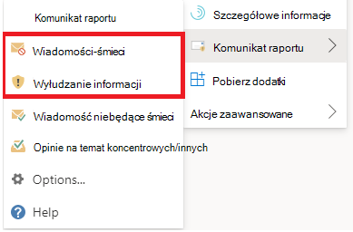
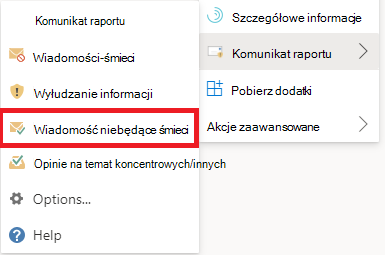

# <a name="report-false-positives-and-false-negatives-in-outlook"></a>Zgłaszanie wyników fałszywie dodatnich i ujemnych w Outlook

[!INCLUDE [Microsoft 365 Defender rebranding](../includes/microsoft-defender-for-office.md)]

**Dotyczy**
- [Exchange Online Protection](exchange-online-protection-overview.md)
- [Microsoft Defender dla Office 365 plan 1 i plan 2](defender-for-office-365.md)
- [Microsoft 365 Defender](../defender/microsoft-365-defender.md)

> [!NOTE]
> Jeśli jesteś administratorem w organizacji usługi Microsoft 365 ze skrzynkami pocztowymi usługi Exchange Online, zalecamy korzystanie ze strony Materiały w portalu Microsoft 365 Defender pocztowych. Aby uzyskać więcej informacji, zobacz Przesyłanie plików za pomocą portalu Przesyłanie w celu przesłania do firmy Microsoft podejrzanych [wiadomości-śmieci,](admin-submission.md) wiadomości wyłudowanych przy użyciu adresów URL i plików.

W organizacjach korzystających z nowoczesnego uwierzytelniania hybrydowego w organizacjach ze skrzynkami pocztowymi w programie Exchange Online lub lokalnych skrzynkach pocztowych można przesyłać do usługi Exchange Online Protection (EOP) wyniki fałszywie dodatnie (oznaczanie dobrymi wiadomościami e-mail, które zostały zablokowane lub wysłane do folderu wiadomości-śmieci) oraz wyników fałszywie ujemnych (niechcianych wiadomości e-mail lub wiadomości wyłudzanych w skrzynce odbiorczej). Microsoft 365

## <a name="what-do-you-need-to-know-before-you-begin"></a>Co należy wiedzieć przed rozpoczęciem?

- Aby uzyskać najlepsze środowisko przesyłania użytkownika, użyj dodatku Report Message (Wiadomość raportu) lub dodatku Wyłudzanie informacji raportu.

- Dodatek Wiadomość raportu i dodatek Wyłudzanie raportów działają dla wszystkich Outlook platform (Outlook w sieci Web, iOS, Android i Desktop).

- Jeśli jesteś administratorem w organizacji, która ma Exchange Online pocztowe, użyj portalu Przesyłanie w portalu Microsoft 365 Defender odbiorczego. Aby uzyskać więcej informacji, zobacz Przesyłanie administratora w celu przesłania podejrzeń o [spam, wyłudzy, adresy URL i pliki do firmy Microsoft](admin-submission.md).

- Możesz skonfigurować wysyłanie wiadomości bezpośrednio do firmy Microsoft,  określisz skrzynkę pocztową lub obie te usługi. Aby uzyskać więcej informacji, zobacz [Zasady przesyłania użytkowników](user-submission.md).

- Aby uzyskać więcej informacji na temat sposobu uzyskania i włączenia dodatków Report Message (Wiadomość raportu) lub Wyłudzanie informacji (Report Phishing), zobacz Włączanie dodatku Report Message (Wiadomość raportu) lub [Report Phishing](enable-the-report-message-add-in.md) (Wyłudzanie informacji raportu).

- Aby uzyskać więcej informacji na temat raportowania wiadomości do firmy Microsoft, zobacz [Raportowanie wiadomości i plików do firmy Microsoft](report-junk-email-messages-to-microsoft.md).

### <a name="turn-off-the-built-in-reporting-experience"></a>Wyłączanie wbudowanego środowisko raportowania

Nie zalecamy korzystania z wbudowanego środowiska raportowania w aplikacji Outlook ponieważ nie może on używać zasad [przesyłania użytkowników](./user-submission.md). Zamiast tego zalecamy użycie dodatku Wiadomość raportu lub dodatku Do wyłudzania informacji raportów.

Aby można było uruchomić to polecenie cmdlet, należy mieć przypisane odpowiednie uprawnienia. Aby znaleźć uprawnienia wymagane do uruchomienia dowolnego polecenia cmdlet lub parametru w organizacji, zobacz Znajdowanie uprawnień wymaganych do uruchamiania dowolnego Exchange [cmdlet](/powershell/exchange/find-exchange-cmdlet-permissions).

Uruchom następujące polecenie programu PowerShell, aby wyłączyć wbudowane środowisko raportowania w programie Outlook w sieci Web:

```powershell
Set-OwaMailboxPolicy -Identity OwaMailboxPolicy-Default -ReportJunkEmailEnabled $false
```


## <a name="use-the-report-message-feature"></a>Korzystanie z funkcji komunikatów raportów

### <a name="report-junk-and-phishing-messages"></a>Zgłaszanie wiadomości-śmieci i wiadomości wyłudzających informacje

W przypadku wiadomości w skrzynce odbiorczej lub dowolnym innym folderze poczty e-mail z wyjątkiem wiadomości-śmieci użyj następującej metody zgłaszania spamu i wiadomości wyłudzających informacje:

1. Wybierz **wielokropek** Więcej akcji w prawym górnym rogu zaznaczonej wiadomości, wybierz pozycję Zgłoś wiadomość z  menu rozwijanego, a następnie **wybierz pozycję** Wiadomości-śmieci lub Wyłudzanie **informacji**.

   

   

2. Wybrane wiadomości zostaną wysłane do firmy Microsoft w celu analizy oraz:
   - Przeniesiono do folderu Wiadomości-śmieci, jeśli zostały zgłoszone jako spam.
   - Usunięto, jeśli zostały zgłoszone jako próby wyłudzenia informacji.

### <a name="report-messages-that-are-not-junk"></a>Zgłaszanie wiadomości niebędących śmieciami

1. Wybierz **wielokropek** Więcej akcji w prawym górnym rogu zaznaczonej wiadomości, wybierz polecenie Zgłoś wiadomość z  menu rozwijanego, a następnie wybierz pozycję **Wiadomość niebędąka śmieciem**.

   

   

2. Wybrana wiadomość zostanie wysłana do firmy Microsoft w celu analizy i przeniesiona do skrzynki odbiorczej lub dowolnego innego określonego folderu.

## <a name="view-and-review-reported-messages"></a>Wyświetlanie i przeglądanie zgłoszonych wiadomości

Aby przejrzeć wiadomości zgłaszane firmie Microsoft przez użytkowników, dostępne są następujące opcje:

- Użyj strony **Przesyłanie** w portalu Microsoft 365 Defender sieci Web. Aby uzyskać więcej informacji, [zobacz Wyświetlanie przesyłania użytkowników do firmy Microsoft](admin-submission.md#view-user-submissions-to-microsoft).
- Utwórz regułę przepływu poczty e-mail (z znaną również regułą transportu), aby wysyłać kopie zgłoszonych wiadomości. Aby uzyskać instrukcje, [zobacz Używanie reguł przepływu poczty e-mail, aby sprawdzić, co użytkownicy zgłaszają firmie Microsoft](/exchange/security-and-compliance/mail-flow-rules/use-rules-to-see-what-users-are-reporting-to-microsoft).
