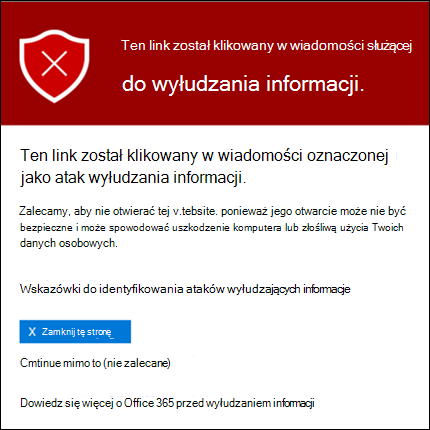
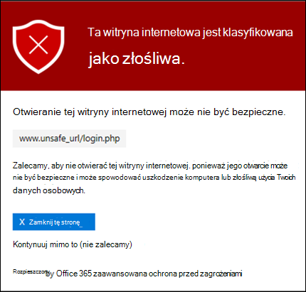

# Sejf linków w programie Microsoft Defender dla Office 365

[!INCLUDE [Microsoft 365 Defender rebranding](../includes/microsoft-defender-for-office.md)]

**Dotyczy**
- [Microsoft Defender dla Office 365 plan 1 i plan 2](defender-for-office-365.md)
- [Microsoft 365 Defender](../defender/microsoft-365-defender.md)

> [!IMPORTANT]
> Ten artykuł jest przeznaczony dla klientów biznesowych korzystających z programu [Microsoft Defender dla Office 365](defender-for-office-365.md). Jeśli korzystasz z usługi Outlook.com, Microsoft 365 Family lub Microsoft 365 Personal i szukasz informacji na temat bezpiecznych linków w u programie Outlook, zobacz Zaawansowane zabezpieczenia usługi [Outlook.com](https://support.microsoft.com/office/882d2243-eab9-4545-a58a-b36fee4a46e2).

Sejf Linki to funkcja usługi [Defender dla usługi Office 365](defender-for-office-365.md), która oferuje skanowanie adresów URL i ponowne wysyłanie przychodzących wiadomości e-mail w przepływie poczty e-mail oraz weryfikację adresów URL i linków jednym kliknięciem w wiadomościach e-mail i innych lokalizacjach. Sejf wiadomościach [e-mail](anti-spam-and-anti-malware-protection.md) przychodzących do usługi Exchange Online Protection (EOP) występuje skanowanie linków oraz zwykłą ochronę przed spamem i złośliwym oprogramowaniem. Sejf skanowania linków można chronić organizację przed złośliwymi linkami używanymi do wyłudzania informacji i innych ataków.

Sejf linków jest dostępna w następujących lokalizacjach:

- Wiadomości **e-mail****: Chociaż** domyślne zasady linków do usługi Sejf nie są dostępne, wstępnie ustawione zasady zabezpieczeń wbudowanej ochrony zapewniają ochronę linków programu Sejf wszystkim adresatom (użytkownikom, którzy nie są zdefiniowani w niestandardowych zasadach Sejf Linków). Aby uzyskać więcej informacji, zobacz [Wstępnie ustawione zasady zabezpieczeń w usługach EOP i Microsoft Defender for Office 365](preset-security-policies.md). Możesz również tworzyć Sejf linków, które dotyczą konkretnych użytkowników, grup lub domen. Aby uzyskać instrukcje, [zobacz Konfigurowanie zasad Sejf Linków w programie Microsoft Defender dla Office 365](set-up-safe-links-policies.md).

  Aby uzyskać więcej informacji na Sejf wiadomości e-mail przy pomocy linków, zobacz sekcję ustawienia linków Sejf wiadomości e-mail [w](#safe-links-settings-for-email-messages) dalszej części tego artykułu.
  
  > [!NOTE]
  > Sejf Linki nie działają w folderach publicznych z obsługą poczty.
  >
  > Sejf łącza obsługują tylko formaty HTTP(S) i FTP.

- **Microsoft Teams**: Ochrona linków Sejf linków w konwersacjach Teams, czatach grupowych lub kanałach jest również kontrolowana przez zasady Sejf Linków.

  Aby uzyskać więcej informacji na Sejf ochrony linków w programie Teams, zobacz Sejf Ustawienia linków do stron [Microsoft Teams dalszej](#safe-links-settings-for-microsoft-teams) części tego artykułu.

- **Office 365:** ochrona linków Sejf dla aplikacji Office 365 jest dostępna w obsługiwanych aplikacjach klasycznych, mobilnych i internetowych. Ochronę **linków** Sejf dla Office 365 konfiguruje się w ustawieniach globalnych, które znajdują się poza Sejf linków. Aby uzyskać instrukcje, [zobacz Konfigurowanie ustawień globalnych Sejf linków w programie Microsoft Defender for Office 365](configure-global-settings-for-safe-links.md).

  Sejf Ochrona linków dla aplikacji Office 365 jest stosowana do wszystkich użytkowników w organizacji, którzy mają licencje na usługę Defender dla usługi Office 365, niezależnie od tego, czy użytkownicy są uwzględnioni w aktywnych zasadach usługi Sejf Links.

  Aby uzyskać więcej informacji na Sejf ochrony linków w Office 365, zobacz sekcję ustawienia linków Sejf dla  aplikacji Office 365 w dalszej części tego artykułu.

Ten artykuł zawiera szczegółowe opisy następujących typów ustawień linków Sejf linków:

- **Ustawienia poszczególnych Sejf** zasadach dotyczących linków: Te ustawienia mają zastosowanie tylko do użytkowników uwzględnionych w określonych zasadach i te ustawienia mogą się różnić w poszczególnych zasadach. Są to między innymi następujące ustawienia:

  - [Sejf linków dla wiadomości e-mail](#safe-links-settings-for-email-messages)
  - [Sejf linków dla Microsoft Teams](#safe-links-settings-for-microsoft-teams)
  - [W zasadach nie należy ponownie pisać następujących adresów URL w Sejf Url](#do-not-rewrite-the-following-urls-lists-in-safe-links-policies)

- **Ustawienia globalne Sejf linków**: Te ustawienia są konfigurowane globalnie, a nie Sejf linków. Są to między innymi następujące ustawienia:

  - [Sejf ustawienia linków dla Office 365 aplikacji](#safe-links-settings-for-office-365-apps)
  - [Lista "Blokuj następujące adresy URL" dla Sejf URL](#block-the-following-urls-list-for-safe-links)

W poniższej tabeli opisano scenariusze dla linków usługi Sejf w organizacjach Microsoft 365 i Office 365, które zawierają usługę Defender for Office 365 (w przykładach należy pamiętać, że brak licencjonowania nigdy nie stanowi problemu).

 

****

|Scenariusz|Result (Wynik)|
|---|---|
|Marcin jest członkiem działu marketingu. Sejf Ochrona linków dla aplikacji Office 365 jest włączona w ustawieniach globalnych usługi Sejf Links i istnieją zasady linków programu Sejf dotyczące członków działu marketingu. Marcin otwiera prezentację PowerPoint wiadomości e-mail, a następnie klika adres URL w prezentacji.|Marcin jest chroniony za pomocą Sejf linków. 
 Marcin jest uwzględniony w zasadach Sejf Linki sieci Web, a ochrona linków Sejf dla Office 365 jest włączona. 
 Aby uzyskać więcej informacji na temat wymagań dotyczących ochrony linków Sejf w aplikacjach pakietu Office 365, zobacz sekcję Ustawienia linków Sejf dla aplikacji Office 365 [w](#safe-links-settings-for-office-365-apps) dalszej części tego artykułu.|
|W organizacji Microsoft 365 E5 Użytkownika nie skonfigurowano żadnych Sejf Linków. Michał otrzymuje wiadomość e-mail od zewnętrznego nadawcy zawierającą adres URL złośliwej witryny internetowej, która zostanie ostatecznie kliknięcia.|Chris nie jest chroniony przez Sejf Links. 
 Administrator musi utworzyć co najmniej jedną Sejf Linki, aby każda osoba Sejf ochronę linków w przychodzących wiadomościach e-mail. Aby chronić witrynę sieci Sejf, musi on zostać uwzględniony w warunkach Sejf.|
|W organizacji Pata żaden administrator nie utworzył żadnych zasad Sejf Linków, ale ochrona linków Sejf dla aplikacji Office 365 jest włączona. Pat otwiera dokument programu Word i klika adres URL w pliku.|Pat nie jest chroniony przez Sejf linków. 
 Ochrona linków Sejf dla aplikacji Office 365 jest włączana globalnie, ale Pat nie jest uwzględniana w żadnych aktywnych zasadach linków do usługi Sejf, więc ochrony nie można stosować.|
|W organizacji Lee skonfigurowano `https://tailspintoys.com` na liście Blokuj następujące adresy **URL** w ustawieniach globalnych usługi Sejf url. Zasady Sejf linków, które zawierają Lee już istnieją. Lee otrzymuje wiadomość e-mail zawierającą adres URL `https://tailspintoys.com/aboutus/trythispage`. Lee klika adres URL.|Adres URL może być automatycznie zablokowany dla Lee. zależy to od wpisu adresu URL na liście i od używanego klienta poczty e-mail Lee. Aby uzyskać więcej informacji, zobacz [sekcję "](#block-the-following-urls-list-for-safe-links)Blokowanie następujących adresów URL" w sekcji Sejf linków w dalszej części tego artykułu.|
|Ewa i Ewa pracują dla contoso.com. Już dawno temu administratorzy skonfigurowali zasady Sejf linków, które dotyczą zarówno Anny, jak i Anny. Ewa wysyła wiadomość e-mail do Anny, nie wiedząc, że wiadomość zawiera złośliwy adres URL.|Anny jest chroniona przez link **Sejf, jeśli** stosowana do niej Sejf Linków wiadomości została skonfigurowana do stosowania do wiadomości między adresatami wewnętrznymi. Aby uzyskać więcej informacji, zobacz Sejf [ustawień linków](#safe-links-settings-for-email-messages) do wiadomości e-mail w dalszej części tego artykułu.|
|

## Sejf linków dla wiadomości e-mail

Sejf przeskanuje przychodzące wiadomości e-mail w poszukiwaniu znanych złośliwych hiperlinków. Zeskanowane adresy URL są pisane ponownie przy użyciu standardowego prefiksu URL firmy Microsoft: `https://nam01.safelinks.protection.outlook.com`. Po zakończeniu pisania link jest analizowany pod celu przeanalizowania jego potencjalnie złośliwej zawartości.

Po Sejf Linki ponownie zapisuje adres URL, adres URL jest redagowany, nawet jeśli wiadomość jest przesyłana dalej  ręcznie lub odpowiadana (zarówno do adresatów wewnętrznych, jak i zewnętrznych). Dodatkowe linki dodawane do wiadomości przekazanej lub odpowiedzi nie są pisane ponownie. Jednak w przypadku automatycznego przesyłania dalej  za pomocą reguł skrzynki odbiorczej lub przesyłania dalej SMTP adres URL nie zostanie ponownie napisany w wiadomości przeznaczonej dla ostatecznej adresata, chyba że ten adresat  jest również chroniony za pomocą linków usługi Sejf lub adres URL został już napisany ponownie w poprzedniej komunikacji. Dopóki jest Sejf linki, adresy URL są nadal skanowane przed dostarczeniem, niezależnie od tego, czy zostały one napisane ponownie, czy nie. Niewrące adresy URL będą również nadal sprawdzane przez wywołanie interfejsu API po stronie klienta do linków programu Sejf w momencie kliknięcia w wersji Outlook dla komputerów stacjonarnych w wersji 16.0.12513 lub nowszej.

Ustawienia w zasadach Sejf dotyczących wiadomości e-mail opisano na poniższej liście:

- **Wybierz akcję dla nieznanych, potencjalnie złośliwych adresów URL** w wiadomościach: Włączenie lub wyłączenie funkcji skanowania Sejf w wiadomościach e-mail. Zalecana wartość jest **wł**. Włączenie tego ustawienia powoduje następujące akcje.

  - Sejf skanowania linków jest włączone w programie Outlook (C2R) na Windows.
  - Adresy URL są pisane ponownie, a użytkownicy są przekierowywani za pośrednictwem ochrony Sejf po kliknięciu przez nich adresów URL w wiadomościach.
  - Po kliknięciu adresy URL są sprawdzane pod kątem listy znanych złośliwych adresów URL i [listy "Blokuj następujące adresy URL"](#block-the-following-urls-list-for-safe-links).
  - Adresy URL, które nie mają prawidłowej reputacji, są detonowane asynchronicznie w tle.

- **Stosowanie skanowania w czasie rzeczywistym adresów URL** w celu wykrycia podejrzanych linków i linków, które wskazują pliki: umożliwia skanowanie linków w czasie rzeczywistym, w tym linków w wiadomościach e-mail, które wskazują zawartość do pobrania. Zalecana wartość jest włączona.
  - **Przed dostarczeniem wiadomości poczekaj na ukończenie skanowania adresów URL**:
    - Włączone: Wiadomości zawierające adresy URL są przechowywane do momentu zakończenia skanowania. Wiadomości są dostarczane dopiero po potwierdzeniu, że adresy URL są bezpieczne. Jest to zalecana wartość.
    - Wyłączone: Jeśli skanowanie adresów URL nie może się zakończyć, dostarczyć wiadomość mimo to.

- Stosowanie **linków Sejf** do wiadomości e-mail wysyłanych w organizacji: Włączenie lub wyłączenie funkcji skanowania linków programu Sejf w wiadomościach wysyłanych między nadawcami wewnętrznymi i adresatami wewnętrznymi w tej samej organizacji Exchange Online organizacji. Zalecana wartość jest włączona.

- **Nie śledź kliknięć użytkownika**: Włączenie lub wyłączenie przechowywania Sejf Klikając dane adresów URL klikowanych w wiadomościach e-mail, klikaj łącza. Zalecane jest pozostawienie tego ustawienia bez wyboru (do śledzenia kliknięć użytkownika).

  Śledzenie kliknięcia adresu URL w przypadku łączy w wiadomościach e-mail wysyłanych między nadawcami wewnętrznymi i adresatami wewnętrznymi nie jest obecnie obsługiwane.

- **Nie zezwalaj użytkownikom na klikanie** w celu oryginalnego adresu URL: umożliwia lub blokuje użytkownikom kliknięcie strony z ostrzeżeniem [na oryginalnym](#warning-pages-from-safe-links) adresie URL. Wartość zalecana jest włączona.

- **Wyświetl znakowanie organizacji na stronach powiadomień** i ostrzeżeń: Ta opcja pokazuje znakowanie organizacji na stronach z ostrzeżeniem. Znakowanie ułatwia użytkownikom identyfikowanie ostrzeżeń zgodnych z prawem, ponieważ domyślne strony ostrzeżeń firmy Microsoft są często używane przez atakujących. Aby uzyskać więcej informacji o niestandardowym znakowaniach, [zobacz Dostosowywanie Microsoft 365 firmy](../../admin/setup/customize-your-organization-theme.md).

- **Nie przepisuj następujących adresów URL**: Pozostawia adresy URL bez opuszczania ich. Zachowuje niestandardową listę bezpiecznych adresów URL, które nie wymagają skanowania. Lista jest unikatowa dla każdej zasady Sejf linków. Aby uzyskać więcej informacji na temat listy Nie robisz ponownie następujących adresów **URL**, zobacz sekcję "Nie przewdaj następujących adresów [URL"](#do-not-rewrite-the-following-urls-lists-in-safe-links-policies) w sekcji zasad dotyczących linków do programu Sejf w dalszej części tego artykułu.

  Aby uzyskać więcej informacji na temat wartości zalecanych dla ustawień zasad standardowych i ścisłych dotyczących zasad Sejf linków, zobacz Sejf [Ustawienia zasad łączy](recommended-settings-for-eop-and-office365.md#safe-links-policy-settings).

- **Nie przepisuj adresów URL, sprawdzaj** tylko za pośrednictwem interfejsu API bezpiecznych łączy: Jeśli to ustawienie jest włączone, nie jest przeprowadzane żadne zawijanie adresów URL. Sejf linki są nazywane wyłącznie za pośrednictwem interfejsów API w momencie klikania adresu URL przez Outlook, którzy go obsługują. Wartość zalecana jest wyłączona.
  
- **Filtry adresatów**: Należy określić warunki i wyjątki adresata, które określają, kogo dotyczą zasady. Możesz użyć tych właściwości dla warunków i wyjątków:
  - **Adresatem jest**
  - **Domena adresata to**
  - **Adresat jest członkiem**

  Możesz użyć tylko raz warunku lub wyjątku, ale warunek lub wyjątek może zawierać wiele wartości. Wiele wartości takich samych warunków lub wyjątków używa logiki OR (na przykład _\<recipient1\>_ lub _\<recipient2\>_). W różnych warunkach lub wyjątkach jest używanie logiki AND (na przykład _\<recipient1\>_ i _\<member of group 1\>_).

- **Priorytet**: Jeśli tworzysz wiele zasad, możesz określić kolejność ich stosowania. Dwa zasady nie mogą mieć tego samego priorytetu i przetwarzanie zasad zostanie zatrzymane po zastosowaniu pierwszej zasady.

  Aby uzyskać więcej informacji na temat kolejności pierwszeństwa oraz sposobu oceniania i stosowania wielu zasad, zobacz Kolejność i [pierwszeństwo ochrony poczty e-mail](how-policies-and-protections-are-combined.md).
  
### Jak działa Sejf w wiadomościach e-mail

Poniżej opisano, jak działa ochrona linków Sejf URL w wiadomościach e-mail:

1. Wszystkie wiadomości e-mail są dostarczane przez usługę EOP, w której filtry protokołów IP (IP) i kopert, ochrona przed złośliwym oprogramowaniem opartym na podpisie, ochrona przed spamem i złośliwym oprogramowaniem, zanim wiadomość zostanie dostarczona do skrzynki pocztowej adresata.

2. Użytkownik otworzy wiadomość w swojej skrzynce pocztowej i kliknie adres URL w wiadomości.

3. Sejf Linki natychmiast sprawdza adres URL przed otwarciem witryny internetowej:

   - Jeśli adres URL znajduje się na liście **Blokuj następujące adresy URL** , zostanie otwarte ostrzeżenie o zablokowanym [adresie URL](#blocked-url-warning) .

   - Jeśli adres URL wskazuje witrynę sieci Web, która została określona jako złośliwa, zostanie otwarta strona z ostrzeżeniem (lub inna strona ostrzegawczy).

   - Jeśli adres URL wskazuje plik do pobrania, a ustawienie Zastosuj skanowanie adresów **URL** w czasie rzeczywistym w celu wykrycia podejrzanych linków i linków, które wskazują pliki, jest włączone w zasadach, które dotyczą użytkownika, plik do pobrania jest sprawdzany.

   - Jeśli adres URL zostanie określony jako bezpieczny, zostanie otwarta witryna internetowa.

## Sejf linków dla Microsoft Teams

Włączanie lub wyłączanie ochrony Sejf linków sieciowych Microsoft Teams w Sejf linków. W szczególności użyj akcji **Wybierz akcję dla nieznanych lub potencjalnie** złośliwych adresów URL w Microsoft Teams adresach URL. Zalecana wartość jest **wł**.

> [!NOTE]
> Gdy włączysz lub wyłączysz ochronę linków Sejf dla Teams, może upłynieć do 24 godzin, aż zmiana zostanie w związku z tym w związku z tym zmianami.

Poniższe ustawienia w zasadach linków programu Sejf, które dotyczą linków w wiadomościach e-mail, mają również zastosowanie do linków w Teams:

- **Stosowanie skanowania w czasie rzeczywistym adresów URL w celu wykrycia podejrzanych linków i linków, które wskazują pliki**
- **Nie śledź kliknięć użytkownika**
- **Nie zezwalaj użytkownikom na klikanie w celu oryginalnego adresu URL**

Te ustawienia o wyjaśniono wcześniej [w Sejf linków do wiadomości e-mail](#safe-links-settings-for-email-messages).

Po włączeniu ochrony linków Sejf dla aplikacji Microsoft Teams adresy URL w programie Teams są sprawdzane pod kątem listy znanych złośliwych linków, gdy chroniony użytkownik klika link (ochrona po kliknięciu). Adresy URL nie są pisane ponownie. Jeśli link zostanie znaleziony jako złośliwy, użytkownicy będą mieli następujące środowisko:

- Jeśli link został klikowany w konwersacji Teams, czacie grupowym lub w kanałach, w domyślnej przeglądarce internetowej pojawi się strona z ostrzeżeniem, jak pokazano na poniższym zrzucie ekranu.
- Jeśli link został klikowany na przypiętej karcie, strona z ostrzeżeniem pojawi się w Teams interfejsie tej karty. Ze względów bezpieczeństwa opcja otwarcia linku w przeglądarce sieci Web jest wyłączona.
- W zależności od tego, jak skonfigurowano ustawienie Nie zezwalaj użytkownikom na kliknięcie w oryginalnym adresie **URL** w zasadach, użytkownik będzie mógł kliknąć oryginalny adres URL (Kontynuuj mimo to (nie zalecane **)** na zrzucie ekranu). Zalecamy włączenie ustawienia Nie zezwalaj użytkownikom na klikanie w celu ustawienia pierwotnego adresu **URL** , aby użytkownicy nie mogą klikać w celu skorzystania z pierwotnego adresu URL.

Jeśli użytkownik, który wysłał link, nie jest uwzględniony w zasadach usługi Sejf Links, gdzie jest włączona ochrona usługi Teams, użytkownik może kliknąć oryginalny adres URL na swoim komputerze lub urządzeniu.

Kliknięcie **przycisku Wróć** na stronie ostrzeżenia spowoduje powrót użytkownika do jego pierwotnego kontekstu lub lokalizacji adresu URL. Jednak ponowne kliknięcie oryginalnego linku spowoduje, że Sejf ponownie spróbuje adresu URL, więc strona z ostrzeżeniem pojawi się ponownie.

### Jak Sejf linki w programie Teams

Poniżej opisano, jak działa ochrona Sejf Łączy dla adresów URL w Microsoft Teams:

1. Użytkownik uruchomi Teams aplikacji.

2. Microsoft 365 pozwala sprawdzić, czy organizacja użytkownika zawiera program Microsoft Defender dla usługi Office 365 oraz czy użytkownik jest uwzględniony w aktywnych zasadach usługi Sejf Links, gdzie jest włączona ochrona Microsoft Teams.

3. Adresy URL są sprawdzane po kliknięciu przez użytkownika na czatach, czatach grupowych, kanałach i kartach.

## Sejf ustawienia linków dla Office 365 aplikacji

Sejf Ochrona linków dla aplikacji Office 365 sprawdza linki w dokumentach programu Office, a nie linki w wiadomościach e-mail (ale po otwarciu dokumentu może sprawdzać linki w dołączonych dokumentach programu Office w wiadomościach e-mail).

Sejf ochrony linków dla Office 365 mają następujące wymagania dotyczące klienta:

- Aplikacje Microsoft 365 lub Microsoft 365 Business Premium.
  - Bieżące wersje programu Word, Excel i PowerPoint na Windows komputerze Windows komputerze Mac lub w przeglądarce internetowej.
  - Office na urządzeniach z systemem iOS lub Android.
  - Visio na Windows.
  - OneNote w przeglądarce internetowej.
  - Outlook do Windows podczas otwierania zapisanych plików EML lub MSG.

- Office 365 są skonfigurowane do korzystania z nowoczesnego uwierzytelniania. Aby uzyskać więcej informacji, zobacz Jak działa nowoczesne uwierzytelnianie w aplikacjach [Office 2013, Office 2016 i Office 2019](../../enterprise/modern-auth-for-office-2013-and-2016.md).

- Użytkownicy są zalogowani przy użyciu swoich kont służbowych. Aby uzyskać więcej informacji, [zobacz Logowanie się Office](https://support.microsoft.com/office/b9582171-fd1f-4284-9846-bdd72bb28426).

Ochronę linków Sejf dla Office 365 w ustawieniach globalnych linków Sejf, a nie w zasadach Sejf linków. Ochrona jest stosowana do wszystkich użytkowników w organizacji, którzy mają licencje na usługę Defender dla usługi Office 365, niezależnie od tego, czy użytkownicy są uwzględnioni w aktywnych zasadach usługi Sejf Links, czy nie.

Następujące ustawienia linków Sejf są dostępne dla Office 365 aplikacji:

- **Office 365 aplikacji**: Włączenie lub wyłączenie funkcji skanowania linków Sejf w obsługiwanych Office 365 aplikacjach. Wartość domyślna i zalecana jest **włączona**.

- **Nie śledź po** kliknięciu przez użytkownika łącza usługi Sejf: Włączenie lub wyłączenie przechowywania linków usługi Sejf Kliknięcie danych w przypadku adresów URL klikowanych w klasycznych wersjach programu Word, Excel, PowerPoint i Visio. Zalecana wartość to **Wyłączone**, co oznacza, że kliknięcia użytkowników są śledzone.

- **Nie zezwalaj** użytkownikom na klikanie bezpiecznych linków do oryginalnego adresu URL: umożliwia lub blokuje użytkownikom kliknięcie strony z ostrzeżeniem na oryginalnym adresie URL w wersjach klasycznych word, Excel, PowerPoint i Visio. Wartość domyślna i zalecana jest **włączona**.

Aby skonfigurować ustawienia Sejf linków dla aplikacji Office 365, zobacz Konfigurowanie ochrony Sejf [linków dla Office 365 aplikacji](configure-global-settings-for-safe-links.md#configure-safe-links-protection-for-office-365-apps-in-the-microsoft-365-defender-portal).

Aby uzyskać więcej informacji na temat wartości zalecanych w przypadku ustawień zasad standardowych i ścisłych, zobacz [Ustawienia globalne Sejf linków](recommended-settings-for-eop-and-office365.md#global-settings-for-safe-links).

### Jak działa Sejf w Office 365 aplikacji

Poniżej opisano, jak działa ochrona Sejf adresów URL w Office 365 internetowych. Obsługiwane Office 365 są opisane w poprzedniej sekcji.

1. Użytkownik może się insietować przy użyciu swojego konta służbowego lub szkolnego w organizacji, w Aplikacje Microsoft 365 lub Microsoft 365 Business Premium.

2. Użytkownik otworzy i kliknie link do dokumentu Office w obsługiwanym dokumencie aplikacja pakietu Office.

3. Sejf Linki natychmiast sprawdza adres URL przed otwarciem docelowej witryny sieci Web:

   - Jeśli adres URL znajduje się na liście, która pomija Sejf skanowania linków (na liście Blokuj następujące adresy  URL), zostanie otwarta strona z ostrzeżeniem o zablokowanym adresie [URL](#blocked-url-warning).

   - Jeśli adres URL wskazuje witrynę sieci Web, która została określona jako złośliwa, zostanie otwarta strona z ostrzeżeniem (lub inna strona ostrzegawczy).

   - Jeśli adres URL wskazuje plik do pobrania, a zasady usługi Sejf Links dotyczące użytkownika są skonfigurowane do skanowania linków do zawartości do pobrania (stosowanie skanowania w czasie rzeczywistym adresów **URL** w poszukiwaniu podejrzanych linków i linków, które wskazują pliki), plik do pobrania jest sprawdzany.

   - Jeśli adres URL jest uważany za bezpieczny, użytkownik jest przekierowywowyny do witryny internetowej.

   - Jeśli Sejf skanowania linków nie może się zakończyć, ochrona Sejf linków nie uruchamia się. W Office komputerów stacjonarnych użytkownik zostanie ostrzegany przed rozpoczęciem do docelowej witryny internetowej.

> [!NOTE]
> Na początku każdej sesji może mi potrwać kilka sekund, aby sprawdzić, czy użytkownik Sejf włączony dla Office sieci.

## Lista "Blokuj następujące adresy URL" dla Sejf URL

Na **liście Blokuj następujące adresy URL** są definiowane linki, które są zawsze blokowane przez skanowanie Sejf w następujących lokalizacjach:

- Wiadomości e-mail.
- Dokumenty w Office 365 aplikacjach w programach Windows i Mac.
- Dokumenty w aplikacji Office systemach iOS i Android.

Gdy użytkownik w aktywnej zasadach Sejf linku sieci Web kliknie zablokowany link w obsługiwanej aplikacji, jest przenoszony do strony z ostrzeżeniem Zablokowany [adres URL](#blocked-url-warning).

Listę adresów URL można skonfigurować w ustawieniach globalnych programu Sejf url. Aby uzyskać instrukcje, [zobacz Konfigurowanie listy "Blokuj następujące adresy URL"](configure-global-settings-for-safe-links.md#configure-the-block-the-following-urls-list-in-the-microsoft-365-defender-portal).

**Uwagi**:

- Aby uzyskać prawdziwie uniwersalną listę adresów URL, które są blokowane wszędzie, zobacz Zarządzanie [listą zezwalania/blokowania dzierżawy](tenant-allow-block-list.md).
- Limity dla **listy Blokuj następujące adresy URL** :
  - Maksymalna liczba wpisów wynosi 500.
  - Maksymalna długość wpisu to 128 znaków.
  - Wszystkie wpisy nie mogą przekraczać 10 000 znaków.
- Nie dołączaj ukośnika (`/`) na końcu adresu URL. Na przykład użyj , `https://www.contoso.com`nie `https://www.contoso.com/`.
- Adres URL domeny (na `contoso.com` przykład lub `tailspintoys.com`) blokuje wszelkie adresy URL zawierające domenę.
- Możesz zablokować poddomenę bez blokowania pełnej domeny. Na przykład blokuje `toys.contoso.com*` on wszystkie adresy URL zawierające poddomenę, ale nie blokuje adresów URL zawierających pełną domenę `contoso.com`.
- Możesz dołączyć maksymalnie trzy symbole wieloznaczne (`*`) na wpis w adresie URL.

### Składnia wpisów listy "Blokuj następujące adresy URL"

Przykłady wartości, które można wprowadzić, oraz ich wyników są opisane w poniższej tabeli:

 

****

|Value|Result (Wynik)|
|---|---|
|`contoso.com` 
 lub 
 `*contoso.com*`|Blokuje domeny, poddomeny i ścieżki. Na przykład `https://www.contoso.com`, `https://sub.contoso.com`i są `https://contoso.com/abc` blokowane.|
|`https://contoso.com/a`|Bloki `https://contoso.com/a` , ale nie dodatkowe podpathie, takie jak `https://contoso.com/a/b`.|
|`https://contoso.com/a*`|Bloki `https://contoso.com/a` i dodatkowe podpathie, takie jak `https://contoso.com/a/b`.|
|`https://toys.contoso.com*`|Blokuje poddomenę (w`toys` tym przykładzie), ale zezwalaj na klikanie innych adresów URL domeny (takich jak lub `https://contoso.com` `https://home.contoso.com`).|
|

## W zasadach nie należy ponownie pisać następujących adresów URL w Sejf Url

> [!NOTE]
> Jeśli Twoja organizacja korzysta z zasad Sejf, poniższe listy adresów **URL** nie są jedynymi metodami obsługiwanymi podczas testów wyłudzania informacji innych firm.

Każda Sejf linki do stron sieci Sejf zawiera  listę Nie pisania ponownie następujących adresów URL, za pomocą których można określić adresy URL, które nie są pisane ponownie przez skanowanie łączy w programie Sejf. Oznacza to, że lista umożliwia użytkownikom uwzględnionym w zasadach uzyskiwanie dostępu do określonych adresów URL, które w przeciwnym razie zostaną zablokowane przez Sejf linki. Różne listy można konfigurować w różnych zasadach Sejf linków. Przetwarzanie zasad zatrzymuje się po pierwszym (prawdopodobnie najwyższym priorytecie) do użytkownika. Dlatego tylko jedna z nich Nie robisz ponownie poniższej listy adresów **URL** jest stosowana do użytkownika, który jest uwzględniony w wielu aktywnych zasadach Sejf url.

Aby dodać wpisy do listy w nowych lub istniejących zasadach Sejf linków sieciowych, zobacz Tworzenie Sejf  linków lub Modyfikowanie zasad Sejf [linków](set-up-safe-links-policies.md#use-the-microsoft-365-defender-portal-to-modify-safe-links-policies).

**Uwagi**:

- Następujący klienci nie rozpoznają list Nie robisz ponownie następujących adresów **URL** w zasadach usługi Sejf Url. Użytkownicy uwzględnioni w tych zasadach mogą mieć zablokowaną możliwość uzyskiwania dostępu do adresów URL na podstawie wyników skanowania linków do stron Sejf w tych klientach:
  - Microsoft Teams
  - Office aplikacji sieci Web

  Aby uzyskać prawdziwie uniwersalną listę adresów URL, które są dozwolone wszędzie, zobacz Zarządzanie [listą dozwolonych/zablokowanych adresów w dzierżawie](tenant-allow-block-list.md). Należy jednak pamiętać, że dodane tam adresy URL nie zostaną wykluczone z ponownego arytmezy w linkach Sejf, ponieważ należy to zrobić w zasadach Sejf linków.

- Rozważ dodanie do listy często używanych wewnętrznych adresów URL, aby zwiększyć komfort pracy użytkownika. Jeśli na przykład masz usługi lokalne, takie jak Skype dla firm lub SharePoint, możesz dodać te adresy URL, aby wykluczyć je z skanowania.
- Jeśli w **zasadach linków do** stron sieci Sejf już nie wielokrotnie wpisaj następujących adresów URL, przejrzyj listy i dodaj symbole wieloznaczne zgodnie z wymaganiami. Na przykład lista zawiera wpis, `https://contoso.com/a` taki jak , a później postanowisz dołączyć podpathie, takie jak `https://contoso.com/a/b`. Zamiast dodawania nowego wpisu dodaj do istniejącego wpisu symbol wieloznaczny, aby stał się on symbolem wieloznaczny `https://contoso.com/a/*`.
- Możesz dołączyć maksymalnie trzy symbole wieloznaczne (`*`) na wpis w adresie URL. Symbole wieloznaczne jawnie zawierają prefiksy lub poddomeny. Na przykład wpis nie jest `contoso.com` taki sam `*.contoso.com/*`jak wpis , ponieważ umożliwia `*.contoso.com/*` użytkownikom odwiedzanie poddomen i ścieżek w określonej domenie.
- Jeśli w adresie URL jest używane automatyczne przekierowywanie dla protokołu HTTP na HTTPS (na przykład przekierowanie 302 `http://www.contoso.com` `https://www.contoso.com`dla ), i spróbujesz wprowadzić na liście zarówno wpisy HTTP, jak i HTTPS dla tego samego adresu URL, możesz zauważyć, że drugi wpis adresu URL zastępuje pierwszy wpis adresu URL. To zachowanie nie występuje, jeśli wersje HTTP i HTTPS adresu URL są całkowicie oddzielne.
- Nie określaj http:// ani https:// (to jest contoso.com), aby wykluczyć zarówno wersje HTTP, jak i HTTPS.
- `*.contoso.com` nie **obejmuje** contoso.com, dlatego należy wykluczyć zarówno określoną domenę, jak i wszystkie domeny podrzędne.
- `contoso.com/*` obejmuje **tylko** contoso.com, więc nie trzeba wykluczać obu `contoso.com` `contoso.com/*`i ; wystarczy `contoso.com/*` .
- Aby wykluczyć wszystkie iteracje domeny, wymagane są dwa wpisy wykluczeń. `contoso.com/*` i `*.contoso.com/*`. Te połączenia wykluczają zarówno http, jak i HTTPS, domenę główną contoso.com i wszelkie domeny podrzędne, a także dowolną lub końcową część (na przykład obie contoso.com i contoso.com/vdir1).

### Składnia wpisów dla listy "Nie zapisuj ponownie następujących adresów URL"

Przykłady wartości, które można wprowadzić, oraz ich wyników są opisane w poniższej tabeli:

 

****

|Value|Result (Wynik)|
|---|---|
|`contoso.com`|Umożliwia dostęp do poddomen `https://contoso.com` i ścieżek, ale nie do poddomen.|
|`*.contoso.com/*`|Umożliwia dostęp do domeny, poddomen i ścieżek ( `https://www.contoso.com`na przykład , `https://www.contoso.com`, `https://maps.contoso.com`lub `https://www.contoso.com/a`). 
 Wpis ten z natury jest lepszy niż `*contoso.com*`, ponieważ nie pozwala na potencjalnie fałszywe witryny, takie jak `https://www.falsecontoso.com``https://www.false.contoso.completelyfalse.com`|
|`https://contoso.com/a`|Umożliwia dostęp do `https://contoso.com/a`, ale nie podpaths, takich jak `https://contoso.com/a/b`|
|`https://contoso.com/a/*`|Umożliwia dostęp do `https://contoso.com/a` takich podpath i ich podpaths, jak `https://contoso.com/a/b`|
|

## Strony ostrzegawcze z Sejf linków

Ta sekcja zawiera przykłady różnych stron ostrzegawczych, które są wyzwalane przez ochronę Sejf linków po kliknięciu adresu URL.

Pamiętaj, że zaktualizowano kilka stron ostrzegawczych. Jeśli zaktualizowane strony nie są jeszcze zaktualizowane, wkrótce się pojawi. Zaktualizowane strony zawierają nowy schemat kolorów, więcej szczegółów i możliwość kontynuowania pracy w witrynie pomimo danego ostrzeżenia i rekomendacji.

### Powiadomienie o skanowaniu w toku

Klikony adres URL jest skanowany za pomocą linku Sejf internetowych. Przed podaniem linku może być konieczne odczekiowanie kilku chwil.

Oryginalna strona powiadomienia wyglądała tak:

### Ostrzeżenie o podejrzanej wiadomości

Klikony adres URL został podany w wiadomości e-mail podobnej do innych podejrzanych wiadomości. Przed przystąpieniem do witryny zalecamy dwukrotne sprawdzenie wiadomości e-mail.

### Ostrzeżenie o próbie wyłudzenia informacji

Klikony adres URL został podany w wiadomości e-mail, która została zidentyfikowany jako atak wyłudzania informacji. W wyniku tego wszystkie adresy URL w wiadomości e-mail zostaną zablokowane. Zalecamy, aby nie przechodzić do tej witryny.

### Ostrzeżenie o złośliwej witrynie sieci Web

Klikony adres URL wskazuje witrynę, która została zidentyfikowany jako złośliwa. Zalecamy, aby nie przechodzić do tej witryny.

Oryginalna strona z ostrzeżeniem wyglądała tak:

### Ostrzeżenie o zablokowanym adresie URL

Klikony adres URL został ręcznie zablokowany przez administratora w organizacji (lista Blokuj następujące adresy **URL** w ustawieniach globalnych usługi Sejf URL). Link nie został zeskanowany przez program Sejf, ponieważ został ręcznie zablokowany.

Istnieje kilka powodów, dla których administrator ręcznie blokował określone adresy URL. Jeśli uważasz, że witryna nie powinna być blokowana, skontaktuj się z administratorem.

Oryginalna strona z ostrzeżeniem wyglądała tak:

### Ostrzeżenie o błędzie

Wystąpił jakiś błąd i nie można otworzyć adresu URL.

Oryginalna strona z ostrzeżeniem wyglądała tak:

