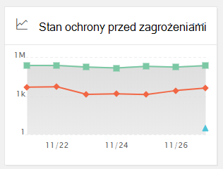
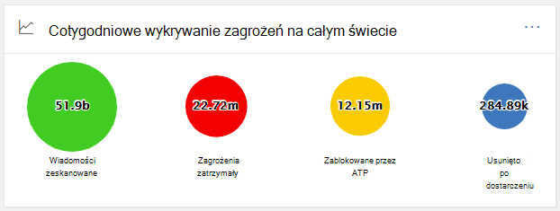
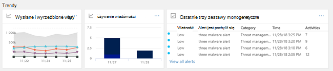

# Pulpit nawigacyjny zabezpieczeń w Centrum & zgodności

[!INCLUDE [Microsoft 365 Defender rebranding](../includes/microsoft-defender-for-office.md)]

## Podstawowe funkcje i otwieranie pulpitu nawigacyjnego zabezpieczeń

Centrum zabezpieczeń & umożliwia <https://protection.office.com> Twojej organizacji zarządzanie ochroną i zgodnością danych. Przy założeniu, że masz niezbędne uprawnienia, pulpit nawigacyjny zabezpieczeń umożliwia ci przeglądanie stanu ochrony przed zagrożeniami, a także wyświetlanie alertów zabezpieczeń i działanie z nimi.

Obejrzyj klip wideo, aby zapoznać się z omówieniem, a następnie przeczytaj ten artykuł, aby dowiedzieć się więcej.

> [!VIDEO https://www.microsoft.com/videoplayer/embed/RE1VV3o]

W zależności od tego, co obejmuje subskrypcja twojej organizacji, pulpit nawigacyjny zabezpieczeń zawiera kilka widżetów, takich jak podsumowanie zarządzania zagrożeniami, stan ochrony przed zagrożeniami, cotygodniowe wykrywanie zagrożeń na całym świecie, złośliwe oprogramowanie itp., zgodnie z opisem w poniższych sekcjach.

Aby wyświetlić pulpit nawigacyjny zabezpieczeń w Centrum zabezpieczeń & zgodności, przejdź do strony **Pulpit nawigacyjny zarządzania zagrożeniami**\>. Aby przejść bezpośrednio do pulpitu nawigacyjnego zabezpieczeń, użyj .<https://protection.office.com/searchandinvestigation/dashboard>

> [!NOTE]
> Aby wyświetlić pulpit nawigacyjny zabezpieczeń, musisz być administratorem globalnym, administratorem zabezpieczeń lub czytelnikiem zabezpieczeń. Niektóre widżety wymagają dodatkowych uprawnień do wyświetlania. Aby dowiedzieć się więcej, zobacz [Uprawnienia w Centrum zabezpieczeń & zgodności](permissions-in-the-security-and-compliance-center.md)[.

## Podsumowanie zarządzania zagrożeniami

Widżet Podsumowanie zagrożeń zarządzania pozwala od razu sprawdzić, jak Twoja organizacja była chroniona przed zagrożeniami w ciągu ostatnich siedmiu (7) dni.

Informacje zawarte w podsumowaniu zarządzania zagrożeniami zależą od tego, co obejmuje Twoja subskrypcja. W poniższej tabeli opisano, jakie informacje są Office 365 E3 i Office 365 E5.

 

****

|Office 365 E3|Office 365 E5|
|---|---|
|Wiadomości z złośliwym oprogramowaniem zablokowane Wiadomości wyłudzdzce informacje zablokowane Wiadomości zgłoszone przez użytkowników    |Wiadomości z złośliwym oprogramowaniem zablokowane Wiadomości wyłudzdzce informacje zablokowane Wiadomości zgłoszone przez użytkowników Zero-day malware blocked Wykryto zaawansowane wiadomości wyłudzdzące informacje Zablokowane złośliwe adresy URL|
|

Aby wyświetlić widżet Podsumowanie zagrożeń zarządzania zagrożeniami lub uzyskać do niego dostęp, musisz mieć uprawnienia do wyświetlania programu Defender dla Office 365 raportów. Aby dowiedzieć się więcej, zobacz [Jakie uprawnienia są potrzebne do wyświetlania programu Defender dla Office 365 raportów?](view-reports-for-mdo.md#what-permissions-are-needed-to-view-the-defender-for-office-365-reports).

## Stan ochrony przed zagrożeniami

Widżet Stan ochrony przed zagrożeniami umożliwia wyświetlanie skuteczności ochrony przed zagrożeniami przy użyciu popularnego i szczegółowego widoku wyłudzy informacji i złośliwego oprogramowania.

Szczegóły zależą od tego, czy Microsoft 365 obejmuje subskrypcję [usługi Exchange Online Protection](exchange-online-protection-overview.md) (EOP) z [programem Microsoft Defender dla systemu Office 365 lub bez](defender-for-office-365.md) niego.

 

****

|Jeśli Subskrypcja obejmuje...|Zobaczysz te szczegóły|
|---|---|
|Usługa EOP, ale nie program Microsoft Defender dla Office 365|Złośliwe wiadomości e-mail wykryte i zablokowane przez usługę EOP.
 Zobacz [Raport o stanie ochrony przed zagrożeniami (EOP).](view-email-security-reports.md#threat-protection-status-report)|
|Usługa Microsoft Defender dla Office 365|Złośliwa zawartość i złośliwa wiadomość e-mail wykrywane i blokowane przez usługi EOP i Defender dla Office 365 
 Zagregowana liczba unikatowych wiadomości [e-mail](zero-hour-auto-purge.md) ze złośliwą zawartością zablokowaną przez aparat ochrony przed złośliwym oprogramowaniem, funkcjami automatycznego przeczyszczania zerowej godziny i programem Defender dla programu Office 365 (w tym łączami programu [Sejf](safe-links.md)[,](safe-attachments.md) załącznikami Sejf i wyłudzaniem informacji w programie [Defender dla systemu Office 365](set-up-anti-phishing-policies.md#exclusive-settings-in-anti-phishing-policies-in-microsoft-defender-for-office-365)). 
 Zobacz [Raport o stanie ochrony przed zagrożeniami](view-reports-for-mdo.md#threat-protection-status-report).|
|

Aby wyświetlić widżet Stanu ochrony przed zagrożeniami lub uzyskać do niego dostęp, musisz mieć uprawnienia do wyświetlania programu Defender dla Office 365 raportów. Aby dowiedzieć się więcej, zobacz [Jakie uprawnienia są wymagane do wyświetlania programu Defender dla Office 365 raportów?](view-reports-for-mdo.md#what-permissions-are-needed-to-view-the-defender-for-office-365-reports)

## Cotygodniowe wykrywanie zagrożeń na całym świecie

Widżet Globalne cotygodniowe wykrywanie zagrożeń wskazuje, ile zagrożeń zostało wykrytych w wiadomościach e-mail w ciągu ostatnich siedmiu (7) dni.

Metryki są obliczane zgodnie z opisem w poniższej tabeli:

 

****

|Metryczny|Sposób obliczania|
|---|---|
|Wiadomości zeskanowane|Liczba zeskanowanych wiadomości e-mail pomnożona przez liczbę adresatów|
|Zagrożenia zatrzymały się|Liczba wiadomości e-mail zidentyfikowanych jako zawierające złośliwe oprogramowanie pomnożona przez liczbę adresatów|
|Zablokowana przez [defendera dla Office 365](defender-for-office-365.md)|Liczba wiadomości e-mail zablokowanych przez usługę Defender Office 365 pomnożona przez liczbę adresatów|
|Usunięto po dostarczeniu|Liczba wiadomości usuniętych przez [automatyczne przeczyszczanie zerowe (ZAP)](zero-hour-auto-purge.md) pomnożona przez liczbę adresatów|
|

## Złośliwe oprogramowanie

Widżety złośliwego oprogramowania pokazują szczegółowe informacje na temat trendów złośliwego oprogramowania i typów rodzinnych złośliwego oprogramowania w ciągu ostatnich siedmiu (7) dni.

## Szczegółowe informacje

Szczegółowe informacje główne problemy, które należy przejrzeć, zawierają również zalecenia i działania do rozważenia.

Na przykład może się okazać, że wiadomości e-mail wyłudzają informacje, ponieważ niektórzy użytkownicy wyłączyli opcje wiadomości-śmieci. Aby dowiedzieć się więcej na temat sposobu działania szczegółowych informacji, zobacz Raporty i [szczegółowe informacje w Centrum & zabezpieczeń i zgodności](reports-and-insights-in-security-and-compliance.md).

## Badanie zagrożeń i odpowiedź

Jeśli subskrypcja Twojej organizacji obejmuje program [Microsoft Defender for Office 365 Plan 2](office-365-ti.md), Pulpit nawigacyjny zabezpieczeń zawiera sekcję, która zawiera zaawansowane narzędzia do analizy zagrożeń i reagowania. Te narzędzia obejmują [funkcje automatycznego badania i reakcji](automated-investigation-response-office.md). Zautomatyzowane badanie i odpowiedź mogą być przydatne w scenariuszach, takich jak szybkie [rozwiązanie problemu naruszonych kont użytkowników](address-compromised-users-quickly.md).

Aby dowiedzieć się więcej, zobacz Wprowadzenie do korzystania z automatycznego badania i odpowiedzi [(AIR) w programie Office 365](office-365-air.md).

## Trendy

U dołu pulpitu nawigacyjnego zabezpieczeń znajduje się sekcja **Trendy** , która zawiera podsumowanie trendów przepływu poczty e-mail w organizacji. Raporty zawierają informacje na temat wiadomości e-mail sklasyfikowanych jako spam, złośliwe oprogramowanie, próby wyłudzenia informacji i dobre wiadomości e-mail. Kliknij kafelek, aby wyświetlić bardziej szczegółowe informacje w raporcie.

Ponadto, jeśli subskrypcja Twojej organizacji zawiera usługę [Defender dla usługi Office 365 (plan 2](office-365-ti.md)), w tej sekcji będzie również raport Ostatnie  alerty o zarządzaniu zagrożeniami, który umożliwia zespołowi zabezpieczeń wyświetlanie alertów zabezpieczeń o wysokim priorytecie i działanie w związku z nimi.

Aby wyświetlić widżet Wysłane i odebrane wiadomości e-mail lub uzyskać do niego dostęp, musisz mieć uprawnienia do wyświetlania programu Defender Office 365 raportów. Aby dowiedzieć się więcej, zobacz [Jakie uprawnienia są potrzebne do wyświetlania programu Defender dla Office 365 raportów?](view-reports-for-mdo.md#what-permissions-are-needed-to-view-the-defender-for-office-365-reports).

Aby wyświetlić widżet Ostatnie alerty zarządzania zagrożeniami lub uzyskać do niego dostęp, musisz mieć uprawnienia do wyświetlania alertów. Aby dowiedzieć się więcej, zobacz [Uprawnienia RBAC wymagane do wyświetlania alertów](../../compliance/alert-policies.md#rbac-permissions-required-to-view-alerts).

## Artykuły pokrewne

[Wyświetlanie raportów zabezpieczeń poczty e-mail w Centrum & zgodności](view-email-security-reports.md)

[Wyświetlanie raportów dla programu Microsoft Defender dla Office 365](view-reports-for-mdo.md)

[Defender for Office 365](defender-for-office-365.md)

[Office 365 i reagowanie na zagrożenia](office-365-ti.md)
