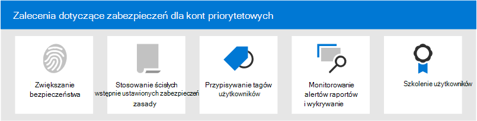

# Zalecenia dotyczące zabezpieczeń dla kont priorytetowych w Microsoft 365

Nie wszystkie konta użytkowników mają dostęp do tych samych informacji o firmie. Niektóre konta mają dostęp do informacji poufnych, takich jak dane finansowe, informacje o rozwoju produktu, dostęp partnera do krytycznych systemów kompilacji i nie tylko. W przypadku naruszenia bezpieczeństwa konta, które mają dostęp do bardzo poufnych informacji, stanowią poważne zagrożenie. Konta tego typu są kontami _o priorytecie_. Konta o priorytecie obejmują (ale nie są ograniczone do) klientów z programem ceos, cisos, cfos, konta administratora infrastruktury, tworzenie kont systemowych i nie tylko.

Dla atakujących zwykłe ataki służące do wyłudzania informacji służące do wyłudzania informacji w przypadku zwykłych lub nieznanych użytkowników są nieefektywne. Natomiast wyłudzanie _informacji i ataki_ kont o priorytetach docelowych są bardzo satysfakcjonujące dla atakujących. Z tego względu konta o priorytecie wymagają silniejszej niż zwykła ochrona, aby zapobiec utracie konta.

Microsoft 365 usługi Microsoft Defender dla Office 365 zawierają kilka kluczowych funkcji, które zapewniają dodatkowe warstwy zabezpieczeń kont priorytetowych. W tym artykule opisano te funkcje i sposób ich używania.

 

****

|Zadanie|Wszystkie Office 365 Enterprise planów|Microsoft 365 E3|Microsoft 365 E5|
|---|:---:|:---:|:---:|
|[Zwiększanie zabezpieczeń logowania dla kont priorytetowych](#increase-sign-in-security-for-priority-accounts)||||
|[Użyj ścisłych wstępnie ustawionych zasad zabezpieczeń dla kont priorytetowych](#use-strict-preset-security-policies-for-priority-accounts)||||
|[Stosowanie tagów użytkowników do kont priorytetowych](#apply-user-tags-to-priority-accounts)||||
|[Monitorowanie priorytetów kont w alertach, raportach i wykrywaniach](#monitor-priority-accounts-in-alerts-reports-and-detections)||||
|[Szkolenie użytkowników](#train-users)||||
|

> [!NOTE]
> Aby uzyskać informacje na _temat zabezpieczania_ kont uprzywilejowanych (kont administratora), zobacz [ten temat](/azure/architecture/framework/security/critical-impact-accounts).

## Zwiększanie zabezpieczeń logowania dla kont priorytetowych

Konta o większej priorytecie wymagają zwiększonego bezpieczeństwa logowania. Możesz zwiększyć ich bezpieczeństwo logowania, wymagając uwierzytelniania wieloskładnikowego (MFA) i wyłączając starsze protokoły uwierzytelniania.

Aby uzyskać instrukcje, [zobacz Krok 1. Zwiększ bezpieczeństwo logowania pracowników zdalnych za pomocą uwierzytelniania wieloskładnikowego](../../solutions/empower-people-to-work-remotely-secure-sign-in.md). Chociaż ten artykuł dotyczy pracowników zdalnych, te same pojęcia dotyczą użytkowników priorytetowych.

**Uwaga**: zdecydowanie zalecamy globalne wyłączenie starszych protokołów uwierzytelniania dla wszystkich użytkowników o wysokim priorytecie, jak opisano w poprzednim artykule. Jeśli twoje wymagania biznesowe uniemożliwiają Ci takie działania, Exchange Online udostępnia następujące kontrolki w celu ograniczenia zakresu starszych protokołów uwierzytelniania:

- Za pomocą zasad  uwierzytelniania i reguł  dostępu klienta w programie Exchange Online można blokować lub zezwalać na podstawowe uwierzytelnianie i starsze protokoły uwierzytelniania, takie jak POP3, IMAP4 i uwierzytelnione protokoły SMTP dla określonych użytkowników.

- Możesz wyłączyć dostęp za pomocą protokołu POP3 i IMAP4 dla poszczególnych skrzynek pocztowych. Uwierzytelniony serwer SMTP można wyłączyć na poziomie organizacji i włączyć go dla określonych skrzynek pocztowych, które wciąż tego wymagają. Aby uzyskać instrukcje, zobacz następujące artykuły:
  - [Włączanie lub wyłączanie dostępu za pomocą protokołu POP3 lub IMAP4 dla użytkownika](/exchange/clients-and-mobile-in-exchange-online/pop3-and-imap4/enable-or-disable-pop3-or-imap4-access)
  - [Włączanie lub wyłączanie przesyłania SMTP uwierzytelnionego klienta (AUTH SMTP)](/exchange/clients-and-mobile-in-exchange-online/authenticated-client-smtp-submission)

Warto również zauważyć, że uwierzytelnianie podstawowe jest w trakcie procesu zaniechania uwierzytelniania w programie Exchange Online dla usług sieci Web Exchange (EWS), Exchange ActiveSync, POP3, IMAP4 i zdalnej wersji programu PowerShell. Aby uzyskać szczegółowe informacje, zobacz [ten wpis w blogu](https://developer.microsoft.com/office/blogs/deferred-end-of-support-date-for-basic-authentication-in-exchange-online/).

## Użyj ścisłych wstępnie ustawionych zasad zabezpieczeń dla kont priorytetowych

Użytkownicy o wysokim priorytecie wymagają bardziej rygorystycznych działań w celu ochrony różnych zabezpieczeń dostępnych w programach Exchange Online Protection (EOP) i Defender for Office 365.

Na przykład zamiast dostarczać do folderu Wiadomości-śmieci wiadomości klasyfikowane jako spam należy poddać kwarantannie te same wiadomości, o ile są przeznaczone dla kont priorytetowych.

Tę rygorystyczną podejście można wdrożyć dla kont priorytetowych przy użyciu profilu Ścisłe w wstępnie ustawionych zasadach zabezpieczeń.

Wstępnie ustawione zasady zabezpieczeń są wygodną i centralną lokalizacją do stosowania naszych zalecanych ustawień zasad ścisłej ochrony wszystkich zabezpieczeń w usługach EOP i Defender dla Office 365. Aby uzyskać więcej informacji, zobacz [Wstępnie ustawione zasady zabezpieczeń w usługach EOP i Microsoft Defender for Office 365](preset-security-policies.md).

Aby uzyskać szczegółowe informacje o tym, czym różnią się ustawienia ścisłych zasad od ustawień domyślnych i standardowych, zobacz Zalecane ustawienia usług [EOP i Microsoft Defender w Office 365 zabezpieczeń](recommended-settings-for-eop-and-office365.md).

## Stosowanie tagów użytkowników do kont priorytetowych

Tagi użytkowników w programie Microsoft Defender dla usługi Office 365 Plan 2 (w ramach usługi Microsoft 365 E5 lub subskrypcji dodatków) to sposób na szybkie identyfikowanie i klasyfikowanie konkretnych użytkowników lub grup użytkowników w raportach i badaniach zdarzeń.

**Konta o** priorytecie to typ wbudowanego tagu użytkownika (nazywanego _tagiem systemowym_), który umożliwia identyfikowanie zdarzeń i alertów dotyczących kont priorytetów. Aby uzyskać więcej informacji o **kontach priorytetowych**, zobacz [Zarządzanie kontami priorytetów i monitorowanie ich](../../admin/setup/priority-accounts.md).

Możesz również tworzyć tagi niestandardowe, aby dodatkowo identyfikować i klasyfikować swoje konta o priorytecie. Aby uzyskać więcej informacji, zobacz [Tagi użytkownika](user-tags.md). Kontami **priorytetów** (tagami systemowym) można zarządzać w tym samym interfejsie co niestandardowe tagi użytkownika.

## Monitorowanie priorytetów kont w alertach, raportach i wykrywaniach

Po zabezpieczeniu i oznaczeniu priorytetowych użytkowników możesz używać dostępnych raportów, alertów i badań w usługach EOP i Defender dla usługi Office 365 do szybkiego identyfikowania zdarzeń lub wykrycia dotyczących kont priorytetowych. Funkcje obsługi tagów użytkowników są opisane w poniższej tabeli.

 

****

|Funkcja|Opis|
|---|---|
|Alerty|Tagi użytkowników, których dotyczy problem, są widoczne i dostępne jako filtry na stronie **Alerty** w Microsoft 365 Defender sieci Web. Aby uzyskać więcej informacji, zobacz [Wyświetlanie alertów](../../compliance/alert-policies.md#viewing-alerts).|
|Eksplorator 
 Wykrywanie w czasie rzeczywistym|W **Eksploratorze** (Defender dla usługi Office 365 Plan 2) lub Wykrywaniu w czasie rzeczywistym (Defender dla usługi Office 365 Plan 1) tagi użytkownika są widoczne w widoku siatki poczty e-mail i w wysuwanym oknie szczegółów wiadomości **e-mail**. Tagi użytkowników są również dostępne jako właściwość z filtrowaniem. Aby uzyskać więcej informacji, zobacz  [Tagi w Eksploratorze](threat-explorer.md#tags-in-threat-explorer).|
|Widoki kampanii|Tagi użytkowników są jedną z wielu właściwości, które można filtrować w widokach kampanii w programie Microsoft Defender Office 365 Plan 2. Aby uzyskać więcej informacji, zobacz [Widoki kampanii](campaigns.md).|
|Raport o stanie ochrony przed zagrożeniami|W niemal wszystkich widokach i tabelach szczegółów w raporcie o stanie ochrony przed zagrożeniami można filtrować wyniki według kont **priorytetów**. Aby uzyskać więcej informacji, zobacz [Raport o stanie ochrony przed zagrożeniami](view-email-security-reports.md#threat-protection-status-report).|
|Raport Problemy z pocztą e-mail dla kont priorytetowych|Raport **Problemy z pocztą** e-mail dla kont priorytetowych w centrum administracyjnym usługi Exchange zawiera informacje o niedostarczanych i opóźnionych wiadomościach dla kont **priorytetowych**. Aby uzyskać więcej informacji, zobacz [Raport Problemy z pocztą e-mail dla kont priorytetowych](/exchange/monitoring/mail-flow-reports/mfr-email-issues-for-priority-accounts-report).|
|

## Szkolenie użytkowników

Szkolenia dla użytkowników z kontami priorytetowymi mogą ułatwić użytkownikom i zespołowi ds. zabezpieczeń dużo czasu i frustrację. Tego użytkownika jest mniej prawdopodobne, że otwierają załączniki lub klikają linki w podejrzanych wiadomościach e-mail i unikają podejrzanych witryn internetowych.

Podręcznik kampanii kampanii na [harvardzie dla](https://www.belfercenter.org/CyberPlaybook) szkół podstawowych zapewnia doskonałe wskazówki dotyczące ustanawiania silnej kultury informacji na temat bezpieczeństwa w organizacji, w tym dla użytkowników szkoleniowych w zakresie identyfikowania ataków na wyłudzanie informacji.

Microsoft 365 udostępnia następujące zasoby, które ułatwiają informowanie użytkowników w organizacji:

 

****

|Pojęcie|Zasoby|Opis|
|---|---|---|
|Microsoft 365|[Dostosowywane ścieżki edukacyjne](/office365/customlearning/)|Te zasoby mogą ułatwić ci złożycie szkolenia dla użytkowników w organizacji.|
|Microsoft 365 zabezpieczeń|[Edukacja: Zabezpieczanie organizacji za pomocą wbudowanych, inteligentnych zabezpieczeń przed Microsoft 365](/learn/modules/security-with-microsoft-365)|Ten moduł umożliwia opisanie Microsoft 365 współpracy funkcji zabezpieczeń i wyartykułować zalety tych funkcji zabezpieczeń.|
|Uwierzytelnianie wieloskładnikowe|[Weryfikacja dwuetapowa: Co to jest dodatkowa strona weryfikacji?](/azure/active-directory/user-help/multi-factor-authentication-end-user-first-time)|Ten artykuł ułatwia użytkownikom końcowych zrozumienie, co to jest uwierzytelnianie wieloskładnikowe i dlaczego jest ono używane w Twojej organizacji.|
|Szkolenie z symeny ataków|[Wprowadzenie do korzystania ze szkolenia symulacyjnego w zakresie ataków](attack-simulation-training-get-started.md)|Szkolenie symulacyjne dotyczące ataków w programie Microsoft Defender dla programu Office 365 Plan 2 umożliwia administratorowi konfigurowanie, uruchamianie i śledzenie symulowanych ataków na wyłudzanie informacji w odniesieniu do określonych grup użytkowników.|

Ponadto firma Microsoft zaleca użytkownikom korzystanie z akcji opisanych w tym artykule: Ochrona konta i urządzeń przed [hakerami i złośliwym oprogramowaniem](https://support.microsoft.com/office/066d6216-a56b-4f90-9af3-b3a1e9a327d6). Są to między innymi:

- Używanie silnych haseł
- Ochrona urządzeń
- Włączanie funkcji zabezpieczeń na Windows komputerach PC i Mac (na urządzeniach niezakierowych)

## Zobacz też

[Ogłaszanie ochrony konta priorytetowego w programie Microsoft Defender dla Office 365](https://techcommunity.microsoft.com/t5/microsoft-defender-for-office/announcing-priority-account-protection-in-microsoft-defender-for/ba-p/1696385)
