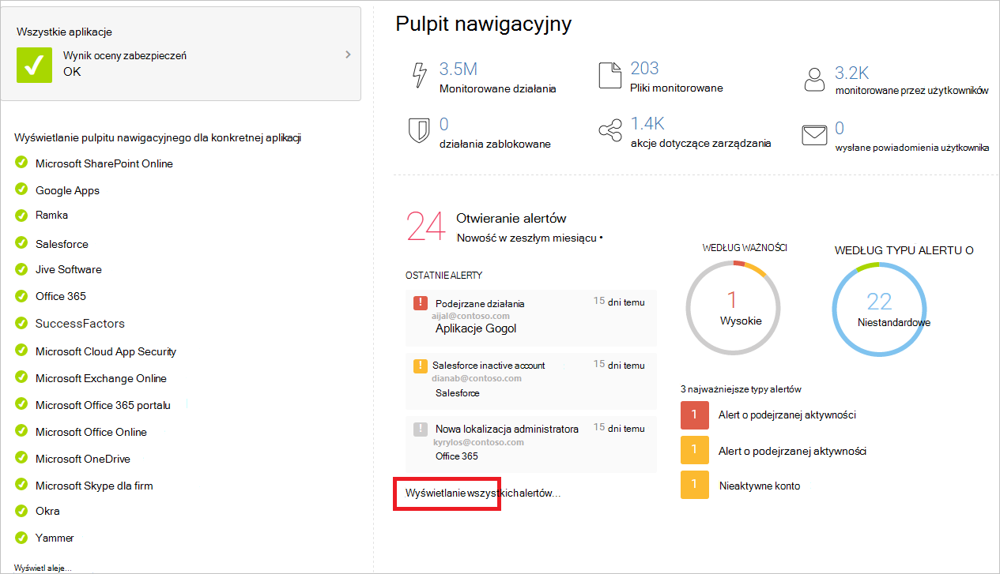

# Konfigurowanie dzierżawy Microsoft 365 w celu zwiększenia zabezpieczeń

[!INCLUDE [Microsoft 365 Defender rebranding](../includes/microsoft-defender-for-office.md)]

**Dotyczy**
- [Exchange Online Protection](exchange-online-protection-overview.md)
- [Microsoft Defender dla Office 365 plan 1 i plan 2](defender-for-office-365.md)
- [Microsoft 365 Defender](../defender/microsoft-365-defender.md)

W tym temacie oowiemy zalecane konfiguracje ustawień dla całej dzierżawy, które wpływają na bezpieczeństwo Twojego Microsoft 365 sieci. Twoje potrzeby w zakresie zabezpieczeń mogą wymagać większej lub mniejszej liczby zabezpieczeń. Na początek skorzystaj z tych zaleceń.

## Sprawdzanie Office 365 bezpiecznego wyniku

Office 365 secure score analizuje zabezpieczenia organizacji na podstawie twoich regularnych działań i ustawień zabezpieczeń oraz przypisuje wynik. Zacznij od notacji bieżącego wyniku. Dostosowanie niektórych ustawień dzierżawy spowoduje zwiększenie wyniku. Celem nie jest osiągnięcie maksymalnej liczby wyników, ale świadomość możliwości ochrony środowiska, które nie wpływają negatywnie na wydajność pracy użytkowników. Zobacz [Microsoft Secure Score](../defender/microsoft-secure-score.md).

## Dostosowywanie zasad zarządzania zagrożeniami w portalu Microsoft 365 Defender zabezpieczeń

Portal Microsoft 365 Defender zawiera funkcje chroniące środowisko. Obejmuje ona również raporty i pulpity nawigacyjne, za pomocą których możesz monitorować i podjąć działania. Niektóre obszary są dostępne z domyślnymi konfiguracjami zasad. Niektóre obszary nie zawierają domyślnych zasad ani reguł. Aby dostosować ustawienia zarządzania zagrożeniami w bezpieczniejszym **środowisku, &** \> zasady współpracy z pocztą e-mail **&** \> zasady dotyczące zagrożeń.

|Obszar|Zasady domyślne?|Zalecenie|
|---|---|---|
|**Ochrona przed wyłudzaniem informacji**|Tak|Skonfiguruj domyślne zasady ochrony przed wyłudzaniem informacji w sposób opisany tutaj: Konfigurowanie ustawień ochrony przed wyłudzaniem informacji w usługach [EOP i Defender for Office 365](protect-against-threats.md#part-2---anti-phishing-protection-in-eop-and-defender-for-office-365). 
 Więcej informacji: <ul><li>[Zasady ochrony przed wyłudzaniem informacji w programie Microsoft 365](set-up-anti-phishing-policies.md)</li><li>[Zalecane ustawienia zasad ochrony przed wyłudzaniem informacji w programie Microsoft Defender dla Office 365](recommended-settings-for-eop-and-office365.md#anti-phishing-policy-settings-in-microsoft-defender-for-office-365)</li><li> [Szczegółowe informacje o personifikacji](impersonation-insight.md)</li><li>[Spoof intelligence insight in EOP](learn-about-spoof-intelligence.md)</li><li>[Zarządzaj listą zezwalania/blokowania dzierżawy](tenant-allow-block-list.md).</li></ul>|
|**Aparat ochrony przed złośliwym oprogramowaniem**|Tak|Skonfiguruj domyślne zasady ochrony przed złośliwym oprogramowaniem zgodnie z opisem w tym miejscu: [Konfigurowanie ustawień ochrony przed złośliwym oprogramowaniem w u usługi EOP](protect-against-threats.md#part-1---anti-malware-protection-in-eop). 
 Więcej informacji: <ul><li>[Ochrona przed złośliwym oprogramowaniem](anti-malware-protection.md)</li><li>[Zalecane ustawienia zasad ochrony przed złośliwym oprogramowaniem](recommended-settings-for-eop-and-office365.md#eop-anti-malware-policy-settings)</li><li>[Konfigurowanie zasad ochrony przed złośliwym oprogramowaniem](configure-anti-malware-policies.md)</li></ul>|
|**Sejf załączników w programie Defender dla Office 365**|Nie|Skonfiguruj ustawienia globalne dla załączników Sejf i utwórz zasady załączników wiadomości Sejf zgodnie z opisem w tym miejscu: Konfigurowanie ustawień załączników Sejf w programie [Microsoft Defender dla systemu Office 365](protect-against-threats.md#safe-attachments-policies-in-microsoft-defender-for-office-365). 
 Więcej informacji: <ul><li>[Zalecane Sejf załączników](recommended-settings-for-eop-and-office365.md#safe-attachments-settings)</li><li>[Sejf załączników w programie Microsoft Defender dla Office 365](safe-attachments.md)</li><li>[Konfigurowanie zasad Sejf załączników](set-up-safe-attachments-policies.md)</li><li>[Sejf załączników do SharePoint, OneDrive i Microsoft Teams](mdo-for-spo-odb-and-teams.md)</li><li>[Bezpieczne dokumenty w usłudze Microsoft 365 E5](safe-docs.md)</li></ul>|
|**Sejf linków w programie Microsoft Defender dla Office 365**|Nie|Skonfiguruj ustawienia globalne dla usługi Sejf Links i utwórz zasady usługi Sejf Links w sposób opisany tutaj: Konfigurowanie ustawień linków Sejf w programie [Microsoft Defender dla systemu Office 365](protect-against-threats.md#safe-links-policies-in-microsoft-defender-for-office-365). 
 Więcej informacji: <ul><li>[Zalecane Sejf linków](recommended-settings-for-eop-and-office365.md#safe-links-settings)</li><li>[Konfigurowanie zasad Sejf linków](set-up-safe-links-policies.md)</li><li>[Sejf linków w programie Microsoft Defender dla Office 365](safe-links.md)</li><li>[Konfigurowanie ustawień globalnych dla programu Sejf Links w programie Microsoft Defender dla Office 365](configure-global-settings-for-safe-links.md)</li></ul>|
|**Ochrona przed spamem (filtrowanie poczty)**|Tak|Konfigurowanie domyślnych zasad ochrony przed spamem zgodnie z opisem w tym miejscu: [Konfigurowanie ustawień ochrony przed spamem w u usługi EOP](protect-against-threats.md#part-3---anti-spam-protection-in-eop) 
 Więcej informacji: <ul><li>[Zalecane ustawienia zasad ochrony przed spamem](recommended-settings-for-eop-and-office365.md#eop-anti-spam-policy-settings)</li><li>[Ochrona przed spamem w uciekaniu poczty eop](anti-spam-protection.md)</li><li>[Konfigurowanie zasad ochrony przed spamem w u usługi EOP](configure-your-spam-filter-policies.md)</li></ul>|
|***Uwierzytelnianie pocztą e-mail***|Tak|Uwierzytelnianie wiadomości e-mail używa rekordów DNS do dodawania weryfikowalnych informacji do wiadomości e-mail dotyczących źródła i nadawcy wiadomości. Microsoft 365 automatycznie konfiguruje uwierzytelnianie poczty e-mail dla swojej domeny domyślnej (onmicrosoft.com), ale administratorzy usługi Microsoft 365 też mogą konfigurować uwierzytelnianie poczty e-mail dla domen niestandardowych. Używane są trzy metody uwierzytelniania: <ul><li>Spf (Lub Framework zasad dotyczących nadawców).</li><ul><li>Aby uzyskać informacje o konfiguracji, [zobacz Konfigurowanie spf w programie Microsoft 365 zapobiegania fałszersce](set-up-spf-in-office-365-to-help-prevent-spoofing.md).</li></ul> <li>DKIM (DomainKeys Identified Mail).</li><ul><li>Zobacz [Używanie funkcji DKIM do sprawdzania poprawności wychodzących wiadomości e-mail wysłanych z domeny niestandardowej](use-dkim-to-validate-outbound-email.md).</li><li>Po skonfigurowaniu funkcji DKIM włącz ją w portalu Microsoft 365 Defender sieci.</li></ul><li>DMARC (Domain-based Message Authentication, Reporting, and Conformance).</li><ul><li>W przypadku konfiguracji funkcji DMARC [Użyj funkcji DMARC do sprawdzania poprawności wiadomości e-mail w Microsoft 365](use-dmarc-to-validate-email.md).</li></ul></ul>|

> [!NOTE]
> W przypadku niestandardowych wdrożeń SPF, wdrożeń hybrydowych i rozwiązywania problemów: Jak Microsoft 365 korzysta z struktury zasad dotyczących nadawców [(SPF) w celu zapobiegania fałszowania](how-office-365-uses-spf-to-prevent-spoofing.md).

## Wyświetlanie pulpitów nawigacyjnych i raportów w Microsoft 365 Defender nawigacyjnym

Odwiedź te raporty i pulpity nawigacyjne, aby dowiedzieć się więcej na temat kondycji środowiska. Dane w tych raportach stają się bardziej rozbudowane w przypadku, gdy Twoja organizacja Office 365 usług. Na razie zaznajomij się z tym, co możesz monitorować i podjąć działania.

|Pulpit nawigacyjny|Opis|
|---|---|
|Raporty zabezpieczeń poczty e-mail|Raporty te są dostępne w programie Exchange Online Protection. Aby uzyskać więcej informacji, [zobacz Wyświetlanie raportów zabezpieczeń poczty e-mail w Microsoft 365 Defender poczty e-mail](view-email-security-reports.md).|
|Defender for Office 365 reports|Raporty są dostępne tylko w programie Defender dla Office 365. Aby uzyskać więcej informacji, [zobacz Wyświetlanie raportów programu Defender Office 365 w portalu Microsoft 365 Defender użytkowników](view-reports-for-mdo.md).|
|Raporty przepływu poczty e-mail i szczegółowe informacje|Te raporty i szczegółowe informacje są dostępne w centrum Exchange administracyjnego (EAC). Aby uzyskać więcej informacji, zobacz [Raporty przepływu poczty e-mail](/exchange/monitoring/mail-flow-reports/mail-flow-reports) i [Szczegółowe informacje o przepływie poczty](/exchange/monitoring/mail-flow-insights/mail-flow-insights).|
|[Eksplorator zagrożeń (lub wykrywanie w czasie rzeczywistym)](threat-explorer.md)|Jeśli badasz lub masz do czynienia z atakiem twojej dzierżawy, użyj Eksploratora (lub wykrywania w czasie rzeczywistym) do przeanalizowania zagrożeń. Eksplorator (i raport wykrywanie w czasie rzeczywistym) pokazuje ilość ataków w czasie i umożliwia analizowanie tych danych przez rodziny zagrożeń, infrastrukturę atakującą i nie tylko. Możesz również oznaczyć podejrzaną wiadomość e-mail na liście Zdarzenia.|

## Konfigurowanie dodatkowych Exchange Online dla całej dzierżawy

Oto kilka zalecanych dodatkowych ustawień.

|Obszar|Zalecenie|
|---|---|
|**Reguły przepływu poczty** (nazywane także regułami transportu)|Dodaj regułę przepływu poczty e-mail, aby chronić się przed oprogramowaniem wymuszającym okup, blokując wykonywalne typy plików i Office zawierających makra. Aby uzyskać więcej informacji, zobacz [Używanie reguł przepływu poczty e-mail do sprawdzania załączników wiadomości Exchange Online](/exchange/security-and-compliance/mail-flow-rules/inspect-message-attachments). 
 Zobacz te dodatkowe tematy: <ul><li>[Ochrona przed oprogramowaniem wymuszającym okup](../../admin/security-and-compliance/secure-your-business-data.md#5-protect-against-ransomware)</li><li>[Ochrona przed złośliwym oprogramowaniem i oprogramowaniem wymuszającym okup w Microsoft 365](/compliance/assurance/assurance-malware-and-ransomware-protection)</li><li>[Odzyskiwanie po atakach oprogramowania wymuszającego okup w Office 365](recover-from-ransomware.md)</li></ul> 
 Utwórz regułę przepływu poczty e-mail, aby zapobiec automatycznemu przesyłaniu poczty e-mail do domen zewnętrznych. Aby uzyskać więcej informacji, zobacz [Ograniczanie reguł przekazywania zewnętrznego klienta przy użyciu bezpiecznego wyniku](/archive/blogs/office365security/mitigating-client-external-forwarding-rules-with-secure-score). 
 Więcej informacji: [Reguły przepływu poczty e-mail (reguły transportu) w programie Exchange Online](/exchange/security-and-compliance/mail-flow-rules/mail-flow-rules)|
|**Nowoczesne uwierzytelnianie**|Nowoczesne uwierzytelnianie stanowi wymaganie wstępne w przypadku korzystania z uwierzytelniania wieloskładnikowego (MFA). Uwierzytelniania wieloskładnikowego zaleca się do zabezpieczania dostępu do zasobów w chmurze, w tym do poczty e-mail. 
 Zobacz te tematy: <ul><li>[Włączanie lub wyłączanie nowoczesnego uwierzytelniania w Exchange Online](/Exchange/clients-and-mobile-in-exchange-online/enable-or-disable-modern-authentication-in-exchange-online)</li><li>[Skype dla firm Online: Włączanie nowoczesnego uwierzytelniania dla dzierżawy](https://social.technet.microsoft.com/wiki/contents/articles/34339.skype-for-business-online-enable-your-tenant-for-modern-authentication.aspx)</li></ul> 
 Nowoczesne uwierzytelnianie jest domyślnie włączone dla klientów Office 2016, usługi SharePoint Online i OneDrive dla Firm. 
 Więcej informacji: [Jak działa nowoczesne uwierzytelnianie w Office 2013 i 2016 Office 2016](../../enterprise/modern-auth-for-office-2013-and-2016.md)|

## Konfigurowanie zasad udostępniania dla całej dzierżawy w SharePoint administracyjnego

Zalecenia firmy Microsoft dotyczące konfigurowania witryn SharePoint na rosnącym poziomie ochrony, począwszy od ochrony podstawowej. Aby uzyskać więcej informacji, zobacz [Zalecenia dotyczące zasad dotyczące SharePoint witryn i plików](sharepoint-file-access-policies.md).

SharePoint zespołu skonfigurowane na poziomie bazowym umożliwiają udostępnianie plików użytkownikom zewnętrznym przy użyciu linków z dostępem anonimowym. Ta metoda jest zalecana zamiast wysyłania plików w wiadomościach e-mail.

Aby wspierać cele dotyczące ochrony podstawowej, skonfiguruj zasady udostępniania dla całej dzierżawy zgodnie z zaleceniami w tym miejscu. Ustawienia udostępniania poszczególnych witryn mogą być bardziej restrykcyjne niż te zasady dla całej dzierżawy, ale nie mogą być bardziej restrykcyjne.

|Obszar|Uwzględnia zasady domyślne|Zalecenie|
|---|---|---|
|**Udostępnianie** (SharePoint Online i OneDrive dla Firm)|Tak|Udostępnianie zewnętrzne jest domyślnie włączone. Zalecane są następujące ustawienia: <ul><li>Zezwalanie na udostępnianie uwierzytelnionym użytkownikom zewnętrznym i korzystanie z linków dostępu anonimowego (ustawienie domyślne).</li><li>Linki z dostępem anonimowym wygasają w ciągu tej wielu dni. W razie potrzeby wprowadź liczbę, na przykład 30 dni.</li><li>Domyślny typ linku — wybierz pozycję Wewnętrzny (tylko osoby w organizacji). Użytkownicy, którzy chcą udostępniać za pomocą linków anonimowych, muszą wybrać tę opcję z menu udostępniania.</li></ul> 
 Więcej informacji: [Omówienie udostępniania zewnętrznego](/sharepoint/external-sharing-overview)|

SharePoint i centrum administracyjnym OneDrive dla Firm te same ustawienia. Ustawienia w obu tych centrum administracyjnym są stosowane do obu tych ustawień.

## Konfigurowanie ustawień w aplikacji Azure Active Directory

Pamiętaj, aby odwiedzić te dwa obszary w programie Azure Active Directory, aby ukończyć konfigurację na całym dzierżawie w celu zapewnienia bezpieczniejszych środowisk.

### Konfigurowanie nazwanych lokalizacji (w obszarze dostępu warunkowego)

Jeśli Twoja organizacja obejmuje biura z bezpiecznym dostępem do sieci, dodaj zaufane zakresy adresów IP Azure Active Directory nazwanych lokalizacji. Ta funkcja pozwala zmniejszyć liczbę zgłoszonych wyników fałszywie dodatnich dla zdarzeń ryzyka logowania.

Zobacz: [Nazwane lokalizacje w Azure Active Directory](/azure/active-directory/active-directory-named-locations)

### Blokowanie aplikacji, które nie obsługują nowoczesnego uwierzytelniania

Uwierzytelnianie wieloskładnikowe wymaga aplikacji, które obsługują nowoczesne uwierzytelnianie. Aplikacje, które nie obsługują nowoczesnego uwierzytelniania, nie mogą być blokowane przy użyciu reguł dostępu warunkowego.

W przypadku bezpiecznych środowisk wyłącz uwierzytelnianie dla aplikacji, które nie obsługują nowoczesnego uwierzytelniania. Możesz to zrobić w Azure Active Directory z kontrolką, która zostanie wkrótce w wkrótce w wer.

W międzyczasie można to zrobić przy użyciu jednej z następujących metod: w przypadku usługi SharePoint Online i OneDrive dla Firm:

- Użyj programu PowerShell, zobacz [Blokowanie aplikacji, które nie używają nowoczesnego uwierzytelniania](/mem/intune/protect/app-modern-authentication-block).
- Skonfiguruj to w centrum <a href="https://go.microsoft.com/fwlink/?linkid=2185219" target="_blank">SharePoint</a> na stronie "Dostęp urządzeń" — "Sterowanie dostępem z aplikacji, które nie używają nowoczesnego uwierzytelniania". Wybierz pozycję Zablokuj.

## Rozpoczynanie pracy z aplikacjami lub usługami w chmurze za pomocą usługi Defender Office 365 Cloud App Security

Za Office 365 Cloud App Security oceniaj ryzyko, ostrzegaj o podejrzanych działaniach i automatycznie podejmiesz działania. Wymaga Office 365 E5 planu.

Możesz też skorzystać z usługi Microsoft Defender for Cloud Apps, aby uzyskać bardziej szczegółowe informacje nawet po przyznaniu dostępu, kompleksowych kontroli i ulepszoną ochronę dla wszystkich aplikacji w chmurze, w tym dla Office 365.

Ponieważ to rozwiązanie zaleca plan EMS E5, zalecamy rozpoczęcie od programu Defender for Cloud Apps, aby można było używać go z innymi aplikacjami SaaS w Twoim środowisku. Zacznij od domyślnych zasad i ustawień.

Więcej informacji:

- [Wdrażanie usługi Defender dla aplikacji w chmurze](/cloud-app-security/getting-started-with-cloud-app-security)
- [Więcej informacji na temat programu Microsoft Defender dla aplikacji w chmurze](https://www.microsoft.com/cloud-platform/cloud-app-security)
- [Co to jest usługa Defender dla aplikacji w chmurze?](/cloud-app-security/what-is-cloud-app-security)

## Dodatkowe materiały

W tych artykułach i przewodnikach podano dodatkowe informacje wstępne dotyczące zabezpieczeń Microsoft 365 urządzenia:

- [Wskazówki firmy Microsoft dotyczące zabezpieczeń dla kampanii politycznych, organizacji niedochodowych](microsoft-security-guidance-for-political-campaigns-nonprofits-and-other-agile-o.md) i innych organizacji Agile (możesz użyć tych zaleceń w dowolnym środowisku, zwłaszcza w środowiskach chmurowych)

- [Zalecane zasady zabezpieczeń i konfiguracje tożsamości i urządzeń](microsoft-365-policies-configurations.md) (zalecenia te obejmują pomoc dla środowisk usług AD FS)
