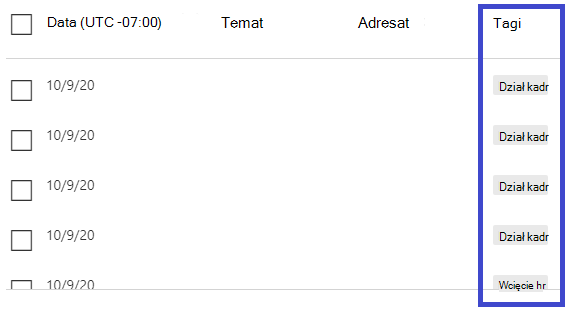
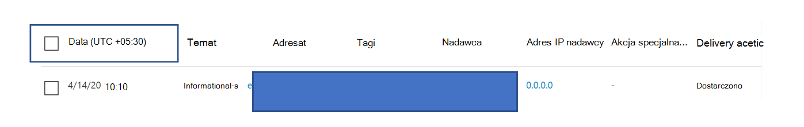

# Wykrywanie w Eksploratorze zagrożeń i w czasie rzeczywistym

**Dotyczy**
- [Microsoft Defender dla Office 365 plan 1 i plan 2](defender-for-office-365.md)
- [Microsoft 365 Defender](../defender/microsoft-365-defender.md)

Jeśli Twoja organizacja ma program [Microsoft Defender for Office 365](defender-for-office-365.md) i masz odpowiednie [uprawnienia, masz](#required-licenses-and-permissions) wykrywanie w czasie rzeczywistym lub **Eksploratora (** wcześniej raporty w czasie *rzeczywistym — sprawdź*, co się [nowego).](#new-features-in-threat-explorer-and-real-time-detections) W Centrum zabezpieczeń & zgodności przejdź do strony Zarządzanie zagrożeniami **, a** następnie wybierz pozycję **Wykrywanie**  eksploratora lub **w czasie rzeczywistym**.

|Usługa Microsoft Defender dla Office 365 Plan 2 pozwala zobaczyć:|Usługa Microsoft Defender dla Office 365 Plan 1 pozwala zobaczyć:|
|---|---|
|||

Wykrywanie w Eksploratorze lub w czasie rzeczywistym ułatwia twojemu zespołowi operacyjnemu ds. zabezpieczeń efektywne badanie zagrożeń i reagowanie na nie. Raport przypomina poniższy obraz:

Ten raport umożliwia:

- [Zobacz złośliwe oprogramowanie wykryte przez Microsoft 365 funkcje zabezpieczeń](#see-malware-detected-in-email-by-technology)
- [Wyświetlanie adresu URL wyłudzania informacji i klikanie danych werdyktu](#view-phishing-url-and-click-verdict-data)
- [Uruchamianie zautomatyzowanego procesu badania i odpowiedzi z widoku w Eksploratorze](#start-automated-investigation-and-response) (tylko program Defender Office 365 Plan 2)
- [Badanie złośliwych wiadomości e-mail i nie tylko](#more-ways-to-use-explorer-and-real-time-detections)

## Ulepszenia dotyczące pracy z zagrożeniami podczas chłoniania

### Wprowadzenie do identyfikatora alertu dla usługi Defender Office 365 alertów w wykryciach w Eksploratorze/czasie rzeczywistym

Obecnie w przypadku przechodzenia z alertu do Eksploratora zagrożeń zostanie otwarty widok filtrowany w Eksploratorze z widokiem filtrowany według identyfikatora zasad alertu (identyfikator zasad, który jest identyfikator unikatowy dla zasad alertu).
Wprowadzamy ten identyfikator alertu (zobacz przykład identyfikatora alertu poniżej) w Eksploratorze zagrożeń i wykrywaniu w czasie rzeczywistym, dzięki czemu widać wiadomości związane z określonym alertem, a także liczbę wiadomości e-mail. Możesz również sprawdzić, czy wiadomość była częścią alertu, a także przejść z tej wiadomości do konkretnego alertu.

Identyfikator alertu jest dostępny w adresie URL podczas wyświetlania pojedynczego alertu. Przykład: `https://protection.office.com/viewalerts?id=372c9b5b-a6c3-5847-fa00-08d8abb04ef1`.

> [!div class="mx-imgBorder"]
> 

> [!div class="mx-imgBorder"]
> 

### Rozszerzanie limitu przechowywania danych i wyszukiwania w Eksploratorze (i wykrywania w czasie rzeczywistym) dla dzierżaw wersji próbnej z 7 do 30 dni

W ramach tej zmiany będzie można wyszukiwać i filtrować dane poczty e-mail przez 30 dni (czyli więcej niż w poprzednich 7 dniach) w wykrywaniu w Eksploratorze zagrożeń/czasie rzeczywistym zarówno w uchcie programu Defender dla dzierżaw wersji próbnej Office P1, jak i P2.
Nie ma to wpływu na żadne dzierżawy produkcyjne zarówno dla klientów P1, jak i P2/E5, którzy mają już 30-dniowe przechowywanie danych i możliwości wyszukiwania.

### Zaktualizowane limity eksportowania rekordów w Eksploratorze zagrożeń

W ramach tej aktualizacji liczba wierszy rekordów poczty e-mail, które można wyeksportować z Eksploratora zagrożeń, została zwiększona z 9990 do 200 000 rekordów. Zestaw kolumn, które można obecnie wyeksportować, pozostanie niezmieniony, ale liczba wierszy zostanie zwiększana w  porównaniu z bieżącym limitem.

### Tagi w Eksploratorze zagrożeń

> [!NOTE]
> Funkcja tagów użytkowników jest w wersji *Preview*, nie jest dostępna dla wszystkich i może ulec zmianie. Aby uzyskać informacje na temat harmonogramu wydania, zapoznaj się z Microsoft 365 przewodnik.

Tagi użytkowników identyfikują konkretne grupy użytkowników w uchcie Microsoft Defender dla Office 365. Aby uzyskać więcej informacji o tagach, w tym o licencjonowaniu i konfiguracji, zobacz [Tagi użytkownika](user-tags.md).

W Eksploratorze zagrożeń możesz zobaczyć informacje o tagach użytkowników w następujących środowiskoch.

#### Widok siatki wiadomości e-mail

Kolumna **Tagi** w siatce wiadomości e-mail zawiera wszystkie tagi, które zostały zastosowane do skrzynek pocztowych nadawcy lub adresata. Domyślnie w pierwszej kolejności są wyświetlane tagi systemowe, takie jak konta priorytetów.

> [!div class="mx-imgBorder"]
> 

#### Filtrowanie

Tagów można używać jako filtru. Przeszukaj tylko priorytetowe konta lub scenariusze z określonymi tagami użytkowników. Możesz również wykluczyć wyniki z określonymi tagami. Połącz tę funkcję z innymi filtrami, aby zawęzić zakres badania.

> [!div class="mx-imgBorder"]
> 

#### Wysuwny szczegół wiadomości e-mail

Aby wyświetlić poszczególne tagi dla nadawcy i adresata, wybierz temat, aby wyświetlić wysuwne szczegóły wiadomości. Na karcie **Podsumowanie** tagi nadawcy i adresata są wyświetlane oddzielnie, jeśli są obecne w wiadomości e-mail.
Informacje o poszczególnych tagach nadawcy i adresata obejmują również wyeksportowane dane CSV, w których te szczegóły są wyświetlane w dwóch osobnych kolumnach.

> [!div class="mx-imgBorder"]
> 

Informacje o znacznikach są również wyświetlane w wysuwanych kliknięciach adresu URL. Aby go wyświetlić, przejdź do widoku Wyłudzy lub Wszystkie wiadomości e-mail, a następnie do **karty Adresy URL** lub **Kliknięcia adresu URL** . Wybierz poszczególne wysuwne informacje o adresie URL, aby wyświetlić dodatkowe szczegóły dotyczące kliknięć tego adresu URL, łącznie z tagami skojarzonymi z tym kliknięciem.

### Zaktualizowany widok osi czasu

> [!div class="mx-imgBorder"]
> 
>
Dowiedz się więcej, oglądając [ten klip wideo](https://www.youtube.com/watch?v=UoVzN0lYbfY&list=PL3ZTgFEc7LystRja2GnDeUFqk44k7-KXf&index=4).

## Ulepszenia w zakresie ochrony przed zagrożeniami (nadchodzące)

### Zaktualizowano informacje o zagrożeniach dla wiadomości e-mail

Skoncentrowaliśmy się na platformie i ulepszeniach jakości danych, aby zwiększyć dokładność i spójność danych dla rekordów poczty e-mail. Udoskonalenia obejmują konsolidację informacji przed dostarczeniem i po dostarczeniu, takich jak akcje wykonywane na wiadomości e-mail w ramach procesu zap, w jeden rekord. Uwzględniono też dodatkowe szczegóły, takie jak werdykt spamu, zagrożenia na poziomie encji (na przykład adres URL, który był złośliwy) i najnowsze lokalizacje dostarczania.

Po tych aktualizacjach dla każdej wiadomości będzie wyświetlany pojedynczy wpis, niezależnie od różnych zdarzeń po dostarczeniu, które wpływają na wiadomość. Działania te mogą obejmować zap, ręczne działania naprawcze (co oznacza akcję administratora), dostarczanie dynamiczne i tak dalej.

Oprócz wyświetlania złośliwego oprogramowania i zagrożeń wyłudzających informacje zobaczysz werdykt spamu skojarzony z wiadomością e-mail. W wiadomości e-mail zobacz wszystkie zagrożenia związane z pocztą e-mail wraz z odpowiednimi technologiami wykrywania. Wiadomość e-mail może mieć zero, jedno lub wiele zagrożeń. W sekcji Szczegóły wysuwu wiadomości e-mail zobaczysz bieżące zagrożenia. W przypadku wielu zagrożeń (takich jak złośliwe oprogramowanie i wyłudzanie informacji) pole **technologii** Wykrywanie wskazuje mapowanie wykrywania zagrożeń, czyli technologię wykrywania, która zidentyfikuje zagrożenie.

Zestaw technologii wykrywania zawiera teraz nowe metody wykrywania, a także technologie wykrywania spamu. Za pomocą tego samego zestawu technologii wykrywania można filtrować wyniki w różnych widokach poczty e-mail (Złośliwe oprogramowanie, Wyłudza, Cała poczta e-mail).

> [!NOTE]
> Analiza werdyktu może nie być powiązana z jednostkami. Na przykład wiadomość e-mail może zostać sklasyfikowana jako wiadomości wyłud treści lub spam, ale nie ma adresów URL z werdyktem wyłudzy/spamu. Jest to spowodowane tym, że filtry oceniają również zawartość i inne szczegóły wiadomości e-mail przed przypisaniem werdyktu.

#### Zagrożenia w adresach URL

Na karcie Szczegóły wysuwana wiadomość e-mail możesz teraz zobaczyć konkretne zagrożenie dla **adresu URL.** Zagrożenie może mieć *na przykład złośliwe oprogramowanie*, *wyłudzy*, *spam* *lub brak*).

> [!div class="mx-imgBorder"]
> 

### Zaktualizowany widok osi czasu (nadchodzące)

> [!div class="mx-imgBorder"]
> 

Widok osi czasu zawiera wszystkie zdarzenia dostarczenia i po dostarczeniu. Zawiera informacje o zagrożeń zidentyfikowanych w tym momencie dla podzestawu tych zdarzeń. Widok osi czasu zawiera również informacje na temat wszelkich dodatkowych działań (takich jak zap lub ręczne działania naprawcze) wraz z ich wynikiem. Informacje widoku osi czasu obejmują:

- **Źródło:** Źródło zdarzenia. Może to być administrator/system/użytkownik.
- **Zdarzenie:** Obejmuje zdarzenia najwyższego poziomu, takie jak dostarczanie pierwotne, ręczne rozwiązywanie problemów, zap, materiały przesłania i dostarczanie dynamiczne.
- **Akcja:** Określone działanie, które zostało wykonane w ramach działania zap lub administratora (na przykład niechybne usunięcie).
- **Zagrożenia:** Zasłania zagrożenia (złośliwe oprogramowanie, wyłudzy, spam) zidentyfikowane w tym momencie.
- **Wynik/Szczegóły:** Więcej informacji na temat wyniku akcji, na przykład tego, czy została wykonana w ramach akcji ZAP/admin.

### Oryginalna i najnowsza lokalizacja dostarczania

Obecnie lokalizacja dostarczania jest dostępna w siatce poczty e-mail i wysuwanych wiadomościach e-mail. Nazwa **pola Lokalizacja dostarczania** zostanie zmieniona na **_Pierwotna lokalizacja dostarczania_*_. Wprowadzamy kolejne pole, _*_Najnowsza lokalizacja dostarczania_**.

**Oryginalna lokalizacja dostarczania** zawiera więcej informacji o tym, gdzie wiadomość e-mail została początkowo dostarczona. **W ostatniej lokalizacji dostarczania** wiadomość e-mail trafiała po działaniach systemowych, takich jak *ZAP* lub akcje administratora, takie jak *Przenieś do elementów usuniętych*. Najnowsza lokalizacja dostarczania ma zamierzenie informujące administratorów o ostatniej znanej lokalizacji wiadomości po dostarczeniu lub o wszelkich działaniach systemowych/a administrujący. Wiadomość e-mail nie zawiera żadnych akcji użytkownika końcowego. Jeśli na przykład użytkownik usunął wiadomość lub przeniesiono wiadomość do archiwum/pst, lokalizacja "dostarczanie" wiadomości nie zostanie zaktualizowana. Jeśli jednak akcja systemowa zaktualizowała lokalizację (na przykład zap, co spowoduje przeniesienie wiadomości e-mail do **kwarantanny), lokalizacja** najnowszej dostawy będzie pokazywana jako "kwarantanna".

> [!div class="mx-imgBorder"]
> 

> [!NOTE]
> W kilku przypadkach lokalizacja **dostarczania i akcja** dostarczenia mogą  być wyświetlane jako "nieznane":
>
> - Jeśli wiadomość została  dostarczona, lokalizacja dostarczania może być  "dostarczona", a lokalizacja dostarczania jako "nieznana", ale reguła skrzynki odbiorczej przeniosła wiadomość do folderu domyślnego (takiego jak Wersja robocza lub Archiwum) zamiast do folderu Skrzynka odbiorcza lub Wiadomości-śmieci.
>
> - **Nie można określić ostatniej** lokalizacji dostarczania, jeśli próbowano wybrać akcję administratora/systemu (na przykład ZAP), ale wiadomość nie została odnaleziona. Zazwyczaj akcja ma miejsce po tym, jak użytkownik przeniosł lub usunął wiadomość. W takich przypadkach sprawdź **kolumnę Wynik/Szczegóły** w widoku osi czasu. Poszukaj instrukcji "Wiadomość przeniesiona lub usunięta przez użytkownika".

> [!div class="mx-imgBorder"]
> 

### Dodatkowe akcje

*Po dostarczeniu* wiadomości e-mail zastosowano dodatkowe akcje. Mogą one obejmować *ZAP**, ręczne* działania naprawcze (działania podejmowane przez administratora, takie jak niechtywne *usunięcie), dostarczanie* dynamiczne i ponowne *przetwarzanie (w* przypadku wiadomości e-mail wykrytych domyślnie jako dobre).

> [!NOTE]
> W ramach oczekujących zmian wartość "Usunięte przez ZAP" obecnie jest powierzchniowa w filtrze Akcja dostarczania zostanie usunięta. Możesz wyszukać wszystkie wiadomości e-mail za pomocą zap w ramach **dodatkowych akcji**.

> [!div class="mx-imgBorder"]
> 

### Zastępowanie systemu

*Zastępowanie systemu* umożliwia wyjątków od zamierzonej lokalizacji dostarczania wiadomości. Lokalizację dostarczania zapewnianą przez system można zastąpić na podstawie zagrożeń i innych wykryciy zidentyfikowanych przez stos filtrowania. Za pomocą zasad dzierżawy lub użytkownika można skonfigurować zastępowanie systemu w celu dostarczenia wiadomości zgodnie z sugestiami tych zasad. Zastępować może identyfikować niezamierzone dostarczanie złośliwych wiadomości z powodu luk w konfiguracjach, takich jak zbyt ogólne Sejf nadawców ustawione przez użytkownika. Te wartości zastępują mogą być następujące:

- Dozwolone przez zasady użytkownika: użytkownik tworzy na poziomie skrzynki pocztowej zasady zezwalania domenom lub nadawcom.

- Zasady użytkownika zablokowane przez: Użytkownik tworzy zasady na poziomie pola poczty w celu blokowania domen lub nadawców.

- Dozwolone przez zasady organizacji: Zespoły zabezpieczeń organizacji ustawiają zasady lub reguły przepływu poczty Exchange (nazywane także regułami transportu), aby umożliwić nadawcom i domenom użytkowników w organizacji. Może to dotyczyć zestawu użytkowników lub całej organizacji.

- Zablokowane przez zasady organizacji: Zespoły zabezpieczeń organizacji ustawiają zasady lub reguły przepływu poczty e-mail, aby blokować nadawców, domeny, języki wiadomości lub źródłowe adresu IP dla użytkowników w organizacji. Tę możliwość można stosować do zestawu użytkowników lub całej organizacji.

- Rozszerzenie pliku blokowane przez zasady organizacji: Zespół zabezpieczeń organizacji blokuje rozszerzenie nazwy pliku za pomocą ustawień zasad ochrony przed złośliwym oprogramowaniem. Te wartości będą teraz wyświetlane w szczegółach wiadomości e-mail, co pomoże w badaniach. Zespoły typu Secops mogą również filtrować zablokowane rozszerzenia plików przy użyciu funkcji filtrowania.

> [!div class="mx-imgBorder"]
> 

### Ulepszenia obsługi adresów URL i kliknięć

Ulepszenia są następujące:

- Pokaż pełny klikowany adres URL (wraz z dowolnymi parametrami zapytania, które są częścią adresu URL) w sekcji Kliknięcia **wysuwu** adresu URL. Domena i ścieżka adresu URL są obecnie wyświetlane na pasku tytułu. Rozszerzamy te informacje, aby pokazać pełny adres URL.

- Poprawki we wszystkich filtrach adresów URL (*domena adresu URL* a domena adresu *URL* a domena i ścieżka adresu *URL*): Aktualizacje wpływają na wyszukiwanie wiadomości zawierających adres URL/werdykt kliknięcia. Włączono obsługę wyszukiwań agnostycznych protokołu, więc możesz wyszukiwać adres URL bez użycia `http`. Domyślnie przeszukiwany adres URL jest mapowany na http, chyba że zostanie jawnie określona inna wartość. Przykład:
  - Wyszukiwanie z prefiksem i bez `http://` niego w polach **filtrowania adresu URL**, domeny adresu URL oraz domeny **i** ścieżki. Wyniki wyszukiwania powinny być takie same.
  - Wyszukaj prefiks w `https://` adresie **URL**. Jeśli nie zostanie określona żadna wartość, przyjmuje się `http://` prefiks.
  - `/`są ignorowane na początku i końcu ścieżki **adresu URL**, pól **Url Domain** (Domena adresu **URL), URL domain (Domena adresu URL) i path (ścieżka).** `/` na końcu pola **adresu URL** jest ignorowana.

### Poziom ufności phish

Poziom ufności phish pomaga określić stopień ufności kategoryzowania wiadomości e-mail jako "phish". Dwie możliwe wartości to *Wysoka i* *Normalna*. W początkowych etapach ten filtr będzie dostępny tylko w widoku Wyłudzy w Eksploratorze zagrożeń.

### Sygnał adresu URL zap

Sygnał adresu URL ZAP jest zazwyczaj używany w scenariuszach alertów ZAP Phish, w których wiadomość e-mail została zidentyfikowana jako Phish i usunięta po dostarczeniu. Ten sygnał łączy alert z odpowiednimi wynikami w Eksploratorze. Jest to jedna z sieci IOCs dla alertu.

Aby usprawnić proces wyszukiwania, zaktualizowaliśmy wykrywanie w Eksploratorze zagrożeń i w czasie rzeczywistym, aby poprawić spójność pracy podczas wyszukiwania. Poniżej opisano zmiany:

- [Ulepszenia strefy czasowej](#timezone-improvements)
- [Aktualizowanie w procesie odświeżania](#update-in-the-refresh-process)
- [Przechodzenie do szczegółów wykresu w celu dodania do filtrów](#chart-drilldown-to-add-to-filters)
- [W informacjach o produkcie](#in-product-information-updates)

### Filtrowanie według tagów użytkowników

Teraz możesz sortować i filtrować według systemowych lub niestandardowych tagów użytkowników, aby szybko chwycić zakres zagrożeń. Aby dowiedzieć się więcej, zobacz [Tagi użytkownika](user-tags.md).

> [!IMPORTANT]
> Filtrowanie i sortowanie według tagów użytkowników jest obecnie dostępne w publicznej wersji Preview. Ta funkcja może zostać znacząco zmodyfikowana przed jej komercyjną premierą. Firma Microsoft nie udziela żadnych gwarancji, jawnych ani domniemanych, w odniesieniu do podanych informacji na jej temat.

> [!div class="mx-imgBorder"]
> 

### Ulepszenia strefy czasowej

Zobaczysz strefę czasową dla rekordów poczty e-mail w portalu, a także dla wyeksportowanych danych. Będzie on widoczny w różnych środowiskoch, takich jak siatka wiadomości e-mail, wysuwne informacje szczegółów, oś czasu wiadomości e-mail i podobne wiadomości e-mail, więc strefa czasowa zestawu wyników jest wyczyścina.

> [!div class="mx-imgBorder"]
> 

### Aktualizowanie w procesie odświeżania

Niektórzy użytkownicy skomentują pomylenia z automatycznym odświeżaniem (na przykład zaraz po zmianie daty odświeżenia strony) i ręcznym odświeżaniem (w przypadku innych filtrów). Podobnie usunięcie filtrów prowadzi do automatycznego odświeżania. Zmiana filtrów podczas modyfikowania zapytania może spowodować niespójne środowisko wyszukiwania. Aby rozwiązać te problemy, pracujemy nad mechanizmem filtrowania ręcznego.

W standpoint środowisko, użytkownik może stosować i usuwać różne zakresy filtrów (z zestawu filtrów i daty) i wybrać przycisk odświeżania, aby filtrować wyniki po zdefiniowanym zapytaniu. Przycisk odświeżania jest teraz wyróżniony na ekranie. Zaktualizowaliśmy także powiązane etykietki narzędzi i dokumentację w produktach.

> [!div class="mx-imgBorder"]
> 

### Przechodzenie do szczegółów wykresu w celu dodania do filtrów

Teraz możesz utworzyć wykres wartości legendy, aby dodać je jako filtry. Wybierz przycisk **Odśwież** , aby przefiltrować wyniki.

> [!div class="mx-imgBorder"]
> 

### Aktualizacje informacji w produktach

W obrębie produktu są teraz dostępne dodatkowe szczegóły, na przykład łączna liczba wyników wyszukiwania w siatce (patrz poniżej). Ulepszyliśmy etykiety, komunikaty o błędach i etykietki narzędzi, aby zapewnić więcej informacji na temat filtrów, jakości wyszukiwania i zestawu wyników.

> [!div class="mx-imgBorder"]
> 

## Rozszerzone funkcje w Eksploratorze zagrożeń

### Najgorętsi użytkownicy docelowi

Dzisiaj udostępniamy listę użytkowników, do których najgorętniej dostępni są użytkownicy, w widoku Złośliwe oprogramowanie w przypadku wiadomości e-mail w sekcji Najgorętsze rodziny złośliwego oprogramowania. Rozszerzymy ten widok również w widokach Wyłudzy i Wszystkie wiadomości e-mail. Można wyświetlić pięciu użytkowników, których docelowo chcesz wyświetlić, wraz z liczbą prób poszczególnych użytkowników w odpowiednim widoku. Na przykład w widoku Phish zobaczysz liczbę prób wyłudzy.

Możesz wyeksportować listę docelowych użytkowników (maksymalnie do 3000) wraz z liczbą prób analizy w trybie offline dla każdego widoku poczty e-mail. Ponadto wybranie liczby prób (na przykład 13 prób na poniższej ilustracji) spowoduje otwarcie widoku filtrowanego w Eksploratorze zagrożeń, dzięki czemu będzie można wyświetlać więcej szczegółów wiadomości e-mail i zagrożeń dla tego użytkownika.

> [!div class="mx-imgBorder"]
> 

### Exchange reguł transportu

W ramach wzbogacenia danych można zobaczyć wszystkie reguły transportu Exchange (ETR), które zostały zastosowane do wiadomości. Te informacje będą dostępne w widoku siatki wiadomości e-mail. Aby go wyświetlić, wybierz **pozycję Opcje kolumny** w siatce, a następnie Exchange **opcje** kolumny Dodaj regułę transportu. Będzie on również widoczny w **wysuwanych szczegółach** w wiadomości e-mail.

Będzie można zobaczyć zarówno identyfikator GUID, jak i nazwę reguł transportu, które zostały zastosowane do wiadomości. Wiadomości będzie można wyszukać, używając nazwy reguły transportu. To jest wyszukiwanie "Zawiera", co oznacza, że możesz również wyszukiwać częściowo.

> [!IMPORTANT]
> Dostępność nazw i wyszukiwania w ercie zależy od konkretnej roli, która Ci przypisana. Aby wyświetlać nazwy i wyniki wyszukiwania w er, musisz mieć jedną z następujących ról lub uprawnień. Jeśli nie przypisano Ci żadnej z tych ról, nie możesz zobaczyć nazw reguł transportu ani wyszukiwać wiadomości przy użyciu nazw eTR. W szczegółach wiadomości e-mail mogą jednak być jednak zawarte etykieta ETR i informacje o identyfikatorze GUID. Nie ma to wpływu na inne środowisko wyświetlania rekordów w siatkach poczty e-mail, wysuwanych wiadomościach e-mail, filtrach i eksportowaniu.
>
> - Tylko EXO — ochrona przed utratą danych: Wszystko
> - Tylko EXO — O365SupportViewConfig: Wszystko
> - Microsoft Azure Active Directory lub EXO — Administrator zabezpieczeń: Wszystko
> - AAD lub EXO — Czytnik zabezpieczeń: Wszystko
> - Tylko EXO — Reguły transportu: Wszystkie
> - Tylko exo — konfiguracja View-Only: Wszystko
>
> W siatce wiadomości e-mail, wysuwanych szczegółach i wyeksportowanych plikach CSV są wyświetlane wartości Nazwa/identyfikator GUID, jak pokazano poniżej.
>
> > [!div class="mx-imgBorder"]
> > 

### Łączniki ruchu przychodzącego

Łączniki to zbiór instrukcji, które dostosują sposób przepływu poczty e-mail do i z Twojej Microsoft 365 lub Office 365 organizacji. Umożliwiają one stosowanie wszelkich ograniczeń zabezpieczeń i kontrolek. W Eksploratorze zagrożeń można teraz wyświetlać łączniki powiązane z wiadomością e-mail i wyszukiwać wiadomości e-mail przy użyciu nazw łączników.

Wyszukiwanie łączników ma charakter "zawiera", co oznacza, że powinno również działać wyszukiwanie części słów kluczowych. W widoku siatki głównej, menu wysuwanym Szczegóły i wyeksportowanym pliku CSV łączniki są wyświetlane w formacie Nazwa/identyfikator GUID, jak pokazano poniżej:

> [!div class="mx-imgBorder"]
> 

## Nowe funkcje w Eksploratorze zagrożeń i wykrywaniu w czasie rzeczywistym

- [Wyświetlanie wiadomości e-mail wyłudzających informacje wysyłanych do spersonifikowanych użytkowników i domen](#view-phishing-emails-sent-to-impersonated-users-and-domains)
- [Podgląd nagłówka wiadomości e-mail i pobieranie treści wiadomości e-mail](#preview-email-header-and-download-email-body)
- [Oś czasu wiadomości e-mail](#email-timeline)
- [Eksportowanie danych kliknięcia adresu URL](#export-url-click-data)

### Wyświetlanie wiadomości e-mail wyłudzających informacje wysyłanych do spersonifikowanych użytkowników i domen

Aby zidentyfikować próby wyłudzenia informacji wobec użytkowników i domen, które są personifikowane użytkownikami, należy dodać do listy *Użytkownicy w celu ochrony*. W przypadku domen administratorzy muszą albo włączyć domeny *organizacji, albo* dodać nazwę domeny do listy Domeny w *celu ochrony*. Domeny do ochrony znajdują się na stronie zasad *ochrony* przed wyłudzaniem informacji w sekcji *Personifikacja* .

Aby przeglądać wiadomości wyłudzywające informacje i wyszukiwać spersonifikowanych użytkowników lub domeny, użyj widoku > [wiadomości e-mail w](threat-explorer-views.md) Eksploratorze.

W tym przykładzie użyto Eksploratora zagrożeń.

1. W Centrum [zabezpieczeń & zgodności](https://protection.office.com) (https://protection.office.com)wybierz pozycję Zarządzanie zagrożeniami w > (lub Wykrywanie w czasie rzeczywistym).

2. W menu Widok wybierz pozycję Wiadomość e-mail > Phish.

   Tutaj możesz wybrać **spersonifikowany domenę** lub **personifikowanego użytkownika**.

3. **WYBIERZ** pozycję **Personifikowana domena**, a następnie wpisz chronioną domenę w polu tekstowym.

   Na przykład wyszukaj chronione nazwy domen, takie jak *contoso*, *contoso.com* lub *contoso.com.au*.

4. Wybierz temat dowolnej wiadomości na karcie Poczta e-mail, a > szczegóły, aby wyświetlić dodatkowe informacje o personifikacji, takie jak lokalizacja personifikacji domeny/wykrytej.

    **LUB**

    Wybierz **pozycję Personifikowany użytkownik** i wpisz chroniony adres e-mail użytkownika w polu tekstowym.

    > [!TIP]
    > **Aby uzyskać najlepsze wyniki**, użyj *pełnych adresów e-mail* do wyszukiwania chronionych użytkowników. Jeśli szukasz informacji o chronionym *firstname.lastname@contoso.com, na* przykład podczas szukania personifikacji użytkownika, znajdziesz go szybciej i pomyślniej. Podczas wyszukiwania domeny chronionej wyszukiwanie będzie odbywało się za pomocą domeny głównej (na przykład contoso.com) i nazwy domeny (*contoso*). Wyszukiwanie domeny głównej w *contoso.com* zwróci zarówno personifikacje *contoso.com, jak* i nazwę domeny *contoso*.

5. Wybierz temat **dowolnej** wiadomości  >  na karcie Szczegóły wiadomości e-mail, aby wyświetlić dodatkowe informacje o personifikacji dotyczące użytkownika lub domeny i lokalizacji *Wykryte*.

    :::image type="content" source="../../media/threat-ex-views-impersonated-user-image.png" alt-text="Okienko szczegółów Eksploratora zagrożeń dla chronionego użytkownika pokazującego lokalizację wykrywania i wykryte zagrożenie (tutaj podszywanie się pod użytkownika).":::

> [!NOTE]
> W kroku 3 lub 5, jeśli wybierzesz technologię  wykrywania i wybierzesz odpowiednio domenę  personifikacji lub użytkownika personifikacji,  >  informacje na karcie Szczegóły poczty *e-mail* dotyczące użytkownika lub domeny,  a lokalizacja Wykryte będą wyświetlane tylko w wiadomościach powiązanych z użytkownikiem lub domeną wymienionych na stronie zasad przeciw wyłudzaniu informacji.

### Podgląd nagłówka wiadomości e-mail i pobieranie treści wiadomości e-mail

Teraz możesz wyświetlić podgląd nagłówka wiadomości e-mail i pobrać jej treść w Eksploratorze zagrożeń. Administratorzy mogą analizować pobrane nagłówki/wiadomości e-mail pod celu analizy zagrożeń. Ponieważ pobieranie wiadomości e-mail może grozić dostępem do informacji, ten proces jest kontrolowany przez kontrolkę dostępu opartą na rolach (RBAC, role based access control). Aby można było pobierać wiadomości e-mail w widoku wszystkich wiadomości e-mail *,* wymagana jest nowa rola — Wersja Preview. Jednak wyświetlanie nagłówka wiadomości e-mail nie wymaga żadnej dodatkowej roli (innej niż wymagana do wyświetlania wiadomości w Eksploratorze zagrożeń). Aby utworzyć nową grupę ról z rolą w wersji Preview:

1. Wybierz wbudowaną grupę ról, która ma tylko rolę Podgląd, na przykład Szybowanie danych lub Menedżer zbierania elektronicznych materiałów dowodowych.
2. Wybierz **pozycję Kopiuj grupę ról**.
3. Wybierz nazwę i opis nowej grupy ról, a następnie wybierz pozycję **Dalej**.
4. Zmodyfikuj role, dodając i usuwając role w razie potrzeby, ale pozostawiając rolę wersji Preview.
5. Dodaj członków, a następnie wybierz **pozycję Utwórz grupę ról**.

Wykrywanie w Eksploratorze i w czasie rzeczywistym zawiera również nowe pola, które zapewniają pełniej obraz miejsca, do którego trafiają wiadomości e-mail. Te zmiany ułatwiają ułatw sobie pracę nad zabezpieczeniami. Ale głównym wynikiem jest to, że wiesz już na pierwszy rzut oka, gdzie są wyświetlane problematyczne wiadomości e-mail.

Jak to zrobić? Stan dostarczenia jest teraz podzielone na dwie kolumny:

- **Akcja dostarczenia** — stan wiadomości e-mail.
- **Lokalizacja dostarczania —** miejsce, do którego została rozsyłana wiadomość e-mail.

*Akcja dostarczania* to akcja podjęta w związku z wiadomością e-mail z powodu istniejących zasad lub wykrycia. Oto możliwe działania związane z wiadomością e-mail:

|Dostarczono|Wiadomości-śmieci|Zablokowane|Zamienione|
|---|---|---|---|
|Wiadomości e-mail zostały dostarczone do skrzynki odbiorczej lub folderu użytkownika i użytkownik może uzyskać do niego dostęp.|Wiadomość e-mail została wysłana do folderu Wiadomości-śmieci lub Usunięte użytkownika i użytkownik może uzyskać do niego dostęp.|Wiadomości e-mail poddane kwarantannie, które zakończyły się niepowodzeniem lub zostały porzucone. Te wiadomości e-mail są niedostępne dla użytkownika.|Wiadomości e-mail miały złośliwe załączniki .txt plikami ze stanem złośliwych załączników.|

Oto, co użytkownik może, a czego nie może zobaczyć:

|Ułatwienia dostępu dla użytkowników końcowych|Niedostępne dla użytkowników końcowych|
|---|---|
|Dostarczono|Zablokowane|
|Wiadomości-śmieci|Zamienione|

**Lokalizacja dostarczania** zawiera wyniki zasad i wykrycia uruchamianych po dostarczeniu. Jest on połączony z **_akcją dostarczenia_**. Możliwe wartości:

- *Skrzynka odbiorcza lub folder*: Wiadomość e-mail znajduje się w skrzynce odbiorczej lub folderze (zgodnie z regułami poczty e-mail).
- *Lokalnie lub zewnętrznie*: Skrzynka pocztowa nie istnieje w chmurze, ale jest lokalna.
- *Folder wiadomości-śmieci*: Wiadomość e-mail znajduje się w folderze Wiadomości-śmieci użytkownika.
- *Folder Elementy usunięte*: Wiadomość e-mail w folderze Elementy usunięte użytkownika.
- *Kwarantanna*: wiadomość e-mail jest poddana kwarantannie, a nie w skrzynce pocztowej użytkownika.
- *Nie powiodło się*: Wiadomość e-mail nie dotarła do skrzynki pocztowej.
- *Upuszczona*: Wiadomość e-mail zaginęła gdzieś w przepływie poczty.

### Oś czasu wiadomości e-mail

Oś **czasu poczty e-mail** to nowa funkcja Eksploratora, która usprawnia czas wyszukiwania dla administratorów. Ogranicza ona czas spędzony na sprawdzaniu różnych lokalizacji, aby spróbować zrozumieć zdarzenie. Gdy w tym samym czasie co najmniej kilka zdarzeń ma miejsce w tym samym czasie, gdy przychodzi wiadomość e-mail, są one wyświetlane w widoku osi czasu. Niektóre zdarzenia, które mają miejsce po dostarczeniu wiadomości e-mail, są przechwytywane w **kolumnie Akcja specjalna** . Administratorzy mogą łączyć informacje z osi czasu ze specjalną czynnością podejmowane na poczcie po dostarczeniu, aby uzyskać szczegółowe informacje na temat sposobu działania ich zasad, miejsca, do którego została docelowa wysyłka poczty, oraz, w niektórych przypadkach, jaka była ostateczna ocena.

Aby uzyskać więcej informacji, zobacz [Badanie i korygowanie złośliwych wiadomości e-mail dostarczonych w Office 365](investigate-malicious-email-that-was-delivered.md).

### Eksportowanie danych kliknięcia adresu URL

Teraz można eksportować raporty za pomocą kliknięć adresu URL w celu Microsoft Excel ich  identyfikatorów wiadomości sieciowych, a następnie klikać werdykt **, co** pomaga wyjaśniać, gdzie znajduje się ruch kliknięcia adresu URL. Oto jak to działa: W narzędziu Zarządzanie zagrożeniami na pasku Office 365 paska szybkiego uruchamiania wykonaj następujące czynności:

**Eksplorator** \> **View Phish** \> **Kliknięcia** \> **Górne adresy URL lub na początku** **kliknięć wybierz** \> dowolny rekord, aby otworzyć wysuwny adres URL.

Po wybraniu adresu URL na liście w wysuwanych panelach będzie dostępny nowy  przycisk Eksportuj. Użyj tego przycisku, aby przenieść dane do arkusza kalkulacyjnego Excel łatwiejszego raportowania.

Postępuj zgodnie z tą ścieżką, aby uzyskać dostęp do tej samej lokalizacji w raporcie wykrywanie w czasie rzeczywistym:

**Eksplorator** \> **Wykrywanie w czasie rzeczywistym** \> **View Phish** \> **Adresy URL** \> **Górne adresy URL lub** **na początku kliknięć** \> Wybierz dowolny rekord, aby otworzyć wysuwny adres URL \> i przejść do **karty Kliknięcia** .

> [!TIP]
> Identyfikator wiadomości sieciowej mapuje kliknięcie z powrotem na określoną pocztę podczas wyszukiwania w identyfikatorze za pomocą Eksploratora lub narzędzi innych firm. Takie wyszukiwania identyfikują wiadomość e-mail skojarzoną z wynikiem kliknięcia. Skorelowanie identyfikatora wiadomości sieciowych umożliwia szybszą i bardziej zaawansowaną analizę.

> [!div class="mx-imgBorder"]
> 

## Wyświetlanie złośliwego oprogramowania wykrytego w wiadomości e-mail za pomocą technologii

Załóżmy, że chcesz widzieć złośliwe oprogramowanie wykryte w wiadomościach e-mail sortowanych Microsoft 365 technologii. W tym celu użyj widoku Wiadomości e [-> w](threat-explorer-views.md#email--malware) programie Malware w Eksploratorze (lub wykrywania w czasie rzeczywistym).

1. W Centrum zabezpieczeń & zgodności (<https://protection.office.com>) wybierz pozycję **Eksplorator zarządzania zagrożeniami** \> **(lub** **wykrywanie w czasie rzeczywistym**). (W tym przykładzie użyto Eksploratora).

2. W menu **Widok** wybierz polecenie Wyślij wiadomość **e-mail do złośliwego** \> **oprogramowania**.

   > [!div class="mx-imgBorder"]
   > 

3. Kliknij **pozycję Nadawca**, a następnie wybierz **pozycję Technologia wykrywania** \> **podstawowego**.

   Technologie wykrywania są teraz dostępne jako filtry raportu.

   > [!div class="mx-imgBorder"]
   > 

4. Wybierz opcję. Następnie wybierz przycisk **Odśwież,** aby zastosować ten filtr.

   > [!div class="mx-imgBorder"]
   > 

Raport zostanie odświeżony w celu pokazania wyników wykrytych w wiadomościach e-mail przez złośliwe oprogramowanie przy użyciu wybranej opcji technologii. Tutaj możesz przeprowadzić dalszą analizę.

## Wyświetlanie adresu URL wyłudzania informacji i klikanie danych werdyktu

Załóżmy, że chcesz, aby próby wyłudzenia informacji były próby wyłudzenia informacji za pośrednictwem adresów URL w wiadomościach e-mail, łącznie z listą adresów URL, które zostały dozwolone, zablokowane i zastąpione. Aby zidentyfikować adresy URL, które zostały klikone, [Sejf skonfigurować](safe-links.md) łącza. Upewnij się, że zasady połączeń [Sejf](set-up-safe-links-policies.md) dotyczące ochrony przed kliknięciami i rejestrowania werdyktów kliknięcia za pomocą linków Sejf kliknięcia.

Aby przeglądać adresy URL wyłudków w wiadomościach i klikać adresy URL w wiadomościach wyłudowych, [ > ](threat-explorer-views.md#email--phish) użyj widoku Wiadomości e-mail w Eksploratorze lub Wykrywania w czasie rzeczywistym.

1. W Centrum zabezpieczeń & zgodności (<https://protection.office.com>) wybierz pozycję **Eksplorator zarządzania zagrożeniami** \> **(lub** **wykrywanie w czasie rzeczywistym**). (W tym przykładzie użyto Eksploratora).

2. W menu **Widok** wybierz polecenie Wiadomość **e-mail** \> **Phish**.

   > [!div class="mx-imgBorder"]
   > 

3. Kliknij **pozycję Nadawca**, a następnie wybierz pozycję **Adresy URL** \> **Kliknij werdykt**.

4. Wybierz jedną lub więcej opcji, takich jak **Zablokowane i Zablokuj** **zastąpione, a** następnie wybierz przycisk Odśwież w  tym samym wierszu co opcje, aby zastosować ten filtr. Nie odświeżaj okna przeglądarki.

   > [!div class="mx-imgBorder"]
   > 

   Raport zostanie odświeżony w celu pokazania dwóch różnych tabel adresów URL na karcie adres URL w obszarze raportu:

   - **Najważniejsze adresy URL to** adresy URL w filtrowanych wiadomościach, a dla każdego adresu URL są liczone akcje dostarczania wiadomości e-mail. W widoku wiadomości e-mail Phish ta lista zawiera zwykle wiarygodne adresy URL. Atakujący zawierają w wiadomościach dobre i złe adresy URL służące do prób ich dostarczenia, ale złośliwi linki wyglądają na bardziej interesujące. Tabela adresów URL jest sortowana według łącznej liczby wiadomości e-mail, ale ta kolumna jest ukryta, aby uprościć widok.

   - **Pierwsze kliknięcia** to kliknięte Sejf URL z zawiniętymi linkami, posortowane według łącznej liczby kliknięć. Ta kolumna również nie jest wyświetlana, aby uprościć widok. Łączna liczba według kolumn wskazuje liczbę Sejf kliknij liczbę werdyktów dla każdego klikowego adresu URL. W widoku wiadomości e-mail Wyłudzy są to zazwyczaj podejrzane lub złośliwe adresy URL. Widok może jednak zawierać adresy URL, które nie są zagrożenia, ale znajdują się w wiadomościach wyłudzeniowych. Kliknięcia adresu URL nieopisanych linków nie są wyświetlane w tym miejscu.

   W obu tabelach adresów URL są wyświetlane najważniejsze adresy URL w wiadomościach e-mail wyłudzających informacje według akcji dostarczenia i lokalizacji. W tabelach są wyświetlane kliknięcia adresów URL, które zostały zablokowane lub odwiedzone pomimo ostrzeżenia, dzięki czemu można zobaczyć, jakie potencjalne złe linki zostały przedstawione użytkownikom i czy zostały klikone. Tutaj możesz przeprowadzić dalszą analizę. Poniżej wykresu można na przykład zobaczyć górne adresy URL wiadomości e-mail, które zostały zablokowane w środowisku organizacji.

   > [!div class="mx-imgBorder"]
   > 

   Wybierz adres URL, aby wyświetlić bardziej szczegółowe informacje.

   > [!NOTE]
   > W oknie dialogowym Wysuw adresu URL filtrowanie wiadomości e-mail zostanie usunięte w celu pokazania pełnego widoku informacji o ekspozycji adresu URL w Twoim środowisku. To umożliwia filtrowanie pod adresem e-mail, dla których martwi Cię Eksplorator, znajdowanie konkretnych adresów URL, które mogą być zagrożenia, a następnie rozszerzenie rozumienia informacji o narażeniu na adresy URL w Twoim środowisku (za pośrednictwem okna dialogowego szczegółów adresu URL) bez konieczności dodawania filtrów adresów URL do samego widoku Eksploratora.

### Interpretacja werdyktów kliknięcia

W wysuwanych wiadomościach e-mail lub adresie URL, górnych kliknięciach oraz w naszych środowiskoch filtrowania zobaczysz różne wartości werdyktów kliknięć:

- **Brak:** Nie można przechwycić werdyktu adresu URL. Być może użytkownik kliknął adres URL.
- **Dozwolone:** Użytkownik mógł przejść do adresu URL.
- **Zablokowane:** Użytkownikowi zablokowano dostęp do adresu URL.
- **Oczekiwanie na werdykt:** Użytkownikowi została przedstawiona strona oczekiwania na detonację.
- **Zablokowane zastąpione:** Użytkownikowi zablokowano dostęp bezpośrednio do adresu URL. Jednak użytkownik overrode the block to navigate to the URL.
- **Oczekiwanie na pominięcie werdyktu:** Użytkownik został zaprezentowany na stronie detonacji. Jednak użytkownik nie korzysta z wiadomości, aby uzyskać dostęp do adresu URL.
- **Błąd:** Użytkownik został przedstawiony na stronie błędu lub wystąpił błąd podczas przechwytywania werdyktu.
- **Niepowodzenie:** Podczas przechwytywania werdyktu wystąpił nieznany wyjątek. Być może użytkownik kliknął adres URL.

## Przeglądanie zgłoszonych przez użytkowników wiadomości e-mail

Załóżmy, że chcesz, aby użytkownicy w organizacji zgłaszali wiadomości [e-mail jako wiadomości-śmieci](enable-the-report-message-add-in.md)*, wiadomości* niebędące śmieciem lub wyłudzanie informacji za pomocą dodatku Wiadomość raportu lub [dodatku](enable-the-report-phish-add-in.md) Wyłudzanie informacji raportów.  Aby je wyświetlić, skorzystaj z [**widoku** **EmailSubmissions** >  Eksploratora](threat-explorer-views.md#email--submissions) (lub wykrywania w czasie rzeczywistym).

1. W Centrum zabezpieczeń & zgodności (<https://protection.office.com>) wybierz pozycję **Eksplorator zarządzania zagrożeniami** \> **(lub** **wykrywanie w czasie rzeczywistym**). (W tym przykładzie użyto Eksploratora).

2. W menu **Widok** wybierz polecenie Wyślij **materiały pocztą e-mail**\>.

   > [!div class="mx-imgBorder"]
   > 

3. Kliknij **pozycję Nadawca**, a następnie wybierz **pozycję Typ** \> **raportu podstawowego**.

4. Wybierz opcję, na przykład **Phish**, a następnie wybierz przycisk **Odśwież** .

   > [!div class="mx-imgBorder"]
   > 

Raport zostanie odświeżony w celu pokazania danych o wiadomościach e-mail zgłoszonych przez osoby w Twojej organizacji jako próba wyłudzenia informacji. Możesz użyć tych informacji do przeprowadzenia dalszej analizy i, w razie potrzeby, dostosować swoje zasady ochrony przed wyłudzaniem informacji w programie [Microsoft Defender dla](configure-mdo-anti-phishing-policies.md) Office 365.

## Rozpoczynanie automatycznego badania i odpowiedzi

> [!NOTE]
> Funkcje automatycznego badania i odpowiedzi są dostępne w programie *Microsoft Defender dla Office 365 Plan 2* i *Office 365 E5*.

[Zautomatyzowane badania i odpowiedzi](automated-investigation-response-office.md) mogą zaoszczędzić czas i nakład pracy zespołowej związanej z operacjami zabezpieczeń, ale mogą pomóc w zbadaniu i ograniczania cyberataków. Oprócz konfigurowania alertów, które mogą wyzwalać podręcznik zabezpieczeń, możesz uruchomić zautomatyzowany proces badania i odpowiedzi z widoku w Eksploratorze. Aby uzyskać szczegółowe informacje, [zobacz Przykład: Administrator zabezpieczeń wyzwala badanie z Eksploratora](automated-investigation-response-office.md#example-a-security-administrator-triggers-an-investigation-from-threat-explorer).

## Więcej sposobów używania wykrywania w Eksploratorze i w czasie rzeczywistym

Oprócz scenariuszy opisanych w tym artykule dostępnych jest wiele innych opcji raportowania w Eksploratorze (lub wykrywania w czasie rzeczywistym). Zobacz następujące artykuły:

- [Znajdowanie i badanie dostarczonych złośliwych wiadomości e-mail](investigate-malicious-email-that-was-delivered.md)
- [Wyświetlaj złośliwe pliki wykryte w usługach SharePoint Online, OneDrive i Microsoft Teams](./mdo-for-spo-odb-and-teams.md)
- [Omówienie widoków w Eksploratorze zagrożeń (i wykrywania w czasie rzeczywistym)](threat-explorer-views.md)
- [Raport o stanie ochrony przed zagrożeniami](view-email-security-reports.md#threat-protection-status-report)
- [Zautomatyzowane badanie i reagowanie w Microsoft 365 Defender](../defender/m365d-autoir.md)

## Wymagane licencje i uprawnienia

Program [Microsoft Defender for Office 365](defender-for-office-365.md) może korzystać z wykrywania w Eksploratorze lub czasie rzeczywistym.

- Eksplorator jest dołączony do usługi Defender dla Office 365 Plan 2.
- Raport wykrywanie w czasie rzeczywistym jest zawarty w programie Defender for Office 365 Plan 1.
- Zaplanuj przypisanie licencji wszystkim użytkownikom, którzy powinni być chronieni przez defendera dla Office 365. Wykrywanie Eksploratora i w czasie rzeczywistym pokazuje dane wykrywania licencjonowanych użytkowników.

Aby można było wyświetlać i używać wykrywania w Eksploratorze lub w czasie rzeczywistym, trzeba mieć odpowiednie uprawnienia, takie jak uprawnienia przyznany administratorowi zabezpieczeń lub czytnikowi zabezpieczeń.

- W Centrum & zgodności zabezpieczeń musisz mieć przypisaną jedną z następujących ról:

  - Zarządzanie organizacją
  - Administrator zabezpieczeń (tę pozycję można przypisać w centrum administracyjnym Azure Active Directory (<https://aad.portal.azure.com>)
  - Czytnik zabezpieczeń

- Na Exchange Online administratora musisz mieć przypisaną jedną z następujących ról w centrum administracyjnym programu Exchange lub w programie [PowerShell Exchange Online:](/powershell/exchange/exchange-online-powershell)

  - Zarządzanie organizacją
  - View-Only zarządzanie organizacją
  - View-Only adresaci
  - Zarządzanie zgodnością

Aby dowiedzieć się więcej o rolach i uprawnieniach, zobacz następujące zasoby:

- [Uprawnienia w Microsoft 365 Defender portalu](permissions-microsoft-365-security-center.md)
- [Uprawnienia funkcji w aplikacji Exchange Online](/exchange/permissions-exo/feature-permissions)

## Różnice między wykrywaniem w Eksploratorze zagrożeń a wykrywaniem w czasie rzeczywistym

- Raport *Wykrywanie w czasie rzeczywistym jest* dostępny w programie Defender dla Office 365 Plan 1. *Eksplorator zagrożeń jest* dostępny w programie Defender dla Office 365 Plan 2.
- Raport Wykrywanie w czasie rzeczywistym umożliwia wyświetlanie wykrywania w czasie rzeczywistym. W Eksploratorze zagrożeń jest to również możliwe, ale podano też dodatkowe szczegóły dotyczące danego ataku.
- Widok *Cała poczta e-mail* jest dostępny w Eksploratorze zagrożeń, ale nie w raporcie wykrywania w czasie rzeczywistym.
- W Eksploratorze zagrożeń dostępnych jest więcej funkcji filtrowania i dostępnych akcji. Aby uzyskać więcej informacji, zobacz [Microsoft Defender for Office 365 Service Description: Feature availability across Defender for Office 365 plans](/office365/servicedescriptions/office-365-advanced-threat-protection-service-description#feature-availability-across-advanced-threat-protection-atp-plans).

## Inne artykuły

[Badanie wiadomości e-mail za pomocą strony jednostki poczty e-mail](mdo-email-entity-page.md)
