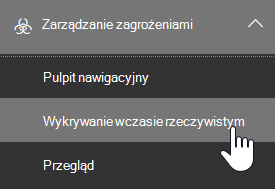

# Wykrywanie zagrożeń i Eksploratora zagrożeń w czasie rzeczywistym

[!INCLUDE [MDO Trial banner](../includes/mdo-trial-banner.md)]

**Dotyczy**
- [Usługi Microsoft Defender dla usługi Office 365 (plan 1 i plan 2)](defender-for-office-365.md)
- [Microsoft 365 Defender](../defender/microsoft-365-defender.md)

Jeśli Twoja organizacja ma [Ochrona usługi Office 365 w usłudze Microsoft Defender](defender-for-office-365.md) i masz [niezbędne uprawnienia](#required-licenses-and-permissions), masz **Eksplorator** lub **Wykrywanie w czasie rzeczywistym** (wcześniej *raporty w czasie rzeczywistym* — [zobacz, co nowego](#new-features-in-threat-explorer-and-real-time-detections)!). W Centrum zgodności & zabezpieczeń przejdź do obszaru **Zarządzanie zagrożeniami**, a następnie wybierz pozycję **Eksplorator** _lub_ **Wykrywanie w czasie rzeczywistym**.

|W Ochrona usługi Office 365 w usłudze Microsoft Defender planie 2 zobaczysz następujące elementy:|W Ochrona usługi Office 365 w usłudze Microsoft Defender planie 1 zobaczysz następujące elementy:|
|---|---|
|||

Wykrywanie eksploratora lub wykrywania w czasie rzeczywistym pomaga zespołowi ds. operacji zabezpieczeń efektywnie badać zagrożenia i reagować na nie. Raport przypomina następujący obraz:

:::image type="content" source="../../media/cab32fa2-66f1-4ad5-bc1d-2bac4dbeb48c.png" alt-text="Element menu Eksplorator w portalu zgodności & zabezpieczeń" lightbox="../../media/cab32fa2-66f1-4ad5-bc1d-2bac4dbeb48c.png":::

Dzięki temu raportowi możesz:

- [Zobacz złośliwe oprogramowanie wykryte przez funkcje zabezpieczeń Microsoft 365](#see-malware-detected-in-email-by-technology)
- [Wyświetl adres URL wyłudzania informacji i kliknij dane werdyktu](#view-phishing-url-and-click-verdict-data)
- [Rozpocznij zautomatyzowane badanie i proces odpowiedzi z widoku w Eksploratorze](#start-automated-investigation-and-response) (tylko Ochrona usługi Office 365 w usłudze Defender plan 2)
- [Badanie złośliwych wiadomości e-mail i nie tylko](#more-ways-to-use-explorer-and-real-time-detections)

## Ulepszenia środowiska wyszukiwania zagrożeń

### Wprowadzenie identyfikatora alertu dla alertów Ochrona usługi Office 365 w usłudze Defender w Eksploratorze/Wykrywanie w czasie rzeczywistym

Obecnie przejście z alertu do Eksploratora zagrożeń spowoduje otwarcie filtrowanego widoku w Eksploratorze z widokiem filtrowanym według identyfikatora zasad alertu (identyfikator zasad jest unikatowym identyfikatorem zasad alertu).
Ta integracja jest bardziej istotna, wprowadzając identyfikator alertu (zobacz przykład identyfikatora alertu poniżej) w Eksploratorze zagrożeń i wykrywaniu w czasie rzeczywistym, dzięki czemu zobaczysz komunikaty, które są istotne dla określonego alertu, a także liczbę wiadomości e-mail. Będzie również można sprawdzić, czy komunikat był częścią alertu, a także przejść od tej wiadomości do określonego alertu.

Identyfikator alertu jest dostępny w adresie URL podczas wyświetlania pojedynczego alertu; przykładem jest `https://protection.office.com/viewalerts?id=372c9b5b-a6c3-5847-fa00-08d8abb04ef1`.

> [!div class="mx-imgBorder"]
> :::image type="content" source="../../media/AlertID-Filter.png" alt-text="Filtrowanie identyfikatora alertu" lightbox="../../media/AlertID-Filter.png":::

> [!div class="mx-imgBorder"]
> :::image type="content" source="../../media/AlertID-DetailsFlyout.png" alt-text="Identyfikator alertu w wysuwnym elemencie szczegółów" lightbox="../../media/AlertID-DetailsFlyout.png":::

### Rozszerzanie przechowywania danych Eksploratora (i wykrywania w czasie rzeczywistym) i limitu wyszukiwania dla dzierżaw wersji próbnej z 7 do 30 dni

W ramach tej zmiany będzie można wyszukiwać i filtrować dane poczty e-mail w ciągu 30 dni (wzrost w stosunku do poprzednich 7 dni) w Eksploratorze zagrożeń/Wykrywanie w czasie rzeczywistym dla dzierżawy wersji próbnej usługi Defender dla Office P1 i P2.
Nie ma to wpływu na dzierżawy produkcyjne zarówno dla klientów P1, jak i P2/E5, którzy mają już 30-dniowe możliwości przechowywania danych i wyszukiwania.

### Zaktualizowano limity eksportowania rekordów dla Eksploratora zagrożeń

W ramach tej aktualizacji liczba wierszy dla rekordów poczty e-mail, które można wyeksportować z Eksploratora zagrożeń, wzrosła z 9990 do 200 000 rekordów. Zestaw kolumn, które można obecnie wyeksportować, pozostanie taki sam, ale liczba wierszy wzrośnie z bieżącego limitu.

### Tagi w Eksploratorze zagrożeń

> [!NOTE]
> Funkcja tagów użytkownika jest dostępna w *wersji zapoznawczej*, nie jest dostępna dla wszystkich i może ulec zmianie. Aby uzyskać informacje na temat harmonogramu wydania, zapoznaj się z planem Microsoft 365.

Tagi użytkowników identyfikują określone grupy użytkowników w Ochrona usługi Office 365 w usłudze Microsoft Defender. Aby uzyskać więcej informacji na temat tagów, w tym licencjonowania i konfiguracji, zobacz [Tagi użytkowników](user-tags.md).

W Eksploratorze zagrożeń możesz zobaczyć informacje o tagach użytkowników w następujących środowiskach.

#### Widok siatki poczty e-mail

Kolumna **Tagi** w siatce wiadomości e-mail zawiera wszystkie tagi, które zostały zastosowane do skrzynek pocztowych nadawcy lub adresata. Domyślnie tagi systemowe, takie jak konta priorytetowe, są wyświetlane jako pierwsze.

> [!div class="mx-imgBorder"]
> :::image type="content" source="../../media/tags-grid.png" alt-text="Filtruj tagi w widoku siatki poczty e-mail" lightbox="../../media/tags-grid.png":::

#### Filtrowanie

Tagów można używać jako filtru. Wyszukiwanie zagrożeń na kontach priorytetowych lub w konkretnych scenariuszach tagów użytkowników. Można również wykluczyć wyniki, które mają określone tagi. Połącz tę funkcję z innymi filtrami, aby zawęzić zakres badania.

> [!div class="mx-imgBorder"]
> :::image type="content" source="../../media/tags-filter-not.png" alt-text="Tagi, które nie są filtrowane" lightbox="../../media/tags-filter-not.png":::

#### Wysuwany szczegół wiadomości e-mail

Aby wyświetlić poszczególne tagi dla nadawcy i odbiorcy, wybierz temat, aby otworzyć wysuwany szczegół komunikatu. Na karcie Podsumowanie tagi **nadawcy** i adresata są wyświetlane oddzielnie, jeśli są one obecne dla wiadomości e-mail.
Informacje o poszczególnych tagach dla nadawcy i adresata rozciągają się również na wyeksportowane dane CSV, gdzie te szczegóły można zobaczyć w dwóch oddzielnych kolumnach.

> [!div class="mx-imgBorder"]
> :::image type="content" source="../../media/tags-flyout.png" alt-text="Tagi Szczegóły wiadomości e-mail" lightbox="../../media/tags-flyout.png":::

Informacje o tagach są również wyświetlane w wysuwanym kliknięciu adresu URL. Aby go wyświetlić, przejdź do widoku Phish lub All Email, a następnie na karcie **Adresy URL** lub **kliknięcia adresu URL** . Wybierz wysuwany indywidualny adres URL, aby wyświetlić dodatkowe szczegóły dotyczące kliknięć tego adresu URL, w tym tagów skojarzonych z tym kliknięciem.

### Zaktualizowany widok osi czasu

> [!div class="mx-imgBorder"]
> :::image type="content" source="../../media/tags-urls.png" alt-text="Tagi adresu URL" lightbox="../../media/tags-urls.png":::
>
Dowiedz się więcej, oglądając [ten film wideo](https://www.youtube.com/watch?v=UoVzN0lYbfY&list=PL3ZTgFEc7LystRja2GnDeUFqk44k7-KXf&index=4).

## Ulepszenia środowiska wyszukiwania zagrożeń (nadchodzące)

### Zaktualizowane informacje o zagrożeniach dla wiadomości e-mail

Skupiliśmy się na ulepszeniach platformy i jakości danych, aby zwiększyć dokładność i spójność danych dla rekordów poczty e-mail. Ulepszenia obejmują konsolidację informacji przed dostarczeniem i po dostarczeniu, takich jak akcje wykonywane w wiadomości e-mail w ramach procesu ZAP, w jeden rekord. Są również uwzględniane dodatkowe szczegóły, takie jak werdykt dotyczący spamu, zagrożenia na poziomie jednostki (na przykład adres URL był złośliwy) i najnowsze lokalizacje dostarczania.

Po tych aktualizacjach zobaczysz pojedynczy wpis dla każdego komunikatu, niezależnie od różnych zdarzeń po dostarczeniu, które mają wpływ na komunikat. Akcje mogą obejmować zap, ręczne korygowanie (co oznacza akcję administratora), [dynamiczne dostarczanie](safe-attachments.md#dynamic-delivery-in-safe-attachments-policies) itd.

Oprócz pokazywania złośliwego oprogramowania i zagrożeń związanych z wyłudzaniem informacji zobaczysz werdykt dotyczący spamu skojarzony z wiadomością e-mail. W wiadomości e-mail zobacz wszystkie zagrożenia związane z wiadomością e-mail wraz z odpowiednimi technologiami wykrywania. Wiadomość e-mail może zawierać zero, jedno lub wiele zagrożeń. Bieżące zagrożenia zostaną wyświetlone w sekcji **Szczegóły** wysuwanej wiadomości e-mail. W przypadku wielu zagrożeń (takich jak złośliwe oprogramowanie i wyłudzanie informacji) w polu **Technologia wykrywania** przedstawiono mapowanie wykrywania zagrożeń, czyli technologię wykrywania, która zidentyfikowała zagrożenie.

Zestaw technologii wykrywania obejmuje teraz nowe metody wykrywania, a także technologie wykrywania spamu. Możesz użyć tego samego zestawu technologii wykrywania, aby filtrować wyniki w różnych widokach poczty e-mail (Złośliwe oprogramowanie, Phish, Wszystkie wiadomości e-mail).

> [!NOTE]
> Analiza werdyktów niekoniecznie może być powiązana z jednostkami. Na przykład wiadomość e-mail może zostać sklasyfikowana jako phish lub spam, ale nie ma adresów URL ostemplowanych werdyktem phish/spam. Wynika to z faktu, że filtry oceniają również zawartość i inne szczegóły wiadomości e-mail przed przypisaniem werdyktu.

#### Zagrożenia w adresach URL

Na karcie **Szczegóły** wysuwanej wiadomości e-mail możesz teraz zobaczyć konkretne zagrożenie dla adresu URL. Zagrożeniem może być *złośliwe oprogramowanie*, *phish*, *spam* lub *brak*.

> [!div class="mx-imgBorder"]
> :::image type="content" source="../../media/URL_Threats.png" alt-text="Zagrożenia związane z adresem URL" lightbox="../../media/URL_Threats.png":::

### Zaktualizowany widok osi czasu (nadchodzące)

> [!div class="mx-imgBorder"]
> :::image type="content" source="../../media/Email_Timeline.png" alt-text="Zaktualizowany widok osi czasu" lightbox="../../media/Email_Timeline.png":::

Widok osi czasu identyfikuje wszystkie zdarzenia dostarczania i po dostarczeniu. Zawiera informacje o zagrożeniu zidentyfikowanym w tym momencie dla podzestawu tych zdarzeń. Widok osi czasu zawiera również informacje o wszelkich dodatkowych działaniach (takich jak zap lub ręczne korygowanie) wraz z wynikiem tej akcji. Informacje o widoku osi czasu obejmują:

- **Źródła:** Źródło zdarzenia. Może to być administrator/system/użytkownik.
- **Zdarzenie:** Obejmuje zdarzenia najwyższego poziomu, takie jak oryginalne dostarczanie, ręczne korygowanie, zap, przesyłanie i dynamiczne dostarczanie.
- **Działania:** Określona akcja, która została podjęta w ramach zap lub akcji administratora (na przykład usuwanie nietrwałe).
- **Zagrożeń:** Obejmuje zagrożenia (złośliwe oprogramowanie, phish, spam) zidentyfikowane w tym momencie.
- **Wynik/szczegóły:** Więcej informacji na temat wyniku akcji, takich jak to, czy została wykonana w ramach akcji ZAP/admin.

### Oryginalna i najnowsza lokalizacja dostarczania

Obecnie lokalizacja dostarczania jest dostępna w siatce wiadomości e-mail i wysuwanej wiadomości e-mail. Nazwa pola **Lokalizacja dostarczania** jest zmieniana na **_Oryginalna lokalizacja dostarczania_*_. Wprowadzamy również inne pole , _*_Najnowsza lokalizacja dostarczania_**.

**Oryginalna lokalizacja dostarczania** będzie zawierać więcej informacji o tym, gdzie początkowo została dostarczona wiadomość e-mail. **Najnowsza lokalizacja dostarczania** określa, gdzie wiadomość e-mail wylądowała po akcjach systemowych, takich jak *zap* lub akcje administratora, takie jak *Przenoszenie do usuniętych elementów*. Najnowsza lokalizacja dostarczania ma na celu poinformowanie administratorów o ostatniej znanej lokalizacji komunikatu po dostarczeniu lub o wszelkich akcjach systemu/administratora. Nie zawiera żadnych akcji użytkownika końcowego w wiadomości e-mail. Jeśli na przykład użytkownik usunął komunikat lub przeniósł wiadomość do archiwum/pst, lokalizacja komunikatu "dostawa" nie zostanie zaktualizowana. Jeśli jednak akcja systemowa zaktualizowała lokalizację (na przykład zap powodujące przeniesienie wiadomości e-mail do kwarantanny), **najnowsza lokalizacja dostarczania** będzie wyświetlana jako "kwarantanna".

> [!div class="mx-imgBorder"]
> :::image type="content" source="../../media/Updated_Delivery_Location.png" alt-text="Zaktualizowane lokalizacje dostarczania" lightbox="../../media/Updated_Delivery_Location.png":::

> [!NOTE]
> Istnieje kilka przypadków, w których **lokalizacja dostawy** i **akcja Dostawa** mogą być wyświetlane jako "nieznane":
>
> - **Lokalizacja dostarczania** może być widoczna jako "dostarczona", a **lokalizacja dostarczania** jako "nieznana", jeśli wiadomość została dostarczona, ale reguła skrzynki odbiorczej przeniosła wiadomość do folderu domyślnego (takiego jak Wersja robocza lub Archiwum) zamiast do folderu Skrzynka odbiorcza lub Wiadomość-śmieci.
>
> - **Najnowsza lokalizacja dostarczania** może być nieznana, jeśli podjęto próbę wykonania akcji administracyjnej/systemowej (takiej jak ZAP), ale komunikat nie został znaleziony. Zazwyczaj akcja jest wykonywana po przeniesieniu lub usunięciu komunikatu przez użytkownika. W takich przypadkach sprawdź kolumnę **Wynik/Szczegóły** w widoku osi czasu. Poszukaj instrukcji "Wiadomość przeniesiona lub usunięta przez użytkownika".

> [!div class="mx-imgBorder"]
> :::image type="content" source="../../media/Updated_Timeline_Delivery_Location.png" alt-text="Lokalizacje dostarczania dla osi czasu" lightbox="../../media/Updated_Timeline_Delivery_Location.png":::

### Dodatkowe akcje

Po dostarczeniu wiadomości e-mail zastosowano *dodatkowe akcje*. Mogą one obejmować *zap*, *ręczne korygowanie* (działania podejmowane przez Administracja, takie jak usuwanie nietrwałe), *dynamiczne dostarczanie* i *ponownie przetwarzane* (dla wiadomości e-mail, która została wykryta wstecznie jako dobra).

> [!NOTE]
> W ramach oczekujących zmian wartość "Usunięto przez zap" obecnie dostępna w filtrze Akcja dostarczania odchodzi. Będziesz mieć sposób wyszukiwania wszystkich wiadomości e-mail przy użyciu próby zap za pomocą **dodatkowych akcji**.

> [!div class="mx-imgBorder"]
> :::image type="content" source="../../media/Additional_Actions.png" alt-text="Dodatkowe akcje w Eksploratorze" lightbox="../../media/Additional_Actions.png":::

### Przesłonięcia systemu

*Przesłonięcia systemowe* umożliwiają wyjątek od zamierzonej lokalizacji dostarczania komunikatu. Lokalizacja dostarczania dostarczana przez system jest zastępowana na podstawie zagrożeń i innych wykryć zidentyfikowanych przez stos filtrowania. Przesłonięcia systemu można ustawić za pomocą zasad dzierżawy lub użytkownika w celu dostarczenia komunikatu zgodnie z sugestią zasad. Przesłonięcia mogą identyfikować niezamierzone dostarczanie złośliwych komunikatów z powodu luk w konfiguracji, takich jak zbyt szerokie zasady Sejf nadawcy ustawione przez użytkownika. Te wartości przesłonięcia mogą być następujące:

- Dozwolone przez zasady użytkownika: użytkownik tworzy zasady na poziomie skrzynki pocztowej, aby zezwalać na domeny lub nadawców.

- Zablokowane przez zasady użytkownika: użytkownik tworzy zasady na poziomie skrzynki pocztowej, aby blokować domeny lub nadawców.

- Dozwolone przez zasady organizacji: zespoły zabezpieczeń organizacji ustawiają zasady lub Exchange reguły przepływu poczty (nazywane również regułami transportu), aby zezwalać nadawcom i domenom na użytkowników w organizacji. Może to dotyczyć zestawu użytkowników lub całej organizacji.

- Zablokowane przez zasady organizacji: zespoły zabezpieczeń organizacji ustawiają zasady lub reguły przepływu poczty, aby blokować nadawców, domeny, języki wiadomości lub źródłowe adresy IP dla użytkowników w organizacji. Można to zastosować do zestawu użytkowników lub całej organizacji.

- Rozszerzenie pliku zablokowane przez zasady organizacji: zespół ds. zabezpieczeń organizacji blokuje rozszerzenie nazwy pliku za pomocą ustawień zasad ochrony przed złośliwym oprogramowaniem. Te wartości będą teraz wyświetlane w szczegółach wiadomości e-mail, aby ułatwić badanie. Zespoły secops mogą również używać funkcji filtrowania zaawansowanego do filtrowania zablokowanych rozszerzeń plików.

> [!div class="mx-imgBorder"]
> :::image type="content" source="../../media/System_Overrides_Grid.png" alt-text="System zastępuje siatkę w Eksploratorze" lightbox="../../media/System_Overrides_Grid.png":::

### Ulepszenia środowiska adresów URL i kliknięć

Ulepszenia obejmują:

- Pokaż pełny kliknięty adres URL (w tym wszystkie parametry zapytania, które są częścią adresu URL) w sekcji **Kliknięcia** wysuwanego adresu URL. Obecnie domena i ścieżka adresu URL są wyświetlane na pasku tytułu. Rozszerzamy te informacje, aby wyświetlić pełny adres URL.

- Poprawki w filtrach adresów URL (*adres URL* i *domena URL* a *domena adresu URL i ścieżka*): aktualizacje mają wpływ na wyszukiwanie komunikatów zawierających adres URL/werdykt kliknięcia. Włączyliśmy obsługę wyszukiwań niezależnych od protokołu, dzięki czemu można wyszukiwać adres URL bez użycia polecenia `http`. Domyślnie wyszukiwanie adresów URL jest mapowane na http, chyba że zostanie jawnie określona inna wartość. Przykład:
  - Wyszukaj przy użyciu prefiksu `http://` i bez w polach **filtru ADRES URL**, **Domena adresu URL** oraz **Domena adresu URL i Ścieżka** . Wyszukiwania powinny pokazywać te same wyniki.
  - Wyszukaj prefiks w **adresie**`https://` URL. Jeśli nie określono żadnej wartości, zakłada się, że `http://` prefiks.
  - `/` Jest ignorowany na początku i na końcu **ścieżki URL**, **domeny URL**, **domeny url i pól ścieżki** . `/` na końcu pola **adresu URL** jest ignorowane.

### Phish poziom ufności

Poziom ufności phish pomaga zidentyfikować stopień zaufania, z jakim wiadomość e-mail została sklasyfikowana jako "phish". Dwie możliwe wartości to *Wysokie* i *Normalne*. W początkowych etapach ten filtr będzie dostępny tylko w widoku Phish w Eksploratorze zagrożeń.

### Sygnał adresu URL zap

Sygnał adresu URL ZAP jest zwykle używany w scenariuszach alertów ZAP Phish, w których wiadomość e-mail została zidentyfikowana jako Phish i usunięta po dostarczeniu. Ten sygnał łączy alert z odpowiednimi wynikami w Eksploratorze. Jest to jedna z operacji we/wy dla alertu.

Aby ulepszyć proces wyszukiwania zagrożeń, zaktualizowaliśmy Eksploratora zagrożeń i wykrywanie w czasie rzeczywistym, aby środowisko wyszukiwania zagrożeń było bardziej spójne. Zmiany zostały opisane tutaj:

- [Ulepszenia strefy czasowej](#timezone-improvements)
- [Aktualizacja w procesie odświeżania](#update-in-the-refresh-process)
- [Przechodzenie do szczegółów wykresu w celu dodania do filtrów](#chart-drilldown-to-add-to-filters)
- [W aktualizacjach informacji o produkcie](#in-product-information-updates)

### Filtrowanie według tagów użytkowników

Teraz możesz sortować i filtrować tagi użytkowników systemowych lub niestandardowych, aby szybko zrozumieć zakres zagrożeń. Aby dowiedzieć się więcej, zobacz [Tagi użytkowników](user-tags.md).

> [!IMPORTANT]
> Filtrowanie i sortowanie według tagów użytkowników jest obecnie dostępne w publicznej wersji zapoznawczej. Ta funkcja może zostać znacząco zmodyfikowana przed jej komercyjną premierą. Firma Microsoft nie udziela żadnych gwarancji, wyraźnych ani dorozumianych, w odniesieniu do dostarczonych informacji.

> [!div class="mx-imgBorder"]
> :::image type="content" source="../../media/threat-explorer-tags.png" alt-text="Kolumna Tagi w Eksploratorze" lightbox="../../media/threat-explorer-tags.png":::

### Ulepszenia strefy czasowej

Strefa czasowa rekordów wiadomości e-mail zostanie wyświetlona w portalu, a także w przypadku wyeksportowanych danych. Będzie ona widoczna w różnych środowiskach, takich jak siatka poczty e-mail, wysuwane szczegóły, oś czasu wiadomości e-mail i podobne wiadomości e-mail, dzięki czemu strefa czasowa zestawu wyników jest jasna.

> [!div class="mx-imgBorder"]
> :::image type="content" source="../../media/TimezoneImprovements.png" alt-text="Strefa czasowa Wyświetl w Eksploratorze" lightbox="../../media/TimezoneImprovements.png":::

### Aktualizacja w procesie odświeżania

Niektórzy użytkownicy skomentowali pomyłek z automatycznym odświeżaniem (na przykład po zmianie daty, odświeżeniu strony) i ręcznym odświeżaniu (w przypadku innych filtrów). Podobnie usunięcie filtrów prowadzi do automatycznego odświeżania. Zmiana filtrów podczas modyfikowania zapytania może powodować niespójne środowiska wyszukiwania. Aby rozwiązać te problemy, przechodzimy do mechanizmu filtrowania ręcznego.

Z punktu widzenia środowiska użytkownik może zastosować i usunąć różne zakresy filtrów (z zestawu filtrów i daty), a następnie wybrać przycisk odświeżania, aby filtrować wyniki po zdefiniowaniu zapytania. Przycisk odświeżania jest teraz wyróżniony na ekranie. Zaktualizowaliśmy również powiązane etykietki narzędzi i dokumentację produktu.

> [!div class="mx-imgBorder"]
> :::image type="content" source="../../media/ManualRefresh.png" alt-text="Przycisk Odśwież, aby filtrować wyniki" lightbox="../../media/ManualRefresh.png":::

### Przechodzenie do szczegółów wykresu w celu dodania do filtrów

Teraz można tworzyć wykresy wartości legendy, aby dodać je jako filtry. Wybierz przycisk **Odśwież** , aby odfiltrować wyniki.

> [!div class="mx-imgBorder"]
> :::image type="content" source="../../media/ChartDrilldown.png" alt-text="Przechodzenie do szczegółów wykresów do filtrowania" lightbox="../../media/ChartDrilldown.png":::

### Aktualizacje informacji o produkcie

Dodatkowe szczegóły są teraz dostępne w produkcie, takie jak całkowita liczba wyników wyszukiwania w siatce (zobacz poniżej). Ulepszyliśmy etykiety, komunikaty o błędach i etykietki narzędzi, aby zapewnić więcej informacji o filtrach, środowisku wyszukiwania i zestawie wyników.

> [!div class="mx-imgBorder"]
> :::image type="content" source="../../media/ProductInfo.png" alt-text="Informacje o produkcie do wyświetlenia" lightbox="../../media/ProductInfo.png":::

## Rozszerzone możliwości w Eksploratorze zagrożeń

### Najważniejsi użytkownicy docelowi

Obecnie udostępniamy listę najpopularniejszych użytkowników docelowych w widoku Złośliwe oprogramowanie dla wiadomości e-mail w sekcji **Najważniejsze rodziny złośliwego oprogramowania** . Rozszerzymy ten widok również w widokach Phish i Wszystkie wiadomości e-mail. Będziesz mieć możliwość wyświetlenia pięciu pierwszych użytkowników docelowych wraz z liczbą prób dla każdego użytkownika dla odpowiedniego widoku. Na przykład w widoku Phish zobaczysz liczbę prób języka Phish.

Będzie można wyeksportować listę docelowych użytkowników do limitu 3000 wraz z liczbą prób analizy w trybie offline dla każdego widoku poczty e-mail. Ponadto wybranie liczby prób (na przykład 13 prób na poniższej ilustracji) spowoduje otwarcie filtrowanego widoku w Eksploratorze zagrożeń, dzięki czemu można zobaczyć więcej szczegółów dotyczących wiadomości e-mail i zagrożeń dla tego użytkownika.

> [!div class="mx-imgBorder"]
> :::image type="content" source="../../media/Top_Targeted_Users.png" alt-text="Najczęściej docelowi użytkownicy" lightbox="../../media/Top_Targeted_Users.png":::

### reguły transportu Exchange

W ramach wzbogacania danych będzie można zobaczyć wszystkie różne Exchange reguł transportu (ETR), które zostały zastosowane do komunikatu. Te informacje będą dostępne w widoku siatki Wiadomości e-mail. Aby go wyświetlić, wybierz pozycję **Opcje kolumny** w siatce, a następnie **dodaj Exchange regułę transportu** z opcji kolumny. Będzie ona również widoczna w wysuwu **Szczegóły** w wiadomości e-mail.

Zobaczysz zarówno identyfikator GUID, jak i nazwę reguł transportu, które zostały zastosowane do komunikatu. Będzie można wyszukiwać komunikaty przy użyciu nazwy reguły transportu. Jest to wyszukiwanie "Zawiera", co oznacza, że możesz również tworzyć wyszukiwania częściowe.

> [!IMPORTANT]
> Dostępność wyszukiwania i nazwy ETR zależy od określonej roli przypisanej Do Ciebie. Aby wyświetlić nazwy ETR i wyszukać, musisz mieć jedną z następujących ról/uprawnień. Jeśli nie masz przypisanej żadnej z tych ról, nie możesz wyświetlić nazw reguł transportu ani wyszukiwać komunikatów przy użyciu nazw ETR. W obszarze Szczegóły poczty e-mail można jednak wyświetlić etykietę ETR i informacje o identyfikatorze GUID. Nie ma to wpływu na inne środowiska wyświetlania rekordów w siatkach poczty e-mail, wysuwanych wiadomości e-mail, filtrach i eksportie.
>
> - Tylko exo — zapobieganie utracie danych: wszystkie
> - Tylko exo — O365SupportViewConfig: wszystkie
> - Microsoft Azure Active Directory lub EXO — Administracja zabezpieczeń: wszystkie
> - AAD lub EXO — czytnik zabezpieczeń: wszystko
> - Tylko exo — reguły transportu: wszystkie
> - Tylko exo — konfiguracja View-Only: wszystkie
>
> W siatce poczty e-mail, wysuwu Szczegóły i wyeksportowanym woluminie CSV wartości ETR są prezentowane z nazwą/identyfikatorem GUID, jak pokazano poniżej.
>
> > [!div class="mx-imgBorder"]
> > :::image type="content" source="../../media/ETR_Details.png" alt-text="Zasady transportu Exchange" lightbox="../../media/ETR_Details.png":::

### Łączniki przychodzące

Łączniki to zbiór instrukcji, które dostosowują sposób przepływu poczty e-mail do i z organizacji Microsoft 365 lub Office 365. Umożliwiają one stosowanie wszelkich ograniczeń zabezpieczeń lub mechanizmów kontroli. W Eksploratorze zagrożeń możesz teraz wyświetlać łączniki powiązane z wiadomością e-mail i wyszukiwać wiadomości e-mail przy użyciu nazw łączników.

Wyszukiwanie łączników ma charakter "zawiera", co oznacza, że częściowe wyszukiwania słów kluczowych powinny również działać. W widoku Siatka główna, wysuwu Szczegóły i wyeksportowanym pliku CSV łączniki są wyświetlane w formacie Nazwa/IDENTYFIKATOR GUID, jak pokazano poniżej:

> [!div class="mx-imgBorder"]
> :::image type="content" source="../../media/Connector_Details.png" alt-text="Szczegóły łącznika" lightbox="../../media/Connector_Details.png":::

## Nowe funkcje w Eksploratorze zagrożeń i wykrywaniu w czasie rzeczywistym

- [Wyświetlanie wiadomości e-mail wyłudzających informacje wysyłanych do personifikowanych użytkowników i domen](#view-phishing-emails-sent-to-impersonated-users-and-domains)
- [Podgląd nagłówka wiadomości e-mail i pobieranie treści wiadomości e-mail](#preview-email-header-and-download-email-body)
- [Oś czasu wiadomości e-mail](#email-timeline)
- [Eksportowanie danych kliknięcia adresu URL](#export-url-click-data)

### Wyświetlanie wiadomości e-mail wyłudzających informacje wysyłanych do personifikowanych użytkowników i domen

Aby zidentyfikować próby wyłudzania informacji względem użytkowników i domen, które są personifikowanymi użytkownikami, należy dodać do listy *użytkowników w celu ochrony*. W przypadku domen administratorzy muszą włączyć *domeny organizacji* lub dodać nazwę domeny do *domeny w celu ochrony*. Domeny do ochrony znajdują się na *stronie zasad ochrony przed wyłudzaniem informacji* w sekcji *Personifikacja* .

Aby przejrzeć fałszywe wiadomości i wyszukać personifikowanych użytkowników lub domeny, użyj [widoku Eksploratora > e-mail](threat-explorer-views.md) .

W tym przykładzie jest używany Eksplorator zagrożeń.

1. W [Centrum zgodności & zabezpieczeń](https://protection.office.com) (https://protection.office.com)wybierz pozycję Zarządzanie zagrożeniami > Explorer (lub wykrywanie w czasie rzeczywistym).

2. W menu Widok wybierz pozycję Poczta e-mail > Phish.

   W tym miejscu możesz wybrać **domenę personifikaną** lub **personifikowanego użytkownika**.

3. **Wybierz** pozycję **Personifikowana domena**, a następnie wpisz chronioną domenę w polu tekstowym.

   Na przykład wyszukaj chronione nazwy domen, takie jak *contoso*, *contoso.com* lub *contoso.com.au*.

4. Wybierz temat dowolnej wiadomości na karcie Poczta e-mail > karta Szczegóły, aby wyświetlić dodatkowe informacje o personifikacji, takie jak Personifikowana domena / Wykryta lokalizacja.

    **LUB**

    Wybierz pozycję **Personifikowany użytkownik** i wpisz adres e-mail chronionego użytkownika w polu tekstowym.

    > [!TIP]
    > **Aby uzyskać najlepsze wyniki**, użyj *pełnych adresów e-mail* do wyszukiwania chronionych użytkowników. Chroniony użytkownik znajdziesz szybciej i skuteczniej, jeśli wyszukasz *firstname.lastname@contoso.com*, na przykład podczas badania personifikacji użytkowników. Podczas wyszukiwania chronionej domeny wyszukiwanie spowoduje przejęcie domeny głównej (na przykład contoso.com) i nazwy domeny (*contoso*). Wyszukiwanie *contoso.com* domeny głównej zwróci zarówno personifikacje *contoso.com* , jak i nazwę domeny *contoso*.

5. Wybierz **temat** dowolnej wiadomości na **karcie** >  **Poczta e-mailDetails,** aby wyświetlić dodatkowe informacje personifikacji dotyczące użytkownika lub domeny oraz *wykrytą lokalizację*.

    :::image type="content" source="../../media/threat-ex-views-impersonated-user-image.png" alt-text="Okienko szczegółów Eksploratora zagrożeń dla chronionego użytkownika pokazujące lokalizację wykrywania i wykryte zagrożenie (tutaj phish personifikacja użytkownika)" lightbox="../../media/threat-ex-views-impersonated-user-image.png":::

> [!NOTE]
> W kroku 3 lub 5, jeśli **wybierzesz opcję Technologia wykrywania** i wybierzesz odpowiednio **domenę personifikacji** lub **użytkownika personifikacji**, informacje na **karcie** >  **Poczta e-mailDetails** dotyczące użytkownika lub domeny oraz *wykryta lokalizacja* będą wyświetlane tylko na komunikatach powiązanych z użytkownikiem lub domeną wymienioną na stronie *zasad ochrony przed wyłudzaniem informacji*.

### Podgląd nagłówka wiadomości e-mail i pobieranie treści wiadomości e-mail

Teraz możesz wyświetlić podgląd nagłówka wiadomości e-mail i pobrać treść wiadomości e-mail w Eksploratorze zagrożeń. Administratorzy mogą analizować pobrane nagłówki/wiadomości e-mail pod kątem zagrożeń. Ponieważ pobieranie wiadomości e-mail może grozić ujawnieniem informacji, ten proces jest kontrolowany przez kontrolę dostępu opartą na rolach (RBAC). Nowa rola( *wersja zapoznawcza*) jest wymagana do przyznania możliwości pobierania wiadomości e-mail w widoku wiadomości e-mail. Jednak wyświetlanie nagłówka wiadomości e-mail nie wymaga żadnej dodatkowej roli (innej niż ta, która jest wymagana do wyświetlania komunikatów w Eksploratorze zagrożeń). Aby utworzyć nową grupę ról z rolą w wersji zapoznawczej:

1. Wybierz wbudowaną grupę ról, która ma tylko rolę w wersji zapoznawczej, taką jak Data Investigator lub eDiscovery Manager.
2. Wybierz pozycję **Kopiuj grupę ról**.
3. Wybierz nazwę i opis nowej grupy ról, a następnie wybierz pozycję **Dalej**.
4. Zmodyfikuj role, dodając i usuwając role w razie potrzeby, ale pozostawiając rolę w wersji zapoznawczej.
5. Dodaj członków, a następnie wybierz pozycję **Utwórz grupę ról**.

Eksplorator i wykrywanie w czasie rzeczywistym otrzymają również nowe pola, które zapewniają bardziej kompletny obraz miejsca, w którym znajdują się wiadomości e-mail. Te zmiany ułatwiają wyszukiwanie zagrożeń w ramach operacji zabezpieczeń. Ale głównym wynikiem jest to, że możesz szybko poznać lokalizację problematycznych wiadomości e-mail.

Jak to się robi? Stan dostarczania jest teraz podzielony na dwie kolumny:

- **Akcja dostarczania** — stan wiadomości e-mail.
- **Lokalizacja dostawy** — miejsce kierowania wiadomości e-mail.

*Akcja dostarczania* to akcja wykonywana w wiadomości e-mail z powodu istniejących zasad lub wykryć. Poniżej przedstawiono możliwe akcje dla wiadomości e-mail:

|Dostarczane|Junked|Zablokowany|Zastąpione|
|---|---|---|---|
|Wiadomość e-mail została dostarczona do skrzynki odbiorczej lub folderu użytkownika, a użytkownik może uzyskać do niej dostęp.|Wiadomość e-mail została wysłana do folderu Wiadomości-śmieci lub Usunięte użytkownika, a użytkownik może uzyskać do niego dostęp.|Wiadomości e-mail, które zostały poddane kwarantannie, które nie powiodły się lub zostały porzucone. Te wiadomości e-mail są niedostępne dla użytkownika.|Wiadomość e-mail miała złośliwe załączniki zastąpione .txt plikami, które stwierdzają, że załącznik był złośliwy.|

Oto, co użytkownik może, a czego nie widzi:

|Dostępne dla użytkowników końcowych|Niedostępne dla użytkowników końcowych|
|---|---|
|Dostarczane|Zablokowany|
|Junked|Zastąpione|

**Lokalizacja dostarczania** przedstawia wyniki zasad i wykryć, które są uruchamiane po dostarczeniu. Jest ona połączona z **_akcją Dostarczanie_**. Są to możliwe wartości:

- *Skrzynka odbiorcza lub folder*: wiadomość e-mail znajduje się w skrzynce odbiorczej lub folderze (zgodnie z regułami poczty e-mail).
- *Lokalnie lub zewnętrznie*: skrzynka pocztowa nie istnieje w chmurze, ale jest lokalna.
- *Folder wiadomości-śmieci*: wiadomość e-mail znajduje się w folderze Wiadomości-śmieci użytkownika.
- *Folder Elementy usunięte*: wiadomość e-mail w folderze Elementy usunięte użytkownika.
- *Kwarantanna*: wiadomość e-mail znajduje się w kwarantannie, a nie w skrzynce pocztowej użytkownika.
- *Niepowodzenie*: wiadomość e-mail nie mogła dotrzeć do skrzynki pocztowej.
- *Porzucone*: Wiadomość e-mail zgubiła się gdzieś w przepływie poczty.

### Oś czasu wiadomości e-mail

**Oś czasu poczty e-mail** to nowa funkcja Eksploratora, która poprawia środowisko wyszukiwania zagrożeń dla administratorów. Skraca czas spędzony na sprawdzaniu różnych lokalizacji, aby spróbować zrozumieć zdarzenie. W przypadku wystąpienia wielu zdarzeń o tej samej godzinie lub w pobliżu tej samej godziny odebrania wiadomości e-mail te zdarzenia są wyświetlane w widoku osi czasu. Niektóre zdarzenia występujące po dostarczeniu wiadomości e-mail są przechwytywane w kolumnie **Akcja specjalna** . Administratorzy mogą łączyć informacje z osi czasu ze specjalnym działaniem wykonywanym po dostarczeniu wiadomości e-mail, aby uzyskać wgląd w sposób działania ich zasad, miejsca, w którym poczta została ostatecznie przekierowana, a w niektórych przypadkach ostatecznej oceny.

Aby uzyskać więcej informacji, zobacz [Badanie i korygowanie złośliwych wiadomości e-mail dostarczonych w Office 365](investigate-malicious-email-that-was-delivered.md).

### Eksportowanie danych kliknięcia adresu URL

Teraz możesz eksportować raporty dla kliknięć adresów URL, aby Microsoft Excel, aby wyświetlić identyfikator **komunikatu sieci** i **kliknąć werdykt**, co pomaga wyjaśnić, skąd pochodzi ruch kliknięcia adresu URL. Oto jak to działa: W usłudze Threat Management na pasku szybkiego uruchamiania Office 365 postępuj zgodnie z następującym łańcuchem:

**Explorer** \> **Wyświetl język phish** \> **Kliknięć** \> **Górne adresy URL** lub **najważniejsze kliknięcia adresu URL wybierają dowolny** \> rekord, aby otworzyć wysuwany adres URL.

Po wybraniu adresu URL na liście zostanie wyświetlony nowy przycisk **Eksportuj** w panelu wysuwanym. Użyj tego przycisku, aby przenieść dane do arkusza kalkulacyjnego Excel, aby ułatwić raportowanie.

Postępuj zgodnie z tą ścieżką, aby przejść do tej samej lokalizacji w raporcie wykrywania w czasie rzeczywistym:

**Explorer** \> **Wykrywanie** \> w czasie rzeczywistym **Wyświetl język phish** \> **Adresy url** \> **Najważniejsze adresy URL** lub **kliknięcia górne Wybierz dowolny** \> rekord, aby otworzyć wysuwany \> adres URL, przejdź do karty **Kliknięcia** .

> [!TIP]
> Identyfikator komunikatu sieciowego mapuje kliknięcie z powrotem na określone wiadomości e-mail podczas wyszukiwania identyfikatora za pośrednictwem Eksploratora lub skojarzonych narzędzi innych firm. Takie wyszukiwania identyfikują wiadomość e-mail skojarzoną z wynikiem kliknięcia. Posiadanie skorelowanego identyfikatora komunikatu sieciowego umożliwia szybszą i bardziej zaawansowaną analizę.

> [!div class="mx-imgBorder"]
> :::image type="content" source="../../media/tp_ExportClickResultAndNetworkID.png" alt-text="Karta Kliknięcia w Eksploratorze" lightbox="../../media/tp_ExportClickResultAndNetworkID.png":::

## Zobacz złośliwe oprogramowanie wykryte w wiadomości e-mail według technologii

Załóżmy, że w wiadomości e-mail wykryto złośliwe oprogramowanie posortowane według technologii Microsoft 365. W tym celu użyj widoku Eksploratora [> złośliwego oprogramowania](threat-explorer-views.md#email--malware) (lub wykrywania w czasie rzeczywistym).

1. W Centrum zgodności & zabezpieczeń (<https://protection.office.com>) wybierz pozycję **Eksplorator** **zarządzania zagrożeniami** \> (lub **Wykrywanie w czasie rzeczywistym**). (W tym przykładzie użyto Eksploratora).

2. W menu **Widok** wybierz pozycję **Złośliwe oprogramowanie** **poczty e-mail**\>.

   > [!div class="mx-imgBorder"]
   > :::image type="content" source="../../media/ExplorerViewEmailMalwareMenu.png" alt-text="Menu Widok dla Eksploratora" lightbox="../../media/ExplorerViewEmailMalwareMenu.png":::

3. Kliknij **pozycję Nadawca**, a **następnie wybierz** pozycję \> **Podstawowa technologia wykrywania**.

   Technologie wykrywania są teraz dostępne jako filtry raportu.

   > [!div class="mx-imgBorder"]
   > :::image type="content" source="../../media/ExplorerEmailMalwareDetectionTech.png" alt-text="Technologie wykrywania złośliwego oprogramowania" lightbox="../../media/ExplorerEmailMalwareDetectionTech.png":::

4. Wybierz opcję. Następnie wybierz przycisk **Odśwież** , aby zastosować ten filtr.

   > [!div class="mx-imgBorder"]
   > :::image type="content" source="../../media/ExplorerEmailMalwareDetectionTechATP.png" alt-text="Wybrana technologia wykrywania" lightbox="../../media/ExplorerEmailMalwareDetectionTechATP.png":::

Raport zostanie odświeżony w celu wyświetlenia wyników wykrytych przez złośliwe oprogramowanie w wiadomości e-mail przy użyciu wybranej opcji technologii. W tym miejscu możesz przeprowadzić dalszą analizę.

## Wyświetl adres URL wyłudzania informacji i kliknij dane werdyktu

Załóżmy, że chcesz zobaczyć próby wyłudzania informacji za pośrednictwem adresów URL w wiadomości e-mail, w tym listę dozwolonych, zablokowanych i przesłoniętych adresów URL. Aby zidentyfikować adresy URL, które zostały klikniętych, [Sejf Łącza](safe-links.md) muszą być skonfigurowane. Upewnij się, że skonfigurowano [zasady linków Sejf](set-up-safe-links-policies.md) na potrzeby ochrony przed kliknięciami i rejestrowania werdyktów dotyczących kliknięć za pomocą linków Sejf.

Aby przejrzeć fałszywe adresy URL w wiadomościach i kliknięcia adresów URL w wiadomościach phish, użyj widoku [**EmailPhish** > ](threat-explorer-views.md#email--phish) Eksploratora lub wykrywania w czasie rzeczywistym.

1. W Centrum zgodności & zabezpieczeń (<https://protection.office.com>) wybierz pozycję **Eksplorator** **zarządzania zagrożeniami** \> (lub **Wykrywanie w czasie rzeczywistym**). (W tym przykładzie użyto Eksploratora).

2. W menu **Widok** wybierz pozycję **Poczta e-mail** \> **Phish**.

   > [!div class="mx-imgBorder"]
   > :::image type="content" source="../../media/ExplorerViewEmailPhishMenu.png" alt-text="Menu Widok dla Eksploratora w kontekście wyłudzania informacji" lightbox="../../media/ExplorerViewEmailPhishMenu.png":::

3. Kliknij **pozycję Nadawca**, a następnie wybierz pozycję **Adresy URL** \> **Kliknij werdykt**.

4. Wybierz co najmniej jedną opcję, taką jak **Zablokowane** i **Przesłonięte blokuj**, a następnie wybierz przycisk **Odśwież** w tym samym wierszu co opcje, aby zastosować ten filtr. (Nie odświeżaj okna przeglądarki).

   > [!div class="mx-imgBorder"]
   > :::image type="content" source="../../media/ThreatExplorerEmailPhishClickVerdictOptions.png" alt-text="Adresy URL i werdykty kliknięcia" lightbox="../../media/ThreatExplorerEmailPhishClickVerdictOptions.png":::

   Raport zostanie odświeżony, aby wyświetlić dwie różne tabele adresów URL na karcie Adres URL w raporcie:

   - **Najważniejsze adresy URL** to adresy URL w odfiltrowanych wiadomościach oraz liczba akcji dostarczania wiadomości e-mail dla każdego adresu URL. W widoku poczty e-mail języka Phish ta lista zwykle zawiera prawidłowe adresy URL. Osoby atakujące zawierają kombinację dobrych i złych adresów URL w swoich wiadomościach, aby spróbować je dostarczyć, ale sprawiają, że złośliwe linki wyglądają bardziej interesująco. Tabela adresów URL jest sortowana według łącznej liczby wiadomości e-mail, ale ta kolumna jest ukryta, aby uprościć widok.

   - **Najważniejsze kliknięcia** to Sejf klikniętych adresów URL opakowanych łączami posortowanych według łącznej liczby kliknięć. Ta kolumna również nie jest wyświetlana, aby uprościć widok. Łączna liczba według kolumny wskazuje liczbę kliknięć Sejf Linków dla każdego klikniętego adresu URL. W widoku poczty e-mail języka Phish są to zwykle podejrzane lub złośliwe adresy URL. Ale widok może zawierać adresy URL, które nie są zagrożeniami, ale są w wiadomościach phish. Kliknięcia adresu URL nieopakowanych linków nie są tutaj wyświetlane.

   Dwie tabele adresów URL zawierają najważniejsze adresy URL w wiadomościach e-mail wyłudzających informacje według akcji dostarczania i lokalizacji. W tabelach są wyświetlane kliknięcia adresu URL, które zostały zablokowane lub odwiedzone pomimo ostrzeżenia, dzięki czemu można zobaczyć, jakie potencjalne nieprawidłowe linki zostały wyświetlone użytkownikom i czy użytkownik został kliknięty. W tym miejscu możesz przeprowadzić dalszą analizę. Na przykład poniżej wykresu można zobaczyć najważniejsze adresy URL w wiadomościach e-mail, które zostały zablokowane w środowisku organizacji.

   > [!div class="mx-imgBorder"]
   > :::image type="content" source="../../media/ExplorerPhishClickVerdictURLs.png" alt-text="Zablokowane adresy URL Eksploratora" lightbox="../../media/ExplorerPhishClickVerdictURLs.png":::

   Wybierz adres URL, aby wyświetlić bardziej szczegółowe informacje.

   > [!NOTE]
   > W oknie dialogowym wysuwanego adresu URL filtrowanie wiadomości e-mail jest usuwane w celu wyświetlenia pełnego widoku ekspozycji adresu URL w środowisku. Dzięki temu można filtrować wiadomości e-mail, których dotyczy problem w Eksploratorze, znaleźć określone adresy URL, które są potencjalnymi zagrożeniami, a następnie rozszerzyć swoją wiedzę na temat ekspozycji adresu URL w środowisku (za pośrednictwem okna dialogowego szczegóły adresu URL) bez konieczności dodawania filtrów adresów URL do samego widoku Eksploratora.

### Interpretacja werdyktów kliknięcia

W wysuwanych adresach e-mail lub adresach URL, kliknięciach górnych oraz w naszych środowiskach filtrowania zobaczysz różne wartości werdyktu kliknięcia:

- **Brak:** Nie można przechwycić werdyktu dla adresu URL. Użytkownik mógł kliknąć adres URL.
- **Dozwolone:** Użytkownik mógł przejść do adresu URL.
- **Zablokowany:** Użytkownik nie może przejść do adresu URL.
- **Oczekiwanie na werdykt:** Użytkownikowi przedstawiono stronę oczekującą na detonację.
- **Przesłonięte zablokowane:** Użytkownik nie może przejść bezpośrednio do adresu URL. Ale użytkownik przekroczył blok, aby przejść do adresu URL.
- **Oczekiwanie na werdykt zostało pominięte:** Użytkownikowi przedstawiono stronę detonacji. Ale użytkownik przekroczył komunikat, aby uzyskać dostęp do adresu URL.
- **Błąd:** Użytkownikowi przedstawiono stronę błędu lub wystąpił błąd podczas przechwytywania werdyktu.
- **Awarii:** Wystąpił nieznany wyjątek podczas przechwytywania werdyktu. Użytkownik mógł kliknąć adres URL.

## Przeglądanie wiadomości e-mail zgłoszonych przez użytkowników

Załóżmy, że chcesz wyświetlić wiadomości e-mail, które użytkownicy w organizacji zgłaszali jako *wiadomości-śmieci*, *a nie wiadomości-śmieci* lub wyłudzanie *informacji* za pośrednictwem [dodatku Komunikat raportu](enable-the-report-message-add-in.md) lub [dodatku Wyłudzanie informacji o raportach](enable-the-report-phish-add-in.md). Aby je wyświetlić, użyj widoku [**EmailSubmissions** > ](threat-explorer-views.md#email--submissions) Eksploratora (lub wykrywania w czasie rzeczywistym).

1. W Centrum zgodności & zabezpieczeń (<https://protection.office.com>) wybierz pozycję **Eksplorator** **zarządzania zagrożeniami** \> (lub **Wykrywanie w czasie rzeczywistym**). (W tym przykładzie użyto Eksploratora).

2. W menu **Widok** wybierz pozycję **Przesyłanie** **wiadomości e-mail**\>.

   > [!div class="mx-imgBorder"]
   > :::image type="content" source="../../media/explorer-view-menu-email-user-reported.png" alt-text="Menu Widok dla Eksploratora wiadomości e-mail" lightbox="../../media/explorer-view-menu-email-user-reported.png":::

3. Kliknij **pozycję Nadawca**, a następnie wybierz pozycję **Typ raportu podstawowego**\>.

4. Wybierz opcję, taką jak **Phish**, a następnie wybierz przycisk **Odśwież** .

   > [!div class="mx-imgBorder"]
   > :::image type="content" source="../../media/EmailUserReportedReportType.png" alt-text="Phish zgłaszane przez użytkownika" lightbox="../../media/EmailUserReportedReportType.png":::

Raport zostanie odświeżony, aby wyświetlić dane dotyczące wiadomości e-mail, które osoby w organizacji zgłosiły jako próbę wyłudzania informacji. Te informacje umożliwiają przeprowadzenie dalszej analizy i, w razie potrzeby, dostosowanie [zasad ochrony przed wyłudzaniem informacji w Ochrona usługi Office 365 w usłudze Microsoft Defender](configure-mdo-anti-phishing-policies.md).

## Rozpoczynanie zautomatyzowanego badania i reagowania

> [!NOTE]
> Funkcje zautomatyzowanego badania i reagowania są dostępne w *Ochrona usługi Office 365 w usłudze Microsoft Defender planie 2* i *Office 365 E5*.

[Zautomatyzowane badanie i reagowanie](automated-investigation-response-office.md) może zaoszczędzić czas i nakład pracy zespołu ds. operacji zabezpieczeń poświęcony na badanie i ograniczanie cyberataków. Oprócz konfigurowania alertów, które mogą wyzwalać podręcznik zabezpieczeń, możesz rozpocząć zautomatyzowane badanie i proces reagowania z poziomu widoku w Eksploratorze. Aby uzyskać szczegółowe informacje, zobacz [Przykład: Administrator zabezpieczeń wyzwala badanie z Eksploratora](automated-investigation-response-office.md#example-a-security-administrator-triggers-an-investigation-from-threat-explorer).

## Więcej sposobów korzystania z Eksploratora i wykrywania w czasie rzeczywistym

Oprócz scenariuszy opisanych w tym artykule masz o wiele więcej opcji raportowania dostępnych w Eksploratorze (lub w przypadku wykrywania w czasie rzeczywistym). Zobacz następujące artykuły:

- [Znajdowanie i badanie dostarczonej złośliwej wiadomości e-mail](investigate-malicious-email-that-was-delivered.md)
- [Wyświetlanie złośliwych plików wykrytych w usłudze SharePoint Online, OneDrive i Microsoft Teams](./mdo-for-spo-odb-and-teams.md)
- [Omówienie widoków w Eksploratorze zagrożeń (i wykrywaniu w czasie rzeczywistym)](threat-explorer-views.md)
- [Raport o stanie ochrony przed zagrożeniami](view-email-security-reports.md#threat-protection-status-report)
- [Zautomatyzowane badanie i reagowanie w Microsoft 365 Defender](../defender/m365d-autoir.md)

## Wymagane licencje i uprawnienia

Aby używać Eksploratora lub wykrywania w czasie rzeczywistym, musisz mieć [Ochrona usługi Office 365 w usłudze Microsoft Defender](defender-for-office-365.md).

- Eksplorator jest uwzględniony w planie Ochrona usługi Office 365 w usłudze Defender 2.
- Raport wykrywania w czasie rzeczywistym jest uwzględniony w planie Ochrona usługi Office 365 w usłudze Defender 1.
- Zaplanuj przypisywanie licencji dla wszystkich użytkowników, którzy powinni być chronieni przez Ochrona usługi Office 365 w usłudze Defender. Eksplorator i wykrywanie w czasie rzeczywistym pokazują dane wykrywania dla licencjonowanych użytkowników.

Aby wyświetlać i używać Eksploratora lub wykrywania w czasie rzeczywistym, musisz mieć odpowiednie uprawnienia, takie jak uprawnienia udzielone administratorowi zabezpieczeń lub czytelnikowi zabezpieczeń.

- W centrum zgodności & zabezpieczeń musisz mieć przypisaną jedną z następujących ról:

  - Zarządzanie organizacją
  - Administrator zabezpieczeń (można to przypisać w centrum administracyjnym Azure Active Directory (<https://aad.portal.azure.com>)
  - Czytelnik zabezpieczeń

- W przypadku Exchange Online w centrum administracyjnym Exchange (EAC) lub [w Exchange Online programie PowerShell](/powershell/exchange/exchange-online-powershell) musi być przypisana jedna z następujących ról:

  - Zarządzanie organizacją
  - zarządzanie organizacją View-Only
  - adresaci View-Only
  - Zarządzanie zgodnością

Aby dowiedzieć się więcej o rolach i uprawnieniach, zobacz następujące zasoby:

- [Uprawnienia w portalu usługi Microsoft 365 Defender](permissions-microsoft-365-security-center.md)
- [Uprawnienia funkcji w Exchange Online](/exchange/permissions-exo/feature-permissions)

## Różnice między Eksploratorem zagrożeń a wykrywaniem w czasie rzeczywistym

- Raport *wykrywania w czasie rzeczywistym* jest dostępny w Ochrona usługi Office 365 w usłudze Defender planie 1. *Eksplorator zagrożeń* jest dostępny w planie Ochrona usługi Office 365 w usłudze Defender 2.
- Raport wykrywania w czasie rzeczywistym umożliwia wyświetlanie wykrywania w czasie rzeczywistym. Eksplorator zagrożeń również to robi, ale zawiera również dodatkowe szczegóły dotyczące danego ataku.
- Widok *Wszystkie wiadomości e-mail* jest dostępny w Eksploratorze zagrożeń, ale nie w raporcie wykrywania w czasie rzeczywistym.
- Więcej funkcji filtrowania i dostępnych akcji znajduje się w Eksploratorze zagrożeń. Aby uzyskać więcej informacji, zobacz [Ochrona usługi Office 365 w usłudze Microsoft Defender Service Description: Feature availability across Ochrona usługi Office 365 w usłudze Defender plans (Opis usługi Ochrona usługi Office 365 w usłudze Microsoft Defender: dostępność funkcji w planach Ochrona usługi Office 365 w usłudze Defender](/office365/servicedescriptions/office-365-advanced-threat-protection-service-description#feature-availability-across-advanced-threat-protection-atp-plans)).

## Inne artykuły

[Badanie wiadomości e-mail za pomocą strony jednostki poczty e-mail](mdo-email-entity-page.md)
