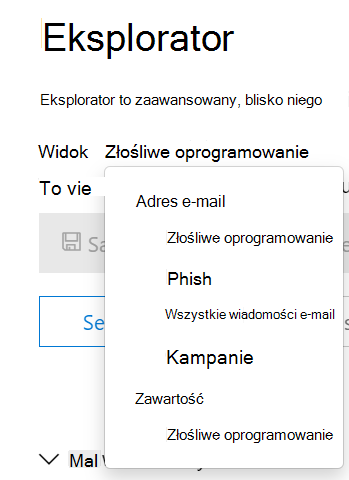
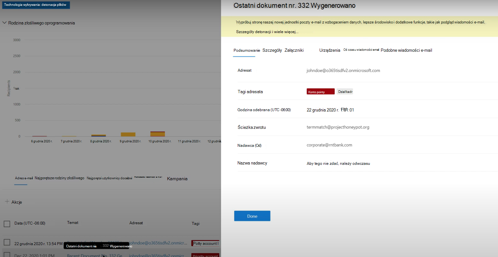
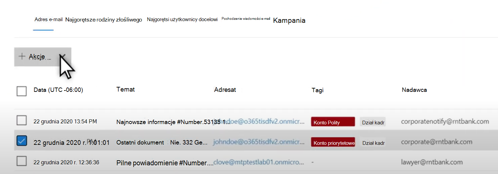

# For threat hunting in Threat Explorer for Microsoft Defender for Office 365

W tym artykule:

- [Choduj do Eksploratora zagrożeń](#threat-explorer-walk-through)
- [Badanie wiadomości e-mail](#email-investigation)
- [Działania naprawcze w wiadomościach e-mail](#email-remediation)
- [Ulepszenia w zakresie ochrony przed zagrożeniami podczas chłoniania](#improvements-to-threat-hunting-experience)

> [!NOTE]
> Jest to część 3-articleowej serii w Eksploratorze zagrożeń **(Eksploratorze),** zabezpieczeniach poczty **e-mail****,** Eksploratorze i wykrywaniu w czasie rzeczywistym (takich jak różnice między narzędziami i uprawnienia potrzebne do ich obsługi). Pozostałe dwa artykuły z tej [serii to zabezpieczenia](email-security-in-microsoft-defender.md) poczty e-mail za pomocą Eksploratora zagrożeń, Eksploratora zagrożeń i [wykrywania w czasie rzeczywistym](real-time-detections.md).

**Dotyczy**
- [Microsoft Defender dla Office 365 plan 1 i plan 2](defender-for-office-365.md)
- [Microsoft 365 Defender](../defender/microsoft-365-defender.md)

Jeśli Twoja organizacja ma program [Microsoft Defender for Office 365](defender-for-office-365.md) i masz odpowiednie [uprawnienia, możesz](#required-licenses-and-permissions) wykrywać i rekultywować  zagrożenia za pomocą wykrywania w Czasie rzeczywistym lub Eksploratora.

W portalu Microsoft 365 Defender pod <https://security.microsoft.com>adresem , przejdź do opcji Współpracy & e-mail, **a** następnie wybierz pozycję **Wykrywanie** **Eksploratora lub W czasie rzeczywistym**. Aby przejść bezpośrednio do strony, użyj lub <https://security.microsoft.com/threatexplorer> <https://security.microsoft.com/realtimereports>.

Za pomocą tych narzędzi możesz:

- Zobacz złośliwe oprogramowanie wykryte przez Microsoft 365 funkcje zabezpieczeń
- Wyświetlanie adresu URL wyłudzania informacji i klikanie danych werdyktu
- Rozpoczynanie zautomatyzowanego procesu badania i odpowiedzi z widoku w Eksploratorze
- Badanie złośliwych wiadomości e-mail i nie tylko

Aby uzyskać więcej informacji, zobacz [Zabezpieczenia poczty e-mail za pomocą Eksploratora zagrożeń](email-security-in-microsoft-defender.md).

## Choduj do Eksploratora zagrożeń

Usługa Microsoft Defender dla Office 365 ma dwa plany subskrypcji — Plan 1 i Plan 2. Ręcznie obsługiwane narzędzia do wyszukiwania zagrożeń istnieją w obu planach, pod różnymi nazwami i z różnymi możliwościami.

Program Defender for Office 365 Plan 1 używa wykrywania w czasie *rzeczywistym, który* jest podzbiorem narzędzia do wyszukiwania w Eksploratorze *zagrożeń (* nazywanego również Eksploratorem *) w* planie 2. W tej serii artykułów większość przykładów utworzono przy użyciu pełnego Eksploratora zagrożeń. Administratorzy powinni przetestować wszystkie kroki wykrywania w czasie rzeczywistym, aby sprawdzić, gdzie mają zastosowanie.

Po przejść do **Eksploratora** domyślnie trafisz na stronę Złośliwe oprogramowanie, ale użyj  listy rozwijanej Widok, aby  zapoznać się z dostępnymi opcjami. Jeśli chcesz pochylić się na czacie lub uprzątniesz kampanię zagrożenia, wybierz te widoki.

> [!div class="mx-imgBorder"]
> 

Po wybraniu danych z operacji zabezpieczeń (Sec Ops) przez osobę, którą chce wyświetlić, czy zakres jest wąskim widokiem, na przykład Przesyłanie przez **użytkownika, czy** też widokiem szerszym, na przykład Wszystkie wiadomości  e-mail **, może** użyć przycisku Nadawca w celu dalszego filtrowania. Pamiętaj, aby wybrać pozycję Odśwież, aby ukończyć akcje filtrowania.

> [!div class="mx-imgBorder"]
> 

Aby uściślić fokus w Eksploratorze lub wykrywaniu w czasie rzeczywistym, można powiedzieć na warstwach. Pierwszym z nich jest **Widok**. Drugi temat można sobie powiedzieć jako z *filtrowaniem fokusu*. Na przykład możesz odtworzyć czynności, które miały miejsce w znalezieniu zagrożenia, rejestrując takie decyzje: Aby znaleźć problem w Eksploratorze, wybieram widok złośliwego oprogramowania z fokusem filtru **adresata**. To ułatwia odwęcie czynności.

> [!TIP]
> Jeśli firma Sec Ops  używa tagów do oznaczania kont, które rozważają wartości docelowe o wysokiej wartości, mogą one dokonać wyboru, takiego jak Widok *phish*, z fokusem filtru Tagi (w przypadku jego zastosowania uwzględnij zakres dat). Spowoduje to pokazanie wszelkich prób wyłudzania informacji w określonym przedziale czasowym (na przykład dat, gdy niektóre ataki służące do wyłudzania informacji są bardzo podobne do ich branży).

Za pomocą kontrolek zakresu dat można uściślić zakresy dat. Tutaj możesz wyświetlić Eksploratora w widoku **Złośliwe** oprogramowanie z **fokusem filtru Technologia wykrywania** . Jednak jest to przycisk **filtru Zaawansowane** , który umożliwia zespołom sec ops dogłębną analizę.

> [!div class="mx-imgBorder"]
> 

Kliknięcie **filtru zaawansowanego** spowoduje wyświetlanie panelu, który umożliwia samodzielnie tworzenie zapytań przez program Sec Ops, pozwalając na dołączanie lub wykluczanie potrzebnych informacji. Zarówno wykres, jak i tabela na stronie Eksploratora będą odzwierciedlać ich wyniki.

> [!div class="mx-imgBorder"]
> 

Użyj **przycisku Opcje kolumny** , aby uzyskać rodzaj informacji w tabeli, który będzie najbardziej przydatny:

> [!div class="mx-imgBorder"]
> 

> [!div class="mx-imgBorder"]
> 

W tym samym mien pamiętaj, aby przetestować opcje wyświetlania. Różni odbiorcy będą dobrze reagować na różne prezentacje tych samych danych. Dla niektórych odbiorców mapa Pochodzenie  wiadomości e-mail może pokazywać, że zagrożenie jest większe lub mniej ważne niż opcja  wyświetlania kampanii bezpośrednio obok niego. Program Sec Ops może korzystać z tych wyświetlaczy, aby jak najlepiej podkreślić potrzebę zabezpieczeń i ochrony lub w celu późniejszego porównania, aby pokazać skuteczność ich działań.

> [!div class="mx-imgBorder"]
> 

> [!div class="mx-imgBorder"]
> 

### Badanie wiadomości e-mail

Gdy zobaczysz podejrzaną wiadomość e-mail, kliknij jej nazwę, aby rozwinąć wysuwną wiadomość po prawej stronie. W tym miejscu dostępny jest transparent, który umożliwia programowi Sec Ops wyświetlanie strony [jednostki poczty e-mail](mdo-email-entity-page.md) .

Strona jednostki poczty e-mail zawiera zawartość, która może być znaleziona **w obszarze Szczegóły****,** Załączniki **, Urządzenia**, ale zawiera bardziej uporządkowane dane. Należą do nich wyniki DMARC, wyświetlanie nagłówka wiadomości e-mail w formacie zwykłego tekstu z opcją kopiowania, werktowanie informacji w załącznikach, które zostały bezpiecznie detonowane, oraz plików usuniętych z detonacji (mogą to być adresy IP, z nimi skontaktowane oraz zrzuty ekranu stron lub plików). Podobnie raportowane są również adresy URL i ich werdykty.

Po dojechanie do tego etapu strona jednostki poczty e-mail będzie krytyczna dla ostatniego kroku — *rozwiązywania problemów*.

> [!div class="mx-imgBorder"]
> 

> [!TIP]
> Aby dowiedzieć się więcej o zaawansowanej stronie jednostki poczty e-mail  (widzianej poniżej na karcie Analiza), w tym o wynikach detonowanych załączników, wynikach dotyczących dołączonych adresów URL i bezpiecznej wersji zapoznawczej wiadomości e-mail, kliknij [tutaj](mdo-email-entity-page.md).

> [!div class="mx-imgBorder"]
> 

### Działania naprawcze w wiadomościach e-mail

Gdy osoba w programie Sec Ops określi, że wiadomość e-mail stanowi zagrożenie, kolejna czynności wykrywania w czasie rzeczywistym lub Eksploratora będzie dotyczyć zagrożeń i ich korygowania. Możesz to zrobić, wracając do Eksploratora zagrożeń, zaznaczając pole wyboru dla problematycznej wiadomości e-mail i używając **przycisku** Akcje.

> [!div class="mx-imgBorder"]
> 

W tym miejscu analityk może podjąć działania, takie jak zgłaszanie wiadomości jako spam, wyłudzanie informacji lub złośliwe oprogramowanie, kontaktowanie się z adresatami lub dalsze badania, które mogą obejmować wyzwalanie podręczników automatycznego badania i odpowiedzi (lub AIR) (jeśli masz plan 2). Wiadomość można również zgłosić jako czystą.

> [!div class="mx-imgBorder"]
> 

## Ulepszenia w zakresie ochrony przed zagrożeniami podczas chłoniania

### Identyfikator alertu

Podczas przechodzenia z alertu do Eksploratora zagrożeń widok  jest filtrowany według **identyfikatora alertu**. Dotyczy to również wykrywania w czasie rzeczywistym. Wyświetlane są wiadomości związane z określonym alertem oraz całkowita liczba wiadomości e-mail. Możesz sprawdzić, czy wiadomość była częścią alertu, a także przejść z tej wiadomości do powiązanego alertu.

Na koniec w adresie URL znajduje się identyfikator alertu, na przykład: `https://https://security.microsoft.com/viewalerts`

> [!div class="mx-imgBorder"]
> 

> [!div class="mx-imgBorder"]
> 

### Rozszerzanie limitu przechowywania i wyszukiwania danych w Eksploratorze (i wykrywanie w czasie rzeczywistym) dla dzierżaw wersji próbnej

W ramach tej zmiany analitycy będą mogli wyszukiwać i filtrować dane poczty e-mail w ciągu 30 dni (zwiększone z siedmiu dni) w Eksploratorze zagrożeń i wykrywaniu w czasie rzeczywistym zarówno dla usługi Defender dla dzierżaw wersji próbnej Office P1, jak i P2. Nie ma to wpływu na żadne dzierżawy produkcyjne zarówno dla klientów P1, jak i P2 E5, gdzie wartość domyślna przechowywania wynosi już 30 dni.

### Zaktualizowano limit eksportu

Liczba rekordów wiadomości e-mail, które można wyeksportować z Eksploratora zagrożeń, wynosi teraz 200 000 (było 9990). Zestaw kolumn, które można wyeksportować, pozostaje bez zmian.

### Tagi w Eksploratorze zagrożeń

> [!NOTE]
> Funkcja znaczników użytkownika jest w wersji Preview i może nie być dostępna dla wszystkich. Ponadto wersje zapoznawcze mogą ulec zmianie. Aby uzyskać informacje na temat harmonogramu wydania, zapoznaj się z Microsoft 365 przewodnik.

Tagi użytkowników identyfikują konkretne grupy użytkowników w uchcie Microsoft Defender dla Office 365. Aby uzyskać więcej informacji o tagach, w tym o licencjonowaniu i konfiguracji, zobacz [Tagi użytkownika](user-tags.md).

W Eksploratorze zagrożeń możesz zobaczyć informacje o tagach użytkowników w następujących środowiskoch.

#### Widok siatki wiadomości e-mail

Gdy analitycy przyjrzyją **się kolumnie Tagi** w siatce poczty e-mail, widzą wszystkie znaczniki, które zostały zastosowane do skrzynek pocztowych nadawcy lub adresata. Domyślnie w pierwszej kolejności są *wyświetlane* tagi systemowe, takie jak konta priorytetów.

> [!div class="mx-imgBorder"]
> 

#### Filtrowanie

Tagi mogą być używane jako filtry. Przeszukaj tylko konta o priorytecie lub używaj w ten sposób określonych scenariuszy z tagami użytkowników. Możesz również wykluczyć wyniki z określonymi tagami. Połącz tagi z innymi filtrami i zakresami dat, aby zawęzić zakres badania.

> [!div class="mx-imgBorder"]
> 

#### Wysuwny szczegół wiadomości e-mail

Aby wyświetlić poszczególne tagi dla nadawcy i adresata, wybierz wiadomość e-mail w celu otwarcia wysuwanych szczegółów wiadomości. Na karcie **Podsumowanie** tagi nadawcy i adresata są wyświetlane oddzielnie. Informacje o poszczególnych tagach nadawcy i adresata można wyeksportować jako dane CSV.

> [!div class="mx-imgBorder"]
> 

Informacje o znacznikach są również wyświetlane w wysuwanych kliknięciach adresu URL. Aby ją wyświetlić, przejdź do widoku Phish lub All Email > **URL** or **URL Clicks** tab. Wybierz poszczególne wysuwne informacje o adresie URL, aby wyświetlić dodatkowe szczegóły dotyczące kliknięć tego adresu URL, w tym wszystkich znaczników skojarzonych z tym kliknięciem.

### Zaktualizowany widok osi czasu

> [!div class="mx-imgBorder"]
> 
>
Dowiedz się więcej, oglądając [ten klip wideo](https://www.youtube.com/watch?v=UoVzN0lYbfY&list=PL3ZTgFEc7LystRja2GnDeUFqk44k7-KXf&index=4).

## Funkcje rozszerzone

### Najgorętsi użytkownicy docelowi

Najważniejsze rodziny złośliwego oprogramowania pokazują **najgorętszą użytkowników w** sekcji Złośliwe oprogramowanie. Użytkownicy, którzy są najgorętsi, zostaną rozszerzoni również za pośrednictwem widoków Phish i All Email. Analitycy będą mogli wyświetlić pięciu najlepszych użytkowników docelowych wraz z liczbą prób poszczególnych użytkowników w każdym widoku.

Operacje zabezpieczeń mogą wyeksportować listę użytkowników docelowych (maksymalnie do 3000) do analizy w trybie offline dla każdego widoku poczty e-mail wraz z liczbą wykonanych prób. Ponadto wybranie liczby prób (na przykład 13 prób na poniższej ilustracji) spowoduje otwarcie widoku filtrowego w Eksploratorze zagrożeń, dzięki czemu będziesz widzieć więcej szczegółów wiadomości e-mail i zagrożeń dla tego użytkownika.

> [!div class="mx-imgBorder"]
> 

### Exchange reguł transportu

Zespół operacyjny zabezpieczeń w widoku Siatki poczty e-mail będzie mógł zobaczyć wszystkie reguły transportu Exchange (lub Reguły przepływu poczty) zastosowane do wiadomości. Wybierz **pozycję Opcje kolumny** w siatce, **Exchange pozycję Dodaj regułę transportu** z opcji kolumny. Opcja Exchange reguł transportu jest również widoczna w **wysuwanych szczegółach** w wiadomości e-mail.

Zostaną wyświetlone nazwy i identyfikatory GUID reguł transportu zastosowanych do wiadomości. Analitycy będą mogli wyszukiwać wiadomości przy użyciu nazwy reguły transportu. To jest wyszukiwanie CONTAINS, co oznacza, że możesz również wyszukiwać częściowo.

> [!IMPORTANT]
> Exchange informacji o wyszukiwaniu reguł transportu i dostępności nazw zależy od przypisanej Ci roli. Do wyświetlania nazw reguł transportu i wyszukiwania potrzebujesz jednej z następujących ról lub uprawnień. Jednak nawet bez poniższych ról lub uprawnień analityk może zobaczyć etykietę reguły transportu i informacje o identyfikatorze GUID w szczegółach wiadomości e-mail. Nie ma to wpływu na inne środowisko wyświetlania rekordów w siatkach poczty e-mail, wysuwanych wiadomościach e-mail, filtrach i eksportowaniu.
>
> - Exchange Online - Ochrona przed utratą danych: Wszystko
> - Exchange Online tylko - O365SupportViewConfig: Wszystko
> - Microsoft Azure Active Directory lub Exchange Online — Administrator zabezpieczeń: Wszystko
> - Azure Active Directory lub Exchange Online — Czytnik zabezpieczeń: Wszystko
> - Exchange Online - Reguły transportu: Wszystkie
> - Exchange Online — tylko konfiguracja View-Only: Wszystkie
>
> W siatce wiadomości e-mail, wysuwanych szczegółach i wyeksportowanych plikach CSV są wyświetlane wartości Nazwa/identyfikator GUID, jak pokazano poniżej.
>
> > [!div class="mx-imgBorder"]
> > 

### Łączniki ruchu przychodzącego

Łączniki to zbiór instrukcji, które dostosują sposób przepływu poczty e-mail do i z Twojej Microsoft 365 lub Office 365 organizacji. Umożliwiają one stosowanie wszelkich ograniczeń zabezpieczeń i kontrolek. W Eksploratorze zagrożeń można wyświetlać łączniki powiązane z wiadomością e-mail i wyszukiwać wiadomości e-mail przy użyciu nazw łączników.

Wyszukiwanie łączników to zapytanie CONTAINS, co oznacza, że może działać wyszukiwanie części słów kluczowych:

> [!div class="mx-imgBorder"]
> 

## Wymagane licencje i uprawnienia

Program [Microsoft Defender for Office 365](defender-for-office-365.md) może korzystać z wykrywania w Eksploratorze lub czasie rzeczywistym.

- Eksplorator jest dołączony do usługi Defender dla Office 365 Plan 2.
- Raport wykrywanie w czasie rzeczywistym jest zawarty w programie Defender for Office 365 Plan 1.
- Zaplanuj przypisanie licencji wszystkim użytkownikom, którzy powinni być chronieni przez defendera dla Office 365. Wykrywanie Eksploratora i w czasie rzeczywistym pokazuje dane wykrywania licencjonowanych użytkowników.

Aby wyświetlać i używać wykrywania w Eksploratorze lub w czasie rzeczywistym, trzeba mieć następujące uprawnienia:

- W portalu Microsoft 365 Defender:
  - Zarządzanie organizacją
  - Administrator zabezpieczeń (tę pozycję można przypisać w centrum administracyjnym Azure Active Directory (<https://aad.portal.azure.com>)
  - Czytnik zabezpieczeń
- W Exchange Online:
  - Zarządzanie organizacją
  - View-Only zarządzanie organizacją
  - View-Only adresaci
  - Zarządzanie zgodnością

Aby dowiedzieć się więcej o rolach i uprawnieniach, zobacz następujące zasoby:

- [Uprawnienia w Microsoft 365 Defender portalu](permissions-microsoft-365-security-center.md)
- [Uprawnienia w aplikacji Exchange Online](/exchange/permissions-exo/permissions-exo)
- [Exchange Online PowerShell](/powershell/exchange/exchange-online-powershell)

## Więcej informacji

- [Znajdowanie i badanie dostarczonych złośliwych wiadomości e-mail](investigate-malicious-email-that-was-delivered.md)
- [Wyświetlaj złośliwe pliki wykryte w usługach SharePoint Online, OneDrive i Microsoft Teams](mdo-for-spo-odb-and-teams.md)
- [Omówienie widoków w Eksploratorze zagrożeń (i wykrywania w czasie rzeczywistym)](threat-explorer-views.md)
- [Raport o stanie ochrony przed zagrożeniami](view-email-security-reports.md#threat-protection-status-report)
- [Automatyczne badanie i reagowanie w zakresie ochrony przed zagrożeniami firmy Microsoft](automated-investigation-response-office.md)
- [Badanie wiadomości e-mail za pomocą strony jednostki poczty e-mail](mdo-email-entity-page.md)
