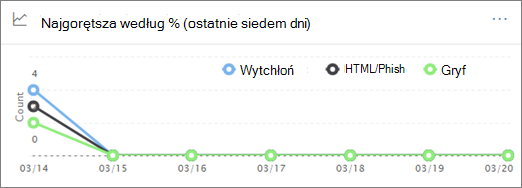

# Śledzenie zagrożeń — nowe i godne uwagi

[!INCLUDE [Microsoft 365 Defender rebranding](../includes/microsoft-defender-for-office.md)]

**Dotyczy**
- [Microsoft Defender dla Office 365 plan 2](defender-for-office-365.md)
- [Microsoft 365 Defender](../defender/microsoft-365-defender.md)

[Office 365 analizy](office-365-ti.md) zagrożeń i reakcji umożliwiają zespołowi zabezpieczeń Twojej organizacji wykrywanie zagrożeń bezpieczeństwa i reagowanie na nie. Office 365 analizy zagrożeń i reakcji obejmują funkcje śledzenia zagrożeń, w tym śledzenie godnych uwagi. Przeczytaj ten artykuł, aby zapoznać się z omówieniem tych nowych funkcji i następnych kroków.

> [!IMPORTANT]
> Office 365 analizą zagrożeń jest teraz usługa Microsoft Defender Office 365 plan 2 wraz z dodatkowymi możliwościami ochrony przed zagrożeniami. Aby dowiedzieć się więcej, zobacz [Program Microsoft Defender, Office 365 i](https://products.office.com/exchange/advance-threat-protection) ceny oraz [Opis usługi Microsoft Defender for Office 365 usługi](/office365/servicedescriptions/office-365-advanced-threat-protection-service-description).

## Co to są śledzenie zagrożeń?

Śledzenie zagrożeń to widżety i widoki informacyjne, które zapewniają analizę różnych problemów z aktywnością, które mogą mieć wpływ na firmę. Możesz na przykład wyświetlić informacje o trendach kampanii dotyczących złośliwego oprogramowania przy użyciu funkcji śledzenia zagrożeń.

Większość stron śledzenia zawiera numery trendów, które są okresowo aktualizowane, widżety ułatwiające zrozumienie, które problemy są największe lub które najwięcej się rozwijały, oraz szybki link w  kolumnie Akcje, który pozwala przejść do Eksploratora, gdzie można wyświetlić bardziej szczegółowe informacje.

Śledzenie to tylko kilka z wielu świetnych funkcji, jakie oferuje program [Microsoft Defender dla Office 365 Plan 2](office-365-ti.md). Śledzenie zagrożeń zawiera [między innymi śledzenie warte uwagi](#noteworthy-trackers)[, śledzenie](#trending-trackers) trendów, [śledzone zapytania](#tracked-queries) i [zapisane zapytania](#saved-queries).

Aby wyświetlić śledzenie zagrożeń dla organizacji i korzystać z nich, otwórz portal <https://security.microsoft.com>wiadomości Microsoft 365 Defender w witrynie , a następnie przejdź do narzędzia Do śledzenia zagrożeń dla & **poczty** \> **e-mail**. Aby przejść bezpośrednio do strony **śledzenie zagrożeń**, użyj .<https://security.microsoft.com/threattracker>

> [!NOTE]
> Aby korzystać z funkcji śledzenia zagrożeń, musisz być administratorem globalnym, administratorem zabezpieczeń lub czytelnikiem zabezpieczeń. Zobacz [Uprawnienia w portalu Microsoft 365 Defender witryny](permissions-microsoft-365-security-center.md).

### Godne uwagi śledzenie

Warto zauważyć, że śledzenie znajduje duże i mniejsze zagrożenia oraz czynniki ryzyka, o których sądzimy. Warto skorzystać z monitorów, dzięki którym dowiesz się, czy w Twoim środowisku programu Microsoft 365 występują te problemy, oraz linki do artykułów (takich jak ten), które zapewniają więcej szczegółowych informacji na temat tego, co się dzieje i jak będą one miały wpływ na korzystanie z aplikacji Office 365 w organizacji. Niezależnie od tego, czy istnieje duże nowe zagrożenie (np. Wannacry, Petya), czy istniejące zagrożenie, które mogłoby tworzyć nowe wyzwania (na przykład nasz inny godny uwagi element — Nemucod), tutaj znajdziesz nowe ważne elementy, które ty i Twój zespół zabezpieczeń powinni okresowo przeglądać i sprawdzać.

Zazwyczaj warto wiedzieć, że śledzenie będzie publikowane przez kilka tygodni, gdy zidentyfikujemy nowe zagrożenia i sądzimy, że może być potrzebna dodatkowa widoczność zapewniana przez tę funkcję. Po zakończeniu największego ryzyka związanego z zagrożeniem usuniemy ten element godny uwagi. Dzięki temu będziemy mieć możliwość dbania o to, aby lista była aktualne i zawierała inne istotne nowe elementy.

### Śledzenie trendów

Popularne śledzenie (wcześniej nazywane kampaniami) wyróżnia nowe zagrożenia otrzymane w wiadomościach e-mail organizacji w ciągu ostatniego tygodnia.

Popularne monitory zapewniają koncepcję nowych zagrożeń, które należy przeglądać, aby upewnić się, że szersze środowisko firmowe jest przygotowane na ataki.

### Śledzone zapytania

Śledzone zapytania wykorzystują zapisane zapytania, aby okresowo oceniać Microsoft 365 aktywności w organizacji. Jest to najbardziej popularne wydarzenie, a w nadchodzących miesiącach będzie ich więcej. Śledzone zapytania są uruchamiane automatycznie, zapewniając aktualne informacje bez konieczności pamiętania o konieczności ponownego uruchomienia zapytań.

### Zapisane zapytania

Zapisane zapytania znajdują się również w sekcji Śledzenie. Za pomocą zapisanych zapytań możesz zapisywać typowe wyszukiwania w Eksploratorze, do których chcesz wrócić szybciej i wielokrotnie, bez konieczności ponownego tworzenia wyszukiwania za każdym razem.

Korzystając z przycisku Zapisz zapytanie u góry strony Eksploratora, zawsze możesz zapisać zapytanie do śledzenia warte  uwagi lub dowolne z własnych zapytań w Eksploratorze. Wszystkie zapisane w tym miejscu dane będą **wyświetlane na liście** Zapisane zapytania na stronie Śledzenie.

## Śledzenie i Eksplorator

Niezależnie od tego, czy przeglądasz pocztę e-mail, zawartość czy aktywność Office (już wkrótce), Eksplorator i śledzenie współpracują ze sobą, aby pomóc w zbadaniu i śledztwu zagrożeń i zagrożeń związanych z zabezpieczeniami i zagrożeniami. Wszystkie razem monitory dostarczają ci informacji w celu ochrony Twoich użytkowników, wyróżniając nowe, istotne i często wyszukiwane problemy — zapewniając lepszą ochronę firmy po jej najechania do chmury.

Pamiętaj, że zawsze możesz przekazać nam swoją opinię na temat tych lub innych funkcji zabezpieczeń Microsoft 365, klikając przycisk Opinia w  prawym dolnym rogu.

## Śledzenie i usługa Microsoft Defender dla Office 365

W związku z naszym godnym uwagi zagrożeniem wyróżniamy zaawansowane zagrożenia związane ze złośliwym oprogramowaniem wykryte przez Sejf [załączników](safe-attachments.md). Jeśli jesteś klientem usługi Office 365 Enterprise E5 i nie korzystasz z programu [Microsoft Defender dla systemu Office 365](defender-for-office-365.md), tak powinno być — jest on uwzględniony w Twojej subskrypcji. Program Defender for Office 365 dostarcza wartości, nawet jeśli masz inne narzędzia zabezpieczające do filtrowania przepływu poczty e-mail Office 365 usługach. Funkcje ochrony przed spamem i linki [Sejf](safe-links.md) działają najlepiej, gdy główne rozwiązanie do ochrony poczty e-mail jest dostępne za pośrednictwem Office 365.

W dzisiejszych czasach pozbywając się zagrożeń, uruchamianie tylko tradycyjnych skanów złośliwego oprogramowania oznacza, że nie jesteś wystarczająco dobrze chroniony przed atakami. Obecnie bardziej zaawansowani atakujący używają często dostępnych narzędzi do tworzenia nowych, obpodpisanych lub opóźnionych ataków, które nie są rozpoznawane przez tradycyjne aparaty złośliwego oprogramowania oparte na podpisach. Funkcja Sejf załączników pobiera załączniki wiadomości e-mail i detonuje je w środowisku wirtualnym w celu ustalenia, czy są one bezpieczne, czy złośliwe. Ten proces detonacji powoduje otwarcie każdego pliku w środowisku komputera wirtualnego, a następnie obserwuje, co się dzieje po jego otwarciu. Zarówno w przypadku pliku PDF, pliku skompresowanego, jak i dokumentu programu Office złośliwy kod można ukryć w pliku i aktywować go dopiero po otworzoniu go na komputerze tej osoby. Dzięki detonacji i analizowaniu pliku w przepływie poczty e-mail program Defender for Office 365 umożliwia znalezienie tych zagrożeń na podstawie zachowań, reputacji pliku i wielu heuristic reguł.

Nowy filtr zagrożeń Godny uwagi wyróżnia elementy, które ostatnio zostały wykryte w Sejf załączników. Wykrywanie to elementy, które są nowymi złośliwymi plikami, które wcześniej nie zostały znalezione Microsoft 365 w przepływie poczty e-mail lub wiadomościach e-mail innych klientów. Zwróć uwagę na elementy w narzędziu Monitor zagrożeń Godny uwagi, sprawdzaj, kto był przez nie kierowany, i przejrzyj szczegóły detonacji wyświetlane na karcie Analiza zaawansowana (która znajduje się po kliknięciu tematu wiadomości e-mail w Eksploratorze). Ta karta będzie dostępna tylko w wiadomościach e-mail wykrytych przez funkcję załączników programu Sejf — ten monitor warte uwagi zawiera ten filtr, ale można też użyć tego filtru do innych wyszukiwań w Eksploratorze.

## Następne kroki

- Jeśli Twoja organizacja nie ma jeszcze tych funkcji analizy zagrożeń i odpowiedzi Office 365, zobacz Jak uzyskać Office 365 analizy zagrożeń [i reakcji?](office-365-ti.md).

- Upewnij się, że zespół zabezpieczeń ma przypisane odpowiednie role i uprawnienia. Musisz być administratorem globalnym albo mieć przypisaną rolę Administrator zabezpieczeń lub Wyszukiwanie i przeczyszczanie w portalu Microsoft 365 Defender sieci. Zobacz [Uprawnienia w portalu Microsoft 365 Defender witryny](permissions-microsoft-365-security-center.md).

- Obserwuj, jak nowe monitory są wyświetlane w Twoim Microsoft 365 środowisku. Jeśli są dostępne, monitory są dostępne na stronie Śledzenie zagrożeń  w portalu Microsoft 365 Defender w sieci Web pod witrynie <https://security.microsoft.com/threattracker>.

- Jeśli jeszcze tego nie zrobiono, dowiedz się więcej o programie [Microsoft Defender](defender-for-office-365.md) dla usługi Office 365 dla organizacji i skonfiguruj go, w tym  linki Sejf i załączniki Sejf [załączników](safe-attachments.md).
