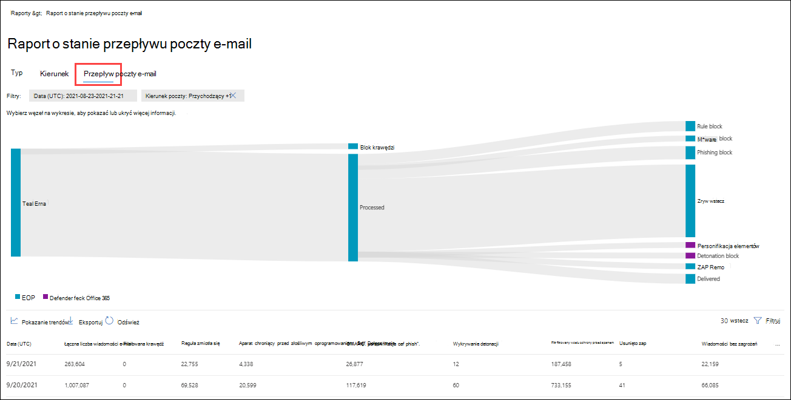
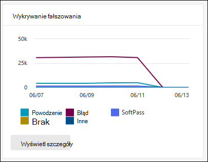
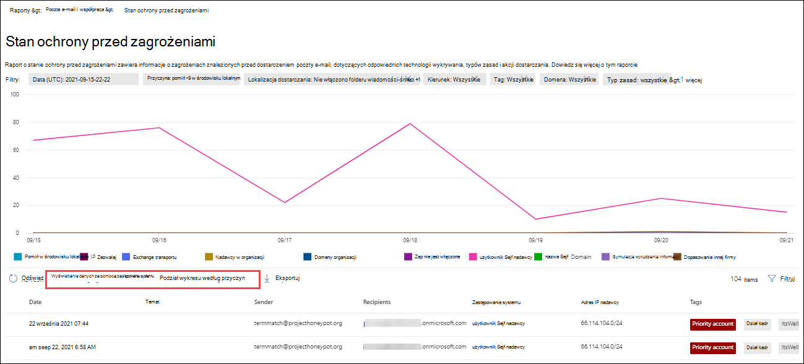
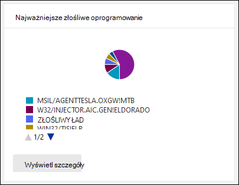
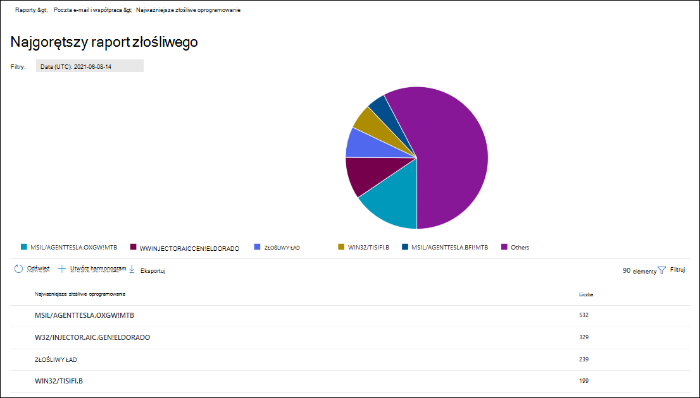

# Wyświetlanie raportów zabezpieczeń poczty e-mail w portalu Microsoft 365 Defender-mail

[!INCLUDE [Microsoft 365 Defender rebranding](../includes/microsoft-defender-for-office.md)]

**Dotyczy**
- [Exchange Online Protection](exchange-online-protection-overview.md)
- [Microsoft Defender dla Office 365 plan 1 i plan 2](defender-for-office-365.md)
- [Microsoft 365 Defender](../defender/microsoft-365-defender.md)

W portalu usługi Microsoft 365 Defender <https://security.microsoft.com> pod adresem pomaga sprawdzić, jak funkcje zabezpieczeń poczty e-mail, takie jak funkcje ochrony przed spamem i złośliwym oprogramowaniem w programie Microsoft 365, chronią Twoją organizację. Jeśli masz odpowiednie [uprawnienia](#what-permissions-are-needed-to-view-these-reports), możesz wyświetlać i pobierać te raporty w sposób opisany w tym artykule.

> [!NOTE]
>
> Niektóre raporty na stronie Raporty dotyczące współpracy **& e-mail** wymagają usługi Microsoft Defender dla Office 365. Aby uzyskać informacje na temat tych raportów, zobacz [Wyświetlanie Office 365 Defender w portalu Microsoft 365 Defender raportach](view-reports-for-mdo.md).
>
> Raporty dotyczące przepływu poczty e-mail znajdują się teraz w centrum Exchange administracyjnego. Aby uzyskać więcej informacji na temat tych raportów, zobacz [Raporty przepływu poczty e-mail w nowej Exchange administracyjnego](/exchange/monitoring/mail-flow-reports/mail-flow-reports).

## Zmiany raportu zabezpieczeń poczty e-mail w portalu Microsoft 365 Defender-mail

Raporty Exchange Online Protection (EOP) i Microsoft Defender dla programu Office 365 w portalu programu Microsoft 365 Defender, które zostały zamienione, przeniesione lub wycofane, opisano w poniższej tabeli.

 

****

|Przestarzały raport i polecenia cmdlet|Nowy raport i polecenia cmdlet|Identyfikator Centrum wiadomości|Data|
|---|---|:---:|:---:|
|**Śledzenie adresu URL** 
 Get-URLTrace|[Raport ochrony adresu URL](view-reports-for-mdo.md#url-protection-report) 
 [Get-SafeLinksAggregateReport](/powershell/module/exchange/get-safelinksaggregatereport)   [Get-SafeLinksDetailReport](/powershell/module/exchange/get-safelinksdetailreport)|MC2399999|Czerwiec 2021|
|**Wysłano i odebrano raport wiadomości e-mail** 
 Get-MailTrafficReport   Get-MailDetailReport|[Raport o stanie ochrony przed zagrożeniami](#threat-protection-status-report)   [Raport o stanie przepływu poczty](#mailflow-status-report) 
 [Get-MailTrafficATPReport](/powershell/module/exchange/get-mailtrafficatpreport)   [Get-MailDetailATPReport](/powershell/module/exchange/get-maildetailatpreport)   [Get-MailFlowStatusReport](/powershell/module/exchange/get-mailflowstatusreport)|MC236025|Czerwiec 2021|
|**Raport przesyłania dalej** 
 brak polecenia cmdlet|[Raport wiadomości automatycznie przesyłanych dalej w Aplikacji programu EAC](/exchange/monitoring/mail-flow-reports/mfr-auto-forwarded-messages-report) 
 brak polecenia cmdlet|MC250533|Czerwiec 2021|
|**Sejf typów plików załączników** 
 Get-AdvancedThreatProtectionTrafficReport   Get-MailDetailMalwareReport|[Raport o stanie ochrony przed zagrożeniami: Wyświetlanie danych za pomocą złośliwego oprogramowania poczty e-mail \>](#view-data-by-email--malware-and-chart-breakdown-by-detection-technology) 
 [Get-MailTrafficATPReport](/powershell/module/exchange/get-mailtrafficatpreport)   [Get-MailDetailATPReport](/powershell/module/exchange/get-maildetailatpreport)|MC250532|Czerwiec 2021|
|**Sejf raportu rozsyłania wiadomości załączników** 
 Get-AdvancedThreatProtectionTrafficReport   Get-MailDetailMalwareReport|[Raport o stanie ochrony przed zagrożeniami: Wyświetlanie danych za pomocą złośliwego oprogramowania poczty e-mail \>](#view-data-by-email--malware-and-chart-breakdown-by-detection-technology) 
 [Get-MailTrafficATPReport](/powershell/module/exchange/get-mailtrafficatpreport)   [Get-MailDetailATPReport](/powershell/module/exchange/get-maildetailatpreport)|MC250531|Czerwiec 2021|
|**Złośliwe oprogramowanie wykryte w raporcie poczty e-mail** 
 Get-MailTrafficReport   Get-MailDetailMalwareReport|[Raport o stanie ochrony przed zagrożeniami: Wyświetlanie danych za pomocą złośliwego oprogramowania poczty e-mail \>](#view-data-by-email--malware-and-chart-breakdown-by-detection-technology) 
 [Get-MailTrafficATPReport](/powershell/module/exchange/get-mailtrafficatpreport)   [Get-MailDetailATPReport](/powershell/module/exchange/get-maildetailatpreport)|MC250530|Czerwiec 2021|
|**Raport wykrywania spamu** 
 Get-MailTrafficReport   Get-MailDetailSpamReport|[Raport o stanie ochrony przed zagrożeniami: Wyświetlanie danych według wiadomości e-mail ze \> spamem](#view-data-by-email--spam-and-chart-breakdown-by-detection-technology) 
 [Get-MailTrafficATPReport](/powershell/module/exchange/get-mailtrafficatpreport)   [Get-MailDetailATPReport](/powershell/module/exchange/get-maildetailatpreport)|MC250529|Październik 2021|
|Get-AdvancedThreatProtectionDocumentReport 
 Get-AdvancedThreatProtectionDocumentDetail|[Get-ContentMalwareMdoAggregateReport](/powershell/module/exchange/get-contentmalwaremdoaggregatereport) 
 [Get-ContentMalwareMdoDetailReport](/powershell/module/exchange/get-contentmalwaremdodetailreport)|TBA|Maj 2022 r.|
|**Exchange reguł transportu** 
 Get-MailTrafficPolicyReport   Get-MailDetailTransportRuleReport|[Exchange raportu o regułach transportu w Programie komunikacji elektronicznej](/exchange/monitoring/mail-flow-reports/mfr-exchange-transport-rule-report) 
 brak polecenia cmdlet|MC316157|Kwiecień 2022 r.|
|Get-MailTrafficTopReport|[Raport o stanie ochrony przed zagrożeniami: Wyświetlanie danych za pomocą złośliwego oprogramowania poczty e-mail \>](#view-data-by-email--malware-and-chart-breakdown-by-detection-technology) 
 [Get-MailTrafficATPReport](/powershell/module/exchange/get-mailtrafficatpreport)   [Get-MailDetailATPReport](/powershell/module/exchange/get-maildetailatpreport) 
 **Uwaga**: Nie zastępuje on funkcji raportowania szyfrowania w aplikacji Get-MailTrafficTopReport.|MC315742|Kwiecień 2022 r.|
|

## Raport naruszonych użytkowników

> [!NOTE]
> Ten raport jest dostępny w Microsoft 365 z Exchange Online pocztowymi. Nie jest dostępna w organizacjach autonomicznych Exchange Online Protection (EOP).

Raport **Naruszoni użytkownicy** zawiera liczbę kont użytkowników oznaczonych jako **podejrzane** lub **ograniczone w ciągu** ostatnich 7 dni. Konta w jednym z tych stanów są problematyczne, a nawet naruszone. W przypadku częstego używania tego raportu można dostrzec kolekcje, a nawet trendy w podejrzanych lub ograniczonych kontach. Aby uzyskać więcej informacji o naruszonych użytkownikach, zobacz [Odpowiadanie na naruszone konto e-mail](responding-to-a-compromised-email-account.md).

Widok agregowania przedstawia dane z ostatnich 90 dni, a widok szczegółów zawiera dane z ostatnich 30 dni.

Aby wyświetlić raport w portalu Microsoft 365 Defender pod <https://security.microsoft.com>adresem ,  \> przejdź do tematu Raporty wiadomości e-mail i & **e-mail** \> & **do współpracy**. Na stronie **Raporty &-mail znajdź** pozycję **Naruszoni użytkownicy** , a następnie kliknij **pozycję Wyświetl szczegóły**. Aby przejść bezpośrednio do raportu, otwórz program <https://security.microsoft.com/reports/CompromisedUsers>.

Na stronie **Naruszoni użytkownicy** wykres przedstawia następujące informacje dotyczące określonego zakresu dat:

- **Ograniczone**: Na konto użytkownika na ograniczono możliwości wysyłania wiadomości e-mail ze względu na wysoce podejrzane wzorce.
- **Podejrzane**: Konto użytkownika wysłało podejrzane wiadomości e-mail i istnieje ryzyko ograniczenia możliwości wysyłania wiadomości e-mail.

Tabela szczegółów pod wykresem zawiera następujące informacje:

- **Godzina utworzenia**
- **Identyfikator użytkownika**
- **Akcja**

Możesz filtrować zarówno wykres, jak i tabelę szczegółów, klikając pozycję **Filtruj** i wybierając jedną lub więcej z następujących wartości w wyświetlonym wysuwaniu:

- **Data (UTC)**: **data rozpoczęcia** i **data zakończenia**.
- **Działanie**: **Ograniczone lub** **Podejrzane**

Po zakończeniu konfigurowania filtrów kliknij pozycję **Zastosuj,** **Anuluj** lub **Wyczyść filtry**.

Na stronie **Naruszoni użytkownicy** ikona  **[Utwórz harmonogram](#schedule-report)**, ikona  **[Zażądaj raportu](#request-report)** i ikony  **[Dostępne](#export-report)** są przyciski eksportu.

## Exchange reguł transportu

> [!NOTE]
> Raport **Exchange transportu jest** teraz dostępny w EAC. Aby uzyskać więcej informacji, [Exchange raport reguł transportu w nowej Wiadomości e-mail](/exchange/monitoring/mail-flow-reports/mfr-exchange-transport-rule-report).

### Podział wykresu według kierunku

Jeśli wybierzesz **pozycję Podział wykresu według kierunku**, będą dostępne następujące wykresy:

- **Wyświetlanie danych według Exchange transportu**: Liczba wiadomości przychodzących i wychodzących, na które  wpływały reguły przepływu poczty.
- **Wyświetlanie danych według reguł Exchange** ochrony przed utratą danych: liczba wiadomości przychodzących i  wychodzących,  na które wpływały reguły przepływu poczty (DLP, data loss prevention).

Poniższe informacje są wyświetlane w tabeli szczegółów poniżej wykresu:

- **Data**
- **Zasady DLP** (**Wyświetlanie danych według zasad DLP Exchange tylko reguł transportu**)
- **Reguła transportu**
- **Temat**
- **Adres nadawcy**
- **Adres adresata**
- **Ważność**
- **Kierunek**

Możesz filtrować zarówno wykres, jak i tabelę szczegółów, klikając pozycję **Filtruj** i wybierając jedną lub więcej z następujących wartości w wyświetlonym wysuwaniu:

- **Data rozpoczęcia (UTC)** **i** **data zakończenia**.
- **Kierunek**: **Wychodzący** **i przychodzący**.
- **Ważność**: **Wysoka ważność**, **Średnie ważność** i **Niskie ważność**

Po zakończeniu konfigurowania filtrów kliknij pozycję **Zastosuj,** **Anuluj** lub **Wyczyść filtry**.

Na stronie **Exchange reguły** transportu ikona  **[Utwórz harmonogram](#schedule-report)**, ikona  **[Zażądaj raportu](#request-report)** i ikony  **[Dostępne](#export-report)** są przyciski eksportu.

### Podział wykresu według ważności

Jeśli wybierzesz **pozycję Zestawienie wykresu według ważności**, dostępne są następujące wykresy:

- **Wyświetl dane według Exchange transportu**: Liczba wiadomości o wysokim, średnim poziomie ważności i o niskim **poziomie ważności**. Ustaw poziom ważności jako akcję w **reguły (** Przeskanuj tę regułę z poziomem ważności lub _UstawSpotkańczSpotkanie_). Aby uzyskać więcej informacji, zobacz [Akcje reguły przepływu poczty e-mail Exchange Online](/Exchange/security-and-compliance/mail-flow-rules/mail-flow-rule-actions).

- **Wyświetl dane według reguł transportu usługi DLP Exchange**: Liczba wiadomości o wysokim, średnim poziomie ważności i o niskim poziomie **ważności, na** które wpływały reguły przepływu poczty DLP.

Poniższe informacje są wyświetlane w tabeli szczegółów poniżej wykresu:

- **Data**
- **Zasady DLP** (**Wyświetlanie danych według zasad DLP Exchange tylko reguł transportu**)
- **Reguła transportu**
- **Temat**
- **Adres nadawcy**
- **Adres adresata**
- **Ważność**
- **Kierunek**

Możesz filtrować zarówno wykres, jak i tabelę szczegółów, klikając pozycję **Filtruj** i wybierając jedną lub więcej z następujących wartości w wyświetlonym wysuwaniu:

- **Data rozpoczęcia (UTC)** **i** **data zakończenia**
- **Kierunek**: **Wychodzący** **i przychodzący**
- **Ważność**: **Wysoka ważność**, **Średnie ważność** i **Niskie ważność**

Po zakończeniu konfigurowania filtrów kliknij pozycję **Zastosuj,** **Anuluj** lub **Wyczyść filtry**.

Na stronie **Exchange reguły** transportu ikona  **[Utwórz harmonogram](#schedule-report)**, ikona  **[Zażądaj raportu](#request-report)** i ikony  **[Dostępne](#export-report)** są przyciski eksportu.

## Raport przesyłania dalej

> [!NOTE]
> Ten raport jest teraz dostępny w EAC. Aby uzyskać więcej informacji, zobacz [Raport Autosyłki wiadomości przesyłanych dalej w nowej aplikacji EAC](/exchange/monitoring/mail-flow-reports/mfr-auto-forwarded-messages-report).

## Raport o stanie przepływu poczty

Raport **o stanie przepływu** poczty jest inteligentnym raportem, który przedstawia informacje o przychodzących i wychodzących wiadomościach e-mail, wykryciu spamu, złośliwym oprogramowaniu, wiadomościach e-mail zidentyfikowanych jako "dobre" oraz informacjach o dozwolonych lub blokowanych wiadomościach e-mail na brzegach. Jest to jedyny raport, który zawiera informacje o ochronie brzegowej i pokazuje, ile wiadomości e-mail zostało zablokowanych, zanim zezwolisz na ich dostęp do usługi w celu oceny przez usługę Exchange Online Protection (EOP). Ważne jest, aby zrozumieć, że jeśli wiadomość zostanie wysłana do pięciu adresatów, jest ona liczna jako pięć różnych wiadomości, a nie jako jedna wiadomość.

Aby wyświetlić raport w portalu Microsoft 365 Defender pod <https://security.microsoft.com>adresem ,  \> przejdź do tematu Raporty wiadomości e-mail i & **e-mail** \> & **do współpracy**. Na stronie **Raporty &-mail znajdź** pozycję Podsumowanie **stanu przepływu** poczty, a następnie kliknij **pozycję Wyświetl szczegóły**. Aby przejść bezpośrednio do raportu, otwórz program <https://security.microsoft.com/reports/mailflowStatusReport>.

### Widok typu dla raportu o stanie przepływu poczty

Na stronie **Raport o stanie przepływu** **poczty domyślnie wybrana** jest karta Typ. Wykres przedstawia następujące informacje dotyczące określonego zakresu dat:

- **Dobra wiadomość e-mail**: Wiadomości e-mail, które zostały określone jako niebędące spamem lub które są dozwolone przez zasady użytkowników lub organizacji.
- **Suma**
- **Złośliwe oprogramowanie**: Wiadomości e-mail, które są blokowane jako złośliwe oprogramowanie przez różne filtry.
- **Wiadomość e-mail wyłudzająca** informacje: Wiadomość e-mail zablokowana przez różne filtry jako próby wyłudzenia informacji.
- **Spam**: Wiadomości e-mail, które są blokowane jako spam przez różne filtry.
- **Ochrona krawędzi**: Poczta e-mail odrzucona na krawędzi/obwodzie przed rozpoczęciem oceny przez usługę EOP lub Defender dla systemu Office 365.
- **Reguły wiadomości**: Wiadomości e-mail, na które zostały wysłane reguły przepływu poczty (nazywane także regułami transportu).

Tabela szczegółów pod wykresem zawiera następujące informacje:

- **Kierunek**
- **Type**
- **24 godziny**
- **3 dni**
- **7 dni**
- **15 dni**
- **30 dni**

Możesz filtrować zarówno wykres, jak i tabelę szczegółów, klikając pozycję **Filtruj** i wybierając jedną lub więcej z następujących wartości w wyświetlonym wysuwaniu:

- **Data (UTC)**: **data rozpoczęcia** i **data zakończenia**.
- **Kierunek poczty**: **Przychodzący** i **Wychodzący**.
- **Typ**:
  - **Dobra wiadomość**
  - **Złośliwe oprogramowanie**
  - **Spam**
  - **Ochrona krawędzi**
  - **Reguły wiadomości**
  - **Wiadomość e-mail wyłudzająca**

Po zakończeniu konfigurowania filtrów kliknij pozycję **Zastosuj,** **Anuluj** lub **Wyczyść filtry**.

Po powrocie do **strony Raport o stanie przepływu** poczty w przypadku kliknięcia przycisku Wybierz kategorię w celu ustawienia szczegółowych informacji można wybrać spośród następujących wartości:

- **Wiadomość e-mail wyłudzająca** informacje: ta zaznaczenie umożliwia dostęp do [raportu o stanie ochrony przed zagrożeniami](view-email-security-reports.md#threat-protection-status-report).
- **Złośliwe oprogramowanie w** wiadomościach e-mail: ta zaznaczenie przenosi Cię do [raportu o stanie ochrony przed zagrożeniami](view-email-security-reports.md#threat-protection-status-report).
- **Wykrywanie spamu**: ta zaznaczenie umożliwia dostęp do raportu [Wykrywanie spamu](view-email-security-reports.md#spam-detections-report).
- **Blokowanie spamu w programie Edge**: ta zaznaczenie umożliwia dostęp do raportu [Wykrywanie spamu](view-email-security-reports.md#spam-detections-report).

Na stronie **Raport o stanie przepływu** poczty e-mail ikona  **[Ikona Utwórz harmonogram](#schedule-report)** i  **[Dostępne](#export-report)** są przyciski eksportu.

### Widok kierunku dla raportu o stanie przepływu poczty

Jeśli klikniesz **kartę Kierunek** , wykres przedstawia następujące informacje dla określonego zakresu dat:

- **Przychodzący**
- **Wychodzące**

Możesz filtrować zarówno wykres, jak i tabelę szczegółów, klikając pozycję **Filtruj** i wybierając jedną lub więcej z następujących wartości w wyświetlonym wysuwaniu:

- **Data (UTC)**: **data rozpoczęcia** i **data zakończenia**.
- **Kierunek poczty**: **Przychodzący** i **Wychodzący**.
- **Typ**:
  - **Dobra wiadomość**
  - **Złośliwe oprogramowanie**
  - **Spam**
  - **Ochrona krawędzi**
  - **Reguły wiadomości**
  - **Wiadomość e-mail wyłudzająca**

Po zakończeniu konfigurowania filtrów kliknij pozycję **Zastosuj,** **Anuluj** lub **Wyczyść filtry**.

Po powrocie do **strony Raport o stanie przepływu** poczty w przypadku kliknięcia przycisku Wybierz kategorię w celu ustawienia szczegółowych informacji można wybrać spośród następujących wartości:

- **Wiadomość e-mail wyłudzająca** informacje: ta zaznaczenie umożliwia dostęp do [raportu o stanie ochrony przed zagrożeniami](view-email-security-reports.md#threat-protection-status-report).
- **Złośliwe oprogramowanie w** wiadomościach e-mail: ta zaznaczenie przenosi Cię do [raportu o stanie ochrony przed zagrożeniami](view-email-security-reports.md#threat-protection-status-report).
- **Wykrywanie spamu**: ta zaznaczenie umożliwia dostęp do raportu [Wykrywanie spamu](view-email-security-reports.md#spam-detections-report).
- **Blokowanie spamu w programie Edge**: ta zaznaczenie umożliwia dostęp do raportu [Wykrywanie spamu](view-email-security-reports.md#spam-detections-report).

Na stronie **Raport o stanie przepływu** poczty e-mail ikona  **Ikona Utwórz harmonogram** i  **Dostępne** są przyciski eksportu.

### Mailflow view for the Mailflow status report

W **widoku Mailflow można** sprawdzić, jak funkcje ochrony przed zagrożeniami w wiadomościach e-mail firmy Microsoft filtrowały przychodzące i wychodzące wiadomości e-mail w organizacji. W tym widoku diagram przepływu poziomego (nazywany diagramem _Sankey_ ) zawiera szczegółowe informacje na temat łącznej liczby wiadomości e-mail oraz tego, jak skonfigurowane funkcje ochrony przed zagrożeniami, takie jak ochrona brzegowa, ochrona przed złośliwym oprogramowaniem, ochrona przed wyłudzaniem informacji, ochrona przed spamem i fałszowanie wpływają na tę liczbę.

Widok zagregowany i widok tabeli szczegółów umożliwiają filtrowanie przez 90 dni.

Informacje na diagramie są kodowane kolorami przez **usługę EOP** lub **Defender dla Office 365** technologii.

Diagram jest zorganizowany w następujące poziome paski:

- **Total email** band: This value is always shown first.
- **Blok graniczny** i **przetwarzane pasmo** :
  - **Blok krawędzi**: wiadomości, które są filtrowane na krawędzi i określone jako Ochrona krawędzi.
  - **Przetwarzane**: wiadomości obsługiwane przez stos filtrowania.
- Pasek wyników:
  - **Blok reguły**: wiadomości przetwarzane przez Exchange przepływu poczty (reguły transportu).
  - **Blok złośliwego** oprogramowania: Wiadomości zidentyfikowane jako złośliwe oprogramowanie za pomocą różnych filtrów.\*
  - **Blok phish**: wiadomości zidentyfikowane jako wyłudzy podczas przetwarzania przy pomocą różnych filtrów.\*
  - **Blok spamu**: Wiadomości zidentyfikowane jako spam podczas przetwarzania przy pomocą różnych filtrów.\*
  - **Blok personifikacji**: Komunikaty wykryte jako personifikacja użytkownika lub personifikacja domeny w uchcie Defender Office 365.\*
  - **Blok detonacji**: Wiadomości wykrywane podczas detonacji pliku lub adresu URL przez Sejf zasady załączników lub Sejf w programie Defender for Office 365.\*
  - **Usunięto ZAP**: Wiadomości usuwane przez automatyczne przeczyszczanie zerowej godziny (ZAP).\*
  - **Dostarczono**: Wiadomości dostarczane do użytkowników z powodu ich zezwalania.\*

Jeśli najedziesz kursorem na poziomy pasek na diagramie, zobaczysz liczbę powiązanych wiadomości.

\* Jeśli klikniesz ten element, diagram zostanie rozwinięty w celu pokazania dodatkowych szczegółów. Aby uzyskać opis każdego elementu w rozwiniętych węzłach, zobacz [Technologie wykrywania](/office/office-365-management-api/office-365-management-activity-api-schema#detection-technologies).

Tabela szczegółów pod diagramem zawiera następujące informacje:

- **Data**
- **Łączna liczba wiadomości e-mail**
- **Filtrowana krawędź**
- **Reguły wiadomości**
- **Aparat ochrony przed złośliwym oprogramowaniem, Sejf załączniki, filtrowane reguły**
- **Personifikacja DMARC, fałsz, filtrowany wyłud**
- **Wykrywanie detonacji**
- **Filtr filtrowany w celu ochrony przed spamem**
- **Usunięto zap**
- **Wiadomości, w przypadku których nie wykryto zagrożeń**

Jeśli wybierzesz wiersz w tabeli szczegółów, w wyświetlonym wysuwu szczegółów zostanie wyświetlony dalsze zestawienie liczby wiadomości e-mail.

Możesz filtrować zarówno wykres, jak i tabelę szczegółów, klikając pozycję **Filtruj** i wybierając jedną lub więcej z następujących wartości w wyświetlonym wysuwaniu:

- **Data rozpoczęcia (UTC)** **i** **data zakończenia**.
- **Kierunek**: **Wychodzący** **i przychodzący**.

Po zakończeniu konfigurowania filtrów kliknij pozycję **Zastosuj,** **Anuluj** lub **Wyczyść filtry**.

Na stronie Raport **o stanie przepływu** poczty możesz kliknąć pozycję Pokaż  trendy, aby wyświetlić wykresy trendów w wyświetlonym **wysuwanych** trendach przepływu poczty.

Na stronie **Raport o stanie przepływu** poczty e-mail ikona  **Przycisk** Eksportuj jest dostępny.

## Raport wykrywanie złośliwego oprogramowania

> [!NOTE]
> Ten raport został przestarzały. Te same informacje są dostępne w raporcie [o stanie ochrony przed zagrożeniami](#threat-protection-status-report).

## Raport opóźnień poczty

Raport **Opóźnienie poczty w uchcie** programu Defender Office 365 zawiera informacje dotyczące opóźnień dostarczenia i detonacji poczty, które wystąpiły w Twojej organizacji. Aby uzyskać więcej informacji, zobacz [Raport o opóźnieniach poczty](view-reports-for-mdo.md#mail-latency-report).

## Raport Wykrywanie spamu

> [!NOTE]
> Ten raport został przestarzały. Te same informacje są dostępne w raporcie [o stanie ochrony przed zagrożeniami](#threat-protection-status-report).

## Raport Wykrywanie fałszu

Raport **Wykrywanie fałszu** zawiera informacje o wiadomościach zablokowanych lub dozwolonych ze względu na spoofing. Aby uzyskać więcej informacji na temat fałszowania, zobacz [Ochrona przed fałszerko-fałszerem w uciekaniu poczty eOP](anti-spoofing-protection.md).

Widok zagregowany raportu umożliwia filtrowanie przez 90 dni, natomiast widok szczegółowy umożliwia filtrowanie tylko przez dziesięć dni.

Aby wyświetlić raport w portalu Microsoft 365 Defender,  \>  \> przejdź do tematu Raporty wiadomości e-mail i & e-mail & **raportów współpracy**. Na stronie **Raporty &-mail** znajdź pozycję Wykrywanie **fałszu** , a następnie kliknij **pozycję Wyświetl szczegóły**. Aby przejść bezpośrednio do raportu, otwórz program <https://security.microsoft.com/reports/SpoofMailReportV2>.

Na wykresie przedstawiono następujące informacje:

- **Pass**
- **Niepowodzenie**
- **SoftPass**
- **Brak**
- **Inne**

Po umieszczeniu wskaźnika myszy nad dniem (punktem danych) na wykresie możesz zobaczyć, ile wiadomości zostało wykrytych jako sfałszowane i dlaczego.

Możesz filtrować zarówno wykres, jak i tabelę szczegółów, klikając pozycję **Filtruj** i wybierając jedną lub więcej z następujących wartości w wyświetlonym wysuwaniu:

- **Data rozpoczęcia (UTC)** **i** **data zakończenia**
- **Wynik**:
  - **Pass**
  - **Niepowodzenie**
  - **SoftPass**
  - **Brak**
  - **Inne**
- **Spoof type**: **Internal** and **External**

Tabela szczegółów pod wykresem zawiera następujące informacje:

- **Data**
- **Fałszywy użytkownik**
- **Infrastruktura wysyłania**
- **Typ fałsz**
- **Result (Wynik)**
- **Kod wyniku**
- **SPF**
- **DKIM**
- **DMARC**
- **Liczba wiadomości**

Aby uzyskać więcej informacji na temat złożonych kodów wyników uwierzytelniania, zobacz [Nagłówki wiadomości ochrony przed spamem w programie Microsoft 365](anti-spam-message-headers.md).

Na stronie **Wykrywanie fałszu** kliknij ikonę  **[Utwórz harmonogram](#schedule-report)**, ikona  **[Zażądaj raportu](#request-report)** i ikony  **[Dostępne](#export-report)** są przyciski eksportu.

## Raport Przesłania

Raport **Przesyłanie zawiera** informacje o elementach zgłoszonych firmie Microsoft przez administratorów w celu analizy. Aby uzyskać więcej informacji, zobacz Przesyłanie administratora w celu przesłania podejrzeń o [spam, wyłudzy, adresy URL i pliki do firmy Microsoft](admin-submission.md).

Aby wyświetlić raport w portalu Microsoft 365 Defender pod <https://security.microsoft.com>adresem ,  \> przejdź do tematu Raporty wiadomości e-mail i & **e-mail** \> & **do współpracy**. Na stronie **Raporty &-mail znajdź** pozycję **Materiały** , a następnie kliknij **pozycję Wyświetl szczegóły**. Aby przejść bezpośrednio do raportu, otwórz program <https://security.microsoft.com/adminSubmissionReport>. Aby przejść do [przesyłania przez administratora w portalu Microsoft 365 Defender,](admin-submission.md) kliknij pozycję **Przejdź do przesyłania**. Administratorzy będą mogli wyświetlać raport z ostatnich 30 dni.

Na wykresie przedstawiono następujące informacje:

- **Oczekiwanie**
- **Ukończone**

Możesz filtrować zarówno wykres, jak i tabelę szczegółów, klikając pozycję **Filtruj** i wybierając jedną lub więcej z następujących wartości w wyświetlonym wysuwaniu:

- **Zgłoszona data**: **Godzina rozpoczęcia i** **Godzina zakończenia**
- **Typ przesłania**:
  - **Poczta e-mail**
  - **ADRES URL**
  - **Plik**
- **Identyfikator przesyłania**
- **Identyfikator wiadomości sieciowej**
- **Nadawca**
- **Nazwa**
- **Przesłane przez**
- **Powód przesyłania**:
  - **To nie wiadomość-śmieć**
  - **Phish**
  - **Złośliwe oprogramowanie**
  - **Spam**
- **Stan ponownego skanowania**:
  - **Oczekiwanie**
  - **Ukończone**

Tabela szczegółów pod wykresem zawiera te same informacje i zawiera te same opcje  grupowania  lub dostosowywania kolumn, co  na karcie Przesłane do analizy w obszarze Przesyłanie wiadomości e-mail & **przesłanych** \> **do współpracy**. Aby uzyskać więcej informacji, [zobacz Wyświetlanie przesyłania administratorów do firmy Microsoft](admin-submission.md#view-admin-submissions-to-microsoft).

Na **stronie Materiały** **[dostępny jest przycisk](#export-report)** Eksportuj.

## Raport o stanie ochrony przed zagrożeniami

Raport **o stanie ochrony przed** zagrożeniami jest dostępny zarówno w programie EOP, jak i Defender dla systemu Office 365, jednak raporty zawierają inne dane. Na przykład klienci usługi EOP mogą wyświetlać informacje o złośliwym oprogramowaniu wykrytym w wiadomościach e-mail, ale nie mogą wyświetlać informacji o złośliwych plikach wykrytych przez załączniki usługi [Sejf dla SharePoint, OneDrive i Microsoft Teams](mdo-for-spo-odb-and-teams.md).

Raport zawiera liczbę wiadomości [e-mail](zero-hour-auto-purge.md) ze złośliwą zawartością, takimi jak pliki lub adresy URL witryn internetowych zablokowane przez aparat ochrony przed złośliwym oprogramowaniem, funkcja automatycznego przeczyszczania (ZAP) o zerowej godzinie oraz funkcja programu Defender dla usługi [Office 365](safe-links.md), takie jak linki programu Sejf[,](safe-attachments.md) załączniki Sejf i funkcje ochrony przed personifikacjami w zasadach ochrony przed wyłudzaniem [informacji.](set-up-anti-phishing-policies.md#exclusive-settings-in-anti-phishing-policies-in-microsoft-defender-for-office-365) Za pomocą tych informacji można identyfikować trendy lub określać, czy zasady organizacji wymagają korekty.

**Uwaga**: Ważne jest, aby zrozumieć, że jeśli wiadomość zostanie wysłana do pięciu adresatów, będziemy liczą ją jako pięć różnych wiadomości, a nie jedną wiadomość.

Aby wyświetlić raport w portalu Microsoft 365 Defender,  \>  \> przejdź do tematu Raporty wiadomości e-mail i & e-mail & **raportów współpracy**. Na stronie **Raporty o & wiadomości e-mail** znajdź pozycję Stan **ochrony przed zagrożeniami** , a następnie kliknij **pozycję Wyświetl szczegóły**. Aby przejść bezpośrednio do raportu, otwórz jeden z następujących adresów URL:

- Defender dla Office 365:<https://security.microsoft.com/reports/TPSAggregateReportATP>
- EOP: <https://security.microsoft.com/reports/TPSAggregateReport>

Domyślnie wykres przedstawia dane z ostatnich 7 dni. Jeśli klikniesz **pozycję Filtr** na  stronie Raport o stanie ochrony przed zagrożeniami, możesz wybrać przedział dat 90-dniowy (subskrypcje wersji próbnej mogą być ograniczone do 30 dni). Tabela szczegółów umożliwia filtrowanie przez 30 dni.

Dostępne widoki opisano w poniższych sekcjach.

### Wyświetlanie danych według o omówienie

Na **wykresie w widoku Wyświetl** dane według podglądu są wyświetlane następujące informacje dotyczące wykrywania:

- **Wyślij e-mailem złośliwe oprogramowanie**
- **Wyłudzy wiadomości e-mail**
- **Wysyłanie wiadomości e-mail ze spamem**
- **Złośliwe oprogramowanie do zawartości**

Poniżej wykresu nie jest dostępna żadna tabela szczegółów.

Jeśli klikniesz **pozycję Filtruj**, dostępne są następujące filtry:

- **Data rozpoczęcia (UTC)** **i** **data zakończenia**.
- **Wykrywanie**:
  - **Wyślij e-mailem złośliwe oprogramowanie**
  - **Wyłudzy wiadomości e-mail**
  - **Wysyłanie wiadomości e-mail ze spamem**
  - **Złośliwe oprogramowanie do zawartości**
- **Chronione przez**: **MDO** (Defender for Office 365) i **EOP**.
- **Tag**: **Wszyscy lub** określony tag użytkownika (w tym konta priorytetów). Aby uzyskać więcej informacji o tagach użytkowników, zobacz [Tagi użytkowników](user-tags.md).
- **Kierunek**:
  - **Wszystkie**
  - **Przychodzący**
  - **Wychodzące**
- **Domena**: **Wszystkie lub** [zaakceptowane domeny](/exchange/mail-flow-best-practices/manage-accepted-domains/manage-accepted-domains).
- **Typ zasad**:
  - **Wszystkie**
  - **Ochrona przed złośliwym oprogramowaniem**
  - **Sejf załączników**
  - **Anti-phish**
  - **Ochrona przed spamem**
  - **Reguła przepływu poczty** e-mail (reguła transportu)
  - **Inne osoby**

Po zakończeniu konfigurowania filtrów kliknij pozycję **Zastosuj,** **Anuluj** lub **Wyczyść filtry**.

### Wyświetlanie danych według wiadomości e-mail \> phish i podziału wykresu według technologii wykrywania

Na **wykresie w widokach Wyświetlanie \>** danych według wiadomości e-mail i Phish oraz **Chart według** technologii wykrywania są wyświetlane następujące informacje:

- **Złośliwy reputacja adresu**\* URL: Reputacja złośliwego adresu URL generowana przez usługę Defender dla Office 365 danych w innych Microsoft 365 klientach.
- **Filtr zaawansowany**: Sygnały wyłudzania informacji na podstawie uczenia maszynowego.
- **Filtr ogólny**: Sygnały wyłudzania informacji na podstawie reguł analityka.
- **Spoof intra-org**: Sender is trying to spoof the recipient domain.
- **Spoof external domain (Fałszowanie** domeny zewnętrznej): Nadawca próbuje fałszować inną domenę.
- **Fałsz DMARC**: Błąd uwierzytelniania DMARC w wiadomościach.
- **Marka personifikacji**: personifikacja dobrze znanych marek na podstawie nadawców.
- **Wykrywanie analizy mieszanej**
- **Reputacja pliku**
- **Dopasowywanie linii papilarnych**
- **Reputacja detonacji adresu URL**\*
- **Detonacja adresu URL**\*
- **Personifikacja użytkownika**\*
- **Domena personifikacji**\*: Personifikacja domen, których właścicielem lub definicją jest klient.
- **Personifikacja skrzynki pocztowej**\*: Personifikacja użytkowników definiowanych przez administratora lub poznanych dzięki analizie skrzynek pocztowych.
- **Detonacja pliku**\*
- **Reputacja detonacji pliku**\*
- **Kampania**\*

\*Tylko Office 365 Defender

W tabeli szczegółów poniżej wykresu dostępne są następujące informacje:

- **Data**
- **Temat**
- **Nadawca**
- **Adresaci**
- **Technologia wykrywania**
- **Stan dostawy**
- **Adres IP nadawcy**
- **Tagi**

Jeśli klikniesz **pozycję Filtruj**, dostępne są następujące filtry:

- **Data rozpoczęcia (UTC)** **i** **data zakończenia**
- **Wykrywanie**: te same wartości co na wykresie.
- **Chroniony przez**: **MDO** (Defender for Office 365) lub **EOP**
- **Kierunek**:
  - **Wszystkie**
  - **Przychodzący**
  - **Wychodzące**
- **Tag**: **Wszyscy lub** określony tag użytkownika (w tym konta priorytetów). Aby uzyskać więcej informacji o tagach użytkowników, zobacz [Tagi użytkowników](user-tags.md).
- **Domena**: **Wszystkie lub** [zaakceptowane domeny](/exchange/mail-flow-best-practices/manage-accepted-domains/manage-accepted-domains).
- **Typ zasad**:
  - **Wszystkie**
  - **Ochrona przed złośliwym oprogramowaniem**
  - **Sejf załączników**
  - **Anti-phish**
  - **Ochrona przed spamem**
  - **Reguła przepływu poczty** e-mail (reguła transportu)
  - **Inne osoby**
- **Nazwa zasad (tylko widok tabeli szczegółów)**: **Wszystkie** lub określone zasady.
- **Adresaci**

Po zakończeniu konfigurowania filtrów kliknij pozycję **Zastosuj,** **Anuluj** lub **Wyczyść filtry**.

Na stronie **Stan ochrony przed zagrożeniami** ikona  **[Utwórz harmonogram](#schedule-report)**, ikona  **[Zażądaj raportu](#request-report)** i ikony  **[Dostępne](#export-report)** są przyciski eksportu.

### Wyświetlanie danych według wiadomości e-mail \> ze spamem i zestawieniem wykresów według technologii wykrywania

Na wykresie **w widoku Wyświetlanie danych według wiadomości e-mail \> ze spamem** i wykresu według technologii wykrywania są wyświetlane następujące informacje:

- **Złośliwa reputacja adresu URL**
- **Filtr zaawansowany**
- **Filtr ogólny**
- **Wykrywanie analizy mieszanej**: Wiele filtrów dodanych do werdyktu wiadomości.
- **Dopasowywanie linii papilarnych**: wiadomość została oznaczona jako zła ze względu na poprzednie wiadomości.
- **Reputacja domeny**: Ta wiadomość była uznawana za spam na podstawie reputacji domeny nadawcy.
- **Zbiorcze**: Elementy wykryte jako przekroczenie ustawienia zbiorczego użytkownika.
- **Reputacja ip**: Wiadomość została uznana za spam na podstawie reputacji wysyłającego adresu IP.

W tabeli szczegółów poniżej wykresu dostępne są następujące informacje:

- **Data**
- **Temat**
- **Nadawca**
- **Adresaci**
- **Technologia wykrywania**
- **Stan dostawy**
- **Adres IP nadawcy**
- **Tagi**

Jeśli klikniesz **pozycję Filtruj**, dostępne są następujące filtry:

- **Data rozpoczęcia (UTC)** **i** **data zakończenia**
- **Wykrywanie**: te same wartości co na wykresie.
- **Kierunek**:
  - **Wszystkie**
  - **Przychodzący**
  - **Wychodzące**
- **Tag**: **Wszyscy lub** określony tag użytkownika (w tym konta priorytetów). Aby uzyskać więcej informacji o tagach użytkowników, zobacz [Tagi użytkowników](user-tags.md).
- **Domena**: **Wszystkie lub** [zaakceptowane domeny](/exchange/mail-flow-best-practices/manage-accepted-domains/manage-accepted-domains).
- **Typ zasad**:
  - **Wszystkie**
  - **Ochrona przed złośliwym oprogramowaniem**
  - **Sejf załączników**
  - **Anti-phish**
  - **Ochrona przed spamem**
  - **Reguła przepływu poczty** e-mail (reguła transportu)
  - **Inne osoby**
- **Nazwa zasad (tylko widok tabeli szczegółów)**: **Wszystkie** lub określone zasady.
- **Adresaci**

Po zakończeniu konfigurowania filtrów kliknij pozycję **Zastosuj,** **Anuluj** lub **Wyczyść filtry**.

Na stronie **Stan ochrony przed zagrożeniami** ikona  **[Utwórz harmonogram](#schedule-report)**, ikona  **[Zażądaj raportu](#request-report)** i ikony  **[Dostępne](#export-report)** są przyciski eksportu.

### Wyświetlanie danych według złośliwego oprogramowania poczty \> e-mail i podziału wykresów według technologii wykrywania

Na wykresie **przedstawiono następujące informacje w \>** widokach  Wyświetlanie danych według złośliwego oprogramowania poczty e-mail i wykresu według technologii wykrywania:

- **Detonacja plików**\*: Wykrywanie przy Sejf załączników.
- **Reputacja detonacji plików**\*: Cała złośliwa reputacja pliku generowana przez program Defender Office 365 detonations.
- **Reputacja pliku**
- **Aparat ochrony przed złośliwym oprogramowaniem**\*: Wykrywanie z aparatów chroniących przed złośliwym oprogramowaniem.
- **Blok typu pliku zasad ochrony przed złośliwym** oprogramowaniem: Są to wiadomości e-mail odfiltrowane ze względu na typ złośliwego pliku zidentyfikowanego w wiadomości.
- **Złośliwa reputacja adresu URL**\*
- **Detonacja adresu URL**\*
- **Reputacja detonacji adresu URL**\*
- **Kampania**\*

W tabeli szczegółów poniżej wykresu dostępne są następujące informacje:

- **Data**
- **Temat**
- **Nadawca**
- **Adresaci**
- **Technologia wykrywania**
- **Stan dostarczenia**
- **Adres IP nadawcy**
- **Tagi**

Jeśli klikniesz **pozycję Filtruj**, dostępne są następujące filtry:

- **Data rozpoczęcia (UTC)** **i** **data zakończenia**
- **Wykrywanie**: te same wartości co na wykresie.
- **Chroniony przez**: **MDO** (Defender for Office 365) lub **EOP**
- **Kierunek**:
  - **Wszystkie**
  - **Przychodzący**
  - **Wychodzące**
- **Tag**: **Wszyscy lub** określony tag użytkownika (w tym konta priorytetów). Aby uzyskać więcej informacji o tagach użytkowników, zobacz [Tagi użytkowników](user-tags.md).
- **Domena**: **Wszystkie lub** [zaakceptowane domeny](/exchange/mail-flow-best-practices/manage-accepted-domains/manage-accepted-domains).
- **Typ zasad**:
  - **Wszystkie**
  - **Ochrona przed złośliwym oprogramowaniem**
  - **Sejf załączników**
  - **Anti-phish**
  - **Ochrona przed spamem**
  - **Reguła przepływu poczty** e-mail (reguła transportu)
  - **Inne osoby**
- **Nazwa zasad (tylko widok tabeli szczegółów)**: **Wszystkie** lub określone zasady.
- **Adresaci**

Po zakończeniu konfigurowania filtrów kliknij pozycję **Zastosuj,** **Anuluj** lub **Wyczyść filtry**.

Na stronie **Stan ochrony przed tym stanem** kliknij ikonę  **[Utwórz harmonogram](#schedule-report)**, ikona  **[Zażądaj raportu](#request-report)** i ikony  **[Dostępne](#export-report)** są przyciski eksportu.

### Podział wykresu według typu zasad

W **widokach \>** Wyświetlanie danych według wiadomości e-mail i Phish, **Wyświetlanie danych według wiadomości e-mail ze spamem \>** lub Wyświetlanie danych w widokach złośliwego oprogramowania w wiadomościach e-mail wybierz pozycję Podział wykresu według **typu** zasad, aby wyświetlić na wykresie następujące informacje: **\>**

- **Ochrona przed złośliwym oprogramowaniem**
- **Sejf załączników**\*
- **Anti-phish**
- **Ochrona przed spamem**
- **Reguła przepływu poczty** e-mail (znana również jako reguła transportu)
- **Inne osoby**

W tabeli szczegółów poniżej wykresu dostępne są następujące informacje:

- **Data**
- **Temat**
- **Nadawca**
- **Adresaci**
- **Technologia wykrywania**
- **Stan dostawy**
- **Adres IP nadawcy**
- **Tagi**

Jeśli klikniesz **pozycję Filtruj**, dostępne są następujące filtry:

- **Data rozpoczęcia (UTC)** **i** **data zakończenia**
- **Wykrywanie**:
  - **Złośliwy reputacja adresu**\* URL: Reputacja złośliwego adresu URL generowana przez usługę Defender dla Office 365 danych w innych Microsoft 365 klientach.
  - **Filtr zaawansowany**: Sygnały wyłudzania informacji na podstawie uczenia maszynowego.
  - **Filtr ogólny**: Sygnały wyłudzania informacji na podstawie reguł analityka.
  - **Spoof intra-org**: Sender is trying to spoof the recipient domain.
  - **Spoof external domain (Fałszowanie** domeny zewnętrznej): Nadawca próbuje fałszować inną domenę.
  - **Fałsz DMARC**: Błąd uwierzytelniania DMARC w wiadomościach.
  - **Marka personifikacji**: personifikacja dobrze znanych marek na podstawie nadawców.
  - **Wykrywanie analizy mieszanej**
  - **Reputacja pliku**
  - **Dopasowywanie linii papilarnych**
  - **Reputacja detonacji adresu URL**\*
  - **Detonacja adresu URL**\*
  - **Personifikacja użytkownika**\*
  - **Domena personifikacji**\*: Personifikacja domen, których właścicielem lub definicją jest klient.
  - **Personifikacja skrzynki pocztowej**\*: Personifikacja użytkowników definiowanych przez administratora lub poznanych dzięki analizie skrzynek pocztowych.
  - **Detonacja pliku**\*
  - **Reputacja detonacji pliku**\*
  - **Kampania**\*
- **Chroniony przez**: **MDO** (Defender for Office 365) lub **EOP**
- **Kierunek**:
  - **Wszystkie**
  - **Przychodzący**
  - **Wychodzące**
- **Tag**: **Wszyscy lub** określony tag użytkownika (w tym konta priorytetów). Aby uzyskać więcej informacji o tagach użytkowników, zobacz [Tagi użytkowników](user-tags.md).
- **Domena**: **Wszystkie lub** [zaakceptowane domeny](/exchange/mail-flow-best-practices/manage-accepted-domains/manage-accepted-domains).
- **Typ zasad**:
  - **Wszystkie**
  - **Ochrona przed złośliwym oprogramowaniem**
  - **Sejf załączników**
  - **Anti-phish**
  - **Ochrona przed spamem**
  - **Reguła przepływu poczty** e-mail (reguła transportu)
  - **Inne osoby**
- **Nazwa zasad (tylko widok tabeli szczegółów)**: **Wszystkie** lub określone zasady.
- **Adresaci**

\*Tylko Office 365 Defender

Po zakończeniu konfigurowania filtrów kliknij pozycję **Zastosuj,** **Anuluj** lub **Wyczyść filtry**.

Na stronie **Stan ochrony przed zagrożeniami** ikona  **[Utwórz harmonogram](#schedule-report)**, ikona  **[Zażądaj raportu](#request-report)** i ikony  **[Dostępne](#export-report)** są przyciski eksportu.

### Podział wykresu według stanu dostawy

W **widokach \>** Wyświetlanie danych według wiadomości e-mail Phish, **Wyświetlanie danych według wiadomości e-mail ze spamem \>** lub Wyświetlanie danych za pomocą widoków złośliwego oprogramowania e-mail wybierz pozycję Podział wykresu według **stanu** dostarczenia pokazuje na wykresie następujące informacje: **\>**

- **Hostowana skrzynka pocztowa: Skrzynka odbiorcza**
- **Hostowana skrzynka pocztowa: Wiadomości-śmieci**
- **Hostowana skrzynka pocztowa: folder niestandardowy**
- **Hostowana skrzynka pocztowa: Elementy usunięte**
- **Przekazane**
- **Serwer lokalny: Dostarczono**
- **Kwarantanna**
- **Dostarczenie nie powiodło się**
- **Wrzucono**

W tabeli szczegółów poniżej wykresu dostępne są następujące informacje:

- **Data**
- **Temat**
- **Nadawca**
- **Adresaci**
- **Technologia wykrywania**
- **Stan dostawy**
- **Adres IP nadawcy**
- **Tagi**

Jeśli klikniesz **pozycję Filtruj**, dostępne są następujące filtry:

- **Data rozpoczęcia (UTC)** **i** **data zakończenia**
- **Wykrywanie**:
  - **Złośliwy reputacja adresu**\* URL: Reputacja złośliwego adresu URL generowana przez usługę Defender dla Office 365 danych w innych Microsoft 365 klientach.
  - **Filtr zaawansowany**: Sygnały wyłudzania informacji na podstawie uczenia maszynowego.
  - **Filtr ogólny**: Sygnały wyłudzania informacji na podstawie reguł analityka.
  - **Spoof intra-org**: Sender is trying to spoof the recipient domain.
  - **Spoof external domain (Fałszowanie** domeny zewnętrznej): Nadawca próbuje fałszować inną domenę.
  - **Fałsz DMARC**: Błąd uwierzytelniania DMARC w wiadomościach.
  - **Marka personifikacji**: personifikacja dobrze znanych marek na podstawie nadawców.
  - **Wykrywanie analizy mieszanej**
  - **Reputacja pliku**
  - **Dopasowywanie linii papilarnych**
  - **Reputacja detonacji adresu URL**\*
  - **Detonacja adresu URL**\*
  - **Personifikacja użytkownika**\*
  - **Domena personifikacji**\*: Personifikacja domen, których właścicielem lub definicją jest klient.
  - **Personifikacja skrzynki pocztowej**\*: Personifikacja użytkowników definiowanych przez administratora lub poznanych dzięki analizie skrzynek pocztowych.
  - **Detonacja pliku**\*
  - **Reputacja detonacji pliku**\*
  - **Kampania**\*
- **Chroniony przez**: **MDO** (Defender for Office 365) lub **EOP**
- **Kierunek**:
  - **Wszystkie**
  - **Przychodzący**
  - **Wychodzące**
- **Tag**: **Wszyscy lub** określony tag użytkownika (w tym konta priorytetów). Aby uzyskać więcej informacji o tagach użytkowników, zobacz [Tagi użytkowników](user-tags.md).
- **Domena**: **Wszystkie lub** [zaakceptowane domeny](/exchange/mail-flow-best-practices/manage-accepted-domains/manage-accepted-domains).
- **Typ zasad**:
  - **Wszystkie**
  - **Ochrona przed złośliwym oprogramowaniem**
  - **Sejf załączników**
  - **Anti-phish**
  - **Ochrona przed spamem**
  - **Reguła przepływu poczty** e-mail (reguła transportu)
  - **Inne osoby**
- **Nazwa zasad (tylko widok tabeli szczegółów)**: **Wszystkie** lub określone zasady.
- **Adresaci**

\*Tylko Office 365 Defender

Po zakończeniu konfigurowania filtrów kliknij pozycję **Zastosuj,** **Anuluj** lub **Wyczyść filtry**.

Na stronie **Stan ochrony przed zagrożeniami** ikona  **[Utwórz harmonogram](#schedule-report)**, ikona  **[Zażądaj raportu](#request-report)** i ikony  **[Dostępne](#export-report)** są przyciski eksportu.

### Wyświetlanie danych według złośliwego oprogramowania do wyświetlania \> zawartości

W widoku **Wyświetl dane według złośliwego \> oprogramowania** zawartości na wykresie dla programu Microsoft Defender dla Office 365 organizacji:

- **Aparat ochrony przed złośliwym oprogramowaniem**: złośliwe pliki wykryte w SharePoint, OneDrive i Microsoft Teams przez wbudowane wykrywanie wirusów w [Microsoft 365](virus-detection-in-spo.md).
- **Detonacja MDO**: złośliwe pliki wykrywane przez użytkowników [Sejf załączników do SharePoint, OneDrive i innych Microsoft Teams](mdo-for-spo-odb-and-teams.md).
- **Reputacja pliku**

W tabeli szczegółów poniżej wykresu dostępne są następujące informacje:

- **Data (UTC)**
- **Nazwa pliku załącznika**
- **Obciążenie pracą**
- **Technologia wykrywania**
- **Rozmiar pliku**
- **Ostatnio modyfikujący użytkownik**

Jeśli klikniesz **pozycję Filtruj**, dostępne są następujące filtry:

- **Data rozpoczęcia (UTC)** **i** **data zakończenia**
- **Wykrywanie**: **aparat ochrony przed złośliwym oprogramowaniem**, **detonacja obiektów MDO** i **detonacja plików**
- **Obciążenie** **pracą: Teams**, **SharePoint** i **OneDrive**

Po zakończeniu konfigurowania filtrów kliknij pozycję **Zastosuj,** **Anuluj** lub **Wyczyść filtry**.

Na stronie **Stan ochrony przed zagrożeniami** ikona  **[Utwórz harmonogram](#schedule-report)**, ikona  **[Zażądaj raportu](#request-report)** i ikony  **[Dostępne](#export-report)** są przyciski eksportu.

### Wyświetlanie danych według zastępowania systemu i podziału wykresu według przyczyny

W widoku **Wyświetl dane według zastępowania systemu** i **Podział** wykresu według przyczyny na wykresie są wyświetlane następujące informacje o przyczynach:

- **Pomiń w środowisku lokalnym**
- **Zezwalaj na adresy IP**
- **Exchange transportu** (reguła przepływu poczty)
- **Organizacja z dozwolonymi nadawcami**
- **Organizacja z dozwolonymi domenami**
- **Zap nie jest włączone**
- **Nadawca Sejf użytkownika**
- **Domena Sejf użytkownika**
- **Symulacja wyłudzania** informacji: Aby uzyskać więcej informacji, zobacz Konfigurowanie do skrzynek pocztowych usługi SecOps symulowania wyłudzania informacji (wyłudzania informacji innych firm), a wiadomości niefiltrowane do skrzynek [pocztowych usługi SecOps](configure-advanced-delivery.md).
- **Filtr innej firmy**

W tabeli szczegółów poniżej wykresu dostępne są następujące informacje:

- **Data**
- **Temat**
- **Nadawca**
- **Adresaci**
- **Zastępowanie systemu**
- **Adres IP nadawcy**
- **Tagi**

Jeśli klikniesz **pozycję Filtruj**, dostępne są następujące filtry:

- **Data rozpoczęcia (UTC)** **i** **data zakończenia**
- **Przyczyna**: te same wartości co na wykresie.
- **Lokalizacja dostarczania**: **Nie włączono folderu wiadomości-śmieci** ani **skrzynki pocztowej usługi SecOps**.
- **Kierunek**:
  - **Wszystkie**
  - **Przychodzący**
  - **Wychodzące**
- **Tag**: **Wszyscy lub** określony tag użytkownika (w tym konta priorytetów). Aby uzyskać więcej informacji o tagach użytkowników, zobacz [Tagi użytkowników](user-tags.md).
- **Domena**: **Wszystkie lub** [zaakceptowane domeny](/exchange/mail-flow-best-practices/manage-accepted-domains/manage-accepted-domains).
- **Typ zasad**: **Wszystkie**
- **Nazwa zasad (tylko widok tabeli szczegółów)**: **Wszystkie**
- **Adresaci**

Po zakończeniu konfigurowania filtrów kliknij pozycję **Zastosuj,** **Anuluj** lub **Wyczyść filtry**.

Na stronie **Stan ochrony przed zagrożeniami** kliknij ikonę  **[Przycisk](#export-report)** Eksportuj jest dostępny.

### Wyświetlanie danych według zastępowania systemu i podziału wykresu według lokalizacji dostarczania

Na wykresie **w widokach** Wyświetlanie danych według zastępowania systemu i **Podział** wykresu według lokalizacji dostarczania są wyświetlane następujące informacje o przyczynach:

- **Nie włączono folderu wiadomości-śmieci**
- **Skrzynka pocztowa usługi SecOps**. Aby uzyskać więcej informacji, zobacz Konfigurowanie czasy dostarczania do użytkowników innych prób wyłudzania informacji oraz niefiltrowanych wiadomości do skrzynek pocztowych [usługi SecOps](configure-advanced-delivery.md).

W tabeli szczegółów poniżej wykresu dostępne są następujące informacje:

- **Data**
- **Temat**
- **Nadawca**
- **Adresaci**
- **Zastępowanie systemu**
- **Adres IP nadawcy**
- **Tagi**

Jeśli klikniesz **pozycję Filtruj**, dostępne są następujące filtry:

- **Data rozpoczęcia (UTC)** **i** **data zakończenia**
- **Przyczyna**
  - **Pomiń w środowisku lokalnym**
  - **Zezwalaj na adresy IP**
  - **Exchange transportu** (reguła przepływu poczty)
  - **Organizacja z dozwolonymi nadawcami**
  - **Organizacja z dozwolonymi domenami**
  - **Zap nie jest włączone**
  - **Nadawca Sejf użytkownika**
  - **Domena Sejf użytkownika**
  - **Symulacja wyłudzania** informacji: Aby uzyskać więcej informacji, zobacz Konfigurowanie do skrzynek pocztowych usługi SecOps symulowania wyłudzania informacji (wyłudzania informacji innych firm), a wiadomości niefiltrowane do skrzynek [pocztowych usługi SecOps](configure-advanced-delivery.md).
  - **Filtr innej firmy**
- **Lokalizacja dostarczania**: **Nie włączono folderu wiadomości-śmieci** ani **skrzynki pocztowej usługi SecOps**.
- **Kierunek**:
  - **Wszystkie**
  - **Przychodzący**
  - **Wychodzące**
- **Tag**: **Wszyscy lub** określony tag użytkownika (w tym konta priorytetów). Aby uzyskać więcej informacji o tagach użytkowników, zobacz [Tagi użytkowników](user-tags.md).
- **Domena**: **Wszystkie lub** [zaakceptowane domeny](/exchange/mail-flow-best-practices/manage-accepted-domains/manage-accepted-domains).
- **Typ zasad**:
  - **Wszystkie**
  - **Ochrona przed złośliwym oprogramowaniem**
  - **Sejf załączników**\*
  - **Anti-phish**
  - **Ochrona przed spamem**
  - **Reguła przepływu poczty** e-mail (reguła transportu)
  - **Inne osoby**
- **Nazwa zasad (tylko widok tabeli szczegółów)**: **Wszystkie**
- **Adresaci**

\*Tylko Office 365 Defender

Po zakończeniu konfigurowania filtrów kliknij pozycję **Zastosuj,** **Anuluj** lub **Wyczyść filtry**.

Na stronie **Stan ochrony przed zagrożeniami** kliknij ikonę  **[Przycisk](#export-report)** Eksportuj jest dostępny.

## Najgorętszy raport złośliwego

W **raporcie Najważniejsze złośliwe oprogramowanie** są raporty o różnych rodzajach złośliwego oprogramowania, które zostało wykryte przez ochronę przed złośliwym oprogramowaniem [w uścisce EOP](anti-malware-protection.md).

Aby wyświetlić raport w portalu Microsoft 365 Defender,  \>  \> przejdź do tematu Raporty wiadomości e-mail i & e-mail & **raportów współpracy**. Na stronie **Raporty &-mail znajdź** najlepsze złośliwe **oprogramowanie** , a następnie kliknij **pozycję Wyświetl szczegóły**. Aby przejść bezpośrednio do raportu, otwórz program <https://security.microsoft.com/reports/TopMalware>.

Po umieszczeniu wskaźnika nad wycinkiem na wykresie kołowym możesz zobaczyć nazwę rodzaju złośliwego oprogramowania oraz informacje o tym, ile wiadomości zostało wykrytych jako złośliwe oprogramowanie.

Na stronie **Raport najlepszego złośliwego** oprogramowania jest wyświetlana większa wersja wykresu kołowego. Tabela szczegółów pod wykresem zawiera następujące informacje:

- **Najważniejsze złośliwe oprogramowanie**
- **Liczba**

Jeśli klikniesz **pozycję Filtr**, możesz określić zakres dat w **datach Rozpoczęcie** i **Data zakończenia**.

Na stronie **Najlepsze złośliwe oprogramowanie** ikona  **[Ikona Utwórz harmonogram](#schedule-report)** i  **[Dostępne](#export-report)** są przyciski eksportu.

## Raport Najgorętsi nadawcy i adresaci

**Raporty Najgorętsi** nadawcy i adresaci są dostępne zarówno w usługach EOP, jak i Defender dla usługi Office 365, jednak raporty zawierają inne dane. Na przykład klienci usługi EOP mogą wyświetlać informacje na temat najgorętszego złośliwego oprogramowania, spamu i wyłudzania informacji (fałszowania), ale nie mogą wyświetlać informacji o złośliwym oprogramowaniu wykrytym przez załączniki usługi [Sejf](safe-attachments.md) lub wyłudzanie informacji wykryte przez ochronę przed personifikacjami[.](set-up-anti-phishing-policies.md#impersonation-settings-in-anti-phishing-policies-in-microsoft-defender-for-office-365)

**Najgoręci** nadawcy i adresaci to najgoręci nadawcy w organizacji, a także najgoręci adresaci wiadomości wykrytych przez usługi EOP i Defender dla funkcji ochrony przed Office 365. Domyślnie raport przedstawia dane z ostatniego tygodnia, ale są dostępne dane z ostatnich 90 dni.

Aby wyświetlić raport w portalu Microsoft 365 Defender pod <https://security.microsoft.com>adresem ,  \> przejdź do tematu Raporty wiadomości e-mail i & **e-mail** \> & **do współpracy**. Na stronie **Raporty &-mail** znajdź raport Najgorętsi nadawcy i adresaci **, a** następnie kliknij **pozycję Wyświetl szczegóły**. Aby przejść bezpośrednio do raportu, otwórz jeden z następujących adresów URL:

- Defender dla Office 365:<https://security.microsoft.com/reports/TopSenderRecipientsATP>
- EOP: <https://security.microsoft.com/reports/TopSenderRecipient>

Po umieszczeniu wskaźnika myszy na wycięciem na wykresie kołowym możesz wyświetlić liczbę wiadomości od nadawcy lub adresata.

Na stronie **Najbożsi** nadawcy i adresaci jest wyświetlana większa wersja wykresu kołowego. Dostępne są następujące wykresy:

- **Pokaż dane dla topowych nadawców poczty** (jest to widok domyślny)
- **Pokazywanie danych dla najgorętszych adresatów poczty**
- **Pokaż dane dla najgorętszych adresatów spamu**
- **Pokaż dane dla najgorętszych adresatów złośliwego** oprogramowania (EOP)
- **Pokaż dane dla najgorętszych adresatów wyłudzających informacje**
- **Pokaż dane dla najgorętszych adresatów złośliwego oprogramowania (MDO)**
- **Pokaż dane dla adresatów o najgorętszych wyłudzach (MDO)**

Dane zmienią się w zależności od wybranej opcji.

Po umieszczeniu wskaźnika myszy na wycięcie wykresu kołowego można wyświetlić liczbę wiadomości dla określonego nadawcy lub adresata.

W tabeli szczegółów pod wykresem są wyświetlani nadawcy lub adresaci i liczba wiadomości na podstawie wybranego widoku.

Możesz filtrować zarówno wykres, jak i tabelę szczegółów, klikając **pozycję Filtruj** i wybierając **pozycję Data rozpoczęcia** **i Data zakończenia**.

Po zakończeniu konfigurowania filtrów kliknij pozycję **Zastosuj,** **Anuluj** lub **Wyczyść filtry**.

Na stronie **Najgoręci nadawcy i adresaci** kliknij ikonę  **Przycisk** Eksportuj jest dostępny.

## Raport ochrony adresu URL

Raport **o ochronie adresu URL** jest dostępny tylko w programie Microsoft Defender dla Office 365. Aby uzyskać więcej informacji, zobacz [Raport o ochronie adresów URL](view-reports-for-mdo.md#url-protection-report).

## Raport wiadomości zgłoszony przez użytkownika

> [!IMPORTANT]
> Aby raport komunikatów **zgłoszonych** przez użytkownika działał prawidłowo, rejestrowanie inspekcji musi **być** włączone w środowisku Microsoft 365 użytkownika. Zazwyczaj robi to osoba, która ma rolę Dzienniki inspekcji przypisaną do Exchange Online. Aby uzyskać więcej informacji, zobacz [Włączanie Microsoft 365 lub wyłączanie przeszukiwania dziennika inspekcji](../../compliance/turn-audit-log-search-on-or-off.md).

Raport **"** Użytkownik zgłosił wiadomości" zawiera informacje o wiadomościach [e-mail](enable-the-report-message-add-in.md) zgłoszonych przez użytkowników jako wiadomości-śmieci, próby wyłudzenia informacji lub dobrej poczty przy użyciu dodatku Report Message (Wiadomość raportu) lub [dodatku Do](enable-the-report-phish-add-in.md) wyłudzania informacji (Report Phishing).

Aby wyświetlić raport w portalu Microsoft 365 Defender,  \>  \> przejdź do tematu Raporty wiadomości e-mail i & e-mail & **raportów współpracy**. Na stronie **Raporty &-mail znajdź** pozycję **Wiadomości** zgłoszone przez użytkowników, a następnie kliknij **pozycję Wyświetl szczegóły**. Aby przejść bezpośrednio do raportu, otwórz program <https://security.microsoft.com/reports/userSubmissionReport>. Aby przejść do [przesyłania przez administratora w portalu Microsoft 365 Defender,](admin-submission.md) kliknij pozycję **Przejdź do przesyłania**.

Możesz filtrować zarówno wykres, jak i tabelę szczegółów, klikając pozycję **Filtruj** i wybierając jedną lub więcej z następujących wartości w wyświetlonym wysuwaniu:

- **Zgłoszona data**: **Godzina rozpoczęcia i** **Godzina zakończenia**
- **Zgłoszone przez**
- **Temat wiadomości e-mail**
- **Identyfikator zgłoszony wiadomości**
- **Identyfikator wiadomości sieciowej**
- **Nadawca**
- **Zgłoszona przyczyna**
  - **To nie wiadomość-śmieć**
  - **Phish**
  - **Spam**
- **Phish simulation**: **Yes** or **No**

Po zakończeniu konfigurowania filtrów kliknij pozycję **Zastosuj,** **Anuluj** lub **Wyczyść filtry**.

Aby zgrupować pozycje, kliknij pozycję **Grupuj** i wybierz jedną z następujących wartości z listy rozwijanej:

- **Brak**
- **Przyczyna**
- **Nadawca**
- **Zgłoszone przez**
- **Ponowny wynik**
- **Phish simulation**

Tabela szczegółów pod wykresem zawiera następujące informacje:

- **Temat wiadomości e-mail**
- **Zgłoszone przez**
- **Data zgłoszonej daty**
- **Nadawca**
- **Zgłoszona przyczyna**
- **Ponowny wynik**
- **Tagi**

Aby przesłać wiadomość do firmy Microsoft w celu analizy, wybierz wpis wiadomości z tabeli, kliknij pozycję Prześlij do firmy **Microsoft** w celu analizy, a następnie wybierz jedną z następujących wartości z listy rozwijanej:

- **Oczyszczanie raportu**
- **Zgłaszanie wyłudzania informacji**
- **Zgłaszanie złośliwego oprogramowania**
- **Zgłaszanie spamu**
- **Wyzwalanie badania** (Defender dla Office 365)

Na stronie **Użytkownik zgłosił wiadomości** ikona  **[Przycisk](#export-report)** Eksportuj jest dostępny.

## Jakie uprawnienia są potrzebne do wyświetlania tych raportów?

Aby móc wyświetlać raporty opisane w tym artykule i korzystać z nich, musisz być członkiem jednej z następujących grup ról w portalu Microsoft 365 Defender grupy:

- **Zarządzanie organizacją**
- **Administrator zabezpieczeń**
- **Czytnik zabezpieczeń**
- **Czytnik globalny**

Aby uzyskać więcej informacji, [zobacz Uprawnienia w portalu Microsoft 365 Defender użytkowników](permissions-microsoft-365-security-center.md).

**Uwaga**: Dodanie użytkowników do odpowiedniej roli Azure Active Directory w aplikacji centrum administracyjne platformy Microsoft 365 zapewnia użytkownikom wymagane uprawnienia w portalu Microsoft 365 Defender oraz uprawnienia do innych funkcji w  Microsoft 365. Aby uzyskać więcej informacji, zobacz [Informacje o rolach administratorów](../../admin/add-users/about-admin-roles.md).

## Co zrobić, jeśli w raportach nie są wyświetlane dane?

Jeśli nie widzisz danych w raportach, sprawdź filtry, których używasz, i upewnij się, że zasady zostały poprawnie skonfigurowane. Aby dowiedzieć się więcej, zobacz [Ochrona przed zagrożeniami](protect-against-threats.md).

## Zaplanuj raport

1. Na stronie głównej konkretnego raportu kliknij ikonę  **Utwórz harmonogram**.
2. Zostanie **otwarty kreator Tworzenie zaplanowanego** raportu. Na stronie **Nazwa zaplanowanego raportu** przejrzyj lub dostosuj wartość **Nazwa** , a następnie kliknij przycisk **Dalej**.
3. Na stronie **Ustawianie preferencji** skonfiguruj następujące ustawienia:
   - **Częstotliwość**: Wybierz jedną z następujących wartości:
     - **Tygodniowy** (domyślny)
     - **Co miesiąc**
   - **Data rozpoczęcia**: po rozpoczęciu generowania raportu. Wartość domyślna to dzisiaj.
   - **Data wygaśnięcia**: koniec generowania raportu. Wartość domyślna to rok od dzisiaj.

   Po zakończeniu kliknij przycisk **Dalej**.

4. Na **stronie Adresaci** wybierz adresatów raportu. Wartością domyślną jest adres e-mail, ale możesz dodać inne osoby.

   Po zakończeniu kliknij przycisk **Dalej**.

5. Na **stronie Recenzja** przejrzyj wybrane opcje. Możesz kliknąć przycisk **Wstecz lub** **link Edytuj** w odpowiednich sekcjach, aby wprowadzić zmiany.

   Po zakończeniu kliknij pozycję **Prześlij**.

### Zarządzane istniejące zaplanowane raporty

Aby zarządzać już utworzonymi raportami planowanymi, wykonaj następujące czynności:

1. W portalu Microsoft 365 Defender pod adresem <https://security.microsoft.com>przejdź do opcji Raporty rozwiń  \> pozycję Poczta **e-mail & wybierz** \> **pozycję Zarządzaj harmonogramami**.

   Aby przejść bezpośrednio do strony **Zarządzanie harmonogramami** , użyj funkcji <https://security.microsoft.com/ManageSubscription>.

2. Na stronie **Zarządzanie harmonogramami** dla każdego zaplanowanego raportu są wyświetlane następujące informacje:
   - **Data rozpoczęcia harmonogramu**
   - **Nazwa harmonogramu**
   - **Typ raportu**
   - **Częstotliwość**
   - **Ostatnio wysłane**

   Znajdź istniejący planowany raport, który chcesz zmodyfikować.

3. Po wybraniu zaplanowanego raportu wykonaj dowolną z następujących czynności w wysuwanych szczegółach, które zostanie otwarte:
   - **Edit name**: Click this button, change the name of the report in the flyout that appears, and then click **Save**.
   - **Usuń harmonogram**: Kliknij ten przycisk, przeczytaj wyświetlone ostrzeżenie (poprzednie raporty nie będą już dostępne do pobrania), a następnie kliknij przycisk **Zapisz**.
   - **Sekcja Szczegóły harmonogramu** : Kliknij **pozycję Edytuj preferencje** , aby zmienić następujące ustawienia:
     - **Częstotliwość**: Co **tydzień** lub **Co miesiąc**
     - **Data rozpoczęcia**
     - **Data wygaśnięcia**

     Po zakończeniu kliknij przycisk **Zapisz**.

   - **Sekcja Adresaci** : Kliknij pozycję **Edytuj adresatów** , aby dodać lub usunąć adresatów zaplanowanego raportu. Po zakończeniu kliknij przycisk **Zapisz.**

   Po wprowadzeniu wszystkich zmian kliknij przycisk **Zamknij**.

## Żądanie raportu

1. Na stronie głównej określonego raportu kliknij ikonę  **Zażądaj raportu**.
2. Zostanie **otwarty kreator tworzenie raportów na** żądanie. Na **stronie Nazwa raportu na żądanie** przejrzyj lub dostosuj wartość **Nazwa** , a następnie kliknij przycisk **Dalej**.
3. Na stronie **Ustawianie preferencji** przejrzyj lub skonfiguruj następujące ustawienia:
   - **Data rozpoczęcia**: po rozpoczęciu generowania raportu. Wartość domyślna to miesiąc temu.
   - **Data wygaśnięcia**: koniec generowania raportu. Wartość domyślna to dzisiaj.

   Po zakończeniu kliknij przycisk **Dalej**.

4. Na **stronie Adresaci** wybierz adresatów raportu. Wartością domyślną jest adres e-mail, ale możesz dodać inne osoby.

   Po zakończeniu kliknij przycisk **Dalej**.

5. Na **stronie Recenzja** przejrzyj wybrane opcje. Możesz kliknąć przycisk **Wstecz lub** **link Edytuj** w odpowiednich sekcjach, aby wprowadzić zmiany.

   Po zakończeniu kliknij pozycję **Prześlij**.

6. Po pomyślnym utworzeniu raportu zostanie przetworzona strona Nowy raport na żądanie, na której możesz kliknąć pozycję Utwórz **kolejny raport** lub **Gotowe**.

   Raport jest również dostępny na stronie Raporty **do pobrania** zgodnie z opisem w następnej sekcji.

### Pobieranie raportów

1. W portalu Microsoft 365 Defender pod adresem <https://security.microsoft.com>, przejdź do strony Raporty  i \> rozwiń pozycję Współpraca **& e-mail** \> **wybierz pozycję Raporty do pobrania**.

   Aby przejść bezpośrednio do strony **Raporty do pobrania** , użyj przycisku <https://security.microsoft.com/ReportsForDownload>.

2. Na stronie **Raporty do pobrania** przedstawiono następujące informacje dotyczące poszczególnych dostępnych raportów:
   - **Data rozpoczęcia**
   - **Nazwa**
   - **Typ raportu**
   - **Ostatnio wysłane**
   - **Kierunek**

   Znajdź i wybierz raport, który chcesz pobrać.

## Eksportowanie raportu

Na stronie głównej określonego raportu kliknij ikonę  **Eksportowanie** (jeśli link jest dostępny). Zostanie **wyświetlone okno wysuwu** warunków eksportu, w którym można skonfigurować następujące ustawienia:

- **Wybierz widok do wyeksportowania**: Wybierz jedną z następujących wartości:
  - **Podsumowanie**: Dostępne są dane z ostatnich 90 dni.
  - **Szczegóły**: Dostępne są dane z ostatnich 30 dni.
- **Data (UTC)**: **data rozpoczęcia** i **data zakończenia**.

Po zakończeniu konfigurowania filtrów kliknij pozycję **Eksportuj**. W oknie dialogowym, które zostanie otwarte, możesz otworzyć plik, zapisać go lub zapamiętać zaznaczenie.

Każdy wyeksportowany .csv jest ograniczony do 150 000 wierszy. Jeśli dane zawierają więcej niż 150 000 wierszy, zostanie .csv utworzonych wiele plików.

## Tematy pokrewne

[Ochrona przed spamem i złośliwym oprogramowaniem w uchroniu EOP](anti-spam-and-anti-malware-protection.md)

[Inteligentne raporty i szczegółowe informacje w portalu Microsoft 365 Defender danych](reports-and-insights-in-security-and-compliance.md)

[Wyświetlanie raportów przepływu poczty e-mail w Microsoft 365 Defender poczty](view-mail-flow-reports.md)

[Wyświetlanie raportów usługi Defender dla Office 365](view-reports-for-mdo.md)
