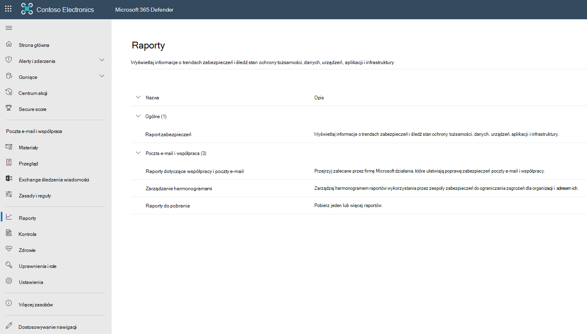

# Wyświetlanie raportów programu Defender Office 365 w portalu Microsoft 365 Defender-

[!INCLUDE [Microsoft 365 Defender rebranding](../includes/microsoft-defender-for-office.md)]

**Dotyczy**
- [Microsoft Defender dla Office 365 plan 1 i plan 2](defender-for-office-365.md)
- [Microsoft 365 Defender](../defender/microsoft-365-defender.md)

Program Microsoft Defender dla organizacji Office 365 (na przykład subskrypcje usługi Microsoft 365 E5 lub usługa Microsoft Defender dla usługi Office 365 Plan 1 lub Program Microsoft Defender dla dodatków Office 365 Plan 2) zawiera wiele różnych raportów dotyczących zabezpieczeń. Jeśli masz odpowiednie [uprawnienia](#what-permissions-are-needed-to-view-the-defender-for-office-365-reports), możesz wyświetlać i pobierać te raporty w portalu Microsoft 365 Defender sieci.

## Wyświetlanie oraz pobieranie raportów

### Wyświetlanie raportów

1. W portalu Microsoft 365 Defender pod adresem <https://security.microsoft.com>, przejdź **do tematu** Raporty \> wiadomości e-mail i **& e-mail** \> **& raportów dotyczących współpracy**. Aby przejść bezpośrednio do strony **Raportów &-mail**, użyj .<https://security.microsoft.com/emailandcollabreport>

1. Wybierz raport, który chcesz wyświetlić, a następnie wybierz pozycję **Wyświetl szczegóły**.  

### Pobieranie raportów

1. W portalu Microsoft 365 Defender w witrynie <https://security.microsoft.com>, przejdź do strony **RaportyMail** >  **& do** \> **pobrania**. Aby przejść bezpośrednio do strony **Raporty do pobrania** , użyj przycisku <https://security.microsoft.com/ReportsForDownload?viewid=custom>.

> [!NOTE]
>
> Raporty zabezpieczeń poczty e-mail, które nie wymagają usługi Defender Office 365 opisano w tece Wyświetlanie raportów dotyczących zabezpieczeń poczty [e-mail w Microsoft 365 Defender portalu](view-email-security-reports.md).
>
> Raporty związane z przepływem poczty e-mail znajdują się teraz w centrum Exchange administracyjnego (EAC). Aby uzyskać więcej informacji na temat tych raportów, zobacz [Raporty przepływu poczty e-mail w nowej Exchange administracyjnego](/exchange/monitoring/mail-flow-reports/mail-flow-reports).

## Sejf typów plików załączników

> [!NOTE]
> Ten raport został przestarzały. Te same informacje są dostępne w raporcie [o stanie ochrony przed zagrożeniami](#threat-protection-status-report).

## Sejf raportu rozsyłania wiadomości załączników

> [!NOTE]
> Ten raport został przestarzały. Te same informacje są dostępne w raporcie [o stanie ochrony przed zagrożeniami](#threat-protection-status-report).

## Raport opóźnień poczty

Raport **Opóźnienie poczty** zawiera zagregowany widok opóźnień dostarczenia i detonacji poczty, które wystąpiły w Twojej organizacji. Na czas dostarczania poczty w usłudze wpływa kilka czynników, a bezwzględny czas dostawy (w sekundach) często nie jest dobrym wskaźnikiem sukcesu lub problemu. Powolne dostarczanie jednego dnia może być uznawane za średni czas dostawy w innym dniu lub na odwrót. W ten sposób próbuje się zakwalifikować dostarczenie wiadomości na podstawie danych statystycznych dotyczących obserwowanych czasów dostarczenia innych wiadomości.

Opóźnienia po stronie klienta i sieci nie są uwzględniane.

Aby wyświetlić raport, otwórz portal Microsoft 365 Defender <https://security.microsoft.com>pod adresem ,  \> przejdź do strony Raporty wiadomości e-mail **&-mail** \> i raporty & **współpracy**. Aby przejść bezpośrednio do strony **Raportów &-mail**, użyj .<https://security.microsoft.com/emailandcollabreport>

Na stronie **Raporty &-mail znajdź** pozycję **Raport** opóźnień poczty, a następnie kliknij **pozycję Wyświetl szczegóły**. Aby przejść bezpośrednio do raportu, użyj funkcji <https://security.microsoft.com/mailLatencyReport>.

Na stronie **Raport o opóźnieniach** poczty na stronie Raport opóźnień poczty dostępne są **następujące karty:**

- **50-ty percentyl**: środkowy czas dostarczania wiadomości. Tę wartość można rozważyć jako średni czas dostawy. Ta karta jest domyślnie zaznaczona.
- **90-ty percentyl**: Oznacza duże opóźnienie w dostarczaniu wiadomości. Tylko 10% wiadomości trwało dłużej niż ta wartość, aby dostarczyć.
- **99-ty percentyl**: oznacza największe opóźnienie w dostarczaniu wiadomości.

Niezależnie od wybranej karty na wykresie są wyświetlane wiadomości podzielone na następujące kategorie:

- **Ogólne**
- **Detonacja**

Po umieszczeniu wskaźnika myszy na kategorii na wykresie możesz zobaczyć zestawienie opóźnień w poszczególnych kategoriach.

Jeśli klikniesz **pozycję Filtruj**, możesz filtrować zarówno wykres, jak i tabelę szczegółów według następujących wartości:

- **Data (UTC)**: **data rozpoczęcia** i **data zakończenia**
- **Widok wiadomości**: Jedna z następujących wartości:
  - **Wszystkie wiadomości**
  - **Detonated messages**: One of the following values:
    - **Detonacja w tekście**: uwzględnia wiadomości, które są w pełni przetestowane przed dostarczeniem.
    - **Asynchroniczne detonowanie**

Po zakończeniu konfigurowania filtrów kliknij pozycję **Zastosuj,** **Anuluj** lub **Wyczyść filtry**.

W tabeli szczegółów poniżej wykresu dostępne są następujące informacje:

- **Data (UTC)**
- **Opóźnienie**
- **Liczba wiadomości**
- **50.percentyl**
- **90-ty percentyl**
- **99. percentyl**

Na stronie raportu głównego ikona  **[Przycisk](view-email-security-reports.md#export-report)** Eksportuj jest dostępny.

## Raport o stanie ochrony przed zagrożeniami

Raport **o stanie ochrony** przed zagrożeniami to jeden widok, który zawiera informacje o złośliwej zawartości oraz złośliwych wiadomościach [e-mail](exchange-online-protection-overview.md) wykrytych i blokowanych przez programy Exchange Online Protection (EOP) i Microsoft Defender for Office 365. Aby uzyskać więcej informacji, zobacz [Raport o stanie ochrony przed zagrożeniami](view-email-security-reports.md#threat-protection-status-report).

## Raport Najgorętsi nadawcy i adresaci

W **raporcie Najgoręci** nadawcy i adresaci są wyświetleń najgorętsi adresaci usługi EOP i usługi Defender Office 365 funkcji ochrony. Aby uzyskać więcej informacji, zobacz [Raport Najgorętsi nadawcy i adresaci](view-email-security-reports.md#top-senders-and-recipients-report).

## Raport ochrony adresu URL

Raport **o ochronie adresu URL** zawiera widoki podsumowania i trendu dotyczące wykrytych zagrożeń oraz akcji podjętych po kliknięciu adresu URL w Sejf [linków](safe-links.md). W tym raporcie nie będą klikane dane użytkowników, do których zastosowano zasady połączeń Sejf ma zaznaczoną opcję **Nie** śledź kliknięć użytkowników.

Aby wyświetlić raport, otwórz portal [Microsoft 365 Defender,](https://security.microsoft.com) \> przejdź do strony Raporty wiadomości e-mail i & **e-mail** \> & **raportów współpracy**. Na stronie **Raporty o & wiadomości e-mail** znajdź stronę **ochrony adresu URL,** a następnie kliknij pozycję **Wyświetl szczegóły**. Aby przejść bezpośrednio do raportu, otwórz program <https://security.microsoft.com/reports/URLProtectionActionReport>.

Dostępne widoki na stronie Raport ochrony **adresu URL** opisano w poniższych sekcjach.

> [!NOTE]
> Jest to raport *trendu ochrony*, który oznacza, że dane reprezentują trendy w większym zestawie danych. W efekcie dane na wykresach nie są tutaj dostępne w czasie rzeczywistym, ale dane w tabeli szczegółów są, więc możesz zauważyć niewielkie rozbieżności między nimi. Wykresy są odświeżane co cztery godziny i zawierają dane z ostatnich 90 dni.

### Akcja ochrony przed kliknięciem w adresie URL umożliwia wyświetlenie danych według adresu URL

Widok **akcji Wyświetl dane według adresu URL ochrony** kliknięciem przedstawia liczbę kliknięć adresu URL (kliknięcia) przez użytkowników w organizacji oraz wyniki kliknięcia:

- **Dozwolone**: Klika dozwolone.
- **Dozwolone przez administratora dzierżawy**: Kliknięcia dozwolone w zasadach Sejf linków.
- **Zablokowane**: Kliknij pozycję zablokowane.
- **Zablokowane przez administratora dzierżawy**: Kliknięcia zablokowane w zasadach połączeń Sejf dzierżawy.
- **Zablokowane i klikowane**: Zablokowane kliknięcia, przez które użytkownicy klikną w celu wyświetlenia zablokowanego adresu URL.
- **Zablokowane przez administratora dzierżawy i klikone** przez: Administrator zablokował link, ale użytkownik kliknął.
- **Kliknął przez podczas skanowania**: Klika miejsce, w którym użytkownicy klikną stronę oczekującego skanowania, aby przejść do adresu URL.
- **Skanowanie oczekujące**: Klika adresy URL, które oczekują na werdykt skanowania.

Kliknięcie wskazuje, że użytkownik kliknął przez stronę blokady złośliwą witrynę sieci Web (administratorzy mogą wyłączyć kliknięcie w zasadach Sejf linków).

Jeśli klikniesz **pozycję** Filtry, możesz zmodyfikować raport i tabelę szczegółów, wybierając co najmniej jedną z następujących wartości w wyświetlonym wysuwanych informacjach:

- **Data (UTC)**: **data rozpoczęcia** i **data zakończenia**
- **Akcja**:
  - **Dozwolone**
  - **Zablokowane**
  - **Dozwolone przez administratora dzierżawy**
  - **Zablokowane i klikone przez**
  - **Zablokowane przez administratora dzierżawy i kliknął**
  - **Kliknął przez podczas skanowania**
  - **Oczekujące skanowanie**
- **Domeny**: domeny adresu URL wymienione w wynikach raportu.
- **Adresaci**

Po zakończeniu konfigurowania filtrów kliknij pozycję **Zastosuj,** **Anuluj** lub **Wyczyść filtry**.

Tabela szczegółów poniżej wykresu zawiera następujący widok niemal w czasie rzeczywistym wszystkich kliknięć, które miały miejsce w organizacji w ciągu ostatnich 7 dni:

- **Godzina kliknięcia**
- **Użytkownik**
- **ADRES URL**
- **Akcja**
- **Aplikacja**

Na stronie raportu głównego ikona Utwórz  **[Utwórz harmonogram](view-email-security-reports.md#schedule-report)**, ikona  **[Zażądaj raportu](view-email-security-reports.md#request-report)** i ikony  **[Dostępne](view-email-security-reports.md#export-report)** są przyciski eksportu.

### Wyświetlanie danych według adresu URL przez kliknięcie według aplikacji

Widok **Wyświetl dane według adresu URL kliknięcia według aplikacji** pokazuje liczbę kliknięć adresu URL według aplikacji, które obsługują Sejf internetowych:

- **Klient poczty e-mail**
- **Office dokumentu**
- **Teams**

Jeśli klikniesz **pozycję** Filtry, możesz zmodyfikować raport i tabelę szczegółów, wybierając co najmniej jedną z następujących wartości w wyświetlonym wysuwanych informacjach:

- **Data (UTC)**: **data rozpoczęcia** i **data zakończenia**
- **Wykrywanie**: Dostępne aplikacje z wykresu.
- **Domeny**: domeny adresu URL wymienione w wynikach raportu.
- **Adresaci**

Po zakończeniu konfigurowania filtrów kliknij pozycję **Zastosuj,** **Anuluj** lub **Wyczyść filtry**.

Tabela szczegółów poniżej wykresu zawiera następujący widok niemal w czasie rzeczywistym wszystkich kliknięć, które miały miejsce w organizacji w ciągu ostatnich 7 dni:

- **Godzina kliknięcia**
- **Użytkownik**
- **ADRES URL**
- **Akcja**
- **Aplikacja**

Na stronie raportu głównego ikona Utwórz  **[Utwórz harmonogram](view-email-security-reports.md#schedule-report)**, ikona  **[Zażądaj raportu](view-email-security-reports.md#request-report)** i ikony  **[Dostępne](view-email-security-reports.md#export-report)** są przyciski eksportu.

## Dodatkowe raporty do wyświetlenia

Oprócz raportów opisanych w tym artykule dostępnych jest kilka innych raportów, jak opisano w poniższej tabeli:

|Raport|Temat|
|---|---|
|**Eksplorator** (Microsoft Defender dla Office 365 Plan 2) lub **wykrywania w** czasie rzeczywistym (Microsoft Defender for Office 365 Plan 1)|[Eksplorator zagrożeń (i wykrywanie w czasie rzeczywistym)](threat-explorer.md)|
|Raporty zabezpieczeń poczty e-mail, które nie wymagają usługi Defender dla Office 365|[Wyświetlanie raportów zabezpieczeń poczty e-mail w portalu Microsoft 365 Defender-mail](view-email-security-reports.md)|
|Raporty przepływu poczty e-mail w centrum Exchange administracyjnego (EAC)|[Raporty przepływu poczty e-mail Exchange centrum administracyjnym](/exchange/monitoring/mail-flow-reports/mail-flow-reports)|

Polecenia cmdlet raportowania programu PowerShell:

|Raport|Temat|
|---|---|
|Najgorętsi nadawcy i adresaci|[Get-MailTrafficTopReport](/powershell/module/exchange/get-mailtraffictopreport) 
 [Get-MailTrafficSummaryReport](/powershell/module/exchange/get-mailtrafficsummaryreport)|
|Najważniejsze złośliwe oprogramowanie|[Get-MailTrafficSummaryReport](/powershell/module/exchange/get-mailtrafficsummaryreport)|
|Ruch poczty|[Get-MailTrafficATPReport](/powershell/module/exchange/get-mailtrafficatpreport) 
 [Get-MailDetailATPReport](/powershell/module/exchange/get-maildetailatpreport)|
|Bezpieczne linki|[Get-SafeLinksAggregateReport](/powershell/module/exchange/get-safelinksaggregatereport) 
 [Get-SafeLinksDetailReport](/powershell/module/exchange/get-safelinksdetailreport)|
|Naruszoni użytkownicy|[Get-CompromisedUserAggregateReport](/powershell/module/exchange/get-compromiseduseraggregatereport) 
 [Get-CompromisedUserDetailReport](/powershell/module/exchange/get-compromiseduserdetailreport)|
|Stan przepływu poczty|[Get-MailflowStatusReport](/powershell/module/exchange/get-mailflowstatusreport)|
|Fałszywi użytkownicy|[Get-SpoofMailReport](/powershell/module/exchange/get-spoofmailreport)|

## Jakie uprawnienia są potrzebne do wyświetlania programu Defender dla Office 365 raportów?

Aby móc wyświetlać raporty opisane w tym artykule i korzystać z nich, musisz być członkiem jednej z następujących grup ról w portalu Microsoft 365 Defender grupy:

- **Zarządzanie organizacją**
- **Administrator zabezpieczeń**
- **Czytnik zabezpieczeń**
- **Czytnik globalny**

Aby uzyskać więcej informacji, [zobacz Uprawnienia w portalu Microsoft 365 Defender użytkowników](permissions-microsoft-365-security-center.md).

**Uwaga**: Dodanie użytkowników do odpowiedniej roli Azure Active Directory w aplikacji centrum administracyjne platformy Microsoft 365 zapewnia użytkownikom wymagane uprawnienia w portalu Microsoft 365 Defender oraz uprawnienia do innych funkcji w  Microsoft 365. Aby uzyskać więcej informacji, zobacz [Informacje o rolach administratorów](../../admin/add-users/about-admin-roles.md).

## Co zrobić, jeśli w raportach nie są wyświetlane dane?

Jeśli nie widzisz danych w programie Defender dla Office 365, upewnij się, że zasady zostały poprawnie skonfigurowane. Aby [Sejf](set-up-safe-links-policies.md) program Defender Office 365 był w miejscu, Sejf musi  mieć zdefiniowane zasady linków oraz zasady załączników. Zobacz też [Ochrona przed spamem i złośliwym oprogramowaniem](anti-spam-and-anti-malware-protection.md).

## Tematy pokrewne

[Inteligentne raporty i szczegółowe informacje w portalu Microsoft 365 Defender danych](reports-and-insights-in-security-and-compliance.md)

[Wbudowane role w usłudze Azure AD](/azure/active-directory/roles/permissions-reference)
