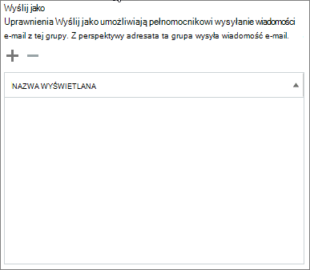
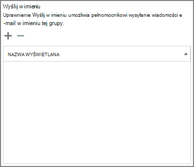

# Zezwalanie członkom na wysyłanie jako grupa lub w jej imieniu

Członek grupy grupy usługi Microsoft 365, który otrzymał uprawnienia Wyślij jako lub Wyślij  w imieniu,  może wysyłać wiadomości e-mail jako grupa lub w imieniu tej grupy. (Gościom w grupie nie można przyznać tych uprawnień).

W tym artykule wyjaśniono, jak administrator globalny Exchange może ustawić te uprawnienia.
  
Jeśli na przykład Megan Bowen należy do grupy **Szkolenie Microsoft 365 i** ma uprawnienia Wyślij jako do grupy,  jeśli wyśle wiadomość e-mail jako grupa, będzie ona wyglądać tak, jakby grupa Szkolenie wysłała wiadomość e-mail. 
  
Uprawnienie **Wyślij w imieniu** umożliwia użytkownikowi wysyłanie wiadomości e-mail w imieniu Microsoft 365 grupy. Jeśli na przykład Alex Wilber należy do grupy **Marketing** Microsoft 365 i ma uprawnienia Wyślij w imieniu oraz wysyła wiadomość e-mail jako grupa, wygląda na to, że została wysłana przez **Alexa Wilbera** w imieniu marketingowym.

> [!IMPORTANT]
> Dla danego użytkownika **możesz** skonfigurować opcje  Wyślij jako lub Wyślij w imieniu danego użytkownika, ale nie oba te opcje. Jeśli skonfigurujesz oba te ustawienia, domyślnie będzie to **opcja Wyślij jako**.

> [!NOTE]
> **W przypadku** usługi **Wyślij jako i Wyślij w imieniu** nie Outlook dla komputerów Mac w hybrydowych Exchange hybrydowych.
    
## Zezwalanie członkom na wysyłanie wiadomości e-mail jako grupa

W tej sekcji wyjaśniono, jak umożliwić użytkownikom wysyłanie wiadomości e-mail jako grupy w centrum administracyjnym usługi Exchange w programie Exchange Online.
  
1. W centrum Exchange przejdź do pozycji **Grupy adresatów**\>.
    
2. Wybierz **ikonę grupy EditEdit**   w grupie, jako której użytkownicy mają być wysyłani. 
    
3. Wybierz **delegowanie grupy**.
    
4. W **sekcji Wyślij jako** wybierz znak **+** , aby dodać użytkowników, których chcesz wysłać jako grupę. 
    
    
  
5. Wpisz tekst, aby wyszukać użytkownika lub wybrać użytkownika z listy. Wybierz **przycisk OK** i **pozycję Zapisz**.
    
    
  
## Zezwalanie członkom na wysyłanie wiadomości e-mail w imieniu grupy

W tej sekcji wyjaśniono, jak zezwolić użytkownikom na wysyłanie wiadomości e-mail w imieniu grupy w centrum administracyjnym programu <a href="https://go.microsoft.com/fwlink/p/?linkid=2059104" target="_blank">Exchange w</a> programie Exchange Online.
  
1. W centrum Exchange przejdź do pozycji **Grupy adresatów**\>.
    
2. Wybierz **ikonę**  w grupie, jako której użytkownicy mają być wysyłani. 
    
3. Wybierz **delegowanie grupy**.
    
4. W sekcji Wyślij w imieniu wybierz znak **+** , aby dodać użytkowników, których chcesz wysłać jako grupę. 
    
    
  
5. Wpisz tekst, aby wyszukać użytkownika lub wybrać użytkownika z listy. Wybierz **przycisk OK** i **pozycję Zapisz**.
    
    

## Artykuły pokrewne

[Wysyłanie wiadomości e-mail w imieniu Microsoft 365 grupy](https://support.microsoft.com/office/0f4964af-aec6-484b-a65c-0434df8cdb6b)

[Zalecenia dotyczące planowania zarządzania współpracą](collaboration-governance-overview.md#collaboration-governance-planning-recommendations)

[Tworzenie planu zarządzania współpracą](collaboration-governance-first.md)

[Dowiedz się więcej o Microsoft 365 grup](https://support.microsoft.com/office/b565caa1-5c40-40ef-9915-60fdb2d97fa2)

[Add-RecipientPermission](/powershell/module/exchange/add-recipientpermission)

[Set-UnifiedGroup](/powershell/module/exchange/set-unifiedgroup)
