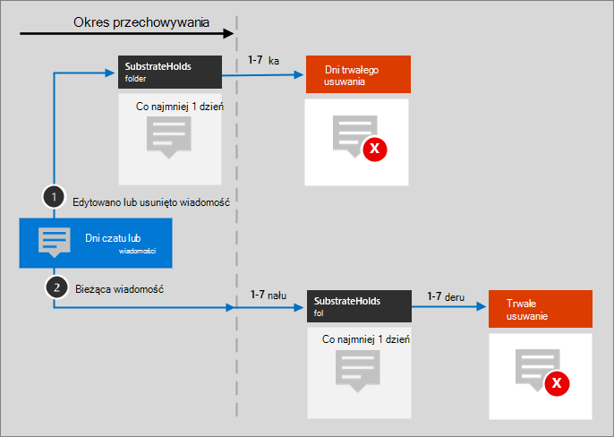

# Microsoft 365 szablonów i ikon architektury

Pomoc naszym partnerom i klientom w projektowaniu i projektowaniu nowych rozwiązań jest ważna. Diagramy architektury, takie jak te zawarte w naszych wskazówkach, mogą ułatwić podejmowanie decyzji dotyczących projektu i relacji między składnikami w środowisku. Używamy zestawu symboli i ikon wraz z szablonami programu Visio do tworzenia diagramów architektury, które udostępniamy, i udostępniamy te narzędzia w tym miejscu, aby ułatwić tworzenie niestandardowego diagramu architektury dla następnego rozwiązania.

Te ikony, symbole i szablony są widoczne w plikach do pobrania dostępnych na następujących stronach:

- [Ilustracje zwiększające produktywność](productivity-illustrations.md)
- [Modele architektury chmury firmy Microsoft](cloud-architecture-models.md)

## Warunki i pobieranie

Firma Microsoft zezwala na używanie tych ikon w diagramach architektonicznych, materiałach szkoleniowych lub w dokumentacji. Ikony można kopiować, rozpowszechniać i wyświetlać tylko w dozwolonym celu, chyba że firma Microsoft udzieliła jawnych uprawnień. Microsoft reserves all other rights.

 > [!div class="button"]
 > [Pobieranie ikon SVG i PNG](https://go.microsoft.com/fwlink/?linkid=869455)

 > [!div class="button"]
 > [Pobieranie Visio szablonów i wzorników](https://go.microsoft.com/fwlink/?linkid=2056186)

## Przykładowe diagramy architektury

Za pomocą tych ikon i szablonów można tworzyć diagramy, takie jak w poniższych przykładach:

1. Przykładowy diagram architektury wyszukiwania dla SharePoint:

    

2. Teams architektury cyklu życia przechowywania:

    

## Więcej zestawów ikon od firmy Microsoft

- [Ikony architektury platformy Azure](/azure/architecture/icons/)
- [Ikony architektury usługi Dynamics 365](/dynamics365/get-started/icons)
- [Ikony platformy Microsoft Power Platform](/power-platform/guidance/icons)