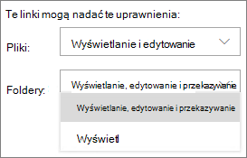
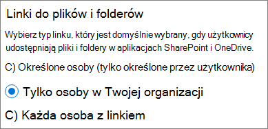
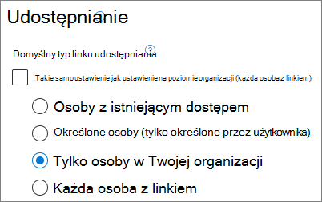
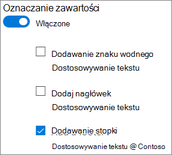

# <a name="best-practices-for-sharing-files-and-folders-with-unauthenticated-users"></a>Najlepsze rozwiązania dotyczące udostępniania plików i folderów nieuwierzytelnionym użytkownikom

Udostępnianie nieuwierzytelnione (linki *wszyscy* ) może być wygodne i przydatne w różnych scenariuszach. *Najprostszym* sposobem udostępniania linków jest udostępnienie wszystkich linków: użytkownicy mogą otworzyć link bez uwierzytelniania i mogą je przekazać innym osobom.

Zazwyczaj nie cała zawartość w organizacji jest odpowiednia do udostępniania nieuwierzytelnionego. W tym artykule omówiono dostępne opcje ułatwiające utworzenie środowiska, w którym użytkownicy mogą korzystać z nieuwierzytelnionego udostępniania plików i folderów, ale w którym istnieją zabezpieczenia ułatwiające ochronę zawartości organizacji.

> [!NOTE]
> Aby udostępnianie nieuwierzytelnione działało, należy włączyć je dla swojej organizacji oraz dla poszczególnych witryn lub zespołów, których będziesz używać. Zobacz [Współpraca z osobami spoza organizacji](collaborate-with-people-outside-your-organization.md) , aby zapoznać się ze scenariuszem, który chcesz włączyć.

## <a name="set-an-expiration-date-for-anyone-links"></a>Ustawianie daty wygaśnięcia dla linków Anyone

Pliki są często przechowywane w witrynach, grupach i zespołach przez długi czas. Czasami istnieją zasady przechowywania danych, które wymagają przechowywania plików przez lata. Jeśli takie pliki są udostępniane nieuwierzytelnionym osobom, może to prowadzić do nieoczekiwanego dostępu i zmian w plikach w przyszłości. Aby wyeliminować tę możliwość, można skonfigurować czas wygaśnięcia dla linków *Anyone* .

Po wygaśnięciu linku *Każdy* nie można już używać go do uzyskiwania dostępu do zawartości.

Aby ustawić datę wygaśnięcia linków Każdy w całej organizacji

1. Otwórz centrum administracyjne SharePoint, rozwiń węzeł **Zasady**, a następnie wybierz pozycję <a href="https://go.microsoft.com/fwlink/?linkid=2185222" target="_blank">**Udostępnianie**</a>.
1. W obszarze **Wybierz opcje wygaśnięcia i uprawnień dla linków Każdy** wybierz pole wyboru **Te linki muszą wygasnąć w ciągu tej wielu dni** .</br>
   
1. Wpisz liczbę dni w polu, a następnie kliknij przycisk **Zapisz**.

Jeśli zmienisz czas wygaśnięcia, istniejące linki zachowają bieżący czas wygaśnięcia, jeśli nowe ustawienie jest dłuższe, lub zostaną zaktualizowane do nowego ustawienia, jeśli nowe ustawienie jest krótsze.

Aby ustawić datę wygaśnięcia linków Dowolna osoba w określonej witrynie

1. Otwórz centrum administracyjne SharePoint, rozwiń węzeł **Witryny**, a następnie wybierz pozycję <a href="https://go.microsoft.com/fwlink/?linkid=2185220" target="_blank">**Aktywne witryny**</a>.
1. Wybierz witrynę, którą chcesz zmienić, a następnie wybierz pozycję **Udostępnianie**.
1. W obszarze **Ustawienia zaawansowane dla linków Każdy** w obszarze **Wygasanie linków Każdy** wyczyść pole wyboru **To samo co ustawienie na poziomie organizacji** .</br>
   
1. Wybierz opcję **Te linki muszą wygasnąć w ciągu tej liczby dni** i w polu wpisz liczbę dni.
1. Wybierz **Zapisz**.

Należy pamiętać, że po wygaśnięciu linku *Każdy* plik lub folder można ponownie udostępnić nowemu linkowi *Każdy* .

Możesz ustawić wygaśnięcie linku *Każdy* dla określonej witryny przy użyciu [polecenia Set-SPOSite](/powershell/module/sharepoint-online/set-sposite). 

```powershell
Set-SPOSite -Identity https://contoso.sharepoint.com/sites/marketing -OverrideTenantAnonymousLinkExpirationPolicy $true -AnonymousLinkExpirationInDays 15
```

## <a name="set-link-permissions"></a>Ustawianie uprawnień linku

Domyślnie łącza *dowolnej osoby* dla pliku umożliwiają użytkownikom edytowanie pliku, a linki *Każdy* dla folderu umożliwiają użytkownikom edytowanie i wyświetlanie plików oraz przekazywanie nowych plików do folderu. Możesz zmienić te uprawnienia dla plików i folderów niezależnie w celu wyświetlania tylko.

Jeśli chcesz zezwolić na udostępnianie nieuwierzytelnione, ale obawiasz się nieuwierzytelnionych osób modyfikujących zawartość organizacji, rozważ ustawienie uprawnień do plików i folderów na **Widok**.

Aby ustawić uprawnienia dla łączy Dowolna osoba w organizacji

1. Otwórz centrum administracyjne SharePoint i wybierz pozycję <a href="https://go.microsoft.com/fwlink/?linkid=2185222" target="_blank">**Udostępnianie**</a>.
1. W obszarze **Ustawienia zaawansowane dla linków "Każdy"** wybierz uprawnienia do plików i folderów, których chcesz użyć.</br>
   

W przypadku linków *Dowolna* osoba ustawiona na **Widok** użytkownicy nadal mogą udostępniać pliki i foldery gościom i przyznawać im uprawnienia do edycji za pomocą linków *Określonych osób* . Te linki wymagają uwierzytelniania osób spoza organizacji jako gości oraz śledzenia i inspekcji aktywności gościa w plikach i folderach udostępnionych za pomocą tych linków.

## <a name="set-default-link-type-to-only-work-for-people-in-your-organization"></a>Ustaw domyślny typ linku tak, aby działał tylko dla osób w organizacji

Po włączeniu *udostępniania przez dowolną* osobę w organizacji domyślny link do udostępniania jest zwykle ustawiony na **Dowolna** osoba. Chociaż może to być wygodne dla użytkowników, może zwiększyć ryzyko niezamierzonego nieuwierzytelnionego udostępniania. Jeśli użytkownik zapomni zmienić typ łącza podczas udostępniania poufnego dokumentu, może przypadkowo utworzyć link do udostępniania, który nie wymaga uwierzytelniania.

Możesz zmniejszyć to ryzyko, zmieniając domyślne ustawienie linku na link, który działa tylko dla osób w organizacji. Użytkownicy, którzy chcą udostępniać nieuwierzytelnione osoby, musieliby wybrać tę opcję.

Aby ustawić domyślny link do udostępniania plików i folderów dla organizacji
1. Otwórz centrum administracyjne SharePoint i wybierz pozycję <a href="https://go.microsoft.com/fwlink/?linkid=2185222" target="_blank">**Udostępnianie**</a>.
1. W obszarze **Łącza plików i folderów** wybierz pozycję **Tylko osoby w organizacji**.

   

1. Wybierz pozycję **Zapisz**

Aby ustawić domyślny link do udostępniania plików i folderów dla określonej witryny

1. Otwórz centrum administracyjne SharePoint, rozwiń węzeł **Witryny**, a następnie wybierz pozycję <a href="https://go.microsoft.com/fwlink/?linkid=2185220" target="_blank">**Aktywne witryny**</a>.
1. Wybierz witrynę, którą chcesz zmienić, a następnie wybierz pozycję **Udostępnianie**.
1. W obszarze **Domyślny typ łącza udostępniania** wyczyść pole wyboru **To samo co ustawienie na poziomie organizacji** .

   

1. Wybierz opcję **Tylko osoby w organizacji** , a następnie wybierz pozycję **Zapisz**.

## <a name="prevent-unauthenticated-sharing-of-sensitive-content"></a>Zapobieganie nieuwierzytelnionemu udostępnianiu poufnej zawartości

Aby zapobiec nieuwierzytelnionemu udostępnianiu poufnej zawartości, można użyć funkcji [Microsoft Purview Data Loss Prevention (DLP](../compliance/dlp-learn-about-dlp.md) ). Zapobieganie utracie danych może podejmować działania na podstawie etykiety poufności pliku, etykiety przechowywania lub informacji poufnych w samym pliku.

Aby utworzyć regułę DLP
1. W centrum administracyjnym usługi Microsoft Purview przejdź do [strony Zapobieganie utracie danych](https://compliance.microsoft.com/datalossprevention).
2. Kliknij **pozycję Utwórz zasady**.
3. Wybierz pozycję **Niestandardowe** i kliknij przycisk **Dalej**.
4. Wpisz nazwę zasad i kliknij przycisk **Dalej**.
5. Na stronie **Lokalizacje do zastosowania zasad** wyłącz wszystkie ustawienia z wyjątkiem **witryn SharePoint** i **kont OneDrive**, a następnie kliknij przycisk **Dalej**.
6. Na stronie **Definiowanie ustawień zasad** kliknij przycisk **Dalej**.
7. Na stronie **Dostosowywanie zaawansowanych reguł DLP** kliknij pozycję **Utwórz regułę** i wpisz nazwę reguły.
8. W obszarze **Warunki** kliknij pozycję **Dodaj warunek** i wybierz pozycję **Zawartość zawiera**.
9. Kliknij pozycję **Dodaj** i wybierz typ informacji, dla których chcesz zapobiec nieuwierzytelnionemu udostępnianiu.

   

10. W obszarze **Akcje** kliknij **pozycję Dodaj akcję** i wybierz pozycję **Ogranicz dostęp lub zaszyfruj zawartość w Microsoft 365 lokalizacjach**.
11. Zaznacz pole wyboru **Ogranicz dostęp lub zaszyfruj zawartość w Microsoft 365 lokalizacjach**, a następnie wybierz opcję **Tylko osoby, które otrzymały dostęp do zawartości za pośrednictwem opcji "Każda osoba z linkiem**".

      

12. Kliknij **przycisk Zapisz,** a następnie kliknij przycisk **Dalej**.
13. Wybierz opcje testu i kliknij przycisk **Dalej**.
14. Kliknij pozycję **Prześlij**, a następnie kliknij pozycję **Gotowe**.

## <a name="protect-against-malicious-files"></a>Ochrona przed złośliwymi plikami

Gdy zezwolisz anonimowym użytkownikom na przekazywanie plików, istnieje zwiększone ryzyko przekazania złośliwego pliku przez kogoś. W Microsoft 365 możesz użyć funkcji *załączników Sejf* w Ochrona usługi Office 365 w usłudze Defender, aby automatycznie skanować przekazane pliki i pliki kwarantanny, które okazały się niebezpieczne.

Aby włączyć bezpieczne załączniki
1. Otwórz [stronę Załączniki Sejf atp](https://protection.office.com/safeattachmentv2) w centrum administracyjnym Zabezpieczenia i zgodność.
2. Kliknij pozycję **Ustawienia globalne**.
3. Włącz usługę ATP dla SharePoint, OneDrive i Microsoft Teams.

   

4. Opcjonalnie włącz również Sejf Dokumenty, a następnie kliknij przycisk **Zapisz**

Aby uzyskać dodatkowe wskazówki[, zobacz ATP for SharePoint, OneDrive, and Microsoft Teams](../security/office-365-security/mdo-for-spo-odb-and-teams.md) and [Turn on ATP for SharePoint, OneDrive, and Microsoft Teams (Włączanie usługi ATP dla SharePoint, OneDrive i Microsoft Teams](../security/office-365-security/turn-on-mdo-for-spo-odb-and-teams.md)).

## <a name="add-copyright-information-to-your-files"></a>Dodawanie informacji o prawach autorskich do plików

Jeśli używasz etykiet poufności w centrum administracyjnym usługi Microsoft Purview, możesz skonfigurować etykiety tak, aby automatycznie dodawać znak wodny lub nagłówek lub stopkę do dokumentów Office organizacji. W ten sposób możesz upewnić się, że udostępnione pliki zawierają prawa autorskie lub inne informacje o własności.

Aby dodać stopkę do pliku z etykietą

1. Otwórz [centrum administracyjne usługi Microsoft Purview](https://compliance.microsoft.com).
2. W obszarze nawigacji po lewej stronie w obszarze **Rozwiązania** kliknij pozycję **Ochrona informacji**.
3. Kliknij etykietę, którą chcesz dodać stopkę, a następnie kliknij pozycję **Edytuj etykietę**.
4. Kliknij przycisk **Dalej** , aby uzyskać dostęp do karty **Oznaczanie zawartości** , a **następnie włącz** znakowanie zawartości.
5. Zaznacz pole wyboru typu tekstu, który chcesz dodać, a następnie kliknij pozycję **Dostosuj tekst**.
6. Wpisz tekst, który chcesz dodać do dokumentów, wybierz odpowiednie opcje tekstowe, a następnie kliknij przycisk **Zapisz**.</br>
   
7. Kliknij przycisk **Dalej** , aby dotrzeć do końca kreatora, a następnie kliknij przycisk **Zapisz etykietę**.

Po włączeniu oznaczenia zawartości dla etykiety określony tekst zostanie dodany do Office dokumentów, gdy użytkownik zastosuje tę etykietę.

## <a name="see-also"></a>Zobacz też

[Omówienie etykiet poufności](/Office365/SecurityCompliance/sensitivity-labels)

[Ograniczanie przypadkowego narażenia na pliki podczas udostępniania gościom](share-limit-accidental-exposure.md)

[Tworzenie bezpiecznego środowiska udostępniania gościa](create-secure-guest-sharing-environment.md)
