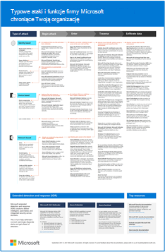

# Ilustracje przedstawiające architektów IT w chmurze firmy Microsoft

Plakaty dotyczące architektury chmury zawierają informacje o usługach firmy Microsoft w chmurze, w tym usługach Microsoft 365, Azure Active Directory (Azure AD), Microsoft Intune i Microsoft Dynamics 365 oraz hybrydowych rozwiązaniach lokalnych i chmurowych. 

Z tych zasobów mogą korzystać indyjenci it i architektzy, aby określić idealne rozwiązania dla ich obciążeń i podjąć decyzje dotyczące podstawowych składników infrastruktury, takich jak sieci, tożsamość i zabezpieczenia.

### Microsoft 365 planu wdrażania Zerowe zaufanie

Na poniższej ilustracji przedstawiono plan wdrażania w zakresie budowania zabezpieczeń zerowego zaufania za pomocą Microsoft 365. Zero zaufania to nowy model zabezpieczeń, który zakłada naruszenie i sprawdza każde żądanie, tak jakby pochodziło z sieci niepod kontroli. Niezależnie od tego, skąd pochodzi żądanie lub do jakiego zasobu uzyskuje dostęp, w modelu zerowego zaufania uczy nas, jak "nigdy nie ufać, zawsze weryfikować".

| Element | Opis |
|:-----|:-----|
|   [PDF](https://download.microsoft.com/download/f/d/b/fdb6ab0c-34bb-4cb8-84e6-5de8f13298da/m365-zero-trust-deployment-plan.pdf) \| [Visio](https://download.microsoft.com/download/f/d/b/fdb6ab0c-34bb-4cb8-84e6-5de8f13298da/m365-zero-trust-deployment-plan.vsdx)   Zaktualizowano marzec 2022 r. | Skorzystaj z poniższej ilustracji wraz z tym artykułem: [Microsoft 365 plan wdrażania zerowego zaufania](../security/Microsoft-365-zero-trust.md)   **Pokrewne przewodniki po rozwiązaniach**   <ul><li>[Wdrażanie infrastruktury tożsamości na Microsoft 365](/microsoft-365/enterprise/deploy-identity-solution-overview)</li><li>[Zalecane konfiguracje tożsamości i dostępu do urządzeń](../security/office-365-security/microsoft-365-policies-configurations.md)</li><li>[Zarządzanie urządzeniami za pomocą usługi Intune](manage-devices-with-intune-overview.md)</li><li>[Ocenianie i pilotaż Microsoft 365 Defender](../security/defender/eval-overview.md)</li><li>[Wdrażanie Microsoft Information Protection rozwiązania](../compliance/information-protection-solution.md)</li><li>[Wdrażanie przepisów dotyczących ochrony danych osobowych za pomocą aplikacji Microsoft 365](information-protection-deploy.md)</li></ul>

### Typowe ataki i możliwości firmy Microsoft chroniące Twoją organizację

Dowiedz się więcej o najczęstszych atakach cyberprzestępczych i o tym, jak firma Microsoft może pomóc Twojej organizacji na każdym etapie ataków. 

| Element | Opis |
|:-----|:-----|
|   [PDF](https://download.microsoft.com/download/F/A/C/FACFC1E9-FA35-4DF1-943C-8D4237B4275B/MSFT_Cloud_architecture_security_commonattacks.pdf) \| [Visio](https://download.microsoft.com/download/F/A/C/FACFC1E9-FA35-4DF1-943C-8D4237B4275B/MSFT_Cloud_architecture_security_commonattacks.vsdx)   Zaktualizowano we wrześniu 2021 r. | Ten plakat przedstawia ścieżkę typowych ataków i opisuje, które funkcje pomagają zatrzymać atakujących na każdym etapie ataków.   **Pokrewne przewodniki po rozwiązaniach**   <ul><li>[Ocenianie i pilotaż Microsoft 365 Defender](../security/defender/eval-overview.md)</li><li>[Zalecane konfiguracje tożsamości i dostępu do urządzeń](../security/office-365-security/microsoft-365-policies-configurations.md)</li><li>[Wdrażanie przepisów dotyczących ochrony danych osobowych za pomocą aplikacji Microsoft 365](information-protection-deploy.md)</li><li>[Wdrażanie ochrony przed oprogramowaniem wymuszającym okup dla Microsoft 365 dzierżawy](ransomware-protection-microsoft-365.md)</li><li>[Rozwiązania dotyczące ryzyka wewnętrznego na platformie Microsoft 365](../compliance/insider-risk-solution-overview.md)</li></ul>

### Tożsamość chmury firmy Microsoft dla architektów IT

Co indyjscy indyjscy muszą wiedzieć o projektowaniu tożsamości dla organizacji korzystających z usług i platform w chmurze firmy Microsoft.
  
| Element | Opis |
|:-----|:-----|
|   [PDF](https://download.microsoft.com/download/3/6/a/36a7c1ba-fe48-414f-92c9-9c9ddba323cd/5594928a.pdf )    Zaktualizowano w listopadzie 2021 r. | Ten model zawiera:  <ul> <li> Wprowadzenie do tożsamości w chmurze firmy Microsoft </li><li> Możliwości usługi Azure AD IDaaS </li><li>Zasady zerowego zaufania w zakresie tożsamości i dostępu do urządzeń</li><li> Integrowanie lokalnych kont Usługi domenowe w usłudze Active Directory (AD DS) z usługą Azure AD </li><li> Umieszczanie składników katalogu w usłudze Azure IaaS </li><li> AD DS dla obciążeń w usłudze Azure IaaS </li></ul>    |

### Zabezpieczenia chmury firmy Microsoft dla architektów it

Co muszą wiedzieć indekscyjni indycyjni indekscyjni indekcyjni instycydowie o zabezpieczeniach w usługach i platformach w chmurze firmy Microsoft.
  
| Element | Opis |
|:-----|:-----|
|   [PDF](https://download.microsoft.com/download/6/D/F/6DFD7614-BBCF-4572-A871-E446B8CF5D79/MSFT_cloud_architecture_security.pdf)   Zaktualizowano w lutym 2022 r. | Ten model zawiera: <ul><li>Obowiązki firmy Microsoft w zakresie bezpieczeństwa klienta</li><li>Dostęp do tożsamość i urządzeń</li><li>Ochrona przed zagrożeniami</li><li>Ochrona informacji </li><li>Ochrona aplikacji w chmurze </li></ul> |
   

### Sieci w chmurze firmy Microsoft dla architektów it

Co indyjscy indyjscy muszą wiedzieć o sieci dla usług i platform chmurowych firmy Microsoft.
  
| Element | Opis |
|:-----|:-----|
|    [Wyświetlanie w formacie PDF](../downloads/MSFT_cloud_architecture_networking.pdf) \| [Pobierz jako plik PDF](https://github.com/MicrosoftDocs/microsoft-365-docs/raw/public/microsoft-365/downloads/MSFT_cloud_architecture_networking.pdf)\| [Pobierz jako Visio](https://github.com/MicrosoftDocs/microsoft-365-docs/raw/public/microsoft-365/downloads/MSFT_cloud_architecture_networking.vsdx)    Zaktualizowano sierpień 2020 r. | Ten model zawiera: <ul><li> Rozwijana sieć na potrzeby łączności z chmurą </li><li> Typowe elementy łączności z chmurą firmy Microsoft </li><li> Łączność w chmurze usługi ExpressRoute dla firmy Microsoft </li><li> Projektowanie sieci dla oprogramowania Microsoft SaaS, Azure PaaS i Azure IaaS </li></ul>    |

### Hybrydowa chmura firmy Microsoft dla architektów IT

Co muszą wiedzieć indycyjni indyjscy na temat hybrydowej chmury dla usługi firmy Microsoft i platform.
  
| Element | Opis |
|:-----|:-----|
|   [Wyświetlanie w formacie PDF](../downloads/MSFT_cloud_architecture_hybrid.pdf)\| [Pobierz jako plik PDF](https://github.com/MicrosoftDocs/microsoft-365-docs/raw/public/microsoft-365/downloads/MSFT_cloud_architecture_hybrid.pdf)\| [Pobierz jako Visio](https://github.com/MicrosoftDocs/microsoft-365-docs/raw/public/microsoft-365/downloads/MSFT_cloud_architecture_hybrid.vsdx)      Zaktualizowano sierpień 2020 r. | Ten model zawiera: <ul><li> Oferty firmy Microsoft w chmurze (SaaS, Azure PaaS i Azure IaaS) oraz ich typowe elementy </li><li> Hybrydowa architektura chmury dla ofert chmury firmy Microsoft </li><li> Hybrydowe scenariusze chmury dla oprogramowania Microsoft SaaS (Office 365), Azure PaaS i Azure IaaS </li></ul> |

### Metody architektury dla migracji z dzierżawy do dzierżawy firmy Microsoft w chmurze 
W tej serii tematów przedstawiono kilka metod architektury fuzji, pozyskiwania, rozwoju i innych scenariuszy, które mogą doprowadzić do przeprowadzenia migracji do nowej dzierżawy w chmurze. Te tematy zawierają wskazówki wyjścia dotyczące planowania zasobów przedsiębiorstwa. 

| Element | Opis |
|:-----|:-----|
|   [PDF](https://download.microsoft.com/download/b/a/1/ba19dfe7-96e2-4983-8783-4dcff9cebe7b/microsoft-365-tenant-to-tenant-migration.pdf)   Zaktualizowano w lutym 2021 r.    |Ten model zawiera: <ul><li>Mapowanie scenariuszy biznesowych na metody architektury</li><li>Zagadnienia projektowe</li><li>Przykład przepływu migracji pojedynczego zdarzenia</li><li>Przykład przepływu migracji etapowej</li><li>Przykład przenoszenia lub dzielenia przepływu dzierżawy</li></ul>|

## Zasoby pokrewne

Uzyskaj zasoby, aby tworzyć własne diagramy projektów architektury: ikony Microsoft 365 [i szablony architektury](architecture-icons-templates.md).

Przejdź do [Centrum architektury Azure](/azure/architecture/).
