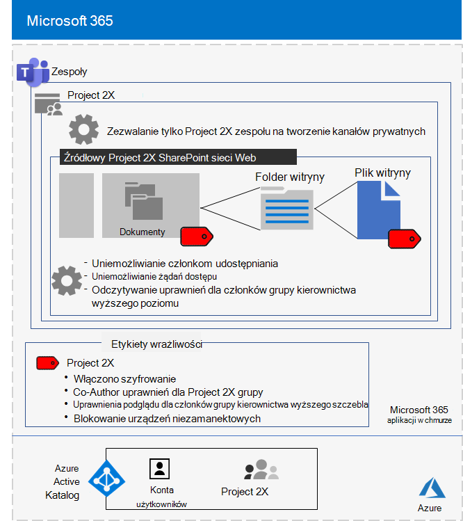

# Odizolowany zespół nad ściśle tajną projektem firmy Contoso Corporation

Po zakończeniu pracy kierownictwa dyrektor ds. klientów firmy Contoso zamówił opracowanie nowego pakietu produktów i usług, które mogłyby dwukrotnie podwoić zyski firmy Contoso w ciągu następnych pięciu lat. Ściśle tajny projekt opracowywania biznesu, inżynierii i rynku został Project **2X**, a kluczowi pracownicy w całej firmie zostali zwerybowani. 

Osie czasu badań i rozwoju były wąskie, co oznaczało, że współpraca musi być skuteczna i zapewniać bezpieczne spotkania, trwające konwersacje i przechowywanie plików.

Powstały w ten sposób produkty Project 2X to plany biznesowe, specyfikacje produktu i inżynierii oraz materiały marketingowe i harmonogramy w postaci plików programu Word, Excel i PowerPoint biznesowych. 

Ze względu na ich poufny charakter dostęp do tych plików był następujące:

- Ograniczone do Project 2X członków zespołu i kierownictwa wyższego szczebla.
- Zaszyfrowane i chronione przy użyciu uprawnień w celu umożliwienia dostępu tylko Project członkom zespołu 2X i kierownictwu wyższego szczebla, nawet jeśli pliki były rozpowszechniane poza ich zabezpieczonym folderami.

Pracownicy IT firmy Contoso [uchylili zespołowi](secure-teams-security-isolation.md) izolacji zabezpieczeń Project 2X i tych kroków.

## Krok 1. Utworzono zespół prywatny

Najpierw, aby chronić dostęp do źródłowej SharePoint zespołu, administratorzy IT firmy Contoso skonfigurowali zalecane zasady dostępu SharePoint [dostępu](../security/office-365-security/sharepoint-file-access-policies.md).

Następnie administrator IT firmy Contoso utworzył nowy prywatny zespół o nazwie Project 2X i dodał konta użytkowników usługi Project 2X jako członków. Ponadto skonfigurowali zespół tak, aby tylko Project 2X  zespołu mogą tworzyć kanały prywatne.

Aby uzyskać szczegółowe informacje o konfiguracji, [zobacz Tworzenie prywatnego zespołu](secure-teams-security-isolation.md#create-a-private-team).

## Krok 2. Utworzono etykietę wrażliwości dla zespołu Project 2X

Administratorzy firmy Contoso tworzyli nową etykietę wrażliwości o **Project 2X**, która:

- Włączono szyfrowanie.
- Dozwolone Co-Author dla grupy Project 2X Microsoft 365 2X.
- Dozwolone uprawnienia podglądu dla grupy kierownictwa wyższego szczebla.
- Zablokowany dostęp do urządzeń niezakierowanych.

Pliki w **sekcji Dokumenty** w źródłowym Project 2X SharePoint były chronione przez:

- Uprawnienia witryny, które zezwalają tylko na pełne uprawnienia członkom grupy Project 2X Microsoft 365 oraz uprawnienia odczytu do grupy kierownictwa wyższego szczebla.
- Etykieta Project 2X z szyfrowaniem i uprawnieniami, które są przenoszone lub kopiowane z witryny wraz z plikiem.

Aby uzyskać szczegółowe informacje o konfiguracji, [zobacz Tworzenie etykiety wrażliwości](secure-teams-security-isolation.md#create-a-sensitivity-label).

## Krok 3. Konfigurowanie źródłowej SharePoint sieci Web

Najpierw, aby chronić dostęp do źródłowej SharePoint zespołu, administratorzy IT firmy Contoso skonfigurowali zalecane zasady dostępu SharePoint [dostępu](../security/office-365-security/sharepoint-file-access-policies.md).

Następnie skonfigurowali dodatkowe ustawienia uprawnień dla witryny:

- Aby uniemożliwić Project dostępu do witryny przez członków grupy 2X. Aby uzyskać szczegółowe informacje o [konfiguracji, SharePoint ustawienia zespołu z izolacji zabezpieczeń](secure-teams-security-isolation.md#sharepoint-settings).
- Uprawnienia do odczytu dla grupy kierownictwa wyższego szczebla.

Następnie skonfigurowali dodatkowe ustawienia uprawnień witryny, aby uniemożliwić Project dostępu do witryny przez członków grupy 2X. 

Po utworzeniu kanałów Project 2X właściciel grupy wyłączył udostępnianie gości i ustawił dla domyślnego linku udostępniania **wartość Określone** osoby.

Oto wynikowa konfiguracja zespołu programu Project 2X z izolacji zabezpieczeń.

 ## Krok 4. Przeszkolone Project 2X członków zespołu

Personel zabezpieczeń firmy Contoso przeszkolił członków zespołu Project 2X w obowiązkowym kursie, przez który przechodzili edytowali:

- Jak uzyskać dostęp do nowego Project 2X zespołu, korzystać ze spotkań i czatów oraz jak współpracować nad plikami zespołu.
- Jak tworzyć nowe pliki w zespole i przekazywać nowe pliki utworzone lokalnie.
- Jak oznaczać pliki etykietą z etykietą wrażliwości Project 2X.
- Pokaz tego, jak etykieta Project 2X chroni plik nawet wtedy, gdy opuszcza zespół.

Wynikiem tego było bezpieczne środowisko, w Project 2X członkowie zespołu współpracowali w bezpiecznym środowisku dla czatów, spotkań i plików.

Oto przykład pliku przechowywanego w źródłowej witrynie programu Project 2X z przypisaną etykietą wrażliwości Project 2X.

W kilku przypadkach członkowie zespołu 2X Project 2X pobierali pliki chronione etykietą Project 2X na dysk lokalny do pracy w trybie offline. 

Jednak po wyświetleniu monitu o poświadczenia podczas ich otwierania zdawał sobie sprawę z błędu i usunął je.

Ze względu na środowisko współpracy Teams i funkcje zabezpieczeń aplikacji Microsoft 365 szczegóły Project 2X były przechowywane w tajemnicy przez czas trwania projektu. Firma Contoso ogłosiła swoje plany i jest w trakcie procesu tworzenia nowych produktów i usług w celu zadowolenia swoich klientów i inwestorzy oraz odsieczą jego konkurentów.

## Następny krok

[Wdeduj zespół z izolacji zabezpieczeń](secure-teams-security-isolation.md) w organizacji.

