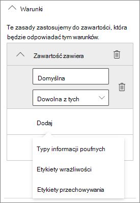

# Tworzenie bezpiecznego środowiska udostępniania gości

W tym artykule otworzymy różne opcje tworzenia bezpiecznego środowiska udostępniania gościa w programie Microsoft 365. Oto przykłady, które dają wyobrażenie o dostępnych opcjach. Możesz użyć tych procedur w różnych kombinacjach, aby spełnić potrzeby twojej organizacji dotyczące zabezpieczeń i zgodności.

Ten artykuł zawiera:

- Konfigurowanie uwierzytelniania wieloskładnikowego dla gości.
- Konfigurowanie warunków użytkowania dla gości.
- Konfigurowanie kwartalnych recenzji dostępu gości w celu okresowego sprawdzania, czy goście nadal potrzebują uprawnień do zespołów i witryn.
- Ograniczanie dostępu gości do dostępu tylko w sieci Web dla urządzeń niezawiązywanych.
- Konfigurowanie zasad limitu czasu sesji w celu zapewnienia codziennego uwierzytelniania gości.
- Tworzenie poufnego typu informacji dla projektu o wysokim stopniu poufnej informacji.
- Automatyczne przypisywanie etykiet wrażliwości do dokumentów zawierających informacje poufne.
- Automatycznie usuwaj dostęp gościa z plików za pomocą etykiety wrażliwości.

Niektóre opcje omówione w tym artykule wymagają, aby goście mieli konto w Azure Active Directory. Aby mieć pewność, że goście będą uwzględniane w katalogu podczas udostępniania im plików i folderów, skorzystaj z funkcji integracji usług SharePoint i OneDrive Azure AD Preview z usługą [Azure AD Preview](/sharepoint/sharepoint-azureb2b-integration-preview).

Pamiętaj, że w tym artykule nie omówiono włączania ustawień udostępniania gościa. Aby [uzyskać szczegółowe informacje na](collaborate-with-people-outside-your-organization.md) temat włączania udostępniania gości w różnych scenariuszach, zobacz Współpraca z osobami spoza organizacji.

## Konfigurowanie uwierzytelniania wieloskładnikowego dla gości

Uwierzytelnianie wieloskładnikowe znacznie zmniejsza ryzyko naruszenia bezpieczeństwa konta. Goście mogą korzystać z osobistych kont e-mail, które nie są zgodne z zasadami zarządzania i najlepszymi rozwiązaniami, dlatego szczególnie ważne jest wymaganie uwierzytelniania wieloskładnikowego dla gości. W przypadku kradzieży nazwy użytkownika i hasła gościa wymaganie drugiego czynnika uwierzytelniania znacznie zmniejsza ryzyko uzyskania dostępu do twoich witryn i plików przez nieznane osoby.

W tym przykładzie skonfigurujemy uwierzytelnianie wieloskładnikowe dla gości przy użyciu zasad dostępu warunkowego w programie Azure Active Directory.

Aby skonfigurować uwierzytelnianie wieloskładnikowe dla gości

1. Przejdź do zasad [dostępu warunkowego platformy Azure](https://portal.azure.com/#blade/Microsoft_AAD_IAM/ConditionalAccessBlade).
2. Na stronie **dostęp warunkowy | Pole** Zasady kliknij pozycję **Nowe zasady**.
3. W **polu** Nazwa wpisz nazwę.
4. W **obszarze Zadania** kliknij pozycję **Użytkownicy i grupy**.
5. Na bloku **Użytkownicy i** grupy zaznacz pole wyboru **Wybierz** użytkowników i grupy, a następnie zaznacz **pole wyboru Wszyscy goście i** użytkownicy zewnętrzni.
6. W **obszarze Zadania** kliknij pozycję **Aplikacje lub akcje w chmurze**.
7. Na karcie **Aplikacje w chmurze lub akcje** wybierz pozycję **Wszystkie aplikacje w** chmurze na **karcie** Dołączanie.
8. W **obszarze Kontrolki programu Access** kliknij przycisk **Ułań**.
9. Na bloku **Ułagodź** zaznacz pole **wyboru Wymagaj uwierzytelniania wieloskładnikowego** , a następnie kliknij przycisk **Wybierz**.
10. Na nowym **bloku** w obszarze **Włącz zasady** kliknij pozycję **Włącz**, a następnie kliknij przycisk **Utwórz**.

Teraz gość będzie wymagany do zarejestrowania się w uwierzytelnieniu wieloskładnikowym, aby uzyskać dostęp do udostępnianej zawartości, witryn lub zespołów.

### Więcej informacji

[Planowanie wdrożenia usługi Azure AD Multi-Factor Authentication](/azure/active-directory/authentication/howto-mfa-getstarted)

## Konfigurowanie warunków użytkowania dla gości

W niektórych sytuacjach goście mogą nie podpisać umów o nie ujawnianiu informacji ani innych umów prawnych z Twoją organizacją. Możesz wymagać od gości zgody na warunki użytkowania przed uzyskaniem dostępu do udostępnionych im plików. Warunki użytkowania mogą być wyświetlane przy pierwszej próbie uzyskania dostępu do udostępnionego pliku lub witryny.

Aby utworzyć warunki użytkowania, należy najpierw utworzyć dokument w programie Word lub innym programie do tworzenia, a następnie zapisać go jako .pdf pliku. Ten plik można następnie przekazać do usługi Azure AD.

Aby utworzyć warunki użytkowania usługi Azure AD

1. Zaloguj się na platformie Azure jako administrator globalny, administrator zabezpieczeń lub administrator dostępu warunkowego.
2. Przejdź do [warunków użytkowania](https://aka.ms/catou).
3. Kliknij **pozycję Nowe terminy**.

   

4. Wpisz pola **Nazwa** i **Nazwa wyświetlana**.
6. W **przypadku opcji Dokument warunków użytkowania** przejdź do utworzonego pliku PDF i wybierz go.
7. Wybierz język dokumentu warunków użytkowania.
8. Ustaw **wymaganie od użytkowników rozszerzenia warunków użytkowania do** **wartość Wł**.
9. W **obszarze Dostęp warunkowy** na liście **Wymuszaj przy użyciu** szablonu zasad dostępu warunkowego wybierz pozycję **Utwórz zasady dostępu warunkowego później**.
10. Kliknij **przycisk Utwórz**.

Kolejnym krokiem po utworzeniu warunków użytkowania jest utworzenie zasad dostępu warunkowego, które będą wyświetlać warunki użytkowania gościom.

Aby utworzyć zasady dostępu warunkowego

1. Przejdź do zasad [dostępu warunkowego platformy Azure](https://portal.azure.com/#blade/Microsoft_AAD_IAM/ConditionalAccessBlade).
2. Na stronie **dostęp warunkowy | Pole** Zasady kliknij pozycję **Nowe zasady**.
3. W **polu** Nazwa wpisz nazwę.
4. W **obszarze Zadania** kliknij pozycję **Użytkownicy i grupy**.
5. Na bloku **Użytkownicy i** grupy zaznacz pole wyboru **Wybierz** użytkowników i grupy, a następnie zaznacz **pole wyboru Wszyscy goście i** użytkownicy zewnętrzni.
6. W **obszarze Zadania** kliknij pozycję **Aplikacje lub akcje w chmurze**.
7. Na karcie **Dołączanie** wybierz pozycję **Wybierz aplikacje**, a następnie kliknij pozycję **Wybierz**.
8. Na grupie **Zaznaczanie** wybierz pozycję **Microsoft Teams**, **kliknij Office 365 SharePoint Online** i kliknij **Outlook Grupy**, a następnie kliknij pozycję **Wybierz**.
9. W **obszarze Kontrolki programu Access** kliknij przycisk **Ułań**.
10. Na **jękce Grant** wybierz **opcję Warunki użytkowania gość**, a następnie kliknij przycisk **Wybierz**.
11. Na nowym **bloku** w obszarze **Włącz zasady** kliknij pozycję **Włącz**, a następnie kliknij przycisk **Utwórz**.

Gdy gość po raz pierwszy próbuje uzyskać dostęp do zawartości albo zespołu lub witryny w organizacji, musi zaakceptować warunki użytkowania.

> [!NOTE]
> Korzystanie z dostępu warunkowego wymaga Azure AD — wersja Premium P1 licencji. Aby uzyskać więcej informacji, zobacz [Co to jest dostęp warunkowy](/azure/active-directory/conditional-access/overview).

### Więcej informacji

[Azure Active Directory użytkowania](/azure/active-directory/conditional-access/terms-of-use)

## Konfigurowanie recenzji dostępu gościa

Dzięki recenzjom dostępu w usłudze Azure AD możesz zautomatyzować okresowy przegląd dostępu użytkowników do różnych zespołów i grup. Wymagając przeglądu dostępu specjalnie dla gości, możesz zadbać o to, aby goście nie zachowali dostępu do informacji poufnych twojej organizacji przez dłuższy czas, niż jest to konieczne.

Aby skonfigurować recenzję dostępu gościa

1. Na stronie [Zarządzanie tożsamościami w](https://portal.azure.com/#blade/Microsoft_AAD_ERM/DashboardBlade) menu po lewej stronie kliknij pozycję Recenzje **w programie Access**.
2. Kliknij **pozycję Nowa recenzja dostępu**.
3. Wybierz opcję **Teams + Grupy**.
4. Wybierz opcję **Wszystkie Microsoft 365 grup z użytkownikami gośćmi**. Kliknij **pozycję Wybierz grupy, aby wykluczyć** , jeśli chcesz wykluczyć jakieś grupy.
5. Wybierz opcję **Tylko użytkownicy goście** , a następnie kliknij pozycję **Dalej: Recenzje**.
6. W **obszarze Wybierz recenzentów** wybierz **pozycję Właściciele grupy**.
7. Kliknij **pozycję Wybierz recenzentów rezerwowych**, wybierz, kto ma być recenzentami rezerwowych, a następnie kliknij pozycję **Wybierz**.
8. W **obszarze Określ cykl recenzji** wybierz pozycję **Kwartalne**.
9. Wybierz datę rozpoczęcia i czas trwania.
10. W **przypadku opcji** Koniec wybierz **pozycję Nigdy**, a następnie kliknij przycisk Dalej **: Ustawienia**.

    

11. Na karcie **Ustawienia** przejrzyj ustawienia w celu zachowania zgodności z regułami biznesowymi.

    

12. Kliknij **pozycję Następny: Recenzja + Utwórz**.
13. Wpisz nazwę **recenzji** i przejrzyj ustawienia.
14. Kliknij **przycisk Utwórz**.

Należy pamiętać, że w przypadku lokalizacji w systemach SharePoint i OneDrive dokumenty będą aktywnie blokowane od razu po wykryciu informacji poufnych niezależnie od tego, czy dokument jest udostępniany wszystkim użytkownikom zewnętrznym, natomiast użytkownicy wewnętrzni nadal będą mieli dostęp do dokumentu.

### Więcej informacji

[Zarządzanie dostępem gości za pomocą recenzji dostępu do usługi Azure AD](/azure/active-directory/governance/manage-guest-access-with-access-reviews)

[Tworzenie recenzji dostępu do grup lub aplikacji w recenzjach dostępu do usługi Azure AD](/azure/active-directory/governance/create-access-review)

## Konfigurowanie dostępu gości tylko do sieci Web

Możesz zmniejszyć ilość miejsca ataków i ułatwić administrowanie przez wymaganie od gości dostępu do zespołów, witryn i plików tylko przy użyciu przeglądarki internetowej.

W Microsoft 365 grupy i Teams odbywa się to za pomocą zasad dostępu warunkowego usługi Azure AD. Na SharePoint skonfigurowano to w centrum administracyjnym usługi SharePoint administracyjnego. Za pomocą etykiet wrażliwości [można też ograniczyć dostęp gości tylko do sieci Web](../compliance/sensitivity-labels-teams-groups-sites.md).

Aby ograniczyć dostęp gości do grup i witryn tylko w sieci Teams:

1. Przejdź do zasad [dostępu warunkowego platformy Azure](https://portal.azure.com/#blade/Microsoft_AAD_IAM/ConditionalAccessBlade).
2. Na bloku **Dostęp warunkowy — Zasady** kliknij pozycję **Nowe zasady**.
3. W **polu** Nazwa wpisz nazwę.
4. W **obszarze Zadania** kliknij pozycję **Użytkownicy i grupy**.
5. Na bloku **Użytkownicy i** grupy zaznacz pole wyboru **Wybierz** użytkowników i grupy, a następnie zaznacz **pole wyboru Wszyscy goście i** użytkownicy zewnętrzni.
6. W **obszarze Zadania** kliknij pozycję **Aplikacje lub akcje w chmurze**.
7. Na karcie **Dołączanie** wybierz pozycję **Wybierz aplikacje**, a następnie kliknij pozycję **Wybierz**.
8. Na bloku **Zaznacz** zaznacz zaznacz pole **Microsoft Teams** i **Outlook Grupy**, a następnie kliknij przycisk **Zaznacz**.
9. W **obszarze Zadania** kliknij **pozycję Warunki**.
10. Na bloku **Warunki** kliknij pozycję **Aplikacje klienckie**.
11. Na bloku **aplikacje klienckie** kliknij pozycję **Tak**, aby **skonfigurować, a** następnie wybierz ustawienia Aplikacje mobilne i klienci Exchange ActiveSync **klientów** oraz **Inny** klient. Wyczyść pole **wyboru** Przeglądarka.

    

12. Kliknij **przycisk Gotowe**.
13. W **obszarze Kontrolki programu Access** kliknij przycisk **Ułań**.
14. Na urządzeniu **typu Grant** blade wybierz pozycję **Require device to be marked as compliant** (Wymagaj zgodnego urządzenia) i **Require Hybrid Azure AD joined device (Wymagaj sprzężenia hybrydowego usługi Azure AD**).
15. W **obszarze Dla wielu kontrolek** wybierz **pozycję Wymagaj jednej z zaznaczonych kontrolek**, a następnie kliknij przycisk **Zaznacz**.
16. Na nowym **bloku** w obszarze **Włącz zasady** kliknij pozycję **Włącz**, a następnie kliknij przycisk **Utwórz**.

Aby ograniczyć dostęp gości do sieci Web w SharePoint

1. W centrum SharePoint rozwiń pozycję **Zasady i** wybierz pozycję <a href="https://go.microsoft.com/fwlink/?linkid=2185071" target="_blank">**Kontrola dostępu**</a>.
2. Wybierz **pozycję Urządzenia niezamanektowane**.
3. Wybierz opcję **Zezwalaj na ograniczony dostęp tylko w** sieci Web, a następnie wybierz pozycję **Zapisz**.

Zwróć uwagę, że to ustawienie w centrum SharePoint administracyjnego powoduje utworzenie obsługi zasad dostępu warunkowego w usłudze Azure AD.

## Konfigurowanie limitu czasu sesji dla gości

Konieczność regularnego uwierzytelniania gości może zmniejszyć możliwość uzyskiwania dostępu do zawartości organizacji przez nieznanych użytkowników, jeśli urządzenie gościa nie jest zabezpieczone. W usłudze Azure AD można skonfigurować zasady dostępu warunkowego dotyczące limitu czasu sesji dla gości.

Aby skonfigurować zasady limitu czasu sesji gościa

1. Przejdź do zasad [dostępu warunkowego platformy Azure](https://portal.azure.com/#blade/Microsoft_AAD_IAM/ConditionalAccessBlade).
2. Na bloku **Dostęp warunkowy — Zasady** kliknij pozycję **Nowe zasady**.
3. W polu **Nazwa** wpisz limit czasu sesji *gościa*.
4. W **obszarze Zadania** kliknij pozycję **Użytkownicy i grupy**.
5. Na bloku **Użytkownicy i** grupy zaznacz pole wyboru **Wybierz** użytkowników i grupy, a następnie zaznacz **pole wyboru Wszyscy goście i** użytkownicy zewnętrzni.
6. W **obszarze Zadania** kliknij pozycję **Aplikacje lub akcje w chmurze**.
7. Na karcie **Dołączanie** wybierz pozycję **Wybierz aplikacje**, a następnie kliknij pozycję **Wybierz**.
8. Na grupie **Zaznaczanie** wybierz pozycję **Microsoft Teams**, **kliknij Office 365 SharePoint Online** i kliknij **Outlook Grupy**, a następnie kliknij pozycję **Wybierz**.
9. W **obszarze Kontrolki dostępu** kliknij pozycję **Sesja**.
10. Na blade **sesji** wybierz pozycję **Częstotliwość logowania**.
11. Wybierz **pozycję 1** i **dni** dla okresu, a następnie kliknij przycisk **Wybierz**.
12. Na nowym **bloku** w obszarze **Włącz zasady** kliknij pozycję **Włącz**, a następnie kliknij przycisk **Utwórz**.

## Tworzenie typu informacji poufnych dla projektu o wysokim stopniu poufnej informacji

Typy informacji poufnych to wstępnie zdefiniowane ciągi, których można używać w przepływach pracy zasad w celu wymuszenia wymagań dotyczących zgodności. Centrum Microsoft 365 zgodności zawiera ponad sto poufnych typów informacji, w tym numery rejestracyjne sterowników, numery kart kredytowych, numery kont bankowych itp.

Niestandardowe typy informacji poufnych można utworzyć, aby ułatwić zarządzanie zawartością specyficzną dla organizacji. W tym przykładzie utworzymy niestandardowy typ informacji poufnych dla bardzo poufnego projektu. Następnie możemy użyć tego typu informacji poufnych w celu automatycznego zastosowania etykiety wrażliwości.

Aby utworzyć typ informacji poufnych

1. W centrum [Microsoft 365 zgodności](https://compliance.microsoft.com) w lewym okienku nawigacji rozwiń pozycję **Klasyfikacja**, a następnie kliknij pozycję **Typy informacji poufnych**.
2. Kliknij **przycisk Utwórz**.
3. W **polu Nazwa** **i opis** wpisz **Project Saturn**, a następnie kliknij przycisk **Dalej**.
4. Kliknij **pozycję Dodaj element**.
5. Na liście **Wykryj zawartość zawierającą** wybierz pozycję **Słowa kluczowe**, a następnie wpisz *słowa kluczowe Project Saturn* w polu słowa kluczowego.
6. Kliknij **przycisk Dalej**, a następnie kliknij przycisk **Zakończ**.
7. Jeśli zostanie pytanie, czy chcesz przetestować typ informacji poufnych, kliknij pozycję **Nie**.

### Więcej informacji

[Niestandardowe typy informacji poufnych](/Office365/SecurityCompliance/custom-sensitive-info-types)

## Tworzenie zasad automatycznego oznaczania w celu przypisania etykiet wrażliwości na podstawie typu informacji poufnych

Jeśli w organizacji używasz etykiet wrażliwości, możesz automatycznie zastosować etykietę do plików, które zawierają zdefiniowane typy informacji poufnych. 

Aby utworzyć zasady automatycznego oznaczania

1. Otwórz centrum [Microsoft 365 zgodności](https://compliance.microsoft.com).
2. W lewym okienku nawigacji kliknij pozycję **Ochrona informacji**.
3. Na karcie **Automatyczne etykiety** kliknij pozycję **Utwórz zasady auto etykiet**.
4. Na stronie **Wybierz informacje, do których chcesz zastosować tę etykietę** , wybierz pozycję **Niestandardowe** i kliknij przycisk **Dalej**.
5. Wpisz nazwę i opis zasad, a następnie kliknij przycisk **Dalej**.
6. Na **stronie Wybierz lokalizacje, w których chcesz** zastosować etykietę, włącz opcję SharePoint **witryny** i kliknij pozycję **Wybierz witryny**.
7. Dodaj adresy URL witryn, w których chcesz włączyć automatyczne dodawanie etykiet, a następnie kliknij przycisk **Gotowe**.
8. Kliknij **Dalej**.
9. Na stronie **Konfigurowanie typowych lub zaawansowanych** reguł wybierz pozycję **Reguły wspólne, a** następnie kliknij przycisk **Dalej**.
10. Na stronie **Definiowanie reguł dla zawartości we wszystkich lokalizacjach** kliknij pozycję **Nowa reguła**.
11. Na stronie **Nowa reguła** nadaj reguły nazwę, kliknij pozycję Dodaj **warunek**, a następnie kliknij pozycję Zawartość **zawiera typy informacji poufnych**.
12. Kliknij **pozycję** Dodaj, **kliknij pozycję** Typy informacji poufnych, wybierz typy informacji poufnych, których chcesz użyć, kliknij pozycję **Dodaj, a** następnie kliknij przycisk **Zapisz**.
13. Kliknij **Dalej**.
14. Kliknij **pozycję Wybierz etykietę**, wybierz etykietę, której chcesz użyć, a następnie kliknij przycisk **Dodaj**.
15. Kliknij **Dalej**.
16. Pozostaw zasady w trybie symulacyjnej i kliknij przycisk **Dalej**.
17. Kliknij **pozycję Utwórz zasady**, a następnie kliknij pozycję **Gotowe**.

Gdy użytkownik wklei zasady "Project Saturn" do dokumentu, zasady automatycznego oznaczania będą automatycznie stosować określoną etykietę podczas skanowania pliku.

### Więcej informacji

[Automatyczne stosowanie etykiet wrażliwości do zawartości](../compliance/apply-sensitivity-label-automatically.md)

## Tworzenie zasad DLP w celu usunięcia dostępu gościa do bardzo poufnych plików

Aby zapobiec niechcianym udostępnianiu poufnej zawartości przez gości, możesz użyć funkcji ochrony przed utratą danych [(DLP, data loss prevention](../compliance/dlp-learn-about-dlp.md) ). Ochrona przed utratą danych może podjąć działania na podstawie etykiety wrażliwości pliku i usunąć dostęp gościa.

Aby utworzyć regułę DLP

1. W centrum Microsoft 365 zgodności przejdź do strony [Ochrona przed utratą danych](https://compliance.microsoft.com/datalossprevention).
2. Kliknij **pozycję Utwórz zasady**.
3. Wybierz **pozycję Niestandardowe** i kliknij przycisk **Dalej**.
4. Wpisz nazwę zasad i kliknij przycisk **Dalej**.
5. Na **stronie Lokalizacje do zastosowania zasad** wyłącz wszystkie ustawienia z wyjątkiem witryn **SharePoint** i kont **OneDrive, a** następnie kliknij przycisk **Dalej**.
6. Na stronie **Definiowanie ustawień zasad** kliknij przycisk **Dalej**.
7. Na stronie **Dostosowywanie zaawansowanych reguł DLP** kliknij pozycję **Utwórz regułę** i wpisz nazwę reguły.
8. W **obszarze Warunki** kliknij **pozycję Dodaj warunek** i wybierz **pozycję Zawartość zawiera**.
9. Kliknij **pozycję** Dodaj, wybierz **pozycję Etykiety wrażliwości**, wybierz etykiety, których chcesz użyć, a następnie kliknij przycisk **Dodaj**.

   

10. W **obszarze** Akcje **kliknij pozycję Dodaj akcję** i wybierz **pozycję Ogranicz dostęp lub zaszyfruj zawartość Microsoft 365 lokalizacjach**.
11. Zaznacz pole **wyboru Ogranicz dostęp lub zaszyfruj zawartość Microsoft 365** lokalizacji, a następnie wybierz opcję Tylko **osoby spoza organizacji**.

      

12. Kliknij **przycisk Zapisz** , a następnie kliknij przycisk **Dalej**.
13. Wybierz opcje testowania i kliknij przycisk **Dalej**.
14. Kliknij **pozycję Prześlij**, a następnie kliknij pozycję **Gotowe**.

Należy pamiętać, że te zasady nie usuwają dostępu, jeśli gość jest członkiem witryny lub zespołu jako całości. Jeśli planujesz mieć wysoce poufne dokumenty w witrynie lub zespole z członkami gości, rozważ korzystanie z kanałów prywatnych w programie [Teams](https://support.microsoft.com/office/de3e20b0-7494-439c-b7e5-75899ebe6a0e) i zezwalanie na dostęp do kanałów prywatnych tylko członkom Twojej organizacji.

## Dodatkowe opcje

Istnieje kilka dodatkowych opcji w Microsoft 365 i Azure Active Directory, które mogą pomóc zabezpieczyć środowisko udostępniania gości.

- Możesz utworzyć listę domen udostępniania dozwolonych lub odrzuconych, aby ograniczyć użytkowników, którym mogą je udostępniać. Aby [uzyskać więcej](/sharepoint/restricted-domains-sharing) informacji, zobacz Ograniczanie SharePoint i OneDrive zawartości według domeny oraz Zezwalanie na zaproszenia [do B2B użytkowników b2B](/azure/active-directory/b2b/allow-deny-list) z określonych organizacji lub blokowanie ich.
- Możesz ograniczyć inne dzierżawy Azure Active Directory z którymi użytkownicy mogą się łączyć. Aby [uzyskać informacje, zobacz Używanie ograniczeń dzierżawy do zarządzania dostępem do aplikacji w chmurze SaaS](/azure/active-directory/manage-apps/tenant-restrictions) .
- Możesz utworzyć środowisko zarządzane, w którym partnerzy mogą pomóc w zarządzaniu kontami gości. Aby [uzyskać informacje, zobacz Tworzenie ekstranetu B2B z zarządzanymi gośćmi](/Office365/Enterprise/b2b-extranet) .

## Zobacz też

[Ograniczanie przypadkowego udostępnienia plików podczas udostępniania gościom](share-limit-accidental-exposure.md)

[Najlepsze rozwiązania dotyczące udostępniania plików i folderów nieuwierzytanych użytkownikom](best-practices-anonymous-sharing.md)

[Tworzenie ekstranetu B2B z gośćmi zarządzanymi](b2b-extranet.md)
