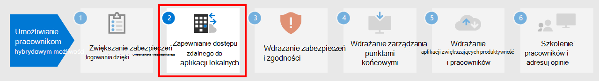

# Krok nr 1. Zwiększanie zabezpieczeń logowania dla pracowników hybrydowych za pomocą uwierzytelniania wieloskładnikowego

Aby zwiększyć bezpieczeństwo logowania pracowników hybrydowych, użyj uwierzytelniania wieloskładnikowego . Uwierzytelniania wieloskładnikowego wymaga, aby logowanie użytkowników podlegało dodatkowej weryfikacji poza hasłem do konta użytkownika. Nawet jeśli złośliwy użytkownik ustali hasło do konta użytkownika, musi też przed udzieleniem dostępu odpowiedzieć na dodatkową weryfikację, taką jak wiadomość SMS wysłana na smartfon.

W przypadku wszystkich użytkowników, w tym pracowników hybrydowych, a zwłaszcza administratorów, firma Microsoft zdecydowanie zaleca uwierzytelniania wieloskładnikowego.

Uwierzytelniania wieloskładnikowego można wymagać na trzy sposoby w zależności od Microsoft 365 mfa.

|Planowanie  |Zalecenie  |
|---------|---------|
|Wszystkie Microsoft 365 (bez Azure AD — wersja Premium P1 licencji P2)     |[Włącz domyślne ustawienia zabezpieczeń w usłudze Azure AD](/azure/active-directory/fundamentals/concept-fundamentals-security-defaults). Wartości domyślne zabezpieczeń w usłudze Azure AD obejmują uwierzytelniania wieloskładnikowe dla użytkowników i administratorów.   |
|Microsoft 365 E3 (obejmuje Azure AD — wersja Premium P1 licencji)     | Użyj [typowych zasad dostępu warunkowego,](/azure/active-directory/conditional-access/concept-conditional-access-policy-common) aby skonfigurować następujące zasady:  - [Wymaganie uwierzytelniania wieloskładnikowego dla administratorów](/azure/active-directory/conditional-access/howto-conditional-access-policy-admin-mfa)  - [Wymaganie uwierzytelniania WIELOSKŁADNIKOWEGO dla wszystkich użytkowników](/azure/active-directory/conditional-access/howto-conditional-access-policy-all-users-mfa)   - [Blokowanie starszego uwierzytelniania](/azure/active-directory/conditional-access/howto-conditional-access-policy-block-legacy)       |
|Microsoft 365 E5 (obejmuje Azure AD — wersja Premium P2 licencji)     | Korzystając z usługi Azure AD Identity Protection, zacznij implementować zalecany przez firmę Microsoft [zestaw](../security/office-365-security/identity-access-policies.md) dostępu warunkowego i powiązanych zasad, tworząc te zasady:  - [Wymagaj uwierzytelniania wieloskładnikowego, gdy ryzyko logowania jest średnie lub wysokie](../security/office-365-security/identity-access-policies.md#require-mfa-based-on-sign-in-risk)  - [Blokowanie klientów, którzy nie obsługują nowoczesnego uwierzytelniania](../security/office-365-security/identity-access-policies.md#block-clients-that-dont-support-multi-factor) - [Zmiana hasła przez użytkowników o wysokim poziomie ryzyka](../security/office-365-security/identity-access-policies.md#high-risk-users-must-change-password)       |
| | |

## Domyślne ustawienia zabezpieczeń

Wartości domyślne zabezpieczeń to nowa funkcja dla subskrypcji Microsoft 365 i Office 365 wersji próbnej utworzonych po 21 października 2019 r. Te subskrypcje mają włączone ustawienia domyślne zabezpieczeń, co wymaga, aby wszyscy użytkownicy korzystali ***z uwierzytelniania WIELOSKŁADNIKOWEGO Microsoft Authenticator aplikacji***.
 
Użytkownicy mają 14 dni na zarejestrowanie się w celu uwierzytelniania wieloskładnikowego za pomocą aplikacji Microsoft Authenticator na swoich telefonach inteligentnych, która rozpoczyna się od pierwszego logowania po włączeniu ustawień domyślnych zabezpieczeń. Po upływie 14 dni użytkownik nie będzie mógł się zalogować do czasu ukończenia rejestracji uwierzytelniania MFA.

Domyślne ustawienia zabezpieczeń zapewniają, że wszystkie organizacje mają podstawowy poziom zabezpieczeń dla domyślnie włączonego logowania użytkownika. Ustawienia domyślne zabezpieczeń można wyłączyć na rzecz uwierzytelniania wieloskładnikowego za pomocą zasad dostępu warunkowego lub dla poszczególnych kont.

Aby uzyskać więcej informacji, zobacz omówienie [domyślnych ustawień zabezpieczeń](/azure/active-directory/fundamentals/concept-fundamentals-security-defaults).

## Zasady dostępu warunkowego

Zasady dostępu warunkowego to zestaw reguł określających warunki, na podstawie których będą sprawdzane i dozwolone logowania. Można na przykład utworzyć zasady dostępu warunkowego o treści:

- Jeśli nazwa konta użytkownika jest członkiem grupy użytkowników z przypisanymi rolami administratora Exchange, użytkownika, hasła, zabezpieczeń, programu SharePoint lub administratora globalnego, przed zezwoleniem na dostęp należy wymagać uwierzytelniania wieloskładnikowego.

Te zasady pozwalają na wymaganie uwierzytelniania MFA opartego na członkostwie w grupach zamiast próby skonfigurowania poszczególnych kont użytkowników do uwierzytelniania MFA, gdy są one przypisane do tych ról administratora lub nieprzypisane do nich.

Za pomocą zasad dostępu warunkowego można także korzystać z bardziej zaawansowanych funkcji, takich jak wymaganie, aby logowanie było wykonywane ze zgodnego urządzenia, takiego jak komputer przenośny z systemem Windows 11 lub 10.

Dostęp warunkowy wymaga Azure AD — wersja Premium P1 licencji, które są zawarte w Microsoft 365 E3 i E5.

Aby uzyskać więcej informacji, zobacz omówienie [dostępu warunkowego](/azure/active-directory/conditional-access/overview).

## Pomoc techniczna usługi Azure AD Identity Protection

Za pomocą usługi Azure AD Identity Protection możesz utworzyć dodatkowe zasady dostępu warunkowego, które będą oznaczać:

- Jeśli ryzyko związane z logowaniem jest określone jako średnie lub wysokie, wymagaj uwierzytelniania MFA.

Usługa Azure AD Identity Protection wymaga Azure AD — wersja Premium P2 licencji, które są zawarte w Microsoft 365 E5.

Aby uzyskać więcej informacji, zobacz [Dostęp warunkowy oparty na czynniku ryzyka](/azure/active-directory/conditional-access/howto-conditional-access-policy-risk#require-mfa-medium-or-high-sign-in-risk-users).

Za pomocą usługi Azure AD Identity Protection możesz również utworzyć zasady wymagające od użytkowników zarejestrowania się w celu uwierzytelniania wieloskładnikowego. Aby uzyskać więcej informacji, zobacz [Konfigurowanie zasad rejestracji usługi Azure AD Multi-Factor Authentication](/azure/active-directory/identity-protection/howto-identity-protection-configure-mfa-policy)

## Wspólne korzystanie z tych metod

Należy pamiętać o następujących kwestiach:

- Nie można włączyć ustawień domyślnych zabezpieczeń, jeśli włączono jakiekolwiek zasady dostępu warunkowego.
- Nie można włączyć żadnych zasad dostępu warunkowego, jeśli włączono ustawienia domyślne zabezpieczeń.

Jeśli są włączone domyślne ustawienia zabezpieczeń, wszyscy nowi użytkownicy są monitni o rejestrację uwierzytelniania MFA i korzystanie z Microsoft Authenticator usługi. 

W poniższej tabeli przedstawiono wyniki włączania uwierzytelniania MFA z ustawieniami domyślnymi zabezpieczeń i zasadami dostępu warunkowego.

| Metoda | Włączone | Wyłączone | Dodatkowa metoda uwierzytelniania |
|:-------|:-----|:-------|:-------|
| **Domyślne ustawienia zabezpieczeń**  | Nie można używać zasad dostępu warunkowego | Można używać zasad dostępu warunkowego | Microsoft Authenticator aplikacji |
| **Zasady dostępu warunkowego** | Jeśli są włączone, nie można włączyć domyślnych ustawień zabezpieczeń | Jeśli wszystkie są wyłączone, możesz włączyć ustawienia domyślne zabezpieczeń  | Użytkownik określa podczas rejestracji uwierzytelniania MFA  |
||||

## Umożliwianie użytkownikom resetowania swoich haseł

Self-Service resetowania hasła (SSPR) umożliwia użytkownikom resetowanie własnych haseł bez wpływu na personel IT. Użytkownicy mogą szybko resetować swoje hasła w dowolnym momencie i z dowolnego miejsca. Aby uzyskać więcej informacji, zobacz [Planowanie wdrożenia samoobsługowego resetowania hasła](/azure/active-directory/authentication/howto-sspr-deployment) w usłudze Azure AD.

## Logowanie się do aplikacji SaaS w usłudze Azure AD

Oprócz uwierzytelniania w chmurze dla użytkowników usługa Azure AD może być również centralnym sposobem zabezpieczania wszystkich aplikacji, niezależnie od tego, czy są one lokalne, w chmurze firmy Microsoft, czy w innej chmurze. [Integrując aplikacje z usługą Azure AD](/azure/active-directory/manage-apps/plan-an-application-integration), możesz ułatwić pracownikom hybrydowym odnajdowanie potrzebnych aplikacji i bezpieczne logowanie się do nich.

## Zasoby techniczne dla uwierzytelniania wieloskładnikowego i tożsamości

- [5 najlepszych sposobów usługi Azure AD może ułatwić włączenie pracy zdalnej](https://techcommunity.microsoft.com/t5/azure-active-directory-identity/top-5-ways-your-azure-ad-can-help-you-enable-remote-work/ba-p/1144691)
- [Infrastruktura tożsamości dla Microsoft 365](../enterprise/deploy-identity-solution-overview.md)
- [Filmy szkoleniowe na platformie Azure Academy w usłudze Azure AD](https://www.youtube.com/watch?v=pN8o0owHfI0&list=PL-V4YVm6AmwUFpC3rXr2i2piRQ708q_ia)

## Wyniki kroku 1

Po wdrożeniu uwierzytelniania wieloskładnikowego użytkownicy:

- Są wymagane do korzystania z uwierzytelniania MFA do logowania.
- Po zakończeniu procesu rejestracji uwierzytelniania WIELOSKŁADNIKowego dla wszystkich logowania jest w nich przetwarzana uwierzytelniania WIELOSKŁADNIKOWEGO.
- Za pomocą funkcji SSPR można resetować własne hasła.

## Następny krok

Przejdź do [kroku 2,](empower-people-to-work-remotely-remote-access.md) aby zapewnić dostęp zdalny do lokalnych aplikacji i usług.