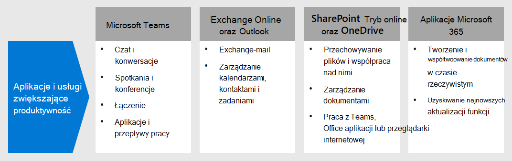

# Krok nr 5. Wdrażanie aplikacji i usług zwiększających produktywność pracowników hybrydowych

Aby pracować wydajnie, ludzie muszą komunikować się i współpracować ze sobą. Muszą spotykać się, rozmawiać na czacie za pomocą głosu i tekstu, tworzyć nową zawartość, udostępniać informacje i pliki, wymieniać się pocztą e-mail oraz zarządzać kalendarzami i zadaniami. Microsoft 365 udostępnia usługi chmurowe dla wszystkich tych kluczowych funkcji:

| IT | Microsoft 365 składników | Opis |
|:-------|:-----|:-------|
| Usługi poczty e-mail | Exchange Online | Exchange poczty e-mail oraz zarządzać kalendarzami, kontaktami i zadaniami za pomocą Outlook poczty e-mail. |
| Czat organizacyjny, połączenia głosowe przez IP (VOIP) i współpraca zespołowa | Microsoft Teams | Utrzymuj kontakt, gdy pracują osobno, za pomocą wspólnego centrum komunikacji na spotkania, czaty i miejsce do przechowywania plików dla organizacji, działów oraz dla małych zespołów i osób. |
| Witryny intranetowe, współpraca nad dokumentami | SharePoint i OneDrive | Przechowuj pliki i współpracuj nad nimi w przeglądarce internetowej lub w Teams. |
| Aplikacje klasyczne i Office przenośne | Aplikacje Microsoft 365 | Twórz nową zawartość lub współpracuj nad istniejącą zawartością za pomocą wersji programu Word, PowerPoint, Excel i Outlook zainstalowanych na komputerze lokalnym i które otrzymują bieżące aktualizacje funkcji i zabezpieczeń. |
||||

## Zadbaj o to, aby ludzie łączyli się z Microsoft Teams

Teams pomocą Microsoft Teams umożliwia Twojej organizacji rozmawianie na czacie, spotykanie się, dzwonienie i współpracę w jednym miejscu. Miliony osób codziennie wypracują swoje zadania z zespołami, ponieważ dzięki temu wszystko, co jest potrzebne do pracy w miejscu lub zdalnie, jest centrum pracy zespołowej. 

Aby uzyskać szczegółowe wskazówki, zobacz [Obsługa pracowników zdalnych przy Microsoft Teams](/microsoftteams/support-remote-work-with-teams). 

Obejrzyj film [Włączanie pracy hybrydowej z Microsoft Teams webcasts](https://resources.techcommunity.microsoft.com/enabling-hybrid-work/), aby uzyskać wskazówki i pokazy dotyczące używania Teams do pracy hybrydowej.

### Czat i konwersacje

Czat i konwersacje w wątkach znajdują się w centrum Teams z obsługą indywidualnych czatów indywidualnych (1:1) oraz czatów grupowych i konwersacji grupowych. Pracownicy zdalni mogą udostępniać informacje, opinie i osobowość, używając obrazów, naklejek i emoji w czatach grupowych lub wiadomościach jeden-do-jednego.

### Spotkania i konferencje 

Teams oczywiście pomagać w komunikacji i udostępnianiu informacji pracownikom hybrydowym, zwłaszcza w przypadku spotkań z nawet 250 osobami. Teams spotkania umożliwiają interakcyjne, oparte na współpracy spotkania z osobami w organizacji i poza nią. Pracownicy zdalni mogą korzystać Teams spotkania na potrzeby codziennie realizowanych działań, w tym cyklicznych punktów kontrolnych projektów, spotkań ze współpracownikami, sesji burzy mózgów i ułatwiania konwersacji z klientami. 

### Rozmowy telefoniczne

Teams obsługuje bezpośrednie połączenia VoIP między użytkownikami a nawet innymi organizacjami korzystającymi z federacji. Koder-kanał używa tych samych koderów-formatów, co spotkania, i zapewnia świetne połączenia audio na całym świecie bez dodatkowych opłat za sieć PSTN. Jednak niektórzy użytkownicy mogą potrzebować dedykowanego numeru telefonu, aby odbierać połączenia zewnętrzne podczas pracy w witrynie lub zdalnie. Teams szybko udostępnić tym użytkownikom usługę telefonii w chmurze do nabierania i odbierania połączeń telefonicznych.

### Aplikacje i przepływy pracy

Teams udostępnia platformę aplikacji i przepływów pracy, do których można uzyskać dostęp z wersji klasycznej, internetowej i mobilnej pakietu Teams. Teams udostępnia setki aplikacji publikowanych przez firmę Microsoft i inne firmy w celu angażowania użytkowników, obsługi produktywności i integracji często używanych usług biznesowych z Teams. Użytkownicy i administratorzy mogą również tworzyć niestandardowe aplikacje i automatyczne przepływy pracy dla Teams za pomocą niskich Power Apps i Power Automate programistów.

Aplikacje i przepływy pracy pozwalają pracownikom hybrydowym pracować wydajniej Teams, zbierając i udostępniając ważne informacje, automatyzując powtarzające się zadania i pozwalając im na czatowanie z interaktywnym botem. Przypinanie aplikacji do kanału lub paska aplikacji Teams to świetny sposób na zwiększenie dostępności tych aplikacji w odpowiednim miejscu, a administratorzy mogą przypinać aplikacje, aby zwiększyć świadomość i wdrożenie aplikacji, z których powinni korzystać wszyscy.

## Exchange e-mail oraz zarządzanie kalendarzami, kontaktami i zadaniami za pomocą Exchange Online i Outlook

Dzięki Outlook hybrydowym pracownicy mogą być w kontakcie i zorganizowani za pomocą poczty e-mail, kalendarzy, kontaktów, zadań i nie tylko — razem w jednym miejscu. Outlook ułatwia śledzenie i priorytetyzowanie dnia na podstawie tego, co jest dla Ciebie istotne. Outlook umożliwia udostępnianie załączników bezpośrednio z programu OneDrive, planowanie spotkań Teams i dołączanie do nich, wyświetlanie i udostępnianie kalendarzy oraz zapewnianie innym osobom uprawnień pełnomocnika. Wiedza o nadchodzących zagadnieniach, zarówno służbowych, jak i osobistych, oraz o tym, co wymaga uwagi, może ułatwić pracownikom hybrydowym skupienie się na tym, co ważne. Outlook pomocnych sposobów na zarządzanie czasem i łatwe znajdowanie potrzebnych informacji dla pracowników hybrydowych, w tym plików, osób w organizacji i nie tylko. 

Zobacz [ten artykuł,](../security/office-365-security/secure-email-recommended-policies.md) aby uzyskać informacje na temat zalecanych zasad dostępu do tożsamości i urządzeń w celu ochrony poczty e-mail i klientów poczty e-mail organizacji, które obsługują nowoczesne uwierzytelnianie i dostęp warunkowy.

## Przechowywanie i współpraca nad plikami za SharePoint i OneDrive

W przypadku współpracy nad zawartością pracownicy hybrydowi mogą używać folderów SharePoint i OneDrive jako centralnego miejsca w chmurze do przechowywania i udostępniania plików, współtworowania, komunikowania się i współpracy. Pracownicy zdalni mogą bezpiecznie pracować z dowolnego miejsca z przeglądarki internetowej, z Teams i z Office aplikacji.

Może być konieczne przeprowadzenie migracji dokumentów do SharePoint lub OneDrive z:

- [SharePoint witryn zespołu na serwerze](/sharepointmigration/sp-teams-sites-migration-guide)
- [Mojawitryna](/sharepointmigration/mysites-to-onedrive-migration-guide)
- [Udziały plików](/sharepointmigration/fileshare-to-odsp-migration-guide)
- [Box](/sharepointmigration/box-to-onedrive-and-sharepoint-migration-guide)

Aby chronić SharePoint i OneDrive, zobacz ten [artykuł](../security/office-365-security/sharepoint-file-access-policies.md), aby uzyskać zalecane zasady dostępu do urządzeń i tożsamości.

## Tworzenie zawartości i współpraca nad zawartością za pomocą Aplikacje Microsoft 365

Aplikacje Microsoft 365 to najbardziej wydajna i bezpieczna Office dla przedsiębiorstw, umożliwiając użytkownikom bezproblemową współpracę z dowolnego miejsca i w dowolnym czasie. Pracownicy zdalni mogą współpracować nad dokumentem z wieloma osobami jednocześnie, oglądać zmiany w czasie rzeczywistym i współtwórz je z innymi osobami na dowolnym komputerze przenośnym, komputerze lub urządzeniu przenośnym.

Aby uzyskać więcej informacji, zobacz [Przewodnik po Aplikacje Microsoft 365](/deployoffice/deployment-guide-microsoft-365-apps).

## Zasoby techniczne dla administratorów dotyczące aplikacji i usług zwiększających produktywność

- [Obsługa pracowników zdalnych korzystających z Microsoft Teams](/microsoftteams/support-remote-work-with-teams)
- [Włączanie pracy hybrydowej z Microsoft Teams Webcasts](https://resources.techcommunity.microsoft.com/enabling-hybrid-work/)
- [pobieranie Teams zestawu sukcesów klienta](https://www.microsoft.com/download/details.aspx?id=54244)
- [Narzędzia do Teams nowych użytkowników](/microsoftteams/adopt-tools-and-downloads) 
- [Tworzenie strategii zarządzania zmianami dla Microsoft Teams](/MicrosoftTeams/change-management-strategy)
- [Teams z trzema warstwami ochrony](configure-teams-three-tiers-protection.md)

## Zasoby szkoleniowe dla użytkowników dotyczące aplikacji i usług zwiększających produktywność

- [Szkolenie użytkowników w Office i Microsoft 365](https://support.microsoft.com/office/train-your-users-on-office-and-microsoft-365-7cba3c97-7f19-46ed-a1c6-763971a26c27)
- [Używanie Office dla sieci web](https://support.microsoft.com/office/get-started-with-office-for-the-web-in-microsoft-365-5622c7c9-721d-4b3d-8cb9-a7276c2470e5)

## Następny krok

Przejdź do [kroku 6,](empower-people-to-work-remotely-train-monitor-usage.md) aby szkolenie użytkowników i monitorowanie ich sukcesu.