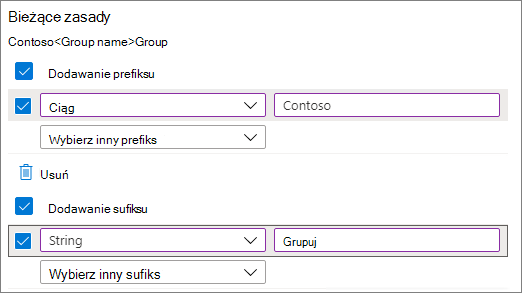

# Microsoft 365 nazewnictwa grup

Za pomocą zasad nazewnictwa grup można wymuszać spójną strategię nazewnictwa dla grup utworzonych przez użytkowników w organizacji. Zasady nazewnictwa mogą ułatwić Sobie i Twoim użytkownikom zidentyfikowanie funkcji grupy, członkostwa, regionu geograficznego lub osoby, która utworzyła grupę. Zasady nazewnictwa mogą także ułatwić kategoryzowanie grup w książce adresowej. Za pomocą tych zasad można blokować używanie określonych wyrazów w nazwach i aliasach grup.

Zasady nazewnictwa są stosowane do grup tworzona we wszystkich obciążeniach grup (takich jak Outlook, Microsoft Teams, SharePoint, Planner, Yammer itp.). Zostanie on zastosowany zarówno do nazwy grupy, jak i aliasu grupy. Stosowana jest również wtedy, gdy użytkownik tworzy grupę oraz gdy nazwa, alias, opis lub awatar grupy jest edytowana dla istniejącej grupy.

> [!TIP]
> Zasady Microsoft 365 nazewnictwa grup mają zastosowanie tylko do Microsoft 365 grup. Nie dotyczy grup dystrybucyjnych tworzona w programie Exchange Online. Aby utworzyć zasady nazewnictwa dla grup dystrybucyjnych, zobacz [Tworzenie zasad nazewnictwa grup dystrybucyjnych](/exchange/recipients-in-exchange-online/manage-distribution-groups/create-group-naming-policy).

Zasady nazewnictwa grup składają się z następujących funkcji:

- **Zasady nazewnictwa** prefiksów i sufiksów: Można używać prefiksów lub sufiksów do definiowania konwencji nazewnictwa grup (na przykład: "UsMy\_ GroupEngineering\_"). Prefiksy/sufiksy mogą być stałymi ciągami lub atrybutami użytkownika, na przykład [Dział], które zostaną podstawione na podstawie użytkownika tworzącego grupę.

- **Niestandardowe blokowane wyrazy**: Możesz przekazać zestaw blokowanych wyrazów specyficznych dla Twojej organizacji, które byłyby blokowane w grupach utworzonych przez użytkowników. (Na przykład: "Dyrektor generalny, płace, kadry").

## Wymagania dotyczące licencjonowania

Korzystanie z zasad nazewnictwa Usługi Azure AD dla grup usługi Microsoft 365 wymaga posiadania przez Ciebie licencji usługi Azure Active Directory — wersja Premium P1 lub licencji usługi Azure AD Basic EDU dla każdego unikatowego użytkownika (w tym gości), który jest członkiem co najmniej jednej grupy usługi Microsoft 365.

Jest to również wymagane dla administratora, który tworzy zasady nazewnictwa grup.

## Prefix-Suffix nazewnictwa

Prefiksy i sufiksy mogą być stałymi ciągami lub atrybutami użytkownika.

### Ciągi naprawione

Możesz użyć krótkich ciągów, które ułatwiają odróżnienie grup na stronie nawigacji po lewej stronie w obciążeniach grup. Niektóre typowe sufiksy prefiksów to słowa kluczowe, takie jak 'GrpName\_', '\#Name', '\_Name'

### Atrybuty

Możesz użyć atrybutów, które ułatwiają określenie, kto utworzył grupę, na przykład [Dział] i gdzie została utworzona, na podstawie przykładu [Kraj].

Przykłady:

- Zasady = "GRP [Nazwa_grupy] [Dział]"
- Dział użytkownika = Inżynieria
- Utworzono nazwę grupy = "GRP My Group Engineering"

Obsługiwane Azure Active Directory (Azure AD) to: [Department], [Company], [Office], [StateOrProvince], [CountryOrRegion] i [Title].

- Nieobsługiwane atrybuty użytkownika są traktowane jako stałe ciągi, na przykład [kod pocztowy].

- Atrybuty rozszerzenia i atrybuty niestandardowe nie są obsługiwane.

Zaleca się używanie atrybutów z wartościami wypełnionymi dla wszystkich użytkowników w organizacji, bez używania atrybutów, które mają dłuższe wartości.

### Rzeczy, na które należy zwrócić uwagę

- Podczas tworzenia zasad całkowita liczba prefiksów i sufiksów jest ograniczona do 53 znaków.

- Prefiksy i sufiksy mogą zawierać znaki specjalne obsługiwane w nazwach grup i aliasach grup. Jeśli prefiksy i sufiksy zawierają znaki specjalne, które nie są dozwolone w aliasie grupy, są stosowane tylko do nazwy grupy. W tym przypadku prefiksy i sufiksy zastosowane do nazwy grupy będą inne niż te zastosowane do aliasu grupy.

  > [!NOTE]
  > W nazwie grupy jest dozwolony okres (.) lub łącznik (-), z wyjątkiem początku lub końca nazwy. W nazwie grupy jest dozwolony podkreślenie (_).

- Jeśli korzystasz z Yammer Office 365, unikaj używania następujących znaków zasad nazewnictwa: @, \#, \[, \]\<, and \>. Jeśli te znaki są w zasadach nazewnictwa, zzwykłą Yammer użytkownicy nie będą mogli tworzyć grup.

> [!Tip]
> - Używaj krótkich ciągów jako sufiksów.
> - Używanie atrybutów z wartościami.
> - Nie bądź zbyt kreatywny, całkowita długość nazwy może mieć maksymalnie 264 znaki.
> - Upload organizacji blokowane wyrazy, aby ograniczyć użycie.

## Niestandardowe blokowane wyrazy

Możesz wprowadzić rozdzieloną przecinkami listę zablokowanych wyrazów, które będą blokowane w nazwach i aliasach grup.

Nie są przeprowadzane żadne wyszukiwania podtypów; W szczególności do wyzwolenia błędu jest wymagane dokładne dopasowanie między wprowadzeniu nazwy użytkownika a niestandardowymi wyrazami zablokowanymi.

**Na co należy zwrócić uwagę**:

- Blokowane wyrazy nie są bez uwzględniania liter.

- Gdy użytkownik wprowadzi zablokowany wyraz, klient grupy wyświetla komunikat o błędzie z zablokowanym wyrazem.

- Blokowane wyrazy nie mają żadnych ograniczeń dotyczących znaków.

- Istnieje ograniczenie do 5000 wyrazów, które można ustawić jako zablokowane wyrazy.

## Zastępowanie administratora

Niektórzy administratorzy są wykluczeni z tych zasad we wszystkich obciążeniach grup i punktach końcowych, dzięki czemu mogą tworzyć grupy z zablokowanymi wyrazami i z odpowiednimi konwencjami nazewnictwa. Poniżej przedstawiono listę ról administratorów wykluczona z zasad nazewnictwa grup.

- Administrator globalny

- Pomoc techniczna dla partnerów (warstwa 1)

- Pomoc techniczna dla partnerów (warstwa 2)

- Administrator konta użytkownika

## Jak skonfigurować zasady nazewnictwa

Aby skonfigurować zasady nazewnictwa:

1. W [Azure Active Directory](https://aad.portal.azure.com) w **obszarze Zarządzanie** kliknij pozycję **Grupy**.
2. W **Ustawienia** Kliknij pozycję **Zasady nazewnictwa**.
3. Wybierz **kartę Zasady nazewnictwa** grup.
4. W **obszarze Bieżące zasady** wybierz, czy chcesz wymagać prefiksu lub sufiksu, czy obu tych opcji, i zaznacz odpowiednie pola wyboru.
5. Wybierz pozycję **Attribute (** Atrybut **) lub String (Ciąg** ) dla każdego wiersza, a następnie określ atrybut lub ciąg.
6. Po dodaniu potrzebnych prefiksów i sufiksów kliknij przycisk **Zapisz**.

## Tematy pokrewne

[Zalecenia dotyczące planowania zarządzania współpracą](collaboration-governance-overview.md#collaboration-governance-planning-recommendations)

[Tworzenie planu zarządzania współpracą](collaboration-governance-first.md)

[Azure Active Directory cmdlet do konfigurowania ustawień grupy](/azure/active-directory/enterprise-users/groups-settings-cmdlets)