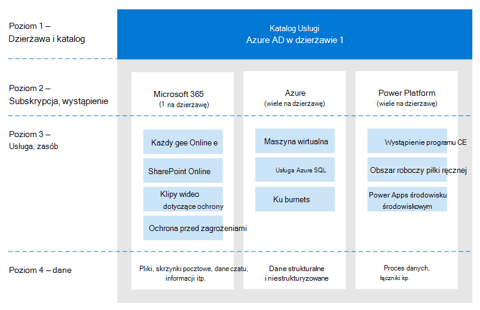
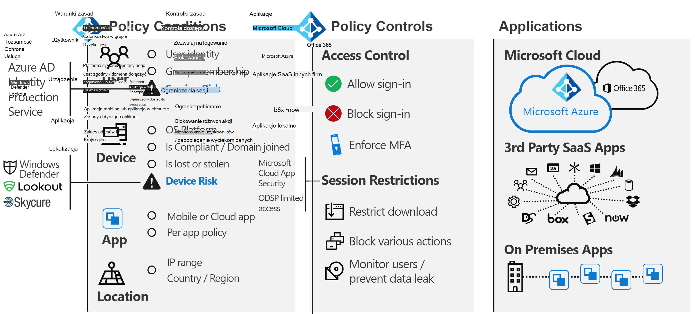
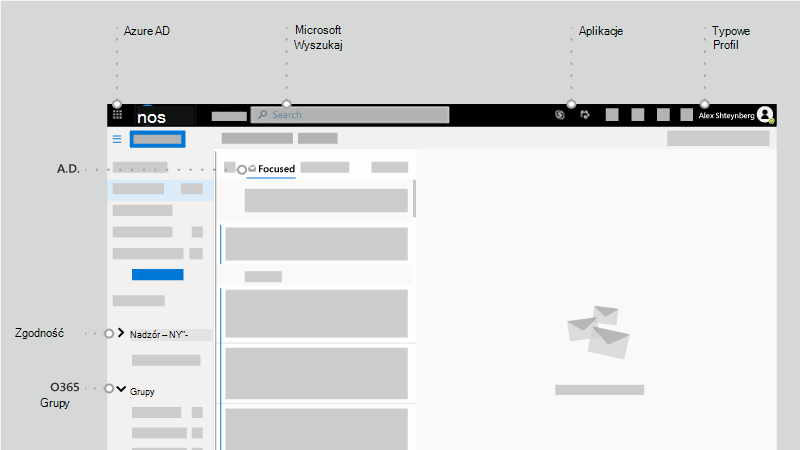
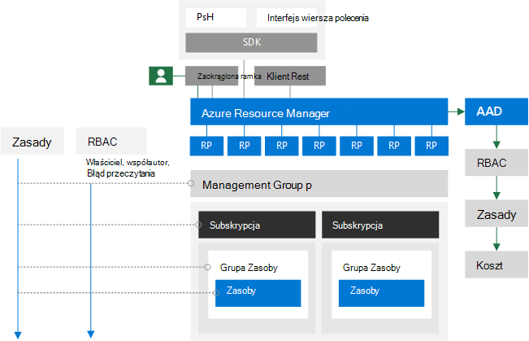

# Tożsamość i nie tylko — punkt widzenia jednego architekta

W tym artykule [Alex Shteynberg](https://www.linkedin.com/in/alex-shteynberg/), główny architekt techniczny w firmie Microsoft, omawia najważniejsze strategie projektowania dla organizacji korporacyjnych wdrażających Microsoft 365 i inne usługi firmy Microsoft w chmurze.

## Informacje o autorze

Jestem głównym architektem technicznym w New York [Microsoft Technology Center](https://www.microsoft.com/mtc?rtc=1). Pracuję głównie z dużymi klientami i złożonymi wymaganiami. Mój punkt widzenia i opinie są oparte na tych interakcjach i mogą nie mieć zastosowania do każdej sytuacji. Jednak z mojego doświadczenia wiem, że jeśli możemy pomóc klientom w rozwiązywaniu najbardziej złożonych wyzwań, możemy pomóc wszystkim klientom.

Zwykle pracuję z ponad 100 klientami każdego roku. Chociaż każda organizacja ma unikatowe cechy, warto zobaczyć trendy i podobieństwa. Na przykład jednym z trendów jest zainteresowanie wielu klientów między branżami. Po tym wszystkim, oddział banku może być również kawiarnia i centrum społeczności.

W mojej roli skupiam się na pomaganiu klientom w dotarciu do najlepszego rozwiązania technicznego w celu osiągnięcia ich unikatowego zestawu celów biznesowych. Oficjalnie skupiam się na tożsamościach, zabezpieczeniach, prywatności i zgodności. Uwielbiam fakt, że dotykają one wszystkiego, co robimy. Daje mi to możliwość zaangażowania się w większość projektów. To sprawia, że jestem zajęty i cieszę się tą rolą.

Mieszkam w Nowym Jorku (najlepsze!) i naprawdę cieszyć się różnorodnością jego kultury, żywności i ludzi (nie ruchu). Uwielbiam podróżować, kiedy mogę i mam nadzieję zobaczyć większość świata w moim życiu. Obecnie badam podróż do Afryki, aby dowiedzieć się więcej o dzikiej przyrodzie.

## Przewodnie

- **Proste jest często lepsze**: możesz zrobić (prawie) wszystko za pomocą technologii, ale to nie znaczy, że powinieneś. Szczególnie w obszarze bezpieczeństwa wielu klientów nadmiernie obsługuje rozwiązania. Podoba mi [się ten film](https://www.youtube.com/watch?v=SOQgABDSYZE) z konferencji Google Stripe, aby podkreślić ten punkt.
- **Ludzie, proces, technologia**: [Projektowanie dla ludzi](https://en.wikipedia.org/wiki/Human-centered_design) w celu ulepszenia procesu, a nie technologii. Nie ma żadnych "doskonałych" rozwiązań. Musimy zrównoważyć różne czynniki ryzyka, a decyzje będą różne dla każdej firmy. Zbyt wielu klientów projektuje podejście, których użytkownicy później unikają.
- **Skup się na "dlaczego" najpierw i "jak" później**: Bądź irytującym 7-letnim dzieckiem z milionem pytań. Nie możemy uzyskać właściwej odpowiedzi, jeśli nie znamy odpowiednich pytań do zadawania. Wielu klientów przyjmuje założenia dotyczące tego, jak wszystko musi działać, zamiast definiować problem biznesowy. Zawsze istnieje wiele ścieżek, które można wykonać.
- **Długi koniec poprzednich najlepszych rozwiązań**: rozpoznaj, że najlepsze rozwiązania zmieniają się z małą prędkością. Jeśli przyjrzeliśmy się usłudze Azure AD ponad trzy miesiące temu, prawdopodobnie jesteś nieaktualny. Wszystko w tym miejscu może ulec zmianie po publikacji. "Najlepsza" opcja dzisiaj może nie być taka sama od sześciu miesięcy.

## Pojęcia dotyczące planu bazowego

Nie pomijaj tej sekcji. Często uważam, że muszę cofnąć się do tych artykułów, nawet dla klientów, którzy od lat korzystają z usług w chmurze.
Niestety, język nie jest precyzyjnym narzędziem. Często używamy tego samego słowa, aby oznaczać różne pojęcia lub różne słowa, aby oznaczać tę samą koncepcję. Często używam tego diagramu poniżej, aby ustalić terminologię punktu odniesienia i "model hierarchii".
  

 

Kiedy nauczysz się pływać, lepiej zacząć w basenie, a nie na środku oceanu. Nie staram się być technicznie dokładne z tego diagramu. Jest to model do omówienia niektórych podstawowych pojęć.

Na diagramie:

- Tenant = wystąpienie usługi Azure AD. Znajduje się on na "górze" hierarchii lub na poziomie 1 na diagramie. Możemy uznać to za "[granicę](/azure/active-directory/users-groups-roles/licensing-directory-independence)", w której występuje wszystko inne ([usługa Azure AD B2B](/azure/active-directory/b2b/what-is-b2b) na bok). Wszystkie usługi firmy Microsoft w chmurze dla przedsiębiorstw należą do jednej z tych dzierżaw. Usługi konsumenckie są oddzielne. "Dzierżawa" jest wyświetlana w dokumentacji jako dzierżawa Office 365, dzierżawa platformy Azure, dzierżawa usługi WVD itd. Często uważam, że te odmiany powodują zamieszanie dla klientów.
- Usługi/subskrypcje, poziom 2 na diagramie, należą do jednej dzierżawy i tylko jednej dzierżawy. Większość usług SaaS ma wartość 1:1 i nie może się poruszać bez migracji. Platforma Azure jest inna. Możesz [przenieść rozliczenia](/azure/cost-management-billing/manage/billing-subscription-transfer) i/lub [subskrypcję](/azure/active-directory/fundamentals/active-directory-how-subscriptions-associated-directory) do innej dzierżawy. Istnieje wielu klientów, którzy muszą przenieść subskrypcje platformy Azure. Ma to różne implikacje. Obiekty istniejące poza subskrypcją nie są przenoszone (na przykład kontrola dostępu oparta na rolach lub kontrola dostępu oparta na rolach platformy Azure oraz obiekty usługi Azure AD, w tym grupy, aplikacje, zasady itd.). Ponadto niektóre usługi (takie jak Azure Key Vault, Data Bricks itd.). Nie migruj usług bez potrzeby biznesowej. Niektóre skrypty, które mogą być przydatne podczas migracji, są [udostępniane w GitHub](https://github.com/lwajswaj/azure-tenant-migration).
- Dana usługa zwykle ma pewnego rodzaju granicę "podpoziomu" lub poziom 3 (L3). Jest to przydatne do zrozumienia w przypadku podziału zabezpieczeń, zasad, ładu itd. Niestety, nie ma jednolitej nazwy, którą znam. Przykładowe nazwy L3 to: Subskrypcja platformy Azure = [zasób](/azure/azure-resource-manager/management/manage-resources-portal); Dynamics 365 CE = [wystąpienie](/dynamics365/admin/new-instance-management); Power BI = [obszar roboczy](/power-bi/service-create-the-new-workspaces); Power Apps = [środowisko](/power-platform/admin/environments-overview) itd.
- Poziom 4 to miejsce, w którym znajdują się rzeczywiste dane. Ta "płaszczyzna danych" to złożony artykuł. Niektóre usługi korzystają z usługi Azure AD dla kontroli dostępu opartej na rolach, inne nie. Omówię to nieco, gdy przejdziemy do artykułów delegowania.

Niektóre dodatkowe pojęcia, które uważam za wiele klientów (i pracowników firmy Microsoft), są zdezorientowane lub mają pytania dotyczące następujących kwestii:

- Każda osoba może [utworzyć](/azure/active-directory/fundamentals/active-directory-access-create-new-tenant) wiele dzierżaw [bez poniesienia kosztów](https://azure.microsoft.com/pricing/details/active-directory/). Nie potrzebujesz usługi aprowizowanej w niej. Mam dziesiątki. Każda nazwa dzierżawy jest unikatowa w globalnej usłudze firmy Microsoft w chmurze (innymi słowy, żadna z dwóch dzierżaw nie może mieć tej samej nazwy). Wszystkie są w formacie TenantName.onmicrosoft.com. Istnieją również procesy, które automatycznie tworzą dzierżawy ([dzierżawy niezarządzane](/azure/active-directory/users-groups-roles/directory-self-service-signup)). Może to na przykład wystąpić, gdy użytkownik zarejestruje się w usłudze przedsiębiorstwa z domeną poczty e-mail, która nie istnieje w żadnej innej dzierżawie.
- W dzierżawie zarządzanej można zarejestrować wiele [domen DNS](/azure/active-directory/fundamentals/add-custom-domain) . Nie zmienia to oryginalnej nazwy dzierżawy. Obecnie nie można łatwo zmienić nazwy dzierżawy (innej niż migracja). Chociaż nazwa dzierżawy nie jest w dzisiejszych czasach technicznie krytyczna, niektóre z nich mogą uznać to za ograniczające.
- Należy zarezerwować nazwę dzierżawy dla swojej organizacji, nawet jeśli nie planujesz jeszcze wdrażania żadnych usług. W przeciwnym razie ktoś może go zabrać od Ciebie i nie ma prostego procesu, aby go odzyskać (ten sam problem co nazwy DNS). Słyszę to zbyt często od klientów. Nazwa dzierżawy powinna być również artykułem dyskusyjnym.
- Jeśli jesteś właścicielem przestrzeni nazw DNS, należy dodać wszystkie te elementy do dzierżaw. W przeciwnym razie można utworzyć [dzierżawę niezarządzaną](/azure/active-directory/users-groups-roles/directory-self-service-signup) o tej nazwie, co spowoduje zakłócenie [zarządzania](/azure/active-directory/users-groups-roles/domains-admin-takeover) nią.
- Przestrzeń nazw DNS (na przykład contoso.com) może należeć do jednej dzierżawy. Ma to wpływ na różne scenariusze (na przykład udostępnianie domeny poczty e-mail podczas fuzji lub przejęcia itd.). Istnieje sposób zarejestrowania podsystemu DNS (takiego jak div.contoso.com) w innej dzierżawie, ale należy tego unikać. Rejestrując nazwę domeny najwyższego poziomu, zakłada się, że wszystkie poddomeny należą do tej samej dzierżawy. W scenariuszach obejmujących wiele dzierżaw (patrz poniżej) zwykle zalecam użycie innej nazwy domeny najwyższego poziomu (na przykład contoso.ch lub ch-contoso.com).
- KtoTo powinna być właścicielem dzierżawy? Często widzę klientów, którzy nie wiedzą, kto obecnie jest właścicielem dzierżawy. Jest to duża czerwona flaga. Zadzwoń do pomocy technicznej firmy Microsoft jak najszybciej. Równie problematyczne jest, gdy właściciel usługi (często administrator Exchange) jest wyznaczony do zarządzania dzierżawą. Dzierżawa będzie zawierać wszystkie usługi, które mogą być potrzebne w przyszłości. Właściciel dzierżawy powinien być grupą, która może podejmować decyzje dotyczące włączania wszystkich usług w chmurze w organizacji. Innym problemem jest monitowanie grupy właścicieli dzierżawy o zarządzanie wszystkimi usługami. Nie jest to skalowane w przypadku dużych organizacji.
- Nie ma koncepcji dzierżawy podrzędnej/super. Z jakiegoś powodu ten mit powtarza się. Dotyczy to również dzierżaw [usługi Azure AD B2C](/azure/active-directory-b2c/) . Słyszę zbyt wiele razy: "Moje środowisko B2C znajduje się w mojej dzierżawie XYZ" lub "Jak mogę przenieść dzierżawę platformy Azure do mojej dzierżawy Office 365?"
- Ten dokument koncentruje się głównie na chmurze komercyjnej na całym świecie, ponieważ jest to, z czego korzysta większość klientów. Czasami warto wiedzieć o [suwerennych chmurach](/azure/active-directory/develop/authentication-national-cloud). Suwerenne chmury mają dodatkowe implikacje, aby omówić, które są poza zakresem tej dyskusji.

## Artykuły dotyczące tożsamości punktu odniesienia

Istnieje wiele dokumentacji dotyczącej platformy tożsamości firmy Microsoft — Azure Active Directory (Azure AD). Dla tych, którzy dopiero zaczynają, często czuje się przytłaczająca. Nawet po zapoznaniu się z tym, nadążanie za ciągłymi innowacjami i zmianami może być trudne. W moich interakcjach z klientami często uważam się za "tłumacza" między celami biznesowymi a podejściami "Dobry, lepszy, najlepszy" w celu rozwiązania tych problemów (i ludzkich "notatek klifowych" dla tych artykułów). Rzadko istnieje doskonała odpowiedź, a "właściwa" decyzja jest równowagą różnych czynników ryzyka. Poniżej przedstawiono niektóre z typowych pytań i obszarów pomyłek, które zwykle omawiam z klientami.

### Inicjowania obsługi

Usługa Azure AD nie rozwiązuje problemów z brakiem ładu w świecie tożsamości! [Ład w zakresie tożsamości](/azure/active-directory/governance/identity-governance-overview) powinien być elementem krytycznym niezależnym od wszelkich decyzji w chmurze. Wymagania dotyczące ładu zmieniają się wraz z upływem czasu, dlatego jest to program, a nie narzędzie.

[Usługa Azure AD Połączenie](/azure/active-directory/hybrid/whatis-azure-ad-connect) a [Microsoft Identity Manager](/microsoft-identity-manager/microsoft-identity-manager-2016) (MIM) a czymś innym (inną firmą lub niestandardową)? Teraz i w przyszłości uratuj sobie wiele bólu głowy i przejdź do usługi Azure AD Połączenie. W tym narzędziu istnieją różne rodzaje rozwiązań inteligentnych, które umożliwiają obsługę specyficznych konfiguracji klientów i ciągłych innowacji.

Niektóre przypadki brzegowe, które mogą prowadzić do bardziej złożonej architektury:

- Mam wiele lasów usługi AD bez łączności sieciowej między nimi. Istnieje nowa opcja o nazwie [Cloud Provisioning](/azure/active-directory/cloud-provisioning/what-is-cloud-provisioning).
- Nie mam usługi Active Directory ani nie chcę jej instalować. Usługa Azure AD Połączenie można skonfigurować do [synchronizacji z protokołu LDAP](/azure/active-directory/hybrid/plan-hybrid-identity-design-considerations-tools-comparison) (partner może być wymagany).
- Muszę aprowizować te same obiekty w wielu dzierżawach. Nie jest to technicznie obsługiwane, ale zależy od definicji "tego samego".

Czy należy dostosować domyślne reguły synchronizacji ([filtrować obiekty](/azure/active-directory/hybrid/how-to-connect-sync-configure-filtering), [zmieniać atrybuty](/azure/active-directory/hybrid/reference-connect-sync-attributes-synchronized), [alternatywny identyfikator logowania itd](/azure/active-directory/hybrid/plan-connect-userprincipalname).)? Unikaj tego! Platforma tożsamości jest tak samo cenna jak usługi, które z niej korzystają. Chociaż można wykonywać różnego rodzaju konfiguracje orzechowe, aby odpowiedzieć na to pytanie, musisz przyjrzeć się wpływowi na aplikacje. Jeśli filtrujesz obiekty z włączoną obsługą poczty, wartość GAL dla Usługi online będzie niekompletna. Jeśli aplikacja korzysta z określonych atrybutów, filtrowanie będzie miało nieprzewidywalny wpływ itd. To nie jest decyzja zespołu ds. tożsamości.

XYZ SaaS obsługuje aprowizację just in time (JIT), dlaczego wymagasz ode mnie synchronizacji? Zobacz wyżej. Wiele aplikacji wymaga informacji o profilu dla funkcji. Nie można mieć gal, jeśli wszystkie obiekty z włączoną obsługą poczty nie są dostępne. To samo dotyczy [aprowizowania użytkowników](/azure/active-directory/app-provisioning/user-provisioning) w aplikacjach zintegrowanych z usługą Azure AD.

### Uwierzytelnianie

[Synchronizacja skrótów haseł](/azure/active-directory/hybrid/how-to-connect-password-hash-synchronization) (PHS) a [uwierzytelnianie przekazywane](/azure/active-directory/hybrid/how-to-connect-pta-how-it-works) (PTA) a [federacja](/azure/active-directory/hybrid/how-to-connect-fed-compatibility).

Zazwyczaj jest namiętna [debata](/azure/active-directory/hybrid/choose-ad-authn) wokół federacji. Prostsze jest zwykle lepiej i dlatego używać PHS, chyba że masz dobry powód, aby nie. Istnieje również możliwość skonfigurowania różnych metod uwierzytelniania dla różnych domen DNS w tej samej dzierżawie.

Niektórzy klienci włączają federację i phs głównie dla:

- Opcja [powrotu](/azure/active-directory/hybrid/plan-migrate-adfs-password-hash-sync) do (na potrzeby odzyskiwania po awarii), jeśli usługa federacyjna nie jest dostępna.
- Dodatkowe możliwości (np. [usługi Azure AD DS](/azure/active-directory-domain-services/tutorial-configure-password-hash-sync)) i usługi zabezpieczeń (np. [ujawnione poświadczenia](/azure/active-directory/reports-monitoring/concept-risk-events#leaked-credentials))
- Obsługa usług na platformie Azure, które nie rozumieją uwierzytelniania federacyjnego (na przykład [Azure Files](/azure/storage/files/storage-files-active-directory-overview)).

Często przeprowadzam klientów przez przepływ uwierzytelniania klienta, aby wyjaśnić pewne nieporozumienia. Wynik wygląda jak poniższy obraz, który nie jest tak dobry jak interaktywny proces dotarcia do tego miejsca.

Ten typ rysunku tablicy ilustruje, gdzie zasady zabezpieczeń są stosowane w przepływie żądania uwierzytelniania. W tym przykładzie zasady wymuszane za pośrednictwem usługi Active Directory Federation Service (AD FS) są stosowane do pierwszego żądania obsługi, ale nie do kolejnych żądań obsługi. Jest to co najmniej jeden powód, aby jak najwięcej przenieść mechanizmy kontroli zabezpieczeń do chmury.

Goniliśmy marzenie o [logowaniu jednokrotnym](/azure/active-directory/manage-apps/what-is-single-sign-on) (SSO) tak długo, jak pamiętam. Niektórzy klienci uważają, że mogą to osiągnąć, wybierając "odpowiedniego" dostawcę federacji (STS). Usługa Azure AD może znacznie pomóc [w włączeniu funkcji logowania jednokrotnego](/azure/active-directory/manage-apps/plan-sso-deployment) , ale żaden sts nie jest magiczny. Istnieje zbyt wiele "starszych" metod uwierzytelniania, które są nadal używane w aplikacjach krytycznych. Rozszerzenie usługi Azure AD o [rozwiązania partnerskie](/azure/active-directory/saas-apps/tutorial-list) może rozwiązać wiele z tych scenariuszy. Logowania jednokrotnego to strategia i podróż. Nie można się tam dostać bez przechodzenia do [standardów dla aplikacji](/azure/active-directory/develop/v2-app-types). Ten artykuł jest związany z podróżą do uwierzytelniania [bez hasła](/azure/active-directory/authentication/concept-authentication-passwordless) , które również nie ma magicznej odpowiedzi.

[Uwierzytelnianie wieloskładnikowe](/azure/active-directory/authentication/concept-mfa-howitworks) (MFA) jest obecnie niezbędne ([tutaj](https://techcommunity.microsoft.com/t5/azure-active-directory-identity/your-pa-word-doesn-t-matter/ba-p/731984) , aby uzyskać więcej informacji). Dodaj do niego [analizę zachowań użytkowników](/azure/active-directory/authentication/tutorial-risk-based-sspr-mfa) i masz rozwiązanie, które zapobiega najczęstszym cyberatakom. Nawet usługi konsumenckie są przenoszone, aby wymagać uwierzytelniania wieloskładnikowego. Nadal jednak spotykam się z wieloma klientami, którzy nie chcą przechodzić do [nowoczesnych metod uwierzytelniania](../enterprise/hybrid-modern-auth-overview.md) . Największym argumentem, jaki słyszę, jest to, że będzie to miało wpływ na użytkowników i starsze aplikacje. Czasami dobry rzut może pomóc klientom poruszać się - Exchange Online [ogłosił zmiany](https://techcommunity.microsoft.com/t5/exchange-team-blog/basic-auth-and-exchange-online-february-2020-update/ba-p/1191282). Wiele [raportów](/azure/active-directory/fundamentals/concept-fundamentals-block-legacy-authentication) usługi Azure AD jest teraz dostępnych, aby pomóc klientom w tym przejściu.

### Autoryzacji

Zgodnie [z wikipedią](https://en.wikipedia.org/wiki/Authorization) "autoryzacja" polega na zdefiniowaniu zasad dostępu. Wiele osób patrzy na to jako możliwość definiowania kontroli dostępu do obiektu (pliku, usługi itd.). W obecnym świecie zagrożeń cybernetycznych koncepcja ta szybko ewoluuje w kierunku dynamicznej polityki, która może reagować na różne wektory zagrożeń i szybko dostosowywać mechanizmy kontroli dostępu w odpowiedzi na te zagrożenia. Jeśli na przykład uzyskam dostęp do konta bankowego z nietypowej lokalizacji, otrzymam dodatkowe kroki potwierdzenia. Aby się do tego podejść, musimy wziąć pod uwagę nie tylko samą politykę, ale także ekosystem metodologii wykrywania zagrożeń i korelacji sygnału.

Aparat zasad usługi Azure AD jest implementowany przy użyciu [zasad dostępu warunkowego](/azure/active-directory/conditional-access/overview). Ten system zależy od informacji z różnych innych systemów wykrywania zagrożeń w celu podejmowania dynamicznych decyzji. Prosty widok będzie podobny do poniższej ilustracji:

Połączenie wszystkich tych sygnałów pozwala na dynamiczne zasady, takie jak te:

- Jeśli na urządzeniu zostanie wykryte zagrożenie, dostęp do danych zostanie ograniczony tylko do Internetu bez możliwości pobrania.
- Jeśli pobierasz niezwykle dużą ilość danych, wszystkie pobrane dane zostaną zaszyfrowane i ograniczone.
- Jeśli uzyskujesz dostęp do usługi z urządzenia niezarządzanego, nie będziesz mieć dostępu do wysoce poufnych danych, ale będziesz mieć dostęp do danych bez ograniczeń bez możliwości kopiowania ich do innej lokalizacji.

Jeśli zgadzasz się z tą rozszerzoną definicją autoryzacji, musisz zaimplementować dodatkowe rozwiązania. Zaimplementowane rozwiązania zależą od tego, jak dynamiczne mają być zasady i jakie zagrożenia chcesz nadać priorytet. Oto kilka przykładów takich systemów:

- [Ochrona tożsamości w usłudze Azure AD](/azure/active-directory/identity-protection/)
- [Microsoft Defender for Identity](/azure-advanced-threat-protection/)
- [Ochrona punktu końcowego w usłudze Microsoft Defender](/windows/security/threat-protection/microsoft-defender-atp/microsoft-defender-advanced-threat-protection)
- [Ochrona usługi Office 365 w usłudze Microsoft Defender](../security/office-365-security/defender-for-office-365.md)
- [Microsoft Defender for Cloud Apps](/cloud-app-security/) (aplikacje Defender dla Chmury)
- [Microsoft 365 Defender](../security/defender/microsoft-365-defender.md)
- [Microsoft Intune](/mem/intune/)
- [Microsoft Purview Information Protection](../compliance/information-protection.md)
- [Microsoft Sentinel](/azure/sentinel/)

Oczywiście oprócz usługi Azure AD różne usługi i aplikacje mają własne modele autoryzacji. Niektóre z nich zostały omówione w dalszej części sekcji delegowania.

### Inspekcji

Usługa Azure AD ma szczegółowe możliwości [inspekcji i raportowania](/azure/active-directory/reports-monitoring/) . Jednak zazwyczaj nie jest to jedyne źródło informacji potrzebnych do podejmowania decyzji dotyczących zabezpieczeń. Zobacz więcej dyskusji na ten temat w sekcji delegowania.

## Nie ma Exchange

Nie panikuj! Nie oznacza to, że Exchange jest przestarzała (lub SharePoint itd.). Nadal jest to podstawowa usługa. Mam na myśli to, że od dłuższego czasu dostawcy technologii przechodzą środowiska użytkownika (UX) w celu objęcia składników wielu usług. W Microsoft 365 prosty przykład to "[nowoczesne załączniki](https://support.office.com/article/Attach-files-or-insert-pictures-in-Outlook-email-messages-BDFAFEF5-792A-42B1-9A7B-84512D7DE7FC)", w których załączniki do wiadomości e-mail są przechowywane w SharePoint Online lub OneDrive dla Firm.

Patrząc na klienta Outlook można zobaczyć wiele usług, które są "połączone" w ramach tego środowiska, a nie tylko Exchange. Obejmuje to usługi Azure AD, Microsoft Search, aplikacje, profil, zgodność i grupy Office 365.

Przeczytaj o [Elastyczna struktura firmy Microsoft](https://techcommunity.microsoft.com/t5/microsoft-365-blog/microsoft-ignite-blog-microsoft-fluid-framework-preview/ba-p/978268), aby zapoznać się z nadchodzącymi możliwościami. Teraz w wersji zapoznawczej mogę czytać Teams konwersacje i odpowiadać na nie bezpośrednio w Outlook. W rzeczywistości [klient Teams](https://products.office.com/microsoft-teams/download-app) jest jednym z bardziej znanych przykładów tej strategii.

Ogólnie rzecz biorąc, coraz trudniej jest wyznaczyć wyraźną granicę między Office 365 a innymi usługami w chmurach firmy Microsoft. Uważam to za wielką korzyść dla klientów, ponieważ mogą oni korzystać z całkowitej innowacji we wszystkim, co robimy, nawet jeśli używają jednego składnika. Całkiem fajne i ma daleko idące implikacje dla wielu klientów.

Obecnie uważam, że wiele grup IT klientów jest ustrukturyzowanych wokół "produktów". Jest to logiczne dla środowiska lokalnego, ponieważ potrzebujesz eksperta dla każdego konkretnego produktu. Jednak jestem całkowicie szczęśliwy, że nie muszę debugować usługi Active Directory ani Exchange bazy danych, ponieważ te usługi zostały przeniesione do chmury. Automatyzacja (czyli rodzaj chmury) usuwa niektóre powtarzające się zadania ręczne (zobacz, co się stało z fabrykami). Są one jednak zastępowane bardziej złożonymi wymaganiami umożliwiającymi zrozumienie interakcji między usługami, wpływu, potrzeb biznesowych itd. Jeśli chcesz [się uczyć](/learn/), transformacja chmury zapewnia ogromne możliwości. Przed przejściem do technologii często rozmawiam z klientami na temat zarządzania zmianami w umiejętnościach IT i strukturach zespołów.

Dla wszystkich SharePoint fanów i deweloperów, przestań pytać "Jak mogę zrobić XYZ w SharePoint online?" Używaj [Power Automate](/power-automate/) (lub Flow) do przepływu pracy, jest to znacznie bardziej zaawansowana platforma. Użyj [platformy Azure Bot Framework](/azure/bot-service/) , aby utworzyć lepsze środowisko użytkownika dla listy elementów 500-K. Zacznij korzystać z [usługi Microsoft Graph](https://developer.microsoft.com/graph/) zamiast CSOM. [Microsoft Teams](/MicrosoftTeams/Teams-overview) obejmuje SharePoint, ale także świat bardziej. Istnieje wiele innych przykładów, które mogę wymienić. Jest tam ogromny i wspaniały wszechświat. Otwórz drzwi i [rozpocznij eksplorowanie]().

Innym typowym wpływem jest obszar zgodności. To podejście obejmujące wiele usług wydaje się całkowicie mylić wiele zasad zgodności. Ciągle widzę organizacje, które stwierdzają: "Muszę zapisać wszystkie wiadomości e-mail do systemu zbierania elektronicznych materiałów dowodowych". Co to naprawdę oznacza, gdy wiadomość e-mail nie jest już tylko wiadomością e-mail, ale oknem na inne usługi? Office 365 ma kompleksowe podejście do [zgodności](../compliance/index.yml), ale zmiana ludzi i procesów jest często znacznie trudniejsza niż technologia.

Istnieje wiele innych osób i implikacje procesu. Moim zdaniem jest to krytyczny i niedostatecznie omówiony obszar. Być może więcej w innym artykule.

## Opcje struktury dzierżawy

### Jedna dzierżawa a wiele dzierżaw

Ogólnie rzecz biorąc, większość klientów powinna mieć tylko jedną dzierżawę produkcyjną. Istnieje wiele powodów, dla których wiele dzierżaw jest wymagających (nadaj mu [Bing wyszukiwania](https://www.bing.com/search?q=office%20365%20multiple%20tenants)) lub przeczytaj ten [oficjalny dokument](https://aka.ms/multi-tenant-user). Jednocześnie wielu klientów korporacyjnych, z których pracuję, ma inną (małą) dzierżawę na potrzeby uczenia się, testowania i eksperymentowania IT. Dostęp do platformy Azure między dzierżawami jest łatwiejszy dzięki [usłudze Azure Lighthouse](https://azure.microsoft.com/services/azure-lighthouse/). Office 365 i wiele innych usług SaaS ma limity dla scenariuszy obejmujących wiele dzierżaw. W scenariuszach [usługi Azure AD B2B](/azure/active-directory/b2b/what-is-b2b) należy wziąć pod uwagę wiele kwestii.

Wielu klientów kończy działalność z wieloma dzierżawami produkcyjnymi po fuzji i przejęciu (M&A) i chce się skonsolidować. Obecnie nie jest to proste i wymagałoby usług Microsoft Consulting Services (MCS) lub partnera oraz oprogramowania innych firm. Trwają prace inżynieryjne dotyczące różnych scenariuszy z klientami z wieloma dzierżawami w przyszłości.

Niektórzy klienci wybierają więcej niż jedną dzierżawę. To powinna być bardzo staranna decyzja i prawie zawsze oparta na przyczynach biznesowych! Oto kilka przykładów:

- Struktura firmy typu holdingu, w której łatwa współpraca między różnymi jednostkami nie jest wymagana i istnieje silne potrzeby administracyjne i inne potrzeby w zakresie izolacji.
- Po przejęciu podejmowana jest decyzja biznesowa o oddzieleniu dwóch jednostek.
- Symulacja środowiska klienta, które nie zmienia środowiska produkcyjnego klienta.
- Opracowywanie oprogramowania dla klientów.

W tych scenariuszach obejmujących wiele dzierżaw klienci często chcą zachować taką samą konfigurację w różnych dzierżawach lub raportować zmiany konfiguracji i dryfy. Często oznacza to przejście od ręcznych zmian do konfiguracji jako kodu. Pomoc techniczna firmy Microsoft Premiere oferuje warsztaty dotyczące tego typu wymagań opartych na tym publicznym adresie IP: <https://Microsoft365dsc.com>.

### Wiele obszarów geograficznych

W przypadku [wielu obszarów geograficznych](../enterprise/microsoft-365-multi-geo.md) lub nie do wielu obszarów geograficznych, to jest pytanie. Dzięki Office 365 Multi-Geo można aprowizować i przechowywać dane magazynowane w lokalizacjach geograficznych wybranych w celu [spełnienia wymagań dotyczących przechowywania danych](../enterprise/o365-data-locations.md). Istnieje wiele nieporozumień dotyczących tej możliwości. Należy pamiętać o następujących kwestiach:

- Nie zapewnia korzyści z wydajności. Może to pogorszyć wydajność, jeśli [projekt sieci](https://aka.ms/office365networking) nie jest poprawny. Przybliż urządzenia do sieci firmy Microsoft, niekoniecznie do danych.
- Nie jest to rozwiązanie dla [zgodności z RODO](https://www.microsoft.com/trust-center/privacy/gdpr-overview). RODO nie koncentruje się na niezależności danych ani lokalizacjach magazynu. Istnieją inne struktury zgodności.
- Nie rozwiązuje delegowania administracji (patrz poniżej) ani [barier informacyjnych](../compliance/information-barriers.md).
- To nie to samo, co wielodostępne i wymaga dodatkowych przepływów pracy [aprowizacji użytkowników](https://github.com/MicrosoftDocs/azure-docs-pr/blob/master/articles/active-directory/hybrid/how-to-connect-sync-feature-preferreddatalocation.md) .
- Nie [przenosi dzierżawy](../enterprise/moving-data-to-new-datacenter-geos.md) (usługi Azure AD) do innej lokalizacji geograficznej.

## Delegowanie administracji

W większości dużych organizacji separacja obowiązków i kontroli dostępu opartej na rolach (RBAC) jest niezbędną rzeczywistością. Z wyprzedzeniem przeproszę. Nie jest to tak proste, jak niektórzy klienci chcą, aby tak było. Wymagania dotyczące klientów, przepisów prawnych, zgodności i innych są różne i czasami są sprzeczne na całym świecie. Prostota i elastyczność często znajdują się po przeciwnych stronach. Nie zmyl mnie, możemy zrobić lepszą robotę w tym. W czasie nastąpiła (i będzie) znacząca poprawa. Odwiedź lokalne [Centrum technologii Firmy Microsoft](https://www.microsoft.com/mtc) , aby wypracować model, który spełnia Twoje wymagania biznesowe bez czytania dokumentacji 379230! Tutaj skoncentruję się na tym, o czym należy myśleć, a nie na tym, dlaczego tak jest. Poniżej przedstawiono pięć różnych obszarów do zaplanowania, a niektóre z typowych pytań, które napotkałem.

### Centra administracyjne usługi Azure AD i Microsoft 365

Istnieje długa i rosnąca lista [wbudowanych ról](/azure/active-directory/roles/permissions-reference). Każda rola składa się z listy uprawnień ról pogrupowanych w celu umożliwienia wykonywania określonych akcji. Te uprawnienia można wyświetlić na karcie "Opis" wewnątrz każdej roli. Alternatywnie możesz zobaczyć bardziej czytelną dla człowieka wersję tych wersji w centrum Administracja Microsoft 365. Nie można modyfikować definicji wbudowanych ról. Ogólnie rzecz biorąc, zgrupuję je w trzy kategorie:

- **administrator globalny**: Ta rola "wszystkie zaawansowane" powinna być [wysoce chroniona](../enterprise/protect-your-global-administrator-accounts.md), tak jak w innych systemach. Typowe zalecenia obejmują: brak stałego przypisania i używanie usługi Azure AD Privileged Identity Management (PIM); silne uwierzytelnianie itd. Co ciekawe, ta rola domyślnie nie zapewnia dostępu do wszystkich elementów. Zwykle widzę nieporozumienia dotyczące dostępu do zgodności i dostępu do platformy Azure, omówione później. Jednak ta rola zawsze może przypisywać dostęp do innych usług w dzierżawie.
- **Administratorzy określonych usług**: niektóre usługi (Exchange, SharePoint, Power BI itd.) korzystają z ról administracyjnych wysokiego poziomu z usługi Azure AD. Nie jest to spójne we wszystkich usługach i później omówiono więcej ról specyficznych dla usługi.
- **Funkcjonalne**: Istnieje długa (i rosnąca) lista ról skoncentrowanych na określonych operacjach (osoba zapraszana gości itd.). Okresowo więcej z nich jest dodawanych w zależności od potrzeb klientów.

Nie można delegować wszystkich elementów (chociaż różnica maleje), co oznacza, że rola administratora globalnego musi być czasami używana. Zamiast członkostwa osób w tej roli należy rozważyć konfigurację jako kod i automatyzację.

**Uwaga**: Centrum administracyjne platformy Microsoft 365 ma bardziej przyjazny dla użytkownika interfejs, ale ma podzestaw możliwości w porównaniu z środowiskiem administratora usługi Azure AD. Oba portale używają tych samych ról usługi Azure AD, więc zmiany występują w tym samym miejscu. Porada: jeśli chcesz mieć interfejs użytkownika administratora skoncentrowany na zarządzaniu tożsamościami bez bałaganu na platformie Azure, użyj polecenia <https://aad.portal.azure.com>.

Co jest w nazwie? Nie przyjmuj założeń z nazwy roli. Język nie jest bardzo precyzyjnym narzędziem. Celem powinno być zdefiniowanie operacji, które należy delegować przed sprawdzeniem, jakie role są potrzebne. Dodanie kogoś do roli "Czytelnik zabezpieczeń" nie powoduje wyświetlenia ustawień zabezpieczeń we wszystkim.

Możliwość tworzenia [ról niestandardowych](/azure/active-directory/users-groups-roles/roles-custom-overview) jest typowym pytaniem. Obecnie jest to ograniczone w usłudze Azure AD (patrz poniżej), ale z czasem zwiększy możliwości. Uważam je za mające zastosowanie do funkcji w usłudze Azure AD i mogą nie obejmować "w dół" modelu hierarchii (omówionego powyżej). Za każdym razem, gdy mam do czynienia z "niestandardowe", mam tendencję do powrotu do mojego dyrektora "proste jest lepsze."

Innym typowym pytaniem jest możliwość określania zakresu ról do podzbioru katalogu. Jednym z przykładów jest "Administrator pomocy technicznej tylko dla użytkowników w UE". [Jednostki administracyjne](/azure/active-directory/users-groups-roles/directory-administrative-units) (AU) mają na celu rozwiązanie tego problemu. Podobnie jak powyżej, uważam, że mają one zastosowanie do funkcji w usłudze Azure AD i mogą nie obejmować "w dół". Oczywiście niektóre role nie mają sensu określać zakresu (administratorzy globalni, administratorzy usług itd.).

Obecnie wszystkie te role wymagają bezpośredniego członkostwa (lub przypisania dynamicznego, jeśli używasz usługi [Azure AD PIM](/azure/active-directory/privileged-identity-management/)). Oznacza to, że klienci muszą zarządzać nimi bezpośrednio w usłudze Azure AD i nie mogą one być oparte na członkostwie w grupie zabezpieczeń. Nie jestem fanem tworzenia skryptów do zarządzania nimi, ponieważ musi działać z podwyższonym poziomem uprawnień. Ogólnie zalecam integrację interfejsu API z systemami przetwarzania, takimi jak ServiceNow, lub przy użyciu narzędzi do zarządzania partnerami, takich jak Saviynt. Trwają prace inżynieryjne, aby rozwiązać ten problem w czasie.

Kilka razy wspomniałem o [usłudze Azure AD PIM](/azure/active-directory/privileged-identity-management/) . Istnieje odpowiednie rozwiązanie do zarządzania [dostępem uprzywilejowanym](/microsoft-identity-manager/pam/privileged-identity-management-for-active-directory-domain-services) (PAM) Microsoft Identity Manager (MIM) dla kontrolek lokalnych. Warto również zapoznać się ze [stacjami roboczymi z dostępem uprzywilejowanym](/windows-server/identity/securing-privileged-access/privileged-access-workstations) (PAW) i [zarządzaniem tożsamościami usługi Azure AD](/azure/active-directory/governance/identity-governance-overview). Istnieją również różne narzędzia innych firm, które mogą włączyć just in time, just-enough i dynamiczne podniesienie roli. Zazwyczaj jest to część szerszej dyskusji na temat zabezpieczania środowiska.

Czasami scenariusze wymagają dodania użytkownika zewnętrznego do roli (zobacz sekcję z wieloma dzierżawami powyżej). To działa dobrze. [Usługa Azure AD B2B](/azure/active-directory/b2b/) to kolejny duży i zabawny artykuł, przez który klienci mogą przejść, być może w innym artykule.

### Centrum zabezpieczeń i zgodności (SCC)

[Uprawnienia w centrum Office 365 Security & Compliance Center](../security/office-365-security/permissions-in-the-security-and-compliance-center.md) są kolekcją "grup ról", które różnią się od ról usługi Azure AD. Może to być mylące, ponieważ niektóre z tych grup ról mają taką samą nazwę jak role usługi Azure AD (na przykład Czytelnik zabezpieczeń), ale mogą mieć inne członkostwo. Wolę korzystać z ról usługi Azure AD. Każda grupa ról składa się z co najmniej jednej "ról" (zobacz, co mam na myśli w przypadku ponownego użycia tego samego wyrazu?) i mają członków z usługi Azure AD, które są obiektami z obsługą poczty e-mail. Ponadto można utworzyć grupę ról o takiej samej nazwie jak rola, która może lub nie może zawierać tej roli (unikaj tego pomyłek).

W pewnym sensie są to ewolucja modelu Exchange grup ról. Jednak Exchange Online ma własny interfejs [zarządzania grupami ról](/exchange/permissions-exo). Niektóre grupy ról w Exchange Online są zablokowane i zarządzane z usługi Azure AD lub Centrum zgodności usługi Security &, ale inne mogą mieć takie same lub podobne nazwy i są zarządzane w Exchange Online (co dodaje do pomyłek). Zalecam unikanie używania Exchange Online interfejsu użytkownika, chyba że potrzebujesz zakresów do zarządzania Exchange.

Nie można tworzyć ról niestandardowych. Role są definiowane przez usługi utworzone przez firmę Microsoft i będą rosnąć wraz z wprowadzeniem nowych usług. Jest to podobne pojęcie do [ról zdefiniowanych przez aplikacje](/azure/active-directory/develop/howto-add-app-roles-in-azure-ad-apps) w usłudze Azure AD. Po włączeniu nowych usług często należy tworzyć nowe grupy ról, aby przyznać lub delegować do nich dostęp (na przykład [do zarządzania ryzykiem wewnętrznym](../compliance/insider-risk-management-configure.md).

Te grupy ról również wymagają bezpośredniego członkostwa i nie mogą zawierać grup usługi Azure AD. Niestety obecnie te grupy ról nie są obsługiwane przez usługę Azure AD PIM. Podobnie jak w przypadku ról usługi Azure AD, zalecam zarządzanie nimi za pośrednictwem interfejsów API lub produktu ładu partnera, takiego jak Saviynt lub inne.

Role Centrum zgodności & zabezpieczeń obejmują Microsoft 365 i nie można określić zakresu tych grup ról do podzestawu środowiska (tak jak w przypadku jednostek administracyjnych w usłudze Azure AD). Wielu klientów pyta, w jaki sposób mogą subdelegate. Na przykład "utwórz zasady DLP tylko dla użytkowników z UE". Obecnie, jeśli masz prawa do określonej funkcji w Centrum zgodności & zabezpieczeń, masz prawa do wszystkich elementów objętych tą funkcją w dzierżawie. Jednak wiele zasad ma możliwości kierowania do podzestawu środowiska (na przykład "udostępnij te [etykiety](../compliance/create-sensitivity-labels.md#publish-sensitivity-labels-by-creating-a-label-policy) tylko tym użytkownikom"). Prawidłowy ład i komunikacja są kluczowym składnikiem umożliwiającym uniknięcie konfliktów. Niektórzy klienci decydują się zaimplementować podejście "konfiguracja jako kod", aby rozwiązać problem z poddelegacją w Centrum zgodności & zabezpieczeń. Niektóre określone usługi obsługują poddelegację (patrz poniżej).

Warto zauważyć, że mechanizmy kontroli obecnie zarządzane za pośrednictwem Centrum zgodności & zabezpieczeń (protection.office.com) są w trakcie migracji do dwóch oddzielnych portali administracyjnych: security.microsoft.com i compliance.microsoft.com. Zmiana jest jedyną stałą!

### Specyficzna dla usługi

Jak wspomniano wcześniej, wielu klientów chce osiągnąć bardziej szczegółowy model delegowania. Typowy przykład: "Zarządzanie usługą XYZ tylko dla użytkowników i lokalizacji z podziałem X" (lub inny wymiar). Możliwość wykonania tej operacji zależy od każdej usługi i nie jest spójna między usługami i możliwościami. Ponadto każda usługa może mieć oddzielny i unikatowy model RBAC. Zamiast omawiać wszystkie te (trwa to wiecznie), dodaję odpowiednie linki dla każdej usługi. Nie jest to pełna lista, ale spowoduje to rozpoczęcie pracy.

- **Exchange Online** — (/exchange/permissions-exo/permissions-exo)
- **SharePoint Online** — (/sharepoint/manage-site-collection-administrators)
- **Microsoft Teams** — (/microsoftteams/itadmin-readiness)
- **eDiscovery** — (.. /compliance/index.yml)
  - **Filtrowanie uprawnień** — (.. /compliance/index.yml)
  - **Granice zgodności** — (.. /compliance/set-up-compliance-boundaries.md)
  - **Advanced eDiscovery** — (.. /compliance/overview-ediscovery-20.md)
- **Yammer** — (/yammer/manage-yammer-users/manage-yammer-admins)
- **Multi-geo** — (.. /enterprise/add-a-sharepoint-geo-admin.md)
- **Dynamics 365** – (/dynamics365/)

  Uwaga: ten link znajduje się w katalogu głównym dokumentacji. Istnieje wiele typów usług z odmianami w modelu administratora/delegowania.

- **Power Platform** — (/power-platform/admin/admin-documentation)
  - **Power Apps** — (/power-platform/admin/wp-security)

    Uwaga: istnieje wiele typów z odmianami w modelach administratora/delegowania.

  - **Power Automate** — (/power-automate/environments-overview-admin)
  - **Power BI** — (/power-bi/service-admin-governance)

    Uwaga: zabezpieczenia i delegowanie platformy danych (które Power BI jest składnikiem) to złożony obszar.

- **MEM/Intune** — (/mem/intune/fundamentals/role-based-access-control)
- **Ochrona punktu końcowego w usłudze Microsoft Defender** — (/windows/security/threat-protection/microsoft-defender-atp/user-roles)
- **Microsoft 365 Defender** — (.. /security/defender/m365d-permissions.md)
- **Microsoft Defender for Cloud Apps** — (/cloud-app-security/manage-admins)
- **Stream** — (/stream/assign-administrator-user-role)
- **Bariery informacyjne** — (.. /compliance/information-barriers.md)

### Dzienniki aktywności

Office 365 ma [ujednolicony dziennik inspekcji](../compliance/search-the-audit-log-in-security-and-compliance.md). Jest to bardzo [szczegółowy dziennik](/office/office-365-management-api/office-365-management-activity-api-schema), ale nie odczytaj zbyt wiele w nazwie. Może nie zawierać wszystkiego, czego potrzebujesz lub czego potrzebujesz, aby spełniać wymagania dotyczące zabezpieczeń i zgodności. Ponadto niektórzy klienci są naprawdę zainteresowani [inspekcją (Premium)](../compliance/advanced-audit.md).

Przykłady dzienników Microsoft 365, do których uzyskuje się dostęp za pośrednictwem innych interfejsów API, obejmują następujące elementy:

- [Azure AD](/azure/azure-monitor/platform/diagnostic-settings) (działania niezwiązane z Office 365)
- [śledzenie komunikatów Exchange](/powershell/module/exchange/get-messagetrace)
- Systemy zagrożeń/UEBA omówione powyżej (na przykład usługa Azure AD Identity Protection, Microsoft Defender for Cloud Apps, Ochrona punktu końcowego w usłudze Microsoft Defender itd.)
- [Microsoft Purview Information Protection](../compliance/data-classification-activity-explorer.md)
- [Ochrona punktu końcowego w usłudze Microsoft Defender](/windows/security/threat-protection/microsoft-defender-atp/api-power-bi)
- [Microsoft Graph](https://graph.microsoft.com)

Ważne jest, aby najpierw zidentyfikować wszystkie źródła dzienników potrzebne do programu zabezpieczeń i zgodności. Należy również pamiętać, że różne dzienniki mają różne limity przechowywania on-line.

Z perspektywy delegowania administratora większość dzienników aktywności Microsoft 365 nie ma wbudowanego modelu RBAC. Jeśli masz uprawnienia do wyświetlenia dziennika, możesz zobaczyć w nim wszystko. Typowym przykładem wymagań klienta jest: "Chcę mieć możliwość wykonywania zapytań tylko dla użytkowników z UE" (lub innego wymiaru). Aby osiągnąć to wymaganie, musimy przenieść dzienniki do innej usługi. W chmurze firmy Microsoft zalecamy przeniesienie go do usługi [Microsoft Sentinel](/azure/sentinel/overview) lub [usługi Log Analytics](/azure/azure-monitor/learn/quick-create-workspace).

Diagram wysokiego poziomu:

Powyższy diagram przedstawia wbudowane możliwości wysyłania dzienników do centrum zdarzeń i/lub usługi Azure Storage i/lub usługi Azure Log Analytics. Nie wszystkie systemy zawierają to gotowe do użycia. Istnieją jednak inne metody wysyłania tych dzienników do tego samego repozytorium. Na przykład zobacz [Ochrona Teams za pomocą usługi Microsoft Sentinel](https://techcommunity.microsoft.com/t5/azure-sentinel/protecting-your-teams-with-azure-sentinel/ba-p/1265761).

Połączenie wszystkich dzienników w jednej lokalizacji magazynu obejmuje dodatkowe korzyści, takie jak korelacje krzyżowe, niestandardowe czasy przechowywania, rozszerzanie o dane potrzebne do obsługi modelu RBAC itd. Gdy dane będą znajdować się w tym systemie magazynu, możesz utworzyć pulpit nawigacyjny Power BI (lub inny typ wizualizacji) przy użyciu odpowiedniego modelu RBAC.

Dzienniki nie muszą być kierowane tylko do jednego miejsca. Korzystne może być również zintegrowanie [dzienników Office 365 z Microsoft Defender for Cloud Apps](/cloud-app-security/connect-office-365-to-microsoft-cloud-app-security) lub niestandardowym modelem RBAC w [Power BI](../admin/usage-analytics/usage-analytics.md). Różne repozytoria mają różne korzyści i odbiorców.

Warto wspomnieć, że istnieje bardzo bogaty wbudowany system analizy zabezpieczeń, zagrożeń, luk w zabezpieczeniach itd. w usłudze o nazwie [Microsoft 365 Defender](../security/defender/microsoft-365-defender.md).

Wielu dużych klientów chce przenieść te dane dziennika do systemu innej firmy (na przykład SIEM). Istnieją różne podejścia do tego problemu, ale ogólnie [usługa Azure Event Hub](/azure/azure-monitor/platform/stream-monitoring-data-event-hubs) i [Graph](/graph/security-integration) są dobrymi punktami początkowymi.

### Azure

Często pojawia się pytanie, czy istnieje sposób rozdzielenia ról o wysokich uprawnieniach między usługami Azure AD, Azure i SaaS (np. administrator globalny dla Office 365, ale nie platformy Azure).  Nie do końca.  Architektura wielodostępna jest wymagana, jeśli wymagana jest całkowita separacja administracyjna, ale zwiększa to znaczną [złożoność](https://aka.ms/multi-tenant-user) (patrz powyżej). Wszystkie te usługi są częścią tej samej granicy zabezpieczeń/tożsamości (spójrz na powyższy model hierarchii).

Ważne jest, aby zrozumieć relacje między różnymi usługami w tej samej dzierżawie. Pracuję z wieloma klientami, którzy budują rozwiązania biznesowe obejmujące platformę Azure, Office 365 i power platformę (a często także lokalne i usługi w chmurze innych firm). Jeden typowy przykład:

1. Chcę współpracować nad zestawem dokumentów/obrazów/itp. (Office 365)
2. Wysyłanie każdego z nich w procesie zatwierdzania (Power Platform)
3. Po zatwierdzeniu wszystkich składników zmontuj je w ujednolicone elementy dostarczane (Azure) [microsoft interfejs Graph API](/azure/active-directory/develop/microsoft-graph-intro) jest najlepszym przyjacielem.  Nie jest to niemożliwe, ale znacznie bardziej złożone do projektowania rozwiązania obejmującego [wiele dzierżaw](/azure/active-directory/develop/single-and-multi-tenant-apps).

Usługa Azure Role-Based Access Control (RBAC) umożliwia szczegółowe zarządzanie dostępem do platformy Azure. Korzystając z kontroli dostępu opartej na rolach, możesz zarządzać dostępem do zasobów, udzielając użytkownikom najmniejszej liczby uprawnień wymaganych do wykonywania zadań. Szczegóły tego dokumentu są poza zakresem, ale aby uzyskać więcej informacji na temat kontroli dostępu opartej na rolach, zobacz [Co to jest kontrola dostępu oparta na rolach (RBAC) na platformie Azure?](/azure/role-based-access-control/overview) Kontrola dostępu oparta na rolach jest ważna, ale tylko część zagadnień dotyczących ładu dla platformy Azure. [Cloud Adoption Framework](/azure/cloud-adoption-framework/govern/) jest doskonałym punktem wyjścia, aby dowiedzieć się więcej. Podoba mi się, jak mój przyjaciel, [Andres Ravinet](https://www.linkedin.com/in/andres-ravinet/), spacery klientów krok po kroku choć różne składniki, aby zdecydować się na podejście. Widok wysokiego poziomu dla różnych elementów (nie tak dobry jak proces uzyskiwania rzeczywistego modelu klienta) jest podobny do następującego:

Jak widać na powyższym obrazie, wiele innych usług należy traktować jako część projektu (np. [Azure Policies](/azure/governance/policy/overview), [Azure Blueprints](/azure/governance/blueprints/overview), [Grupy zarządzania](/azure/governance/management-groups/) itd.).

## Wniosku

Rozpoczęto jako krótkie podsumowanie, skończyło się dłużej niż się spodziewałem.  Mam nadzieję, że teraz możesz zacząć tworzyć model delegowania dla swojej organizacji.  Ta konwersacja jest bardzo powszechna w przypadku klientów. Nie ma jednego modelu, który działa dla wszystkich. Czekanie na kilka planowanych ulepszeń inżynierii firmy Microsoft przed udokumentowaniem typowych wzorców, które widzimy w różnych klientach. W międzyczasie możesz współpracować z zespołem ds. konta Microsoft, aby zorganizować wizytę w najbliższym [Centrum technologii Firmy Microsoft](https://www.microsoft.com/mtc).  Do zobaczenia!
