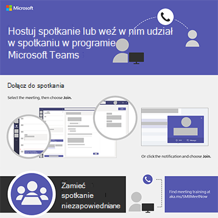

# Microsoft 365 i Microsoft Teams użytkowników

Te infografiki przedstawiają najlepsze rozwiązania dotyczące pracy i współpracy w Microsoft 365. Udostępnij je swoim użytkownikom, aby upewnić się, że mogą oni korzystać z bezpiecznego przechowywania i udostępniania plików, trzymania spotkań zespołowych i nie tylko.

Więcej [infografik Office do](https://support.microsoft.com/office/great-ways-to-work-with-office-6fe70269-b9a4-4ef0-a96e-7a5858b3bd5a) pobrania w witrynie Microsoft 365 [szkoleniowej](https://support.microsoft.com/training).

## Microsoft 365 porady dotyczące zabezpieczeń

Pobierz tę infografikę z poradami dotyczącymi zabezpieczeń dla członków zespołu — zarówno w przypadku zespołu, jak i organizacji niedochodowej, takiej jak kampania wyborcza:

| Element | Opis |
|:-----|:-----|
|   [Pobierz jako plik PDF](https://download.microsoft.com/download/f/c/5/fc58bc0c-773a-4ac8-a232-6f986f61ef58/M365CampaignsWhatCanUsersDoToSecure.pdf) \  [Pobierz jako PowerPoint](https://download.microsoft.com/download/f/c/5/fc58bc0c-773a-4ac8-a232-6f986f61ef58/M365CampaignsWhatCanUsersDoToSecure.pptx)| Udostępnij te najlepsze rozwiązania dotyczące zabezpieczania informacji organizacji za pomocą usługi Microsoft 365. Ta infografika została utworzona w celu wspierania personelu kampanii politycznych, ponieważ są one kierowane przez zaawansowane hakerów. Możesz skorzystać z tej PowerPoint, aby dostosować tę infografikę dla swojej organizacji. Powiązany artykuł: [Jak zalecenia dotyczące zabezpieczeń dotyczące Microsoft 365 wpływają na użytkowników](../business-premium/m365-campaigns-users.md)|

## Udostępnianie plików firmowych przy Teams, SharePoint i OneDrive

Pobierz infografikę, aby uzyskać krótkie omówienie sposobów udostępniania plików firmowych:
  
| Element | Opis |
|:-----|:-----|
|   [Pobierz jako plik PDF](https://go.microsoft.com/fwlink/?linkid=2079435) \  [Pobierz jako PowerPoint](https://go.microsoft.com/fwlink/?linkid=2079438) | Korzystaj z tych najlepszych rozwiązań podczas udostępniania plików firmowych i współpracy nad nimi, aby zapewnić bezpieczeństwo i ochronę swoich informacji. Udostępniaj w wiadomości e-mail Teams programie i przechowuj pliki w SharePoint i OneDrive. Artykuł pokrewny: [Omówienie udostępniania plików firmowych](../business-video/overview-file-sharing.md)|

## Hostuj spotkania online w Microsoft Teams

Pobierz infografikę, aby szybko sprawdzić, jak dołączyć do spotkania online lub je hostować za pomocą programu Microsoft Teams:

| Element | Opis |
|:-----|:-----|
|   [Pobierz jako plik PDF](https://go.microsoft.com/fwlink/?linkid=2078712) \  [Pobierz jako PowerPoint](https://go.microsoft.com/fwlink/?linkid=2079515) | Krótkie wprowadzenie do sposobu hostować spotkanie online lub dołączać do niego za pomocą programu Microsoft Teams. 

## Pracuj z dowolnego miejsca dzięki OneDrive i Microsoft 365

Pobierz infografikę, aby uzyskać porady dotyczące pracy z dowolnego miejsca przy użyciu plików w aplikacjach OneDrive i Aplikacje Microsoft 365:

| Element | Opis |
|:-----|:-----|
|   [Pobierz jako plik PDF](https://go.microsoft.com/fwlink/?linkid=2079451) \  [Pobierz jako PowerPoint](https://go.microsoft.com/fwlink/?linkid=2079455) | Zobacz porady dotyczące sposobu skonfigurowania urządzeń przenośnych w celu umożliwienia pracy z dowolnego miejsca Aplikacje Microsoft 365 i OneDrive. Artykuł pokrewny: [Praca z dowolnego miejsca](../business-video/work-from-anywhere.md)|

## Ankieta dla klientów za pomocą formularzy w programie Microsoft 365

Pobierz infografikę, aby dowiedzieć się, jak ankietować klientów (wewnętrznych lub zewnętrznych) za pomocą programu Microsoft Forms w programie Microsoft 365:

| Element | Opis |
|:-----|:-----|
|   [Pobierz jako plik PDF](https://go.microsoft.com/fwlink/?linkid=2079526) \  [Pobierz jako PowerPoint](https://go.microsoft.com/fwlink/?linkid=2079446) | Użyj programu Microsoft Forms, aby dowiedzieć się, co sądzą klienci. Powiązany artykuł: [Zbieranie informacji za pomocą programu Microsoft Forms](https://support.microsoft.com/topic/collect-information-with-microsoft-forms-a55d6e0d-04f6-45b8-b05f-b141b8ecb4d5)|
