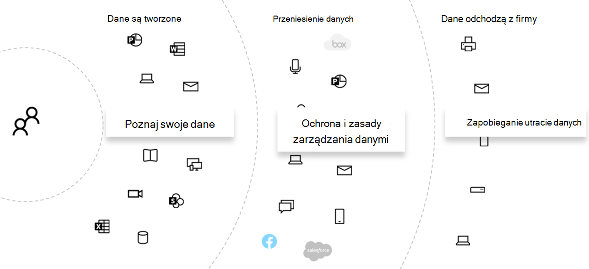

# Ocena ryzyka związanego z prywatnością danych i identyfikowanie poufnych elementów przy użyciu Microsoft 365

Ocena przepisów dotyczących prywatności danych i zagrożeń, na które podlega organizacja, jest pierwszym krokiem przed wdrożeniem wszelkich powiązanych akcji poprawy, w tym akcji osiągalnych za pomocą funkcji i usług Microsoft 365.

## Potencjalnie obowiązujące przepisy dotyczące prywatności danych

Aby uzyskać dobre informacje na temat szerszych ram regulacyjnych dotyczących przepisów dotyczących ochrony prywatności danych, zobacz [Portal zaufania usług firmy Microsoft](https://servicetrust.microsoft.com/) oraz [serię artykułów na temat rozporządzenia o ochronie danych osobowych (RODO](/compliance/regulatory/gdpr)). Zapoznaj się również z materiałami dotyczącymi przepisów, które mogą podlegać Twojej branży lub regionowi.

### RODO

RODO jest najbardziej znanym i cytowanym przepisami dotyczącymi prywatności danych. Reguluje ona zbieranie, przechowywanie, przetwarzanie i udostępnianie wszelkich danych osobowych odnoszących się do zidentyfikowanej lub możliwej do zidentyfikowania osoby fizycznej, która jest rezydentem Unii Europejskiej (UE).

Zgodnie z rozporządzeniem RODO art.

- "dane osobowe" oznaczają wszelkie informacje dotyczące zidentyfikowanej lub możliwej do zidentyfikowania osoby fizycznej ("podmiot danych"); identyfikowalna osoba fizyczna to osoba, którą można zidentyfikować bezpośrednio lub pośrednio, w szczególności przez odniesienie do identyfikatora, takiego jak imię i nazwisko, numer identyfikacyjny, dane lokalizacji, identyfikator online lub co najmniej jeden czynnik specyficzny dla fizycznej, fizjologicznej, genetycznej, psychicznej, ekonomicznej, kulturowej lub społecznej tożsamości tej osoby fizycznej.

### ISO 27001

Przestrzeganie innych standardów, takich jak ISO 27001, zostało również uznane przez kilka europejskich organów nadzorczych za ważny pełnomocnik intencji w całym spektrum ludzi, procesów i technologii. Standardy, które określa, nakładają się na siebie i są zgodne z mechanizmami ochrony opartymi na normie ISO-27001, można uznać za serwer proxy, który w pewnych okolicznościach spełnia niektóre obowiązki w zakresie ochrony prywatności.

### Inne przepisy dotyczące prywatności danych

Inne ważne przepisy dotyczące prywatności danych określają również wymagania dotyczące obsługi danych osobowych.

W Stany Zjednoczone należą do nich California Consumer Protection Act ([CCPA](/compliance/regulatory/ccpa-faq)), HIPAA-HITECH (Stany Zjednoczone ustawy o ochronie prywatności opieki zdrowotnej) i Graham Leach Bliley Act (GLBA). Dodatkowe przepisy specyficzne dla stanu są również w miejscu lub w rozwoju.

Na całym świecie dodatkowe przykłady obejmują niemiecką krajową ustawę o wdrożeniu RODO (BDSG), brazylijską ustawę o ochronie danych (LGPD) i wiele innych.

## Mapowanie przepisów na kategorie kontroli technicznej Microsoft 365

Wiele przepisów dotyczących prywatności danych ma nakładające się wymagania, dlatego przed opracowaniem jakiegokolwiek schematu kontroli technicznej należy zrozumieć, którym przepisom podlegają.

Aby uzyskać późniejsze informacje w artykułach tego ogólnego rozwiązania, ta tabela zawiera fragmenty próbkowania przepisów dotyczących prywatności danych.

|Rozporządzenie|Artykuł/sekcja|Fragment|Odpowiednie kategorie kontroli technicznej|
|---|---|---|---|
|RODO|Artykuł 5 ust.|Dane osobowe są przetwarzane w sposób zapewniający odpowiednie bezpieczeństwo danych osobowych, w tym ochronę przed nieautoryzowanym lub niezgodnym z prawem przetwarzaniem oraz przed przypadkową utratą, zniszczeniem lub uszkodzeniem, przy użyciu odpowiednich środków technicznych lub organizacyjnych ("integralność i poufność".|(Wszystkie)   Tożsamości   Urządzenie   Ochrona przed zagrożeniami   Ochrona informacji   Informacje o zarządzaniu   Odkryj i odpowiedz|
||Artykuł (32)(1)a)|Uwzględniając stan wiedzy, koszty realizacji oraz charakter, zakres, kontekst i cele przetwarzania, a także ryzyko zróżnicowanego prawdopodobieństwa i ważności praw i wolności osób fizycznych, administrator i podmiot przetwarzający wdrażają odpowiednie środki techniczne i organizacyjne w celu zapewnienia poziomu bezpieczeństwa odpowiedniego dla ryzyka,  w tym między innymi w stosownych przypadkach: a) pseudonimizacja i szyfrowanie danych osobowych.|Ochrona informacji|
||Artykuł (13)(2)a)|"... administrator w momencie uzyskania danych osobowych dostarcza podmiotowi danych następujące dodatkowe informacje niezbędne do zapewnienia sprawiedliwego i przejrzystego przetwarzania: a) okres, w którym dane osobowe będą przechowywane lub jeśli nie jest to możliwe, kryteria stosowane do określenia tego okresu.|Informacje o zarządzaniu|
||Artykuł (15)(1)(e)|Podmiot danych ma prawo do uzyskania od administratora potwierdzenia, czy dane osobowe dotyczące go są przetwarzane, a w takim przypadku dostęp do danych osobowych i następujące informacje: e) istnienie prawa do żądania od administratora sprostowania lub usunięcia danych osobowych lub ograniczenia przetwarzania danych osobowych dotyczących podmiotu danych lub sprzeciwu wobec takiego Przetwarzania|Odkryj i odpowiedz|
|LGPD|Artykuł 46|Agenci przetwarzania przyjmują środki bezpieczeństwa, techniczne i administracyjne, które mogą chronić dane osobowe przed nieautoryzowanym dostępem oraz przypadkowymi lub niezgodnymi z prawem sytuacjami zniszczenia, utraty, zmiany, komunikacji lub jakiegokolwiek rodzaju niewłaściwego lub niezgodnego z prawem przetwarzania.|Ochrona informacji   Informacje o zarządzaniu   Odkryj i odpowiedz|
||Artykuł 48|Administrator musi przekazać organowi krajowemu i podmiotowi danych wystąpienie zdarzenia bezpieczeństwa, które może spowodować ryzyko lub istotne szkody dla osób, których dane dotyczą.|Odkryj i odpowiedz|
|HIPPA-HITECH|45 CFR 164.312(e)(1)|Wdrożenie technicznych środków bezpieczeństwa w celu ochrony przed nieautoryzowanym dostępem do elektronicznych chronionych informacji zdrowotnych przesyłanych za pośrednictwem sieci łączności elektronicznej.|Ochrona informacji|
||45 C.F.R. 164.312(e)(2)(ii)|Zaimplementuj mechanizm szyfrowania elektronicznych chronionych informacji o kondycji zawsze, gdy uzna to za stosowne.|Ochrona informacji|
||45 CFR 164.312(c)(2)|Wdrożenie mechanizmów elektronicznych w celu potwierdzenia, że elektroniczne chronione informacje zdrowotne nie zostały zmienione ani zniszczone w nieautoryzowany sposób.|Informacje o zarządzaniu|
||45 CFR 164.316(b)(1)(i)|Jeśli niniejsza część podrzędna wymaga udokumentowania działania, działania lub oceny, zachowaj pisemny (elektroniczny) zapis działania, działania lub oceny|Informacje o zarządzaniu|
||45 CFR 164.316(b)(1)(ii)|Zachowaj dokumentację wymaganą przez akapit (b)(1) tej sekcji przez 6 lat od daty jej utworzenia lub daty jej ostatniego wejścia w życie, w zależności od tego, co nastąpi później.|Informacje o zarządzaniu|
||45 C.F.R. 164.308(a)(1)(ii)(D)|Implementowanie procedur regularnego przeglądania rekordów aktywności systemu informacyjnego, takich jak dzienniki inspekcji, raporty dostępu i raporty śledzenia zdarzeń zabezpieczeń|Odkryj i odpowiedz|
||45 C.F.R. 164.308(a)(6)(ii)|Identyfikowanie podejrzanych lub znanych zdarzeń zabezpieczeń oraz reagowanie na nie; ograniczyć, w zakresie, w jakim jest to możliwe, szkodliwe skutki zdarzeń związanych z zabezpieczeniami, które są znane podmiotowi objętemu lub podmiotowi stowarzyszonemu; i dokumentowanie zdarzeń związanych z bezpieczeństwem i ich wyników.|Odkryj i odpowiedz|
||45 C.F.R. 164.312(b)|Zaimplementuj sprzęt, oprogramowanie i mechanizmy proceduralne, które rejestrują i analizują działania w systemach informacyjnych zawierających lub korzystających z elektronicznych chronionych informacji zdrowotnych.|Odkryj i odpowiedz|
|CCPA|1798.105(c)|Firma, która otrzymuje weryfikowalny wniosek od konsumenta o usunięcie danych osobowych konsumenta zgodnie z podpodziału a) niniejszej sekcji, usuwa dane osobowe konsumenta z jego rejestrów i kieruje do wszystkich usługodawców usunięcie danych osobowych konsumenta z ich ewidencji|Odkryj i odpowiedz|
||1798.105(d)|(wyjątki od 1798.105(c)   Firma lub usługodawca nie musi spełniać żądania konsumenta usunięcia danych osobowych konsumenta, jeśli jest to konieczne, aby firma lub usługodawca utrzymywał dane osobowe konsumenta w celu: (zapoznaj się z obowiązującym rozporządzeniem w celu uzyskania dodatkowych informacji).|Odkryj i odpowiedz|
|||||

> [!IMPORTANT]
> Nie ma to być wyczerpująca lista. Aby uzyskać więcej informacji na temat stosowania przytoczonych sekcji do wymienionych kategorii kontroli technicznej, zapoznaj się z menedżerem [zgodności](../compliance/compliance-manager.md) lub doradcą ds. zgodności.

## Znajomość danych

Niezależnie od przepisów, którym podlegasz, w przypadku, gdy różne typy danych użytkowników w organizacji i poza nią wchodzą w interakcje z systemami, wszystkie ważne czynniki mogą mieć wpływ na ogólną strategię ochrony danych osobowych, z zastrzeżeniem przepisów branżowych i rządowych mających zastosowanie do Organizacji. Obejmuje to miejsce przechowywania danych osobowych, ich typ i ilość danych oraz w jakich okolicznościach zostały zebrane.

### Przenośność danych

Dane są również przenoszone w miarę ich przetwarzania, uściślania i innych wersji. Początkowa migawka nigdy nie wystarczy. Musi istnieć ciągły proces znajomości danych. Stanowi to jedno z największych wyzwań dla dużych organizacji, które obsługują znaczną ilość danych osobowych. Organizacje, które nie rozwiązują problemu "poznaj swoje dane", mogą potencjalnie wiązać się z bardzo wysokim ryzykiem i możliwymi grzywnami ze strony agencji regulacyjnych.

### Gdzie dane osobowe są

Aby rozwiązać problemy z przepisami dotyczącymi prywatności danych, nie możesz polegać na ogólnych pojęciach, gdzie według Ciebie dane osobowe mogą istnieć teraz lub w przyszłości. Przepisy dotyczące prywatności danych wymagają, aby organizacje udowodniły, że wiedzą, gdzie dane osobowe są na bieżąco. Dzięki temu ważne jest, aby utworzyć początkową migawkę wszystkich źródeł danych na potrzeby możliwego przechowywania danych osobowych, w tym środowiska Microsoft 365, oraz ustanowić mechanizmy ciągłego monitorowania i wykrywania.

Jeśli nie oceniono jeszcze ogólnej gotowości i ryzyka związanego z przepisami dotyczącymi prywatności danych, skorzystaj z poniższej trzyetapowej struktury, aby rozpocząć pracę.

> [!NOTE]
> Ten artykuł i jego zawartość nie mają na celu umieszczenia usług doradztwa prawnego. Zawiera ona tylko podstawowe wskazówki i linki do narzędzi, które mogą być pomocne na wczesnych etapach oceny.

## Krok 1. Opracowywanie podstawowego zrozumienia scenariuszy danych osobowych organizacji

Należy ocenić narażenie na ryzyko związane z prywatnością danych na podstawie rodzaju danych osobowych, którymi obecnie zarządza, gdzie są przechowywane, jakie mechanizmy ochronne są na nim umieszczane, jak jest zarządzany cykl życia i kto ma do nich dostęp.

Na początek ważne jest, aby określić, jakie typy danych osobowych istnieją w środowisku Microsoft 365. Użyj następujących kategorii:

- Dane pracowników wymagane do wykonywania codziennych funkcji biznesowych
- Dane organizacji dotyczące jej klientów biznesowych, partnerów i innych relacji w scenariuszu biznesowym (B2B)
- Dane organizacji dotyczące konsumentów, którzy dostarczają informacje Usługi online, które organizacja zarządza w scenariuszu biznesowym-klient (B2C)

Oto przykład różnych typów danych dla typowych działów organizacji.

Większość danych osobowych podlegających regulacjom dotyczącym prywatności danych jest zwykle zbierana i przechowywana poza Microsoft 365. Wszelkie dane osobowe z aplikacji internetowych lub mobilnych dla konsumentów musiałyby zostać wyeksportowane z takich aplikacji do Microsoft 365, aby podlegały kontroli prywatności danych w ramach Microsoft 365.

Ochrona prywatności danych w Microsoft 365 może być bardziej ograniczona w stosunku do aplikacji internetowych i systemów CRM, których to rozwiązanie nie dotyczy.

Ważne jest również, aby podczas oceny profilu ryzyka zastanowić się nad następującymi typowymi wyzwaniami dotyczącymi zgodności z prywatnością danych:

- **Dystrybucja danych osobowych.** Jak rozproszone są informacje o danym temacie? Czy wiadomo, że jest wystarczająco dobrze, aby przekonać organy regulacyjne, że istnieją odpowiednie kontrole? Czy można go zbadać i skorygować w razie potrzeby?
- **Ochrona przed eksfiltracją.** Jak chronić dane osobowe danego typu lub źródła przed naruszeniem zabezpieczeń i jak zareagować, jeśli tak było?
- **Ochrona a ryzyko.** Jakie mechanizmy ochrony informacji są odpowiednie w stosunku do ryzyka oraz jak utrzymać ciągłość działania i produktywność oraz zminimalizować wpływ użytkowników końcowych, jeśli wymagana jest interwencja użytkownika końcowego? Na przykład czy należy używać ręcznej klasyfikacji lub szyfrowania?
- **Przechowywanie danych osobowych.** Jak długo należy przechowywać informacje zawierające dane osobowe z ważnych powodów biznesowych i jak uniknąć wcześniejszych praktyk utrzymywania ich na zawsze, zrównoważonych potrzebami przechowywania w celu zapewnienia ciągłości działania?
- **Obsługa żądań podmiotów danych.** Jakie mechanizmy będą potrzebne do obsługi żądań podmiotów danych (DSR) i wszelkich akcji korygowania, takich jak anonimizacja, ponowna akcja i usuwanie?
- **Bieżące monitorowanie i raportowanie.** Jakiego rodzaju codzienne techniki monitorowania, analizy i raportowania są dostępne dla różnych typów danych i źródeł?
- **Ograniczenia dotyczące przetwarzania danych.** Czy istnieją ograniczenia dotyczące używania danych dla informacji zbieranych lub przechowywanych za pomocą tych metod, które organizacja musi odzwierciedlać w mechanizmach kontroli prywatności? Na przykład zobowiązania, że dane osobowe nie będą używane przez pracowników sprzedaży, mogą wymagać od organizacji wprowadzenia mechanizmów uniemożliwiających transfer lub przechowywanie tych informacji w systemach skojarzonych z organizacją sprzedaży.

### Dane pracowników wymagane do wykonywania codziennych funkcji biznesowych

Organizacje z natury muszą zbierać dane dotyczące pracowników w celach związanych z tożsamością elektroniczną i kadrą, z zastrzeżeniem tego, na co zgadzają się w umowach dotyczących pracowników. Tak długo, jak dana osoba pracuje w firmie, zazwyczaj nie jest to problem. Organizacja może chcieć wprowadzić mechanizmy uniemożliwiające złośliwym podmiotom eksfiltrację lub wyciek danych osobowych pracowników.

Jeśli dana osoba opuszcza firmę, organizacje zwykle mają procesy, procedury oraz harmonogramy przechowywania i usuwania dotyczące usuwania kont użytkowników, likwidowania skrzynek pocztowych i dysków osobistych oraz zmieniania stanu pracownika w takich sytuacjach jak systemy zasobów ludzkich. W sytuacjach, w których toczą się spory sądowe, pracownik lub inna strona dochodzenia prawnego może mieć uzasadnione powody do uzyskania informacji o danych osobowych przechowywanych w systemach organizacji. W niektórych przypadkach strona ta może zażądać usunięcia lub zanonimizowania takich danych.

Aby zaspokoić takie potrzeby, organizacje powinny dysponować procesami i procedurami, które dotyczą potrzeb zapobiegawczych, detektywistycznych i naprawczych, aby ułatwić takie żądania, zauważając, że niektóre informacje o pracowniku mogą być racjonalnie uważane za kluczowe dla ciągłości działalności biznesowej. Na przykład informacje, że dana osoba jest autorem pliku lub wykonała funkcję.

> [!NOTE]
> Aby zapoznać się z technikami analizy i korygowania danych osobowych w Microsoft 365, zobacz [artykuł dotyczący monitorowania i reagowania](information-protection-deploy-monitor-respond.md). Możesz również zastosować zautomatyzowane systemy klasyfikacji i ochrony, aby upewnić się, że dane osobowe są kontrolowane w organizacji, a także uniemożliwić opuszczanie organizacji w sytuacjach złośliwego aktora. Aby uzyskać więcej informacji, zobacz [artykuł dotyczący ochrony informacji](information-protection-deploy-protect-information.md) .

### Dane organizacji dotyczące klientów biznesowych w scenariuszu B2B

Zbieranie informacji B2B jest również wyzwaniem, ponieważ organizacja może wymagać prowadzenia ewidencji nazw klientów i transakcji w różnych systemach w celu zapewnienia ciągłości działalności biznesowej, a jednocześnie chronić te informacje przed nieumyślnym lub złośliwym eksfiltracją. Podobnie jak dane pracowników, organizacje muszą mieć zasady, procedury i mechanizmy kontroli technicznej, aby chronić takie dane, a także starzeć je zgodnie ze zdefiniowanymi harmonogramami przechowywania i usuwania.

Zazwyczaj umowy z klientami zewnętrznymi, partnerami i innymi jednostkami, z którymi organizacja prowadzi działalność, będą miały język obsługujący takie dane, w tym ochronę, przechowywanie i usuwanie zarówno w trakcie, jak i po relacji jednostki z organizacją.

### Dane organizacji dotyczące konsumentów, którzy dostarczają informacje Usługi online, które organizacja zarządza w scenariuszu B2C

Ta kategoria jest jedną z tych, które większość osób myśli o ochronie prywatności danych z powodu wielu publicznych wystąpień wycieku danych klientów. Może to być zamierzone, takie jak strona trzecia w ramach umowy z dostawcą lub niezamierzone, takie jak eksfiltracja przez złośliwego aktora. Ochrona danych konsumentów jest jednym z głównych powodów, dla których UE i inne wprowadziły te przepisy. Przepisy dotyczące prywatności danych, takie jak RODO i CCPA, wymagają planowania:

- [Plany akcji](/compliance/regulatory/gdpr-action-plan) i [listy kontrolne gotowości do odpowiedzialności](/compliance/regulatory/gdpr-arc-Office365)
- [Oceny wpływu ochrony danych](/compliance/regulatory/gdpr-data-protection-impact-assessments)
- [Powiadomienia o naruszeniu zabezpieczeń](/compliance/regulatory/gdpr-breach-Office365)
- [Żądania podmiotów danych](/compliance/regulatory/gdpr-dsr-Office365)

Jeśli Twoja organizacja nie wykonuje wielu zbierania danych bezpośrednio od konsumentów, ta kategoria może stanowić mniejszy problem. Jednak nadal może być konieczne przejście przez procesy opisane w tych artykułach, aby osiągnąć zgodność.

### Podsumowanie kroku 1

Zrozumienie narażenia na ryzyko i regulacji prywatności danych jest ważnym pierwszym krokiem opartym na podstawowym zrozumieniu scenariuszy danych osobowych organizacji.

Jeśli nie masz danych osobowych od konsumentów w środowisku Microsoft 365 lub są one ograniczone do niektórych części środowiska, a potrzeba kontroli technicznej zależy od ujawnienia danych typu konsumenta, kontrola techniczna może wymagać stosowania tylko w częściach środowiska wysokiego ryzyka, a nie wszędzie.

Chociaż rekomendacja organizacji zewnętrznej lub standardowego zestawu kontroli, na przykład z programu Compliance Manager w Microsoft 365, może pomóc w informowaniu o strategii kontroli, wybór implementacji powinien być spowodowany świadomością spisu danych w celu kwantyfikacji rzeczywistego narażenia na ryzyko.

Większość organizacji będzie miała pewne narażenie na jeden z powyższych scenariuszy. Ważne jest przyjęcie całościowego podejścia do oceny.

## Krok 2. Ocena gotowości do przestrzegania przepisów dotyczących prywatności danych

Mimo że są specyficzne dla RODO, pytania przedstawione w bezpłatnym [narzędziu do oceny RODO firmy Microsoft](https://clouddamcdnprodep.azureedge.net/gdc/1863571/original) zapewniają dobry początek w zrozumieniu ogólnej gotowości do ochrony prywatności danych.

Organizacje podlegające innym przepisom dotyczącym ochrony prywatności danych, takim jak CCPA w Stany Zjednoczone lub lgpd Brazylii, mogą również korzystać z spisu gotowości tego narzędzia z powodu nakładania się przepisów rodorza.

Ocena RODO składa się z następujących sekcji:

|Sekcji|Opis|
|:-------|:-----|
|Nadzór|<ol><li>Czy zasady ochrony prywatności jawnie zawierają informacje o danych, które są przetwarzane? </li><li>Czy regularnie uruchamiasz oceny wpływu na prywatność? </li><li> Czy używasz narzędzia do zarządzania danymi osobowymi? </li><li> Czy masz uprawnienia prawne do prowadzenia działalności gospodarczej przy użyciu danych PI dla danej osoby? Czy śledzisz zgodę na dane? </li><li> Czy można śledzić, implementować i zarządzać kontrolkami inspekcji? Czy monitorujesz przecieki danych? </li></ol>|
|Usuwanie i powiadamianie|<ol><li>Czy podajesz jawne instrukcje dotyczące sposobu uzyskiwania dostępu do danych użytkowników? </li><li> Czy masz udokumentowane procesy obsługi zgody na rezygnację? </li><li> Czy masz proces automatycznego usuwania danych? </li><li> Czy masz proces weryfikacji tożsamości podczas angażowania się w kontakt z klientem? </li></ol>|
|Ograniczanie ryzyka i bezpieczeństwo informacji|<ol><li>Czy używasz narzędzi do skanowania danych bez struktury? </li><li>Czy wszystkie serwery są aktualne i czy używasz zapór do ich ochrony? </li><li>Czy są uruchamiane regularne kopie zapasowe serwerów? </li><li>Czy aktywnie monitorujesz przecieki danych? </li><li>Czy szyfrujesz dane magazynowane i przesyłane? </li></ol>|
|Zarządzanie zasadami|<ol><li>Jak zarządzać powiązaniami reguł firmowych? </li><li>Czy śledzisz zgodę na dane? </li><li> Czy umowy obejmują klasyfikacje danych i wymagania dotyczące obsługi w skali od 1 do 5 lub 5? </li><li>Czy masz i regularnie testujesz plan reagowania na zdarzenia? </li><li>Jakich zasad używasz do zarządzania dostępem? </li></ol>|
|||

## Krok 3. Identyfikowanie typów informacji poufnych występujących w środowisku Microsoft 365

Ten krok obejmuje identyfikację konkretnych typów informacji poufnych, które podlegają określonym kontrolom regulacyjnym, a także ich występowanie w środowisku Microsoft 365.

Znajdowanie zawartości w środowisku zawierającej dane osobiste może być ogromnym zadaniem, które wcześniej wiąże się z użyciem wyszukiwania zgodności, zbierania elektronicznych materiałów dowodowych, zbierania elektronicznych materiałów dowodowych (Premium), DLP i inspekcji.

Dzięki nowemu rozwiązaniu **do klasyfikacji danych** w portalu zgodności usługi Microsoft Purview stało się to znacznie łatwiejsze dzięki funkcji [Eksploratora zawartości](../compliance/data-classification-content-explorer.md) , która współpracuje z wbudowanymi lub niestandardowymi typami informacji poufnych, w tym tymi dotyczącymi danych osobowych.

### Typy informacji poufnych

Portal zgodności usługi Microsoft Purview zawiera wstępnie załadowanych ponad 100 poufnych typów informacji, z większością z nich związanych z identyfikowaniem i lokalizowaniem danych osobowych. Te wbudowane typy informacji poufnych mogą pomóc w identyfikowaniu i ochronie numerów kart kredytowych, numerów kont bankowych, numerów paszportów i innych, na podstawie wzorców zdefiniowanych przez wyrażenie regularne (regex) lub funkcję. Aby dowiedzieć się więcej, zobacz [Wyszukiwanie typów informacji poufnych](../compliance/sensitive-information-type-entity-definitions.md).

Jeśli musisz zidentyfikować i chronić specyficzny dla organizacji lub regionalny typ poufnych elementów, na przykład niestandardowy format identyfikatorów pracowników lub inne dane osobowe, które nie są jeszcze objęte wbudowanym typem informacji poufnych, możesz utworzyć niestandardowy typ informacji poufnych przy użyciu następujących metod:

- PowerShell
- Reguły niestandardowe z dokładnym dopasowaniem danych (EDM)
- Za pośrednictwem interfejsu użytkownika administratora Centrum zgodności, co zostało wyróżnione w [artykule Use Compliance Score and Compliance Manager (Używanie wskaźnika zgodności i menedżera zgodności](information-protection-deploy-compliance.md))

Możesz również dostosować istniejący, wbudowany typ informacji poufnych.

Aby uzyskać więcej informacji, zobacz następujące artykuły:

- [Dostosuj wbudowany typ informacji poufnych](../compliance/customize-a-built-in-sensitive-information-type.md)
- [Dowiedz się więcej o typach informacji poufnych](../compliance/sensitive-information-type-learn-about.md)
- [Tworzenie niestandardowego typu informacji poufnych w Centrum zgodności & zabezpieczeń](../compliance/create-a-custom-sensitive-information-type.md)
- [Tworzenie niestandardowego typu informacji poufnych w programie PowerShell Centrum zgodności & zabezpieczeń](../compliance/create-a-custom-sensitive-information-type-in-scc-powershell.md)
- [Tworzenie niestandardowych typów informacji poufnych przy użyciu klasyfikacji opartej na dokładnym dopasowaniu danych](../compliance/create-custom-sensitive-information-types-with-exact-data-match-based-classification.md)

### Eksplorator zawartości

Ważnym narzędziem do określania wystąpienia poufnych elementów w środowisku jest nowy [Eksplorator zawartości](../compliance/data-classification-content-explorer.md) w centrum administracyjnym usługi Microsoft Purview. Jest to zautomatyzowane narzędzie do początkowego i ciągłego skanowania całej subskrypcji Microsoft 365 pod kątem występowania typów informacji poufnych i wyświetlania wyników.

Nowe narzędzie Eksploratora zawartości umożliwia szybkie identyfikowanie lokalizacji poufnych elementów w środowisku przy użyciu wbudowanych typów informacji poufnych lub niestandardowych. Może to obejmować ustanowienie procesu i przypisaną odpowiedzialność za regularne badanie obecności i lokalizacji poufnych elementów.

Wraz z innymi krokami wyróżnionymi w tym artykule stanowi to punkt wyjścia do identyfikowania ogólnego narażenia na ryzyko, gotowości i lokalizacji poufnych elementów w celu ochrony za pośrednictwem planowanej konfiguracji i monitorowania Microsoft 365.

### Inne metody identyfikowania danych osobowych w twoim środowisku

Oprócz Eksploratora zawartości organizacje mają dostęp do funkcji wyszukiwania zawartości w celu tworzenia niestandardowych wyszukiwań w celu znajdowania danych osobowych w swoim środowisku przy użyciu zaawansowanych kryteriów wyszukiwania i filtrów niestandardowych.

Szczegółowe wskazówki dotyczące korzystania z wyszukiwania zawartości do odnajdywania danych osobowych znajdują się w [tym artykule](/compliance/regulatory/gdpr). Wyszukiwanie zawartości i inne techniki odnajdywania są również eksplorowane w [celach DSR dla RODO i CCPA](/compliance/regulatory/gdpr-dsr-Office365#introduction-to-dsrs).

Dodatkowe informacje na temat technik dochodzeniowych i korygowania danych osobowych w Microsoft 365 znajdują się w [artykule monitorowanie i reagowanie](information-protection-deploy-monitor-respond.md).

> [!NOTE]
> Aby znaleźć informacje poufne przechowywane w plikach przechowywanych lokalnie, zapoznaj się z artykułem [Azure Information Protection](/azure/information-protection/quickstart-findsensitiveinfo).
