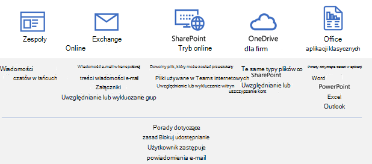
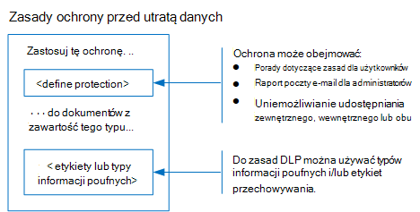
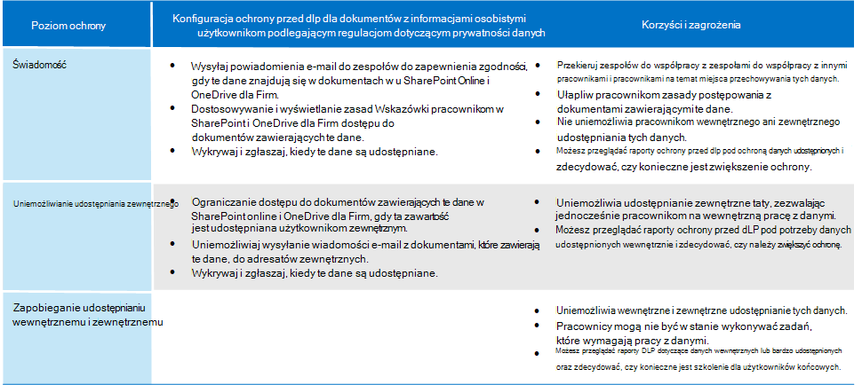

# Ochrona informacji podlegających przepisom dotyczącym prywatności danych

W ramach subskrypcji można zastosować szereg mechanizmów kontroli ochrony informacji, które ułatwiają spełnianie wymagań i przepisów dotyczących zgodności z prywatnością danych. Należą do nich ogólne rozporządzenie o ochronie danych (RODO), HIPAA-HITECH (ustawa o ochronie prywatności Stany Zjednoczone służbie zdrowia), California Consumer Protection Act (CCPA) i Brazil Data Protection Act (LGPD).

Te kontrolki znajdują się w następujących obszarach rozwiązania:

- Etykiety wrażliwości
- Ochrona przed utratą danych (DLP) w usłudze Microsoft Purview
- Szyfrowanie komunikatów usługi Microsoft Purview
- kontrola dostępu Teams i lokacji

> [!NOTE]
> To rozwiązanie zawiera opis funkcji zabezpieczeń i zgodności w celu ochrony informacji podlegających przepisom dotyczącym prywatności danych. Aby uzyskać pełną listę funkcji zabezpieczeń w Microsoft 365, zobacz [Microsoft 365 dokumentację zabezpieczeń](../security/index.yml). Aby uzyskać pełną listę funkcji zgodności w Microsoft 365, zobacz [dokumentację usługi Microsoft Purview](../compliance/index.yml).

## Przepisy dotyczące prywatności danych, które mają wpływ na mechanizmy kontroli ochrony informacji

Oto przykładowa lista przepisów dotyczących prywatności danych, które mogą odnosić się do mechanizmów kontroli ochrony informacji:

- RODO art.
- RODO art.
- ARTYKUŁ LGPD 46
- HIPAA-HITECH (45 CFR 164.312(e)(1))
- HIPAA-HITECH (45 C.F.R. 164.312(e)(2)(ii))

Aby uzyskać więcej informacji na temat każdego z [powyższych elementów, zapoznaj się z artykułem Dotyczącym oceny ryzyka związanego z prywatnością danych i identyfikowania elementów poufnych](information-protection-deploy-assess.md) .

Przepisy dotyczące ochrony danych w zakresie ochrony informacji zalecają:

- Ochrona przed utratą lub nieautoryzowanym dostępem, użyciem i/lub transmisją.
- Oparte na ryzyku stosowanie mechanizmów ochronnych.
- Użycie szyfrowania w stosownych przypadkach.

Organizacja może również chcieć chronić zawartość Microsoft 365 do innych celów, takich jak inne potrzeby w zakresie zgodności lub ze względów biznesowych. Ustanowienie systemu ochrony informacji w zakresie prywatności danych powinno odbywać się w ramach ogólnego planowania, wdrażania i zarządzania ochroną informacji.

Aby ułatwić rozpoczęcie pracy ze schematem ochrony informacji w Microsoft 365, poniższa sekcja zawiera krótką listę powiązanych możliwości i akcji ulepszeń dla Microsoft 365. Lista zawiera możliwości i akcje poprawy, które mają zastosowanie do przepisów dotyczących prywatności danych. Jednak lista nie zawiera starszych technologii, jeśli istnieje nowsza funkcja, która w dużej mierze zastępuje starszą. Na przykład usługa Zarządzanie prawami do informacji (IRM) dla SharePoint i OneDrive nie jest uwzględniona na liście, ale są uwzględniane etykiety poufności.

## Zarządzanie ochroną informacji w Microsoft 365

[Rozwiązania do ochrony informacji](../compliance/information-protection.md) firmy Microsoft obejmują szereg zintegrowanych funkcji w Microsoft 365, Microsoft Azure i microsoft Windows. W Microsoft 365 rozwiązania do ochrony informacji obejmują:

- [Typy informacji poufnych](../compliance/sensitive-information-type-entity-definitions.md) (opisane w [artykule dotyczącym oceny ryzyka związanego z prywatnością danych i identyfikowania elementów poufnych](information-protection-deploy-assess.md)
- [Etykiety wrażliwości](../compliance/sensitivity-labels.md)
  - Poziom usługi/kontenera
  - Po stronie klienta/na poziomie zawartości
  - Zautomatyzowane do przechowywania danych w SharePoint i OneDrive
- Ochrona przed utratą danych (DLP)
- [Zapobieganie utracie danych punktu końcowego](../compliance/endpoint-dlp-learn-about.md)
- [Office 365 nowych możliwości szyfrowania komunikatów (OME)](../compliance/ome.md) i [zaawansowanego szyfrowania komunikatów](../compliance/ome-advanced-message-encryption.md) OME

Ponadto ochrona na poziomie lokacji i biblioteki to ważne mechanizmy, które należy uwzględnić w dowolnym schemacie ochrony.

Aby uzyskać informacje na temat innych funkcji ochrony informacji poza Microsoft 365, zobacz:

- [Microsoft Defender for Cloud Apps](/cloud-app-security/)
- [Azure Information Protection](/azure/information-protection/what-is-information-protection)
- [Microsoft Endpoint Manager](https://www.microsoft.com/microsoft-365/microsoft-endpoint-manager)
- [Windows Information Protection](/windows/security/information-protection/windows-information-protection/protect-enterprise-data-using-wip)

## Etykiety wrażliwości

Etykiety poufności z usługi Microsoft Purview Information Protection umożliwiają klasyfikowanie i ochronę danych organizacji bez ograniczania produktywności użytkowników i możliwości współpracy.

> [!div class="mx-imgBorder"]
> 

### Wymagania wstępne dotyczące etykiet poufności

Wykonaj następujące działania przed zaimplementowaniem dowolnej z możliwości opartych na etykietach poufności wyróżnionych poniżej:

1. Zapoznaj się z następującymi kwestiami:
   - **Wymagania biznesowe.** Ustal przyczyny biznesowe stosowania etykiet poufności w przedsiębiorstwie. Na przykład wymagania dotyczące prywatności danych na potrzeby ochrony informacji.
   - **Możliwości etykiet poufności.** Etykietowanie poufności może stać się złożone, dlatego przed rozpoczęciem zapoznaj się z [dokumentacją etykiet poufności](../compliance/sensitivity-labels.md) .
   - **Najważniejsze kwestie do zapamiętania** Etykiety poufności są zarządzane w portalu zgodności usługi Microsoft Purview, ale opcje określania wartości docelowej i aplikacji różnią się znacznie.
      - Istnieją etykiety poufności witryn, grup i Teams na poziomie kontenera (ustawienia nie mają zastosowania do zawartości wewnątrz kontenera). Są one publikowane dla użytkowników i grup, którzy stosują je podczas aprowizacji witryny, grupy lub zespołu.
      - Istnieją etykiety poufności dla aktywnej zawartości. Są one również publikowane dla użytkowników lub grup, którzy stosują je ręcznie lub są automatycznie stosowane w następujących przypadkach:
        - Plik jest otwierany/edytowany/zapisywany na pulpicie użytkownika lub w witrynie SharePoint.
        - Wiadomość e-mail została sporządzona i wysłana.
      - Oprócz wiadomości e-mail przesyłanych za pośrednictwem Exchange istnieją etykiety poufności automatycznego stosowania plików magazynowanych w SharePoint i OneDrive. Są one przeznaczone dla wszystkich witryn lub określonych lokacji i są automatycznie stosowane do plików magazynowanych w tych środowiskach.

2. Racjonalizowanie bieżącego etykietowania poufności przy użyciu metod przeszłych lub alternatywnych

   - Azure Information Protection

      Bieżący schemat etykietowania poufności może wymagać uzgodnienia z istniejącą implementacją etykietowania [Information Protection platformy Azure](../compliance/sensitivity-labels.md#sensitivity-labels-and-azure-information-protection).
   - OME

      Jeśli planujesz użycie nowoczesnego etykietowania poufności na potrzeby ochrony poczty e-mail i istniejących metod szyfrowania poczty e-mail, takich jak OME, mogą one współistnieć, ale należy zrozumieć scenariusze, w których należy zastosować dowolną z tych metod. Zobacz [Office 365 nowe funkcje szyfrowania komunikatów (OME),](#office-365-message-encryption-ome-new-capabilities) które zawierają tabelę porównującą nowoczesną ochronę typu etykiet poufności z ochroną opartą na protokole OME.

3. Planowanie integracji z szerszym systemem ochrony informacji. Oprócz współistnienia z OME etykiety poufności mogą być używane wraz z możliwościami, takimi jak Microsoft Purview Data Loss Prevention (DLP) i Microsoft Defender for Cloud Apps. Zobacz [Ochrona danych za pomocą usługi Microsoft Purview](../compliance/information-protection.md) , aby osiągnąć cele związane z ochroną informacji związane z prywatnością danych.

4. Opracowywanie schematu klasyfikacji i kontroli etykiet poufności. Zobacz [Klasyfikacja danych i taksonomia etykiet poufności](https://aka.ms/dataclassificationwhitepaper).

### Ogólne wskazówki

1. **Definicja schematu.** Przed użyciem możliwości technicznych do stosowania etykiet i ochrony należy pracować w całej organizacji, aby zdefiniować schemat klasyfikacji. Być może masz już schemat klasyfikacji, co ułatwia dodawanie danych osobowych.
2. **Wprowadzenie.** Rozpocznij od podjęcia decyzji o liczbie i nazwach etykiet do zaimplementowania. Wykonaj tę czynność, nie martwiąc się o to, której technologii używać i jak będą stosowane etykiety. Zastosuj ten schemat uniwersalnie w całej organizacji, w tym dane, które znajdują się w środowisku lokalnym i w innych usługach w chmurze.
3. **Dodatkowe zalecenia** Podczas projektowania i implementowania zasad, etykiet i warunków należy wziąć pod uwagę następujące zalecenia:

   - **Użyj istniejącego schematu klasyfikacji (jeśli istnieje).** Wiele organizacji korzysta już z klasyfikacji danych w jakiejś formie. Dokładnie oceń istniejący schemat etykiety i jeśli to możliwe, użyj go w następujący sposób. Użycie znanych etykiet, które są rozpoznawalne dla użytkowników końcowych, będzie prowadzić do wdrożenia.
   - **Rozpocznij od małego.** Nie ma praktycznie żadnego limitu liczby etykiet, które można utworzyć. Jednak duża liczba etykiet i etykiet podrzędnych może spowolnić wdrażanie.
   - **Używanie scenariuszy i przypadków użycia.** Identyfikowanie typowych przypadków użycia w organizacji i używanie scenariuszy wynikających z przepisów dotyczących prywatności danych, którym podlegasz. Sprawdź, czy przewidywana konfiguracja etykiet i klasyfikacji będzie działać w praktyce.
   - **Prześlij każde żądanie nowej etykiety.** Czy każdy scenariusz lub przypadek użycia naprawdę wymaga nowej etykiety, czy możesz użyć tego, co już masz? Utrzymanie minimalnej liczby etykiet poprawia wdrożenie.
   - **Użyj etykiet podrzędnych dla kluczowych działów.** Niektóre działy będą miały określone potrzeby, które wymagają określonych etykiet. Zdefiniuj te etykiety jako etykiety podrzędne istniejącej etykiety i rozważ użycie zasad o określonym zakresie, które są przypisane do grup użytkowników, a nie globalnie.
   - **Rozważ zasady o określonym zakresie.** Zasady przeznaczone dla podzbiorów użytkowników uniemożliwią przeciążenie etykiet. Zasady o określonym zakresie umożliwiają przypisywanie etykiet lub etykiet specyficznych dla działu lub działu tylko do pracowników, którzy pracują dla danego działu.
   - **Użyj znaczących nazw etykiet.** Staraj się nie używać żargonu, standardów ani akronimów jako nazw etykiet. Spróbuj użyć nazw, które rezonują z użytkownikiem końcowym, aby poprawić wdrożenie. Zamiast używać etykiet takich jak PII, PCI, HIPAA, LBI, MBI i HBI, należy wziąć pod uwagę takie nazwy jak Inne firmy, Publiczne, Ogólne, Poufne i Wysoce poufne.

### Tworzenie i wdrażanie etykiet poufności dla witryn, grup i zespołów

Podczas tworzenia [etykiet poufności](../compliance/sensitivity-labels-teams-groups-sites.md) w <a href="https://go.microsoft.com/fwlink/p/?linkid=2077149" target="_blank">portalu zgodności usługi Microsoft Purview</a> można teraz zastosować je do tych kontenerów:

- witryny Microsoft Teams
- grupy Microsoft 365 (dawniej grupy Office 365)
- witryny SharePoint

Użyj następujących ustawień etykiety, aby chronić zawartość w tych kontenerach:

- Prywatność (publiczna lub prywatna) witryn Teams połączonych z grupą Microsoft 365
- Dostęp użytkowników zewnętrznych
- Dostęp z urządzeń niezarządzanych

Aby zapewnić prywatność danych, aby zapobiec zewnętrznemu udostępnianiu kontenerów, które będą używane do przechowywania zawartości z poufnymi danymi osobowymi, oznacz pliki zawierające dane jako prywatne i wymagaj urządzeń zarządzanych.

### Tworzenie i wdrażanie etykiet poufności dla zawartości

Etykiety poufności stosowane do plików umożliwiają szyfrowanie ich zawartości, oznaczanie zawartości znakiem wodnym i definiowanie innych kontrolek zawartości Office aplikacji, w tym Outlook i Office w sieci Web.

Gdy wszystko będzie gotowe do rozpoczęcia ochrony danych organizacji przy użyciu etykiet poufności:

1. **Utwórz etykiety.** Utwórz etykiety poufności i nadaj im nazwę zgodnie z taksonomią klasyfikacji organizacji dla różnych poziomów poufności zawartości. Aby uzyskać więcej informacji na temat opracowywania taksonomii klasyfikacji, zobacz [oficjalny dokument Dotyczący klasyfikacji danych i taksonomii etykiet poufności](https://aka.ms/dataclassificationwhitepaper).
2. **Zdefiniuj, co może zrobić każda etykieta.** Skonfiguruj ustawienia ochrony, które mają być skojarzone z każdą etykietą. Na przykład możesz chcieć, aby zawartość o niższej poufności (na przykład etykieta "Ogólne" miała tylko nagłówek lub stopkę, podczas gdy zawartość o większej poufności (np. etykieta "Poufne") powinna mieć znak wodny i mieć włączone szyfrowanie.
3. **Opublikuj etykiety.** Po skonfigurowaniu etykiet poufności opublikuj je przy użyciu zasad etykiety. Zdecyduj, którzy użytkownicy i grupy mają mieć etykiety i jakie ustawienia zasad mają być używane. Pojedyncza etykieta jest wielokrotnego użytku. Zdefiniuj ją raz, a następnie możesz ją uwzględnić w kilku zasadach etykiet przypisanych do różnych użytkowników.

Po opublikowaniu etykiet poufności w <a href="https://go.microsoft.com/fwlink/p/?linkid=2077149" target="_blank">portalu zgodności usługi Microsoft Purview</a> zaczynają one pojawiać się w [aplikacjach Office](../compliance/sensitivity-labels-office-apps.md), aby użytkownicy mogli klasyfikować i chronić zawartość podczas jej tworzenia lub edytowania.

W celu zachowania poufności danych należy ręcznie zastosować etykietę poufności z szyfrowaniem i innymi regułami do wiadomości e-mail lub zawartości zawierającej poufne dane osobowe.

> [!NOTE]
> Etykiety poufności z włączonym szyfrowaniem stosowane do poczty e-mail mają pewne nakładające się funkcje z OME. Zobacz [Porównanie scenariuszy bezpiecznej poczty e-mail z etykietami OME i poufności](#secure-email-scenarios-comparison-with-ome-and-sensitivity-labels).

### Automatyczne etykietowanie po stronie klienta, gdy użytkownicy edytują dokumenty lub tworzą wiadomości e-mail

Podczas tworzenia etykiety poufności można [automatycznie przypisać tę etykietę](../compliance/apply-sensitivity-label-automatically.md) do zawartości, w tym wiadomości e-mail, gdy jest ona zgodna z określonymi warunkami.

Możliwość automatycznego stosowania etykiet poufności do zawartości jest ważna, ponieważ:

- Nie musisz szkolić użytkowników, kiedy używać każdej klasyfikacji.
- Nie musisz polegać na użytkownikach, aby poprawnie klasyfikować całą zawartość.
- Użytkownicy nie muszą już znać twoich zasad — zamiast tego mogą skupić się na swojej pracy.

Automatyczne etykietowanie obsługuje zalecanie etykiety użytkownikom, a także automatyczne stosowanie etykiety. Jednak w obu przypadkach użytkownik decyduje, czy zaakceptować lub odrzucić etykietę, aby zapewnić poprawne etykietowanie zawartości.

To etykietowanie po stronie klienta ma minimalne opóźnienie dla dokumentów, ponieważ etykietę można zastosować jeszcze przed zapisaniem dokumentu. Jednak nie wszystkie aplikacje klienckie obsługują automatyczne etykietowanie. Ta funkcja jest obsługiwana przez klienta ujednoliconego etykietowania usługi Azure Information Protection oraz [niektóre wersje aplikacji Office](../compliance/sensitivity-labels-office-apps.md#support-for-sensitivity-label-capabilities-in-apps).

Aby uzyskać instrukcje dotyczące konfiguracji, zobacz [How to configure auto-labeling for Office apps (Jak skonfigurować automatyczne etykietowanie dla aplikacji Office](../compliance/sensitivity-labels-office-apps.md#support-for-sensitivity-label-capabilities-in-apps)).

Aby uzyskać prywatność danych, automatycznie stosujesz etykiety poufności dla zawartości zawierającej poufne dane osobowe.

### Automatyczne etykietowanie po stronie usługi, gdy zawartość jest już zapisana

Ta metoda jest określana jako automatyczna klasyfikacja z etykietami poufności. Można również usłyszeć, że jest ono nazywane automatycznym etykietowaniem danych magazynowanych (w przypadku dokumentów w SharePoint i OneDrive) oraz danych przesyłanych (w przypadku wiadomości e-mail wysyłanych lub odbieranych przez Exchange). W przypadku Exchange nie zawiera ona wiadomości e-mail w skrzynkach pocztowych magazynowanych.

Ponieważ to etykietowanie jest stosowane przez samą usługę, a nie przez aplikację użytkownika, nie musisz martwić się o to, jakie aplikacje mają użytkownicy i jaka wersja. W związku z tym ta funkcja jest natychmiast dostępna w całej organizacji i nadaje się do etykietowania na dużą skalę. Zasady automatycznego etykietowania nie obsługują zalecanego etykietowania, ponieważ użytkownik nie wchodzi w interakcję z procesem etykietowania. Zamiast tego administrator uruchamia zasady w trybie symulacji, aby zapewnić poprawne etykietowanie zawartości przed faktycznym zastosowaniem etykiety.

Aby uzyskać instrukcje dotyczące konfiguracji, zobacz [How to configure auto-labeling policies for SharePoint, OneDrive, and Exchange (Jak skonfigurować zasady automatycznego etykietowania dla SharePoint, OneDrive i Exchange](../compliance/apply-sensitivity-label-automatically.md#how-to-configure-auto-labeling-policies-for-sharepoint-onedrive-and-exchange)).

W celu zachowania poufności danych w witrynach, których dotyczy problem, wypychanie etykiet poufności w celu automatycznego szyfrowania zawartości zawierającej poufne dane osobowe.

## Zapobieganie utracie danych

W Microsoft 365 można użyć [ochrony przed utratą danych (DLP)](../compliance/dlp-learn-about-dlp.md) w celu wykrywania, ostrzegania i blokowania ryzykownych, niezamierzonych lub nieodpowiednich udostępniania, takich jak udostępnianie danych zawierających dane osobowe, zarówno wewnętrznie, jak i zewnętrznie.

DLP umożliwia:

- Identyfikowanie i monitorowanie ryzykownych działań udostępniania.
- Poinformuj użytkowników, korzystając ze wskazówek w kontekście, aby podejmowali właściwe decyzje.
- Wymuszanie zasad użycia danych dla zawartości bez ograniczania produktywności.
- Integracja z klasyfikacją i etykietowaniem w celu wykrywania i ochrony danych po ich udostępnieniu.

### Obsługiwane obciążenia dla DLP

Dzięki zasadom DLP w <a href="https://go.microsoft.com/fwlink/p/?linkid=2077149" target="_blank">portalu zgodności usługi Microsoft Purview</a> można identyfikować, monitorować i automatycznie chronić poufne elementy w wielu lokalizacjach w Microsoft 365, takich jak Exchange Online, SharePoint, OneDrive i Microsoft Teams.

Można na przykład zidentyfikować dowolny dokument zawierający numer karty kredytowej przechowywany w dowolnej witrynie OneDrive lub monitorować tylko OneDrive witryn określonych osób.

Możesz również monitorować i chronić poufne elementy w lokalnie zainstalowanych wersjach Excel, PowerPoint i Word, które obejmują możliwość identyfikowania poufnych elementów i stosowania zasad DLP. DLP zapewnia ciągłe monitorowanie, gdy użytkownicy udostępniają zawartość z tych Office aplikacji.

> [!div class="mx-imgBorder"]
> 

Na tej ilustracji przedstawiono przykład ochrony danych osobowych przez DLP.

> [!div class="mx-imgBorder"]
> 

DLP służy do identyfikowania dokumentu lub wiadomości e-mail zawierającej rekord kondycji, a następnie automatycznie blokuje dostęp do tego dokumentu lub blokuje wysyłanie wiadomości e-mail. Następnie DLP powiadamia adresata za pomocą porady dotyczącej zasad i wysyła alert do użytkownika końcowego i administratora.

### Planowanie DLP

Zaplanuj zasady DLP dla:

- Wymagania biznesowe.

- Ocena organizacji oparta na ryzyku zgodnie z opisem w [artykule Dotyczącym oceny ryzyka związanego z prywatnością danych i identyfikowania elementów poufnych](information-protection-deploy-assess.md).

- Inne mechanizmy ochrony informacji i ładu w miejscu lub w planowaniu prywatności danych.

- Typy informacji poufnych, które zostały zidentyfikowane dla danych osobowych na podstawie oceny, zgodnie z opisem w [artykule dotyczącym oceny zagrożeń dla prywatności danych i identyfikowania elementów poufnych](information-protection-deploy-assess.md). Warunki zasad DLP mogą być oparte zarówno na typach informacji poufnych, jak i etykietach przechowywania.

- Etykiety przechowywania należy określić warunki DLP. Aby uzyskać więcej informacji, zapoznaj [się z informacjami podlegającymi przepisom dotyczącym prywatności danych w organizacji](information-protection-deploy-govern.md) .

- Bieżące zarządzanie zasadami DLP, które wymaga, aby ktoś w organizacji obsługiwał i dostrajał zasady zmian w typach informacji poufnych, etykietach przechowywania, przepisach i zasadach zgodności.

Mimo że etykiet poufności nie można używać w warunkach zasad DLP, niektóre scenariusze ochrony w celu zapobiegania dostępowi mogą być osiągalne z etykietami poufności, które mogą być automatycznie stosowane na podstawie poufnych typów informacji. Jeśli istnieje niezawodne etykietowanie poufności, zastanów się, czy należy użyć DLP do zwiększenia ochrony, ponieważ:

  - DLP może uniemożliwić udostępnianie plików. Etykiety poufności mogą po prostu uniemożliwić dostęp.

  - DLP ma bardziej szczegółowe poziomy kontroli pod względem reguł, warunków i akcji.

  - Zasady DLP mogą być stosowane do Teams wiadomości czatu i kanału. Etykiety poufności mogą być stosowane tylko do dokumentów i wiadomości e-mail.

### Zasady DLP

Zasady DLP są konfigurowane w portalu zgodności usługi Microsoft Purview i określają poziom ochrony, typ informacji poufnych, których szukają zasady, oraz docelowe obciążenia. Ich podstawowe składniki składają się z identyfikowania ochrony i typów danych.

> [!div class="mx-imgBorder"]
> 

Oto przykładowe zasady DLP dotyczące świadomości RODO.

Zobacz [ten artykuł](../compliance/create-test-tune-dlp-policy.md) , aby uzyskać więcej informacji na temat tworzenia i stosowania zasad DLP.

### Poziomy ochrony prywatności danych

W poniższej tabeli wymieniono trzy konfiguracje zwiększania ochrony przy użyciu protokołu DLP.

Pierwsza konfiguracja, Awareness, może służyć jako punkt początkowy i minimalny poziom ochrony w celu spełnienia wymagań dotyczących zgodności z przepisami dotyczącymi prywatności danych.

> [!NOTE]
> Wraz ze wzrostem poziomu ochrony w niektórych przypadkach zmniejszy się możliwość udostępniania i uzyskiwania dostępu do informacji przez użytkowników i może to potencjalnie wpłynąć na ich produktywność lub możliwość wykonywania codziennych zadań.

Aby pomóc pracownikom w dalszej produktywności w bezpieczniejszym środowisku przy zwiększaniu poziomu ochrony, poświęć czas na szkolenie i edukowanie ich w zakresie nowych zasad i procedur zabezpieczeń.

### Przykład używania etykiet poufności z DLP

Etykiety poufności mogą współpracować z DLP, aby zapewnić prywatność danych w wysoce regulowanym środowisku. Poniżej przedstawiono kluczowe kroki wdrożenia zintegrowanego:

1. Udokumentowano wymagania prawne i inne wymagania biznesowe dotyczące prywatności danych.
2. Docelowe źródła danych, typy i własność charakteryzują się względami prywatności danych.
3. Ustanawia się ogólną strategię spełniania wymagań oraz ochrony hotspotów prywatności danych i zarządzania nimi.
4. Wprowadzany jest etapowy plan działania w celu rozwiązania strategii kontroli prywatności danych.

Po określeniu tych elementów można użyć typów informacji poufnych, taksonomii etykietowania poufności i zasad DLP. Na tej ilustracji przedstawiono przykład.

> [!div class="mx-imgBorder"]
> 

[Zobacz większą wersję tego obrazu](https://github.com/MicrosoftDocs/microsoft-365-docs/raw/public/microsoft-365/media/information-protection-deploy-protect-information/information-protection-deploy-protect-information-sensitivity-lables-dlp.png)

Poniżej przedstawiono kilka scenariuszy ochrony danych korzystających z etykiet DLP i poufności, jak pokazano na rysunku.

| Scenariusz | Proces |
|:-------|:-----|
| A | <ol><li>Etykiety poufności zawartości są publikowane przez administratora dla użytkowników i grup na potrzeby ręcznej lub automatycznej aplikacji do zawartości i poczty e-mail. </li><li>Użytkownik A stosuje etykiety ręcznie lub automatycznie podczas interakcji z zawartością, z zastosowaniem szyfrowania lub innych ustawień. </li><li>Użytkownik A wysyła chronioną wiadomość e-mail lub plik do użytkownika B, użytkownika-gościa. </li></ol> |
| B | Zasady DLP opublikowane przez administratora użytkownika A uniemożliwiają użytkownikowi A wysyłanie wiadomości e-mail i/lub pliku do użytkownika B. |
| C |  Etykieta poufności z ustawieniem "właściciel nie może zapraszać gości" jest publikowana dla użytkownika A, który aprowizuje zespół Teams lub witrynę SharePoint. Inny użytkownik witryny selektywnie próbuje udostępnić plik użytkownikowi B, ale DLP go blokuje. |
| D | Etykieta poufności dla zawartości automatycznej aplikacji do witryny jest publikowana w co najmniej jednej lokacji, zapewniając kolejną warstwę ochrony, co skutkuje ochroną witryny. |
|||

## Office 365 nowych możliwości szyfrowania komunikatów (OME)

Osoby często używają poczty e-mail do wymiany poufnych elementów, takich jak informacje o stanie zdrowia pacjenta lub informacje o klientach i pracownikach. Szyfrowanie wiadomości e-mail pomaga zapewnić, że tylko zamierzoni adresaci mogą wyświetlać zawartość wiadomości.

Za pomocą [protokołu OME](../compliance/ome.md) można wysyłać i odbierać zaszyfrowane komunikaty między osobami w organizacji i poza nią. OME współpracuje z Outlook.com, Yahoo!, Gmail i innymi usługami poczty e-mail. Protokół OME pomaga zapewnić, że tylko zamierzoni adresaci mogą wyświetlać zawartość wiadomości.

Aby zapewnić prywatność danych, używasz protokołu OME do ochrony wewnętrznych komunikatów zawierających poufne elementy. Office 365 Message Encryption to usługa online oparta na usłudze Microsoft Azure Rights Management (Azure RMS), która jest częścią usługi Azure Information Protection. Obejmuje to zasady szyfrowania, tożsamości i autoryzacji ułatwiające zabezpieczanie poczty e-mail. Komunikaty można szyfrować przy użyciu szablonów zarządzania prawami, opcji Nie przesyłaj dalej i opcji tylko do szyfrowania.

Możesz również zdefiniować reguły przepływu poczty, aby zastosować tę ochronę. Można na przykład utworzyć regułę, która wymaga szyfrowania wszystkich komunikatów skierowanych do określonego adresata lub zawierającej określone słowa kluczowe w wierszu tematu, a także określić, że adresaci nie mogą kopiować ani drukować zawartości wiadomości.

Ponadto [zaawansowane szyfrowanie komunikatów](../compliance/ome-advanced-message-encryption.md) OME pomaga spełnić wymagania dotyczące zgodności, które wymagają bardziej elastycznej kontroli nad adresatami zewnętrznymi i ich dostępu do zaszyfrowanych wiadomości e-mail. Zaawansowane szyfrowanie komunikatów OME w Microsoft 365 umożliwia kontrolowanie poufnych wiadomości e-mail udostępnianych poza organizacją przy użyciu automatycznych zasad, które wykrywają typy informacji poufnych.

Jeśli chcesz udostępnić wiadomość e-mail podmiotowi zewnętrznemu, możesz określić datę wygaśnięcia i odwołać wiadomości. Możesz odwołać i ustawić tylko datę wygaśnięcia komunikatów wysyłanych do adresatów zewnętrznych.

### Porównanie bezpiecznych scenariuszy poczty e-mail z etykietami OME i poufności

Etykiety OME i poufności stosowane do poczty e-mail z szyfrowaniem nakładają się na siebie, dlatego ważne jest, aby zrozumieć, które scenariusze mogą mieć zastosowanie, jak pokazano w tej tabeli.

| Scenariusz | Etykiety poufności | OME |
|:-------|:-----|:-------|
| Wewnętrzni i partnerzy   Bezpieczna komunikacja i współpraca między użytkownikami wewnętrznymi i zaufanymi partnerami | Zalecane — etykiety z w pełni dostosowaną klasyfikacją i ochroną | Tak — szyfrowanie tylko lub nie przesyłaj dalej ochrony bez klasyfikacji |
| Strony zewnętrzne   Bezpieczna komunikacja i współpraca z dowolnymi użytkownikami zewnętrznymi/użytkownikami | Tak — adresaci wstępnie zdefiniowani w etykiecie | Zalecane — ochrona just in time oparta na adresatach |
| Wewnętrzni i partnerzy z wygaśnięciem/odwołaniem   Kontrolowanie dostępu do poczty i zawartości przez użytkowników wewnętrznych i zaufanych partnerów z wygaśnięciem i odwołaniem | Zalecane — w pełni dostosowana ochrona z czasem trwania dostępu, użytkownik może ręcznie śledzić i odwoływać pliki | Nie — brak odwołania lub wygaśnięcia dla poczty wewnętrznej |
| Strony zewnętrzne z wygaśnięciem/odwołaniem   Kontrolowanie dostępu do poczty i zawartości za pomocą użytkowników zewnętrznych/konsumenckich z wygaśnięciem i odwołaniem | Tak — użytkownik może ręcznie śledzić pliki | Zalecane (E5) — administrator może odwołać pocztę z Centrum zgodności & zabezpieczeń |
| Automatyczne etykietowanie   Organizacja chce automatycznie chronić pocztę/załączniki przy użyciu określonej poufnej zawartości i/lub określonych adresatów | Zalecane (E5) — automatyczne etykietowanie w klientach Exchange i Outlook, rozszerza reguły przepływu poczty i zasady DLP | Tak — reguły przepływu poczty i zasady DLP z ochroną tylko zaszyfruj lub Nie przesyłaj dalej |
||||

Między tymi dwiema metodami wystąpią również różnice w środowiskach użytkowników końcowych i administratorów.

## Teams z ochroną danych wysoce poufnych

W przypadku organizacji, które planują przechowywanie danych osobowych podlegających przepisom dotyczącym prywatności danych w Teams, zobacz [Konfigurowanie zespołu z izolacją zabezpieczeń](secure-teams-security-isolation.md), która zawiera szczegółowe wskazówki i kroki konfiguracji dotyczące:

- Dostęp do tożsamość i urządzeń
- Tworzenie zespołu prywatnego
- Blokada podstawowych uprawnień witryny zespołu
- Etykieta poufności oparta na grupach z szyfrowaniem
