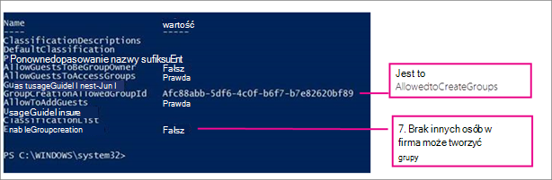

# <a name="manage-who-can-create-microsoft-365-groups"></a>Zarządzanie tym, kto może tworzyć grupy platformy Microsoft 365

Domyślnie wszyscy użytkownicy mogą tworzyć grupy platformy Microsoft 365. Jest to zalecana opcja, ponieważ umożliwia użytkownikom rozpoczęcie współpracy bez konieczności pomocy ze strony działu IT.

Jeśli Twoja firma wymaga ograniczenia osób, które mogą tworzyć grupy, możesz ograniczyć tworzenie grup platformy Microsoft 365 do członków określonej grupy tej platformy lub grupy zabezpieczeń.

Jeśli martwisz się o użytkowników tworzących zespoły lub grupy, które nie są zgodne ze standardami biznesowymi, rozważ wymaganie od użytkowników ukończenia kursu szkoleniowego, a następnie dodanie ich do grupy dozwolonych użytkowników.

Ograniczenie liczby osób, które mogą utworzyć grupę, ma wpływ na wszystkie usługi korzystające z grup w celu uzyskania dostępu, w tym:

- Outlook
- SharePoint
- Yammer
- Microsoft Teams
- Microsoft Stream
- Planner
- Power BI (klasyczny)
- Project dla sieci Web / Plan

Kroki opisane w tym artykule nie uniemożliwią członkom niektórych ról tworzenia grup. Administratorzy globalni usługi Office 365 mogą tworzyć grupy za pośrednictwem centrum administracyjnego platformy Microsoft 365, usługi Planner, programu Exchange i usługi SharePoint Online. Inne role mogą tworzyć grupy za pośrednictwem ograniczonych środków wymienionych poniżej.

- Administrator usługi Exchange: centrum administracyjne programu Exchange, Azure AD
- Pomoc techniczna dla partnerów (warstwa 1): centrum administracyjne platformy Microsoft 365, centrum administracyjne programu Exchange, Azure AD
- Pomoc techniczna dla partnerów (warstwa 2): centrum administracyjne platformy Microsoft 365, centrum administracyjne programu Exchange, Azure AD
- Zapisywanie katalogów: Azure AD
- Administrator programu SharePoint: centrum administracyjne programu SharePoint, Azure AD
- Administrator aplikacji Teams: centrum administracyjne aplikacji Teams, Azure AD
- Administrator użytkownika: centrum administracyjne platformy Microsoft 365, Azure AD

Jeśli jesteś członkiem jednej z tych ról, możesz utworzyć Grupy Microsoft 365 dla użytkowników objętych ograniczeniami, a następnie przypisywać tych użytkowników jako właścicieli grup.

## <a name="licensing-requirements"></a>Wymagania dotyczące licencjonowania

Aby zarządzać tym, kto tworzy grupy, następujące osoby muszą mieć przypisane licencje usługi Azure AD w wersji Premium:

- Administrator, który konfiguruje te ustawienia tworzenia grup
- Członkowie grupy, którzy mogą tworzyć grupy

> [!NOTE]
> Zobacz [Przypisywanie lub usuwanie licencji w portalu Azure Active Directory](/azure/active-directory/fundamentals/license-users-groups), aby uzyskać więcej informacji na temat przypisywania licencji platformy Azure.

Następujące osoby nie potrzebują przypisanych do nich licencji usługi Azure AD w wersji Premium:

- Osoby, które są członkami grup platformy Microsoft 365 i nie mają możliwości tworzenia innych grup.

## <a name="step-1-create-a-group-for-users-who-need-to-create-microsoft-365-groups"></a>Krok 1. Tworzenie grupy dla użytkowników, którzy muszą tworzyć grupy platformy Microsoft 365

Tylko jedna grupa w organizacji może być przeznaczona do kontrolowania, kto może tworzyć grupy. Można jednak zagnieździć inne grupy jako członków tej grupy.

Administratorzy w wymienionych powyżej rolach nie muszą być członkami tej grupy: zachowują oni możliwość tworzenia grup.

1. W centrum administracyjnym przejdź do [strony Grupy](https://admin.microsoft.com/adminportal/home#/groups).

2. Kliknij pozycję **Dodaj grupę**.

3. Wybierz odpowiedni typ grupy. Zapamiętaj nazwę tej grupy! Będzie potrzebna później.

4. Zakończ konfigurowanie grupy, dodając osoby lub inne grupy, którym chcesz umożliwić tworzenie grup w organizacji.

Aby uzyskać szczegółowe instrukcje, zobacz [Tworzenie, edytowanie lub usuwanie grupy zabezpieczeń w centrum administracyjnym platformy Microsoft 365](../admin/email/create-edit-or-delete-a-security-group.md).

## <a name="step-2-run-powershell-commands"></a>Krok 2. Uruchamianie poleceń programu PowerShell

Aby zmienić ustawienie dostępu gościa na poziomie grupy, musisz użyć wersji zapoznawczej programu [Azure Active Directory PowerShell for Graph](/powershell/azure/active-directory/install-adv2) (nazwa modułu **AzureADPreview**):

- Jeśli nie zainstalowano jeszcze żadnej wersji modułu programu Azure AD PowerShell, zobacz [Instalowanie modułu usługi Azure AD](/powershell/azure/active-directory/install-adv2?preserve-view=true&view=azureadps-2.0-preview) i postępuj zgodnie z instrukcjami, aby zainstalować publiczną wersję zapoznawczą.

- Jeśli masz zainstalowaną ogólnie dostępną wersję modułu Azure AD PowerShell (AzureAD) w wersji 2.0, musisz ją odinstalować, uruchamiając `Uninstall-Module AzureAD` w sesji programu PowerShell, a następnie zainstalować wersję zapoznawczą, uruchamiając `Install-Module AzureADPreview`.

- Jeśli masz już zainstalowaną wersję zapoznawczą, uruchom `Install-Module AzureADPreview` , aby upewnić się, że jest to najnowsza wersja tego modułu.

Skopiuj poniższy skrypt do edytora tekstów, takiego jak Notatnik, lub [środowiska Windows PowerShell ISE](/powershell/scripting/components/ise/introducing-the-windows-powershell-ise).

Zamień *\<GroupName\>* na nazwę utworzonej grupy. Przykład:

`$GroupName = "Group Creators"`

Zapisz plik jako GroupCreators.ps1.

W oknie programu PowerShell przejdź do lokalizacji, w której został zapisany plik (wpisz „CD \<FileLocation\>”).

Uruchom skrypt, wpisując:

`.\GroupCreators.ps1`

i [zaloguj się przy użyciu konta administratora](../enterprise/connect-to-microsoft-365-powershell.md#step-2-connect-to-azure-ad-for-your-microsoft-365-subscription) po wyświetleniu monitu.

```PowerShell
$GroupName = "<GroupName>"
$AllowGroupCreation = $False

Connect-AzureAD

$settingsObjectID = (Get-AzureADDirectorySetting | Where-object -Property Displayname -Value "Group.Unified" -EQ).id
if(!$settingsObjectID)
{
    $template = Get-AzureADDirectorySettingTemplate | Where-object {$_.displayname -eq "group.unified"}
    $settingsCopy = $template.CreateDirectorySetting()
    New-AzureADDirectorySetting -DirectorySetting $settingsCopy
    $settingsObjectID = (Get-AzureADDirectorySetting | Where-object -Property Displayname -Value "Group.Unified" -EQ).id
}

$settingsCopy = Get-AzureADDirectorySetting -Id $settingsObjectID
$settingsCopy["EnableGroupCreation"] = $AllowGroupCreation

if($GroupName)
{
  $settingsCopy["GroupCreationAllowedGroupId"] = (Get-AzureADGroup -SearchString $GroupName).objectid
} else {
$settingsCopy["GroupCreationAllowedGroupId"] = $GroupName
}
Set-AzureADDirectorySetting -Id $settingsObjectID -DirectorySetting $settingsCopy

(Get-AzureADDirectorySetting -Id $settingsObjectID).Values
```

W ostatnim wierszu skryptu zostaną zaktualizowane ustawienia:



Jeśli w przyszłości chcesz zmienić używaną grupę, możesz ponownie uruchomić skrypt z nazwą nowej grupy.

Jeśli chcesz wyłączyć ograniczenie tworzenia grupy i ponownie zezwolić wszystkim użytkownikom na tworzenie grup, ustaw parametr $GroupName na wartość "" i parametr $AllowGroupCreation na wartość "True", a następnie ponownie uruchom skrypt.

## <a name="step-3-verify-that-it-works"></a>Krok 3. Sprawdzenie działania

Wprowadzenie zmian może potrwać co najmniej trzydzieści minut. Nowe ustawienia możesz sprawdzić, wykonując następujące czynności:

1. Zaloguj się w usłudze Microsoft 365 przy użyciu konta użytkownika, który NIE POWINIEN mieć możliwości tworzenia grup. Powinien to więc być użytkownik nie będący członkiem utworzonej grupy lub administratorem.

2. Wybierz kafelek **Planner** .

3. W aplikacji Planner wybierz pozycję **Nowy plan** w lewym okienku nawigacji, aby utworzyć plan.

4. Powinien zostać wyświetlony komunikat informujący o wyłączeniu możliwości tworzenia planu i grupy.

Spróbuj ponownie wykonać tę samą procedurę z członkiem grupy.

> [!NOTE]
> Jeśli członkowie grupy nie mogą tworzyć grup, sprawdź, czy nie są blokowani za pośrednictwem ich [zasad skrzynki pocztowej aplikacji OWA](/powershell/module/exchange/set-owamailboxpolicy).

## <a name="related-topics"></a>Tematy pokrewne

[Zalecenia dotyczące planowania zarządzania współpracą](collaboration-governance-overview.md#collaboration-governance-planning-recommendations)

[Tworzenie planu zarządzania współpracą](collaboration-governance-first.md)

[Rozpoczynanie pracy z programem Office 365 PowerShell](../enterprise/getting-started-with-microsoft-365-powershell.md)

[Konfigurowanie samoobsługowego zarządzania grupą w programie Azure Active Directory](/azure/active-directory/users-groups-roles/groups-self-service-management)

[Set-ExecutionPolicy](/powershell/module/microsoft.powershell.security/set-executionpolicy)

[Polecenia cmdlet usługi Azure Active Directory do konfigurowania ustawień grupy](/azure/active-directory/users-groups-roles/groups-settings-cmdlets)
