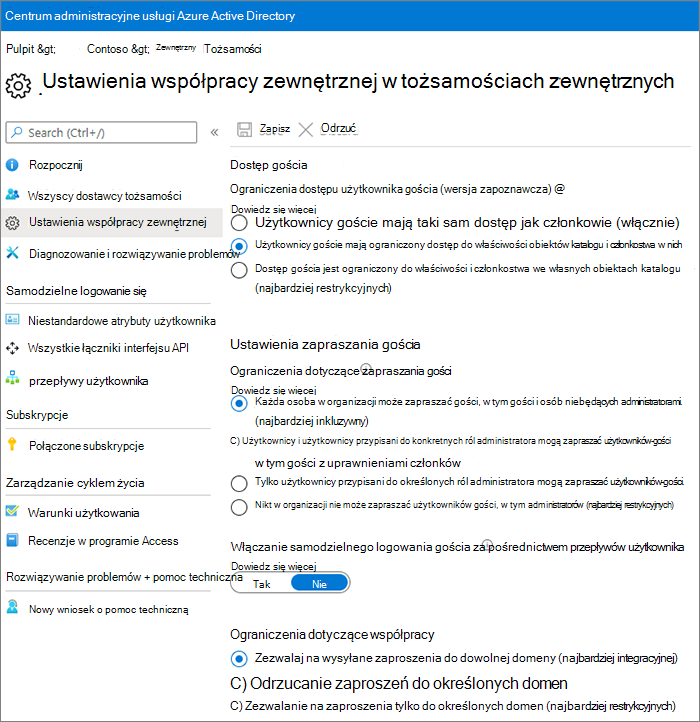
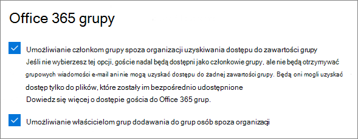
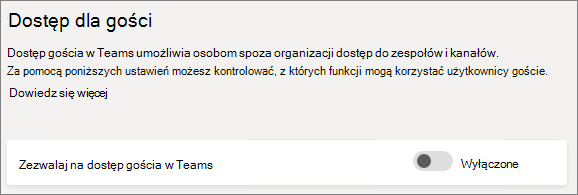
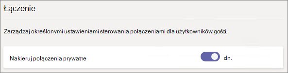
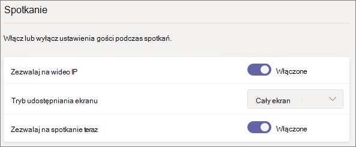
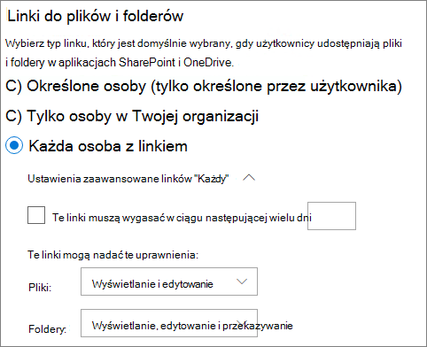
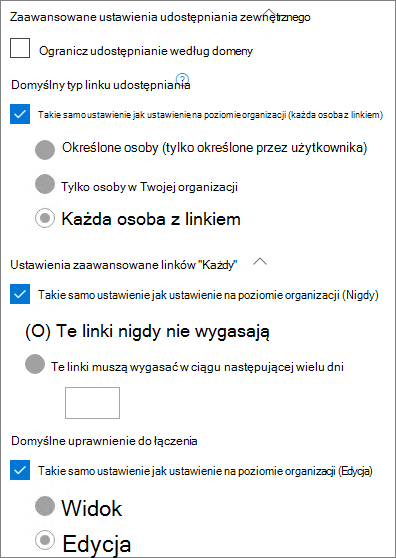

# Informacje dotyczące ustawień udostępniania dla gości na platformie Microsoft 365

Ten artykuł zawiera informacje o różnych ustawieniach, które mogą mieć wpływ na udostępnianie obciążeń pracą usługi Microsoft 365 osobom spoza organizacji: Teams, Microsoft 365 Groups, SharePoint i OneDrive. Te ustawienia znajdują się w centrach administracyjnych usługi Azure Active Directory, platformy Microsoft 365, usługi Teams i programu SharePoint.

## Azure Active Directory

**Rola administratora:** Administrator globalny

Azure Active Directory to usługa katalogowa używana przez firmę Microsoft 365. Ustawienia Azure Active Directory relacje organizacyjne mają bezpośredni wpływ na udostępnianie w Teams, grupach Microsoft 365, grupach SharePoint i OneDrive.

> [!NOTE]
> Te ustawienia mają wpływ SharePoint tylko SharePoint [i OneDrive usługi Azure AD B2B](/sharepoint/sharepoint-azureb2b-integration-preview). W poniższej tabeli przyjęto założenie, że zostało to skonfigurowane.

### Ustawienia współpracy zewnętrznej

**Nawigacja:** [Azure Active Directory administracyjne > Azure Active Directory >](https://aad.portal.azure.com) tożsamości zewnętrzne > ustawienia współpracy zewnętrznej

| Ustawienie | Domyślne | Opis |
|:-----|:-----|:-----|
|Dostęp gościa|Użytkownicy goście mają ograniczony dostęp do właściwości obiektów katalogu i członkostwa w nich|Określa uprawnienia[, które mają goście w Azure Active Directory](/azure/active-directory/fundamentals/users-default-permissions).|
|Ustawienia zapraszania gościa|Każda osoba w organizacji może zapraszać gości, w tym gości i osób niebędących administratorami.|Określa, czy goście, członkowie i administratorzy mogą zapraszać gości do organizacji. 
 To ustawienie wpływa Microsoft 365 udostępniania, takich jak Teams i SharePoint.|
|Włączanie samodzielnego logowania gościa za pośrednictwem przepływów użytkownika|Nie|Określa, czy można utworzyć przepływy użytkownika umożliwiające osobie utworzenie konta w utworzonej przez Ciebie aplikacji i utworzenie nowego konta gościa.|
|Ograniczenia dotyczące współpracy|Zezwalaj na wysyłane zaproszenia do dowolnej domeny|To ustawienie umożliwia określenie listy dozwolonych lub zablokowanych domen do udostępniania. Po określonym dozwolonym domenie zaproszenia do udostępniania mogą być wysyłane tylko do tych domen. Po określonej domenie odrzuconej nie można wysyłać do tych domen zaproszeń do udostępniania. 
 To ustawienie wpływa Microsoft 365 udostępniania, takich jak Teams i SharePoint. Aby zezwolić na domeny lub zablokować je na bardziej szczegółowym poziomie, możesz użyć filtrowania domen w SharePoint lub Teams.|

Te ustawienia mają wpływ na sposób zapraszania użytkowników do katalogu. Nie mają one wpływu na udostępnianie gościom, którzy znajdują się już w katalogu.

## Microsoft 365

**Rola administratora:** Administrator globalny

Grupa centrum administracyjne platformy Microsoft 365 ma ustawienia udostępniania na poziomie organizacji oraz grup Microsoft 365 grupy.

### Udostępnianie

**Nawigacja:** [centrum administracyjne platformy Microsoft 365](https://admin.microsoft.com) >  **Ustawienia** >  **Ustawianie zabezpieczeń** >  <a href="https://go.microsoft.com/fwlink/p/?linkid=2072756" target="_blank">**& prywatnośćUstawianie**</a> > .

| Ustawienie | Domyślne | Opis |
|:-----|:-----|:-----|
|Umożliwianie użytkownikom dodawania nowych gości do organizacji|Wł.|Gdy jest **ustawiona wartość Tak**, członkowie usługi Azure AD mogą zapraszać gości za pośrednictwem usługi Azure AD. w przypadku ustawienia **na wartość Nie**, nie mogą. W przypadku ustawienia **Tak członkowie grupy** Microsoft 365 mogą zapraszać gości za zgodą właściciela; w przypadku ustawienia Nie członkowie grupy Microsoft 365 mogą zapraszać gości z zatwierdzeniem właściciela, ale ich właściciele muszą być administratorami globalnymi. 
 Pamiętaj, **że w usłudze** Azure AD członkowie mogą zapraszać członków (w odróżnieniu od gości), a nie do członków witryny lub grupy w Microsoft 365. 
 Jest to identyczne z ustawieniem **Członkowie mogą zapraszać** w Azure Active Directory Relacje organizacyjne.|

### Microsoft 365 grupy

**Nawigacja:** [centrum administracyjne platformy Microsoft 365](https://admin.microsoft.com) >  **Ustawienia** >  **Utorze ustawień > Microsoft 365** grupy

| Ustawienie | Domyślne | Opis |
|:-----|:-----|:-----|
|Umożliwianie członkom grupy spoza organizacji uzyskiwania dostępu do zawartości grupy|Wł.|Gdy jest **ustawiona wartość Wł**., goście mogą uzyskać dostęp do zawartości grup. gdy jest **ustawiona na wartość Wyłączone**, nie mogą. To ustawienie powinno być wł **.** w każdym scenariuszu, w którym goście komunikują się Microsoft 365 grupami lub Teams.|
|Umożliwianie właścicielom grup dodawania do grup osób spoza organizacji|Wł.|Gdy **jest** wł., właściciele grup Microsoft 365 lub grupy Teams mogą zapraszać nowych gości do grupy. Gdy **jest** wyłączona, nie mogą. To ustawienie powinno być wł **.** w każdym scenariuszu, w którym goście mają zostać dodani do grup.|

Te ustawienia znajdują się na poziomie organizacji. Aby [uzyskać informacje na temat](/azure/active-directory/users-groups-roles/groups-settings-cmdlets#create-settings-for-a-specific-group) zmieniania tych ustawień na poziomie grupy za pomocą programu PowerShell, zobacz Tworzenie ustawień dla określonej grupy.

## Teams

Główny Teams dostępu gościa: Zezwalaj na dostęp gościa Teams gościa w programie **Teams**,  musi być włączony, aby inne ustawienia gościa są dostępne.

**Rola administratora: Teams** usługi

### Dostęp dla gości

**Nawigacja:** [Teams centrum](https://admin.teams.microsoft.com) **administracyjneOrg-wideost** >  >  <a href="https://go.microsoft.com/fwlink/p/?linkid=2173122" target="_blank">**access**</a>

| Ustawienie | Domyślne | Opis |
|:-----|:-----|:-----|
|Zezwalaj na dostęp gościa w Teams|Wyłączone|Umożliwia ogólnym wyłączenie lub wyłączenie dostępu Teams gościa. Po zmianie tego ustawienia może potrwać 24 godziny.|

### Dzwonienie gościa

**Nawigacja:** [Teams centrum](https://admin.teams.microsoft.com) **administracyjneOrg-wideost** >  >  <a href="https://go.microsoft.com/fwlink/p/?linkid=2173122" target="_blank">**access**</a>

| Ustawienie | Domyślne | Opis |
|:-----|:-----|:-----|
|Nakieruj połączenia prywatne|Wł.|Gdy **jest** wł., goście mogą dzwonić równorzędnie w Teams, **a gdy Wyłączone**, nie mogą.|

### Spotkanie gościa

**Nawigacja:** [Teams centrum](https://admin.teams.microsoft.com) **administracyjneOrg-wideost** >  >  <a href="https://go.microsoft.com/fwlink/p/?linkid=2173122" target="_blank">**access**</a>

| Ustawienie | Domyślne | Opis |
|:-----|:-----|:-----|
|Zezwalaj na wideo IP|Wł.|Gdy **jest** wł., goście mogą używać wideo podczas połączeń i spotkań. gdy **jest** wyłączona, nie mogą.|
|Tryb udostępniania ekranu|Cały ekran|Gdy **wyłączono**, goście nie mogą udostępniać swoich ekranów w Teams. W przypadku ustawienia **pojedynczej aplikacji** goście mogą udostępnić tylko jedną aplikację na swoim ekranie. W przypadku ustawienia **Cały ekran** goście mogą zdecydować się na udostępnienie aplikacji lub całego ekranu.|
|Zezwalaj na spotkanie teraz|Wł.|Gdy **jest** wł., goście mogą używać funkcji Spotkaj się z w programie Teams, **a gdy jest** wyłączona, nie mogą.|

### Wiadomości dla gości

**Nawigacja:** [Teams centrum](https://admin.teams.microsoft.com) **administracyjneOrg-wideost** >  >  <a href="https://go.microsoft.com/fwlink/p/?linkid=2173122" target="_blank">**access**</a>

| Ustawienie | Domyślne | Opis |
|:-----|:-----|:-----|
|Edytowanie wysłanych wiadomości|Wł.|Gdy **jest** wł., goście mogą edytować wcześniej wysłane przez nich wiadomości. gdy **jest** wyłączona, nie mogą.|
|Usuwanie wysłanych wiadomości|Wł.|Gdy **jest wł**., goście mogą usuwać wcześniej wysłane przez nich wiadomości. gdy **jest** wyłączona, nie mogą.|
|Czat|Wł.|Gdy **jest** wł., goście mogą korzystać z czatu w Teams, **a gdy wyłączone**, nie mogą.|
|Korzystanie z giphy w konwersacjach|Wł.|Gdy **jest wł**., goście mogą używać giphy w konwersacjach; gdy **jest** wyłączona, nie mogą.|
|Klasyfikacja zawartości Giphy|Umiarkowane|Gdy jest **ustawiona wartość** Zezwalaj na całą zawartość, goście mogą wstawiać wszystkie giphy w czatach, niezależnie od klasyfikacji zawartości. W przypadku ustawienia **Moderowane** goście mogą wstawiać treści Giphy do czatów, ale zostaną moderowo ograniczeni od treści dla dorosłych. W **przypadku ustawienia Ścisłe** goście mogą wstawiać giphy do czatów, ale nie mogą wstawiać zawartości dla dorosłych.|
|Używanie memów w konwersacjach|Wł.|Gdy **jest** wł., goście mogą używać memów w konwersacjach. gdy **jest** wyłączona, nie mogą.|
|Nalepki użytkowników w konwersacjach|Wł.|Gdy **jest wł**., goście mogą używać nalepek w konwersacjach. gdy **jest** wyłączona, nie mogą.|
|Zezwalanie czytnikowi immersyjneowi na wyświetlanie wiadomości|Wł.|Gdy **jest** wł., goście mogą wyświetlać wiadomości w Czytnik immersyjny, **a gdy wyłączone**, nie mogą.|

## SharePoint i OneDrive (na poziomie organizacji)

**Rola administratora: administrator** SharePoint administrator

Te ustawienia mają wpływ na wszystkie witryny w organizacji. Nie wpływają one bezpośrednio Microsoft 365 grup ani grup Teams, jednak zalecamy, aby wyrównać te ustawienia z ustawieniami grup Microsoft 365 i grupy Teams, aby uniknąć problemów z interfejsem użytkownika. Jeśli na przykład udostępnianie gości jest dozwolone w programie Teams, SharePoint, goście w programie Teams nie będą mieli dostępu do karty Pliki, ponieważ pliki Teams są przechowywane w programie SharePoint).

### SharePoint i OneDrive udostępniania

Ponieważ OneDrive to hierarchia witryn w SharePoint, ustawienia udostępniania na poziomie organizacji mają bezpośredni OneDrive tak samo jak inne SharePoint witryn.

**Nawigacja:** SharePoint administracyjne > udostępniania

| Ustawienie | Domyślne | Opis |
|:-----|:-----|:-----|
|SharePoint|Każdy|Określa uprawnienia do udostępniania, które są najbardziej odpowiednie dla SharePoint witryn.|
|OneDrive|Każdy|Określa uprawnienia do udostępniania, które są najbardziej odpowiednie dla OneDrive witryn. To ustawienie nie może być bardziej przesądne niż SharePoint ustawienia.|

### SharePoint i OneDrive zaawansowane ustawienia udostępniania

**Nawigacja:** SharePoint administracyjne > udostępniania

| Ustawienie | Domyślne | Opis |
|:-----|:-----|:-----|
|Ograniczanie udostępniania zewnętrznego według domeny|Wyłączone|To ustawienie umożliwia określenie listy dozwolonych lub zablokowanych domen do udostępniania. Po określonym dozwolonym domenie zaproszenia do udostępniania mogą być wysyłane tylko do tych domen. Po określonej domenie odrzuconej nie można wysyłać do tych domen zaproszeń do udostępniania. 
 To ustawienie ma wpływ na SharePoint i OneDrive witryn internetowych w organizacji.|
|Zezwalanie na zewnętrzne udostępnianie plików tylko użytkownikom w określonych grupach zabezpieczeń|Wyłączone|Jeśli chcesz ograniczyć liczbę osób, które mogą udostępniać gościom w programach SharePoint i OneDrive, możesz to zrobić przez ograniczenie udostępniania do osób w określonych grupach zabezpieczeń. Te ustawienia nie mają wpływu na udostępnianie za pośrednictwem Microsoft 365 Grup ani Teams. Goście zaproszeni za pośrednictwem grupy lub zespołu również mieli dostęp do skojarzonej witryny, chociaż udostępnianie dokumentów i folderów mogło być wykonywane tylko przez osoby z określonych grup zabezpieczeń. 
 Dla każdej określonej grupy możesz wybrać, którzy z tych użytkowników mogą udostępniać za pomocą linków Każdy.|
|Goście muszą zalogować się przy użyciu tego samego konta, do którego są wysyłane zaproszenia do udostępniania.|Wyłączone|Uniemożliwia gościom realizowanie zaproszeń do udostępniania witryn przy użyciu adresu e-mail innego niż adres, na który wysłano zaproszenie. 
 [SharePoint i OneDrive usługi Azure AD (wersja Preview)](/sharepoint/sharepoint-azureb2b-integration-preview) nie używają tego ustawienia, ponieważ wszyscy goście są dodawana do katalogu na podstawie adresu e-mail, na który wysłano zaproszenie. Alternatywnych adresów e-mail nie można używać do uzyskiwania dostępu do witryny.|
|Zezwalanie gościom na udostępnianie elementów, które nie są ich właścicielami|Wł.|Gdy **jest** w pozycji Wł., goście mogą udostępniać użytkownikom lub gościom elementy, które nie są ich właścicielami. gdy **wyłączone** , nie mogą. Goście zawsze mogą udostępniać elementy, dla których mają pełną kontrolę.|
|Osoby, które używają kodu weryfikacyjnego, muszą je ponownie uwierzytelnić po upływie tylu dni|Wyłączone|To ustawienie pozwala na wymaganie, aby użytkownicy uwierzytelniający się za pomocą kodu dostępu z jednego kodu dostępu musieli ponownie uwierzytelniać się po określonej liczbie dni.|
|Dostęp gościa do witryny lub witryny OneDrive wygaśnie automatycznie po tylu dniach|Wł.|Jeśli administrator ustawi czas wygaśnięcia dostępu gościa, każdy gość zaproszony do witryny lub osoba, której udostępniasz pojedyncze pliki i foldery, będzie mieć dostęp przez określoną liczbę dni. Aby uzyskać więcej informacji, zobacz [Zarządzanie wygasaniem gości w witrynie.](https://support.microsoft.com/en-us/office/manage-guest-expiration-for-a-site-25bee24f-42ad-4ee8-8402-4186eed74dea)

### SharePoint i OneDrive do plików i folderów

Gdy pliki i foldery są udostępniane w programach SharePoint i OneDrive, adresatom udostępniania jest wysyłany link z uprawnieniami do pliku lub folderu, a nie bezpośredni dostęp do pliku lub folderu. Dostępnych jest kilka typów linków i można wybrać domyślny typ linku prezentowany użytkownikom, którzy współużytkują plik lub folder. Możesz również ustawić uprawnienia i opcje wygasania dla linków *Każdy* .

**Nawigacja:** SharePoint administracyjne > udostępniania

| Ustawienie | Domyślne | Opis |
|:-----|:-----|:-----|
|Linki do plików i folderów|Każda osoba z linkiem|Określa, który link udostępniania jest domyślnie wyświetlany, gdy użytkownik udostępnia plik lub folder. Jeśli chcesz, użytkownicy mogą zmienić tę opcję przed jej udostępnieniem. Jeśli jako domyślne ustawienie jest ustawiona wartość Każda osoba z  **linkiem**, a w przypadku danej witryny udostępnianie każda osoba  nie jest dozwolone, jako domyślną dla tej witryny będą wyświetlane tylko osoby w organizacji.|
|Te linki muszą wygasać w ciągu następującej wielu dni|Wyłączone (brak wygaśnięcia)|Określa liczbę dni po utworzeniu *linku* Każdy, po upływie jego wygaśnięcia. Nie można odnowić wygasłych linków. Utwórz nowy link, jeśli chcesz nadal udostępniać po wygaśnięciu.|
|Uprawnienia do pliku|Wyświetlanie i edytowanie|Określa poziomy uprawnień do plików dostępne dla użytkowników podczas tworzenia *linku Każdy* . Jeśli **wybrano** opcję Widok, użytkownicy mogą tworzyć tylko linki do plików *Każdy* z uprawnieniami do wyświetlania. Jeśli **zaznaczono opcję Wyświetl** i edytuj, użytkownicy będą mieli do wyboru uprawnienia do wyświetlania, wyświetlania i edytowania podczas tworzenia linku.|
|Uprawnienia folderu|Wyświetlanie, edytowanie i przekazywanie|Określa poziomy uprawnień folderów dostępne dla użytkowników podczas tworzenia *linku Każdy* . Jeśli **wybrano** opcję Widok, użytkownicy mogą tworzyć tylko linki do folderów *Każdy* z uprawnieniami do wyświetlania. Jeśli **wybrano opcję Wyświetlania,** edytowania i przekazywania, użytkownicy mogą wybierać uprawnienia do wyświetlania, edytowania i przekazywania podczas korzystania z linku.|

## SharePoint (poziom witryny)

**Rola administratora: administrator** SharePoint administrator

Ponieważ te ustawienia podlegają ustawieniam witryny dla całej organizacji SharePoint, skuteczne ustawienie udostępniania witryny może ulec zmianie w przypadku zmiany ustawień na poziomie organizacji. Jeśli wybierzesz tutaj ustawienie, a na poziomie organizacji zostanie później ustawiona bardziej restrykcyjna wartość, ta witryna będzie działać na tej bardziej restrykcyjnej wartości. Jeśli na przykład wybierzesz opcję  Każdy, a ustawienie na poziomie organizacji zostanie później ustawione na Nowi i istniejący **goście, w** tej witrynie będą zezwalać tylko nowi i istniejący goście. Jeśli ustawienie na poziomie organizacji zostanie ustawione z powrotem **na Każdy,** ta witryna ponownie zezwala na linki *Każdy* .

### Udostępnianie witryn

Możesz ustawić uprawnienia udostępniania gości dla każdej witryny w programie SharePoint. To ustawienie dotyczy zarówno udostępniania witryny, jak i udostępniania plików i folderów. (*Każda osoba* udostępniana nie jest dostępna do udostępniania witryny. Jeśli wybierzesz **opcję Każdy**, użytkownicy będą mogli udostępniać pliki i foldery za pomocą  linków Każdy i samej witryny nowym i istniejącym gościom).

Jeśli do witryny zastosowano etykietę wrażliwości, może ona sterować ustawieniami udostępniania zewnętrznego. Aby uzyskać więcej informacji, zobacz Chroninie zawartości w witrynach sieci [Microsoft Teams, Microsoft 365 i SharePoint zawartości za pomocą etykiet wrażliwości](../compliance/sensitivity-labels-teams-groups-sites.md).

**Nawigacja:** SharePoint administracyjne > witryny aktywne > wybierz kartę Zasady witryny > i > Edytowanie udostępniania zewnętrznego

| Ustawienie | Domyślne | Opis |
|:-----|:-----|:-----|
|Zawartość witryny może być udostępniana|Różne typy witryn (zobacz tabelę poniżej)|Wskazuje typ udostępniania zewnętrznego dozwolony dla tej witryny. Dostępne w tym miejscu opcje podlegają ustawień udostępniania na poziomie organizacji dla SharePoint.|

### Ustawienia linku do pliku witryny i folderu

Dla każdej witryny możesz ustawić ustawienia domyślne dla typu linku, uprawnień oraz ustawień wygasania dla *każdego linku* Każda osoba. Ustawienia ustawione na poziomie witryny zastępują ustawienia na poziomie organizacji. Pamiętaj *, że jeśli* na poziomie organizacji linki Każdy są *wyłączone, każdy* nie będzie dostępnym typem linku na poziomie witryny.

**Nawigacja:** SharePoint administracyjne > witryny aktywne > wybierz kartę Zasady witryny > i > Edytowanie udostępniania zewnętrznego

| Ustawienie | Domyślne | Opis |
|:-----|:-----|:-----|
|Ograniczanie udostępniania według domeny|Wyłączone|To ustawienie umożliwia określenie listy dozwolonych lub zablokowanych domen do udostępniania. Po określonym dozwolonym domenie zaproszenia do udostępniania mogą być wysyłane tylko do tych domen. Po określonej domenie odrzuconej nie można wysyłać do tych domen zaproszeń do udostępniania. 
 Tego ustawienia nie można używać do zastępowania ograniczeń domeny ustawionych na poziomie organizacji lub usługi Azure AD.|
|Domyślny typ linku udostępniania|Takie samo ustawienie jak ustawienie na poziomie organizacji|To ustawienie umożliwia określenie domyślnego linku udostępniania prezentowanego użytkownikom w tej witrynie. To *samo co opcja ustawienia na* poziomie organizacji jest definiowana przez połączenie ustawień udostępniania witryny i organizacji.|
|Ustawienia zaawansowane linków Każdy|Takie samo ustawienie jak ustawienie na poziomie organizacji|Określa liczbę dni po utworzeniu *linku* Każdy dla pliku w tej witrynie, po upływie jego wygaśnięcia. Nie można odnowić wygasłych linków. Utwórz nowy link, jeśli chcesz nadal udostępniać po wygaśnięciu.|
|Domyślne uprawnienie do łączenia|Takie samo ustawienie jak ustawienie na poziomie organizacji|To ustawienie pozwala określić domyślne uprawnienie (Wyświetlanie lub Edycja) do udostępniania linków utworzonych dla plików w tej witrynie.|

### Domyślne ustawienia udostępniania witryn

W poniższej tabeli przedstawiono domyślne ustawienie udostępniania dla poszczególnych typów witryn.

| Typ witryny | Domyślne ustawienie udostępniania |
|:-----|:-----|
|Klasyczne|**Tylko osoby w Twojej organizacji**|
|OneDrive|**Każdy**|
|Witryny połączone z grupą (w tym Teams)|**Nowi i istniejący goście**, jeśli Microsoft 365 ustawienia Pozwalaj  właścicielom grup dodawać osoby spoza organizacji do grup jest wł **.; w** przeciwnym razie **tylko istniejący goście**|
|Komunikacja|**Tylko osoby w Twojej organizacji**|
|Nowoczesne witryny bez grupy (#STS3 TeamSite)|**Tylko osoby w Twojej organizacji**|

> [!NOTE]
> Główna witryna do komunikacji (tenant-name.sharepoint.com) ma domyślne ustawienie **udostępniania Każdy.**

## Zobacz też

[SharePoint i OneDrive udostępniania zewnętrznego — omówienie](/sharepoint/external-sharing-overview)

[Dostęp dla gości w programie Microsoft Teams](/MicrosoftTeams/guest-access)

[Dodawanie gości do grup Microsoft 365 grupy](https://support.office.com/article/bfc7a840-868f-4fd6-a390-f347bf51aff6)
