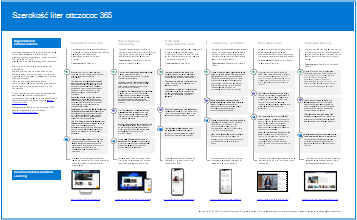

# Ilustracje dotyczące produktywności na platformie Microsoft 365

Seria rozwiązań dla przedsiębiorstw platformy Microsoft 365 zawiera wskazówki dotyczące implementowania możliwości platformy Microsoft 365, zwłaszcza w przypadku możliwości obejmujących wiele technologii, w tym diagramy architektury usługi Teams.

## Microsoft Teams i powiązane usługi produktywności w usłudze Microsoft 365 dla architektów IT
Architektura logiczna usług produktywności w usłudze Microsoft 365, wiodąca w usłudze Microsoft Teams.

| Element | Opis |
|:-----|:-----|
|   [PDF](https://github.com/MicrosoftDocs/microsoft-365-docs/raw/public/microsoft-365/downloads/msft-m365-teams-logical-architecture.pdf) \| [Visio](https://github.com/MicrosoftDocs/microsoft-365-docs/raw/public/microsoft-365/downloads/msft-m365-teams-logical-architecture.vsdx)   Zaktualizowano styczeń 2021 r.   |Firma Microsoft oferuje zestaw usług zwiększających produktywność, które współpracują ze sobą w celu zapewnienia współpracy z funkcjami zapewniania ładu, zabezpieczeń i zgodności danych.    Ta seria ilustracji przedstawia logiczną architekturę usług zwiększających produktywność dla architektów przedsiębiorstw, wiodących w usłudze Microsoft Teams.|

## Komunikacja firmowa z platformą Microsoft 365 — analiza przypadku firmy Contoso
Zaangażowanie pracowników jest istotnym czynnikiem przyczyniającym się do zadowolenia, utrzymania i produktywności w miejscu pracy w dowolnej organizacji. Na platformie Microsoft 365 istnieje wiele sposobów komunikowania się i angażowania odbiorców. 

Znajomość metody (lub kombinacji metod) do użycia i tego, kiedy z nich korzystać, zależy od odbiorców i kultury komunikacji organizacji. 

| Element | Opis |
|:-----|:-----|
|   [PDF](https://download.microsoft.com/download/0/3/4/034fbee5-ecf4-4559-86d3-815e898f21ea/contoso-corporate-communication-poster.pdf) \| [Visio](https://download.microsoft.com/download/0/3/4/034fbee5-ecf4-4559-86d3-815e898f21ea/contoso-corporate-communication-poster.vsdx)   Zaktualizowano styczeń 2022 r.   |Ten plakat przedstawia sposób, w jaki firma Contoso zapewnia pracownikom informacje i zaangażowanie w popularnych scenariuszach komunikacyjnych. Firma Contoso używa różnych aplikacji platformy Microsoft 365, w tym nowej oferty, Zasoby Viva.  **Powiązane przewodniki po rozwiązaniach**   <ul><li>[Komunikacja organizacyjna: Wskazówki, metody i produkty](/sharepoint/corporate-communications-overview)|

## Grupy w usłudze Microsoft 365 dla architektów IT
Ta ilustracja zawiera informacje dla architektów IT dotyczące Grupy Microsoft 365. Aby dowiedzieć się więcej na temat konfigurowania i administrowania Grupy Microsoft 365 i zespołami do współpracy w organizacji, zobacz [Konfigurowanie bezpiecznej współpracy z platformą Microsoft 365](/microsoft-365/solutions/setup-secure-collaboration-with-teams) i [Co to jest zarządzanie współpracą?](/microsoft-365/solutions/collaboration-governance-overview).

| Element | Opis |
|:-----|:-----|
|   [PDF](https://download.microsoft.com/download/6/3/0/6309218f-a169-4f2d-af4c-2fe49e30ba17/msft-m365-groups.pdf) \| [Visio](https://download.microsoft.com/download/6/3/0/6309218f-a169-4f2d-af4c-2fe49e30ba17/msft-m365-groups.vsdx)   Zaktualizowano maj 2022 r.|Na tych ilustracjach przedstawiono różne typy grup, sposób ich tworzenia i zarządzania oraz kilka zaleceń dotyczących ładu.

## Migracja do platformy Microsoft 365

Firma Microsoft udostępnia narzędzia do migrowania lokalnych udziałów plików sieciowych i witryn programu SharePoint Server do platformy Microsoft 365 z naciskiem na ochronę i zapewnienie bezpieczeństwa zawartości podczas migracji. Ten zestaw ilustracji przedstawia różne metody przenoszenia zawartości do programu SharePoint, aplikacji Teams i usługi OneDrive oraz sposobu przepływu danych przez proces.

| Element | Opis |
|:-----|:-----|
| 
 [PDF](https://download.microsoft.com/download/0/5/b/05b7fb7c-1557-4ebb-9036-c5fc3a4cd94c/m365-migration-posters-mm-spmt.pdf)\|[Visio](https://download.microsoft.com/download/0/5/b/05b7fb7c-1557-4ebb-9036-c5fc3a4cd94c/m-365-migration-posters-mm-spmt.vsdx) 
 Zaktualizowano marzec 2021 r. |Zawiera: <ul><li> Migracja udziału plików</li><li>Migracja programu SharePoint Server</li></ul> 
 Aby uzyskać więcej informacji, zobacz [Migrowanie zawartości do platformy Microsoft 365](/sharepointmigration/migrate-to-sharepoint-online).|

## Funkcje ochrony i zgodności informacji platformy Microsoft 365

Platforma Microsoft 365 obejmuje szeroki zestaw funkcji ochrony informacji i zgodności. Wraz z narzędziami zwiększającymi produktywność firmy Microsoft te funkcje mają na celu ułatwienie organizacjom współpracy w czasie rzeczywistym przy jednoczesnym przestrzeganiu rygorystycznych ram zgodności z przepisami.

Ten zestaw ilustracji korzysta z jednej z najbardziej regulowanych branż, usług finansowych, aby zademonstrować, w jaki sposób te możliwości mogą być stosowane w celu spełnienia typowych wymagań prawnych. Możesz dostosować te ilustracje do własnych potrzeb.

| Element | Opis |
|:-----|:-----|
|   Angielski: [pobieranie w formacie PDF](https://download.microsoft.com/download/3/a/6/3a6ab1a3-feb0-4ee2-8e77-62415a772e53/m365-compliance-illustrations.pdf)  \| [jako program Visio](https://download.microsoft.com/download/3/a/6/3a6ab1a3-feb0-4ee2-8e77-62415a772e53/m365-compliance-illustrations.vsdx)   Japoński: [pobieranie w formacie PDF](https://download.microsoft.com/download/6/f/1/6f1a7d0e-dd8e-442e-b073-8e94327ae4f8/m365-compliance-illustrations.pdf)  \| [jako program Visio](https://download.microsoft.com/download/6/f/1/6f1a7d0e-dd8e-442e-b073-8e94327ae4f8/m365-compliance-illustrations.vsdx)   Zaktualizowano listopad 2020 r.|Zawiera: <ul><li>  Ochrona informacji i zapobieganie utracie danych</li><li>Zasady przechowywania i etykiety przechowywania </li><li>Bariery informacyjne</li><li>Zgodność w komunikacji</li><li>Ryzyko związane z wewnętrznymi testerami</li><li>Pozyskiwanie danych innych firm</li>|

## Zabezpieczenia i Information Protection dla organizacji z wieloma regionami
Zabezpieczenia i ochrona informacji dla organizacji w wielu regionach z jedną dzierżawą platformy Microsoft 365

| Element | Opis |
|:-----|:-----|
|   [PDF](https://github.com/MicrosoftDocs/microsoft-365-docs/raw/public/microsoft-365/downloads/msft-security-info-protect-multi-region.pdf) \| [Visio](https://github.com/MicrosoftDocs/microsoft-365-docs/raw/public/microsoft-365/downloads/msft-security-info-protect-multi-region.vsdx) Zaktualizowano marzec 2020 r. |Korzystanie z jednej dzierżawy platformy Microsoft 365 dla organizacji globalnej jest najlepszym wyborem i doświadczeniem z wielu powodów. Jednak wielu architektów zmaga się z tym, jak osiągnąć cele w zakresie bezpieczeństwa i ochrony informacji w różnych regionach. Ten zestaw tematów zawiera zalecenia. |

<!--
## Security Guidance for Political Campaigns, Nonprofits, and Other Agile Organizations

If your organization is agile, you have a small IT team, and your threat profile is higher than average, this guidance is designed for you. This solution demonstrates how to quickly build an environment with essential cloud services that include secure controls from the start. This guidance includes prescriptive security recommendations for protecting data, identities, email, and access from mobile devices.

| Item | Description |
|:---|:---|
|**Microsoft Security Guidance for Political Campaigns**   [:::image type="content" source="../media/d370ce28-ca40-4930-9a2c-907312aa06c8.png" alt-text="Thumbnail for mini poster about security guidance.":::](https://download.microsoft.com/download/B/4/D/B4D520C3-4D0C-4B4D-BFB9-09F0651C2775/MSFT_Cloud_architecture_security%20for%20political%20campaigns.pdf)   [PDF](https://download.microsoft.com/download/B/4/D/B4D520C3-4D0C-4B4D-BFB9-09F0651C2775/MSFT_Cloud_architecture_security%20for%20political%20campaigns.pdf) \| [Visio](https://download.microsoft.com/download/B/4/D/B4D520C3-4D0C-4B4D-BFB9-09F0651C2775/MSFT_Cloud_architecture_security%20for%20political%20campaigns.vsdx)|This guidance uses a political campaign organization as an example. Use this guidance as a starting point for any environment.|
|**Microsoft Security Guidance for Nonprofits**   [:::image type="content" source="../media/e4784889-1c69-4067-9a8f-31d31d1eceea.png" alt-text="Thumbnail for security guidance download.":::](https://download.microsoft.com/download/9/4/3/94389612-C679-4061-8DF2-D9A15D72B65F/Microsoft_Cloud%20Architecture_Security%20for%20Nonprofits.pdf)   [PDF](https://download.microsoft.com/download/9/4/3/94389612-C679-4061-8DF2-D9A15D72B65F/Microsoft_Cloud%20Architecture_Security%20for%20Nonprofits.pdf) \| [Visio](https://download.microsoft.com/download/9/4/3/94389612-C679-4061-8DF2-D9A15D72B65F/Microsoft_Cloud%20Architecture_Security%20for%20Nonprofits.vsdx)|This guide is slightly revised for nonprofit organizations. For example, it references Office 365 Nonprofit plans. The technical guidance is the same as the political campaign solution guide.|
-->

## strategia wdrażania Ochrona punktu końcowego w usłudze Microsoft Defender

W zależności od środowiska niektóre narzędzia są lepiej dostosowane do niektórych architektur.

| Element | Opis |
|:-----|:-----|
|  [PDF](https://download.microsoft.com/download/5/6/0/5609001f-b8ae-412f-89eb-643976f6b79c/mde-deployment-strategy.pdf)  \| [Visio](https://download.microsoft.com/download/5/6/0/5609001f-b8ae-412f-89eb-643976f6b79c/mde-deployment-strategy.vsdx)  Zaktualizowano wrzesień 2021 r.| Materiał architektoniczny pomaga zaplanować wdrożenie dla następujących architektur: <ul><li> Natywny dla chmury </li><li> Współzarządzanie </li><li> Lokalnie</li><li>Ocena i dołączanie lokalne</li> |
<!--

## Zero Trust identity and device protection for Microsoft 365

Recommended Zero Trust capabilities for protecting identities and devices that access Microsoft 365, other SaaS services, and on-premises applications published with Azure AD Application Proxy.

| Item | Description |
|:-----|:-----|
|    [View as a PDF](../downloads/MSFT_cloud_architecture_identity&device_protection.pdf) \| [Download as a PDF](https://github.com/MicrosoftDocs/microsoft-365-docs/raw/public/microsoft-365/downloads/MSFT_cloud_architecture_identity&device_protection.pdf)  \| [Download as a Visio](https://github.com/MicrosoftDocs/microsoft-365-docs/raw/public/microsoft-365/downloads/MSFT_cloud_architecture_identity&device_protection.vsdx)   Updated November 2021|It's important to use consistent levels of protection across your data, identities, and devices. This model shows you which Zero Trust capabilities are comparable with more information on capabilities to protect identities and devices.    |

--> 

## Architektura zbierania elektronicznych materiałów dowodowych (Premium) na platformie Microsoft 365

Kompleksowy przepływ pracy i przepływ danych zbierania elektronicznych materiałów dowodowych (Premium), w tym w środowiskach z wieloma lokalizacjami geograficznymi platformy Microsoft 365.

| Element | Opis |
|:-----|:-----|
|   [Wyświetl jako obraz](../media/solutions-architecture-center/m365-advanced-ediscovery-architecture.png) \| [Pobieranie w formacie PDF](https://download.microsoft.com/download/d/1/c/d1ce536d-9bcf-4d31-b75b-fcf0dc560665/m365-advanced-ediscovery-architecture.pdf)  \| [Pobierz jako program Visio](https://download.microsoft.com/download/d/1/c/d1ce536d-9bcf-4d31-b75b-fcf0dc560665/m365-advanced-ediscovery-architecture.vsdx)   Zaktualizowano październik 2020 r.|Zawiera: <ul><li>  Kompleksowy przepływ pracy w jednym środowisku</li><li>Kompleksowy przepływ pracy w środowisku z wieloma lokalizacjami geograficznymi platformy Microsoft 365 </li><li>Kompleksowy przepływ danych obsługujący przepływ pracy EDRM</li> |

## Rozwiązania telefoniczne firmy Microsoft

Ten plakat ułatwia określenie, które rozwiązanie do telefonii firmy Microsoft jest odpowiednie dla użytkowników w Organizacji. Opisano w nim system Phone System, technologię firmy Microsoft umożliwiającą kontrolę połączeń i możliwości programu Private Branch Exchange (PBX) na platformie Microsoft 365 w usłudze Microsoft Teams. Na plakacie opisano również opcje łączenia systemu telefonicznego z publiczną przełączoną siecią telefoniczną (PSTN).  

| Element | Opis |
|:-----|:-----|
|   [PDF](https://download.microsoft.com/download/4/3/5/435cd4e9-ca56-4fd1-acb6-d1fda7952320/microsoft-voice-solutions.pdf) \| [Visio](https://download.microsoft.com/download/7/5/c/75c13012-e20c-48bd-a6dd-ea49d1a3420d/microsoft-voice-solutions.vsdx)  Zaktualizowano czerwiec 2022 r. | Aby uzyskać więcej informacji, zobacz [Planowanie rozwiązania głosowe usługi Teams](/microsoftteams/cloud-voice-landing-page).|

## Konfigurowanie infrastruktury do pracy hybrydowej

Dzięki platformie Microsoft 365 i innym technologiom w chmurze firmy Microsoft możesz zapewnić pracownikom bezpieczny dostęp do lokalnych i chmurowych informacji, narzędzi i zasobów organizacji z ich domów.

  
[PDF](https://download.microsoft.com/download/9/b/b/9bb5fa79-74e9-497b-87c5-4021e53d9fc2/hybrid-worker-infrastructure.pdf)    
Zaktualizowano czerwiec 2021 r.

Aby uzyskać więcej informacji, zobacz artykuł dotyczący tego plakatu: [Konfigurowanie infrastruktury na potrzeby pracy hybrydowej z platformą Microsoft 365](empower-people-to-work-remotely.md).

## Usługa Microsoft Teams z izolacją zabezpieczeń

Za pomocą platformy Microsoft 365 można skonfigurować prywatny zespół w usłudze Microsoft Teams i użyć ustawień zabezpieczeń witryny programu SharePoint i unikatowej etykiety poufności do szyfrowania plików, aby tylko członkowie zespołu mogli je odszyfrować.

  
[PDF](https://github.com/MicrosoftDocs/microsoft-365-docs/raw/public/microsoft-365/downloads/team-security-isolation-poster.pdf) |  [Powerpoint](https://download.microsoft.com/download/8/0/5/8057fc16-c044-40b6-a652-7ed555ba2895/team-security-isolation-poster.pptx)  
Zaktualizowano sierpień 2020 r.

Aby uzyskać więcej informacji, zobacz artykuł dotyczący tego plakatu: [Konfigurowanie zespołu z izolacją zabezpieczeń](secure-teams-security-isolation.md).

## Zobacz też

[Modele architektoniczne dla programów SharePoint, Exchange, Skype dla firm i Lync](../enterprise/architectural-models-for-sharepoint-exchange-skype-for-business-and-lync.md)

[Przewodniki laboratorium testowego wdrażania chmury (TLG)](../enterprise/cloud-adoption-test-lab-guides-tlgs.md)
