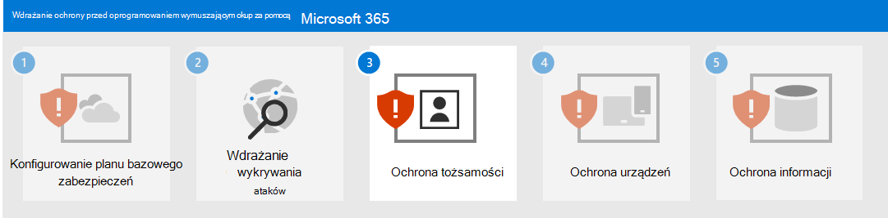

# Krok nr 2. Wdrażanie wykrywania ataków i reagowania

Jako zdecydowanie zalecany etap początkowy dla wykrywania ataków oprogramowania wymuszającego okup i odpowiedzi w dzierżawie usługi  Microsoft 365 skonfiguruj środowisko wersji próbnej, aby ocenić funkcje i możliwości oprogramowania Microsoft 365 Defender.

Aby uzyskać dodatkowe informacje, zobacz te zasoby.

| Funkcja | Opis | Od czego zacząć | Jak używać jej do wykrywania i reagowania |
|:-------|:-----|:-------|:-------|
| [Microsoft 365 Defender](/microsoft-365/security/defender) | Łączy możliwości sygnału i bajtów w jedno rozwiązanie.    Umożliwia specjalistom zabezpieczeń łączenie sygnałów zagrożeń oraz określanie pełnego zakresu i wpływu zagrożenia.    Automatyzuje akcje w celu zapobiegania atakom i samodzielnej obsługi skrzynek pocztowych, punktów końcowych i tożsamości użytkowników, których dotyczy problem. | [Wprowadzenie](/microsoft-365/security/defender/get-started) | [Reagowanie na incydenty](/microsoft-365/security/defender/incidents-overview) |
| [Microsoft Defender for Identity](/defender-for-identity/what-is) |  Identyfikuje, wykrywa i bada zaawansowane zagrożenia, naruszone tożsamości i złośliwe działania niejawnego programu testów skierowane do organizacji za pośrednictwem opartego na chmurze interfejsu zabezpieczeń używa sygnałów Usługi domenowe w usłudze Active Directory (AD DS). | [Omówienie](/defender-for-identity/what-is) | [Praca z portalem usługi Microsoft Defender for Identity](/defender-for-identity/workspace-portal) |
| [Usługa Microsoft Defender dla Office 365](/microsoft-365/security/office-365-security) | Chroni organizację przed złośliwymi zagrożeniami ze strony wiadomości e-mail, linków (adresów URL) i narzędzi do współpracy.    Chroni przed złośliwym oprogramowaniem, wyłudzaniem informacji, fałszerniem i innymi typami ataków. | [Omówienie](/microsoft-365/security/office-365-security/overview) | [Schłoń pogromę](/microsoft-365/security/office-365-security/threat-hunting-in-threat-explorer) |
| [Ochrona punktu końcowego w usłudze Microsoft Defender](/microsoft-365/security/defender-endpoint) | Umożliwia wykrywanie i reagowanie na zaawansowane zagrożenia dla punktów końcowych (urządzeń). | [Omówienie](/microsoft-365/security/defender-endpoint/microsoft-defender-endpoint)  | [Wykrywanie punktu końcowego i odpowiedź](/microsoft-365/security/defender-endpoint/overview-endpoint-detection-response) |
| [Azure Active Directory tożsamości w usłudze Azure AD](/azure/active-directory/identity-protection/) | Automatyzuje wykrywanie i rozwiązywanie problemów związanych z zagrożeniami opartymi na tożsamościach oraz ich badanie. | [Omówienie](/azure/active-directory/identity-protection/overview-identity-protection) | [Badanie ryzyka](/azure/active-directory/identity-protection/howto-identity-protection-investigate-risk) |
| [Usługa Microsoft Defender dla aplikacji w chmurze](/cloud-app-security) | Broker zabezpieczeń dostępu w chmurze do odnajdowania, badania i zarządzania we wszystkich usługach firmy Microsoft i innych firm w chmurze. | [Omówienie](/cloud-app-security/what-is-cloud-app-security) | [Badanie](/cloud-app-security/investigate) |

>[!Note]
>Wszystkie te usługi wymagają Microsoft 365 E5 lub Microsoft 365 E3 z Zabezpieczenia platformy Microsoft 365 E5 dodatku.
>

Za pomocą tych usług wykrywaj i odpowiadaj na następujące typowe zagrożenia ze strony atakujących oprogramowania wymuszającego okup:

- Kradzież poświadczeń

   - Azure AD Identity Protection
   - Defender for Identity
   - Defender for Office 365

- Złamanie zabezpieczeń urządzenia

   - Defender for Endpoint
   - Defender for Office 365

- Eskalacji uprawnień

   - Azure AD Identity Protection
   - Defender for Cloud Apps

- Złośliwe zachowanie aplikacji

   - Defender for Cloud Apps

- Exfiltrowanie, usuwanie lub przekazywanie danych

   - Defender for Office 365
   - Usługa Defender dla aplikacji w chmurze [z zasadami wykrywania anomalii](/cloud-app-security/anomaly-detection-policy#ransomware-activity)

Następujące usługi używają Microsoft 365 Defender i jego portalu (https://security.microsoft.com)jako wspólnego punktu zbierania i analizowania zagrożeń:

- Defender for Identity
- Defender for Office 365
- Defender for Endpoint
- Defender for Cloud Apps

Microsoft 365 Defender łączy sygnały zagrożeń z alertami i alertami połączonymi w zdarzenie, dzięki czemu analitycy zabezpieczeń mogą szybciej wykrywać, badać i rekultywować fazy ataków oprogramowania wymuszającego okup.

## Wynikowa konfiguracja

Oto ochrona przed oprogramowaniem wymuszającym okup dla Twojej dzierżawy w krokach 1 i 2.

## Następny krok

Przejdź do [kroku 3, aby](ransomware-protection-microsoft-365-identities.md) chronić tożsamości w twojej Microsoft 365 dzierżawie.
