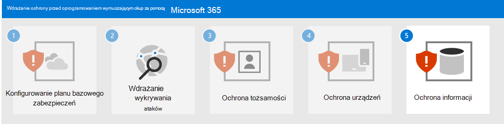

# Krok nr 4. Ochrona urządzeń

Aby chronić urządzenia (punkty końcowe) przed początkową częścią ataku oprogramowania wymuszającego okup:

- [Wdrażaj usługę Intune](/mem/intune/fundamentals/what-is-intune) jako dostawcę zarządzania urządzeniami przenośnymi (MDM) i zarządzania aplikacjami mobilnymi (MAM) dla swoich urządzeń i zarejestruj urządzenia należące do Twojej organizacji.
- Wdrożenie [wspólnych zasad dostępu do urządzenia i tożsamości w](/microsoft-365/security/office-365-security/identity-access-policies) celu zweryfikowania poświadczeń konta użytkownika i wymuszenia wymagań dotyczących kondycji urządzenia i zgodności.
- Włączanie [ochrony sieci w](/microsoft-365/security/defender-endpoint/network-protection) programie Microsoft Defender dla punktów końcowych i Microsoft 365 Defender.
- Skonfiguruj [sprawdzanie witryny oraz pobieranie,](/windows/security/threat-protection/microsoft-defender-smartscreen/microsoft-defender-smartscreen-available-settings) [sprawdzanie aplikacji i plików w programie](/windows/security/threat-protection/microsoft-defender-smartscreen/microsoft-defender-smartscreen-available-settings) Microsoft Defender SmartScreen blokować lub ostrzegać.
- Włącz [Program antywirusowy Microsoft Defender skanowanie](/microsoft-365/security/defender-endpoint/configure-advanced-scan-types-microsoft-defender-antivirus) pobranych plików i załączników.
- Ustaw **poziom zabezpieczeń pulpitu zdalnego na** **TLS** w programie Microsoft Defender dla punktu końcowego i Microsoft 365 Defender.

## Windows 11 lub 10 urządzeń

Aby chronić się przed elementem ruchu bocznego podczas ataków z Windows 11 lub 10:

- [Włącz Zaporę Microsoft Defender](https://support.microsoft.com/windows/turn-microsoft-defender-firewall-on-or-off-ec0844f7-aebd-0583-67fe-601ecf5d774f).
- [Aktualizowanie Program antywirusowy Microsoft Defender danych](/microsoft-365/security/defender-endpoint/manage-updates-baselines-microsoft-defender-antivirus).

Aby zmniejszyć wpływ ataków:

- Korzystaj [z reguł ograniczania powierzchni ataków i zaawansowanej ochrony przed oprogramowaniem wymuszającym okup](/microsoft-365/security/defender-endpoint/attack-surface-reduction-rules-reference#use-advanced-protection-against-ransomware).

Aby chronić przed atakującym i chronić Twoje obrony zabezpieczeń:

- [Zapewniaj ochronę w chmurze w](/microsoft-365/security/defender-endpoint/enable-cloud-protection-microsoft-defender-antivirus) Program antywirusowy Microsoft Defender włączone.
- Monitoruj Program antywirusowy Microsoft Defender [w](/microsoft-365/security/defender-endpoint/configure-real-time-protection-microsoft-defender-antivirus) czasie rzeczywistym.
- Włącz ochronę [w czasie rzeczywistym](/microsoft-365/security/defender-endpoint/configure-real-time-protection-microsoft-defender-antivirus).
- Włącz ochronę [przed naruszeniami w programie Microsoft Defender dla punktu końcowego,](/microsoft-365/security/defender-endpoint/prevent-changes-to-security-settings-with-tamper-protection) aby zapobiec złośliwym zmianom ustawień zabezpieczeń.

Aby chronić przed atakiem atakującego wykonującego kod:

- Włącz [Program antywirusowy Microsoft Defender.](/mem/intune/user-help/turn-on-defender-windows)
- [Blokuj połączenia interfejsu API Win32 Office makr.](/microsoft-365/security/defender-endpoint/attack-surface-reduction-rules#block-win32-api-calls-from-office-macros)
- Za pomocą tego procesu przemigruj wszystkie starsze skoroszyty wymagające makra Excel 4.0 do zaktualizowanego formatu makr [VBA](https://www.microsoft.com/microsoft-365/blog/2010/02/16/migrating-excel-4-macros-to-vba/).
- [Wyłącz używanie niepodpisanych makr](https://support.microsoft.com/topic/enable-or-disable-macros-in-office-files-12b036fd-d140-4e74-b45e-16fed1a7e5c6). Upewnij się, że wszystkie makra wewnętrzne w potrzebie biznesowej są  podpisane i korzystając z zaufanych lokalizacji, aby zapewnić, że w Twoim środowisku nie będą uruchamiane nieznane makra.
- Zatrzymaj złośliwe makra XLM lub VBA, upewniając się, że skanowanie makr środowiska uruchomieniowego za pomocą interfejsu AMSI ( [Antimalware Scan Interface](https://www.microsoft.com/security/blog/2021/03/03/xlm-amsi-new-runtime-defense-against-excel-4-0-macro-malware/) ) jest wł. Ta funkcja (domyślnie włączona) jest włączona, zasady grupy dla opcji Zakres skanowania w  czasie uruchamiania makr jest ustawiona na wartość  Włącz dla wszystkich plików lub Włącz dla plików o niskim **zaufaniu**. Pobierz najnowsze pliki szablonów zasad grupy.

## Wpływ na użytkowników i zarządzanie zmianami

Podczas wdrażania tych zabezpieczeń należy wykonywać poniższe czynności w celu zarządzania zmianami:

- Typowe [zasady zerowego zaufania w zakresie tożsamości](/microsoft-365/security/office-365-security/identity-access-policies) i dostępu do urządzeń mogą odmawiać dostępu użytkownikom, którzy mają niezgodne urządzenia.
- Pobieranie plików może ostrzegać użytkowników przed pobraniem lub zablokowaniem pobierania.
- Niektóre Office, Excel 4.0, XLM lub VBA mogą już nie być uruchamiane.

## Wynikowa konfiguracja

Oto ochrona przed oprogramowaniem wymuszającym okup dla Twojej dzierżawy w krokach od 1 do 4.

## Następny krok

Przejdź do [kroku 5, aby](ransomware-protection-microsoft-365-information.md) chronić informacje w Twojej Microsoft 365 dzierżawie. 
