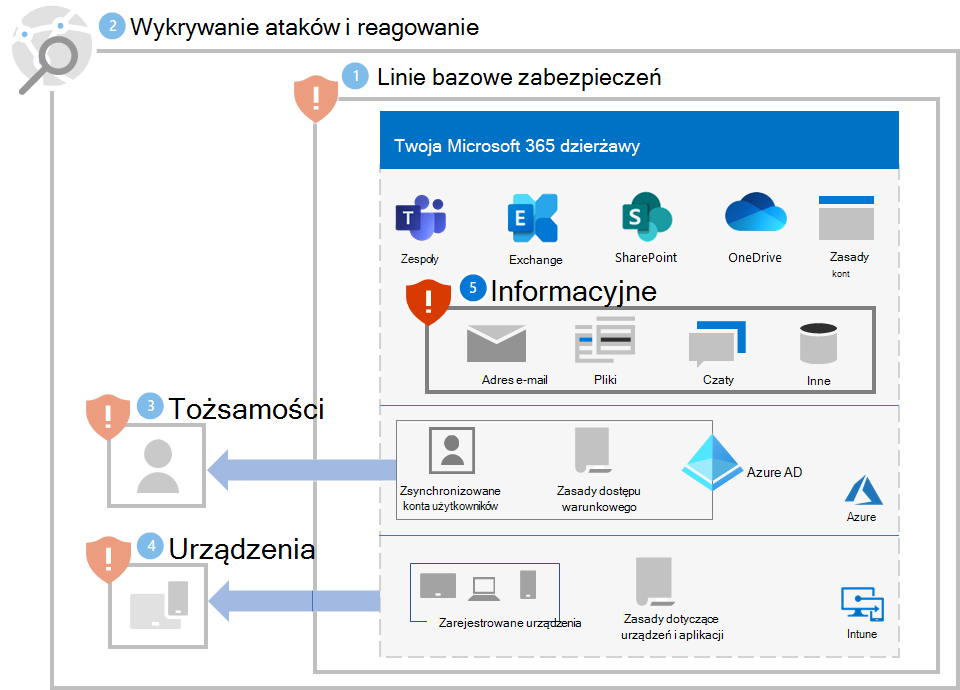

# Krok nr 5. Ochrona informacji

Ponieważ atakujący oprogramowania wymuszającego okup będą również przyjrzeć się Twoim lokalnym danych umieszczonym na plikach, bazach danych i innych serwerach, jednym z najlepszych sposobów ochrony tych danych jest ich migracja do Twojej Microsoft 365 dzierżawy. W tym miejscu może on być chroniony przez wbudowane funkcje odzyskiwania i środki zaradcze, takie jak wersja [, Kosz i Przywracanie plików](ransomware-protection-microsoft-365.md#ransomware-mitigation-and-recovery-capabilities-provided-with-microsoft-365).

Aby zapewnić dodatkową ochronę informacji poufnych w Twojej Microsoft 365 dzierżawie:

- Odszukaj informacje poufne.
- Implementowanie ścisłych uprawnień i wyeliminowanie szerokiego dostępu (na przykład zapobieganie możliwościom pisania, edytowania i usuwania zbyt wielu użytkowników).
- Ochrona informacji poufnych.

>[!Note]
>Aby uzyskać szczegółowe wskazówki dotyczące wdrażania ochrony informacji w dzierżawie Microsoft 365, zobacz [Wdrażanie ochrony informacji w celu ochrony prywatności danych](information-protection-deploy.md). Mimo że jest przeznaczona do ochrony prywatności danych, wiele z tych wskazówek dotyczy również ochrony oprogramowania wymuszającego okup.
>

## Znajdowanie informacji poufnych

Pierwszym zadaniem jest [zidentyfikowanie typów i](/microsoft-365/compliance/information-protection#know-your-data) lokalizacji informacji poufnych w dzierżawie, które mogą obejmować następujące typy:

- Pochylić
- Własność zastrzeżona lub intelektualna
- Przepisy prawne, takie jak przepisy regionalne określające ochronę informacji osobistych
- Plany odzyskiwania it

Dla każdego typu informacji poufnych określ następujące informacje:

- Korzystanie z informacji w Twojej organizacji
- Względna miara wartości pieniężnej, jeśli była ona utrzymywana dla okupu (na przykład wysoka, średnia, niska)
- Jego bieżąca lokalizacja, na przykład OneDrive folder SharePoint lub miejsce współpracy, takie jak Microsoft Teams zespołu
- Bieżące uprawnienia, które składają się z:

   - Konta użytkowników z dostępem

   - Akcje, które są dozwolone dla każdego konta z dostępem 

## Implementowanie ścisłych uprawnień dla lokalizacji z informacjami poufnymi

Implementowanie ścisłych uprawnień w dzierżawie usługi Microsoft 365 korzysta z zasady  najmniejszych uprawnień do lokalizacji i miejsc komunikacji, które w programie Microsoft 365 OneDrive są zazwyczaj folderami SharePoint witrynami i folderami oraz zespołami. 

O ile łatwiej jest tworzyć lokalizacje przechowywania plików lub zespoły mające szeroki dostęp (na przykład domyślne ustawienia wszystkich osób w organizacji), w przypadku informacji poufnych dozwolone konta użytkowników i dozwolone akcje muszą być ograniczone do minimalnego zestawu wymaganego do spełnienia wymagań dotyczących współpracy i biznesowych.

Gdy atakujący oprogramowania wymuszającego okup zinfiltruje Twoją dzierżawę, próbują eskalować swoje uprawnienia, narażając poświadczenia kont użytkowników o szerszych zakresach uprawnień w całej dzierżawie, na przykład konta ról administratora lub konta użytkowników, które mają dostęp do informacji poufnych. 

Na podstawie tego typowego zachowania atakującego są dwa poziomy trudności dla atakującego:

- **Niska:** Atakujący może korzystać z konta o niskich uprawnieniach i odnajdować informacje poufne użytkownika ze względu na szeroki dostęp w całej dzierżawie.
- **Wyższa:** Atakujący nie może korzystać z konta o niskich uprawnieniach i odnajdować informacji poufnych użytkownika ze względu na ścisłe uprawnienia. Muszą oni eskalować swoje uprawnienia, określając, a następnie narażając poświadczenia konta, które ma dostęp do lokalizacji z informacjami poufnymi, a następnie mogą być w stanie wykonać tylko ograniczony zestaw akcji.

W przypadku informacji poufnych poziom trudności musi być jak najwyższy.

Aby zapewnić ścisłe uprawnienia w dzierżawie, możesz wykonać następujące czynności:

1. Odszukaj [informacje poufne,](#locate-your-sensitive-information) mając odpowiednie uprawnienia, przejrzyj uprawnienia dotyczące lokalizacji informacji poufnych. 
2. Wdrażaj ścisłe uprawnienia do informacji poufnych podczas spotkań dotyczących współpracy i wymagań biznesowych, a także informuj użytkowników, których to dotyczy.
3. Przekieruj zarządzanie zmianami w przyszłych lokalizacjach informacji poufnych, aby tworzyły i zachowywały ścisłe uprawnienia.
4. Inspekcja lokalizacji pod danymi poufnymi i monitorowanie ich w celu upewnienia się, że nie są udzielane ogólne uprawnienia.

Zobacz [Konfigurowanie bezpiecznego udostępniania plików i współpracy z innymi Microsoft Teams](setup-secure-collaboration-with-teams.md), aby uzyskać szczegółowe wskazówki. Przykładem miejsca komunikacji i współpracy z rygorystycznymi uprawnieniami do informacji poufnych jest [zespół z izolacji zabezpieczeń](/microsoft-365/solutions/secure-teams-security-isolation).

## Ochrona informacji poufnych

Aby chronić informacje poufne w przypadku uzyskania dostępu przez atakującego oprogramowania wymuszającego okup:

- Używaj [kontrolowanego dostępu do folderu](/windows/security/threat-protection/microsoft-defender-atp/controlled-folders) , aby utrudnić nieautoryzowanym aplikacjom modyfikowanie danych w folderach kontrolowanych.

- Użyj [Microsoft Information Protection](/microsoft-365/compliance/information-protection) etykiet wrażliwości i zastosuj je do informacji poufnych. Etykiety wrażliwości można skonfigurować w celu dodatkowego szyfrowania i uprawnień przy użyciu zdefiniowanych kont użytkowników i dozwolonych akcji. Plik oznaczony etykietą wrażliwości tego typu, który jest przefiltrowany z dzierżawy, będzie można używać tylko dla konta użytkownika zdefiniowanego na tej etykiecie.

- Ochrona przed utratą danych [(DLP, Data Loss Prevention)](/microsoft-365/compliance/dlp-learn-about-dlp) Microsoft 365 wykrywanie, ostrzeganie i blokowanie ryzykownego, przypadkowego lub nieodpowiedniego udostępniania danych zawierających informacje osobiste lub poufne na podstawie etykiet poufności, zarówno wewnętrznie, jak i zewnętrznie.

- Za [pomocą programu Microsoft Defender for Cloud Apps](/cloud-app-security/what-is-cloud-app-security) możesz blokować pobieranie poufnych informacji, takich jak pliki. Za pomocą zasad [wykrywania anomalii w usłudze Defender for Cloud Apps](/cloud-app-security/anomaly-detection-policy#ransomware-activity) można również wykrywać dużą szybkość przekazywania plików lub działań usuwania plików.

## Wpływ na użytkowników i zarządzanie zmianami

Zmiany administracyjne dotyczące szerokich uprawnień mogą doprowadzić do odmówienia użytkownikom dostępu lub wykonywania pewnych akcji.

Ponadto w celu ochrony informacji poufnych w Twojej dzierżawie Microsoft 365 przeszkolić użytkowników w zakresie:

- Twórz miejsca komunikacji i współpracy z rygorystycznymi uprawnieniami (minimalny zestaw kont użytkowników do uzyskiwania dostępu i minimalne dozwolone akcje dla każdego konta). 
- Zastosuj odpowiednie etykiety wrażliwości do informacji poufnych.
- Używanie kontrolowanego dostępu do folderu.

## Wynikowa konfiguracja

Oto ochrona przed oprogramowaniem wymuszającym okup dla Twojej dzierżawy w krokach od 1 do 5.

## Dodatkowe zasoby oprogramowania wymuszającego okup

Najważniejsze informacje od firmy Microsoft:

- [Coraz większe zagrożenie związane z oprogramowaniem wymuszającym okup](https://blogs.microsoft.com/on-the-issues/2021/07/20/the-growing-threat-of-ransomware/) (Microsoft) w wpisie w blogu Problemy z 20 lipca 2021 r.
- [Oprogramowanie wymuszające okup obsługiwane przez człowieka](/security/compass/human-operated-ransomware)
- [Błyskawiczna ochrona przed oprogramowaniem wymuszającym okup i wymuszającym okup](/security/compass/protect-against-ransomware)
- [2021: Microsoft Digital Defense Report](https://www.microsoft.com/security/business/microsoft-digital-defense-report) (zobacz strony 10-19)
- [Oprogramowanie wymuszające okup: natłok](https://security.microsoft.com/threatanalytics3/05658b6c-dc62-496d-ad3c-c6a795a33c27/overview) i bieżący raport analizy zagrożeń w portalu Microsoft 365 Defender okup
- Rozwiązanie firmy Microsoft dotyczące oprogramowania wymuszającego okup (DETECTION and Response Team) firmy Microsoft oraz najlepsze [rozwiązania i](/security/compass/incident-response-playbook-dart-ransomware-approach) [analiza przypadku](/security/compass/dart-ransomware-case-study)

Microsoft 365:

- [Zmaksymalizuj odporność oprogramowania wymuszającego okup na platformie Azure Microsoft 365](https://azure.microsoft.com/resources/maximize-ransomware-resiliency-with-azure-and-microsoft-365/)
- [Odzyskiwanie po atakach oprogramowania wymuszającego okup](/microsoft-365/security/office-365-security/recover-from-ransomware)
- [Ochrona przed złośliwym oprogramowaniem i oprogramowaniem wymuszającym okup](/compliance/assurance/assurance-malware-and-ransomware-protection)
- [Ochrona komputera Windows 10 przed oprogramowaniem wymuszającym okup](https://support.microsoft.com//windows/protect-your-pc-from-ransomware-08ed68a7-939f-726c-7e84-a72ba92c01c3)
- [Obsługa oprogramowania wymuszającego okup w SharePoint Online](/sharepoint/troubleshoot/security/handling-ransomware-in-sharepoint-online)
- [Raporty analizy zagrożeń dotyczące oprogramowania wymuszającego](https://security.microsoft.com/threatanalytics3?page_size=30&filters=tags%3DRansomware&ordering=-lastUpdatedOn&fields=displayName,alertsCount,impactedEntities,reportType,createdOn,lastUpdatedOn,tags,flag) okup w Microsoft 365 Defender sieci

Microsoft 365 Defender:

- [Znajdź oprogramowanie wymuszające okup dzięki zaawansowanej chłonie](/microsoft-365/security/defender/advanced-hunting-find-ransomware)

Microsoft Azure:

- [Obrony platformy Azure w przypadku ataków na oprogramowanie wymuszające okup](https://azure.microsoft.com/resources/azure-defenses-for-ransomware-attack/)
- [Zmaksymalizuj odporność oprogramowania wymuszającego okup na platformie Azure Microsoft 365](https://azure.microsoft.com/resources/maximize-ransomware-resiliency-with-azure-and-microsoft-365/)
- [Plan tworzenia kopii zapasowej i przywracania w celu ochrony przed oprogramowaniem wymuszającym okup](/security/compass/backup-plan-to-protect-against-ransomware)
- [Pomóż chronić przed oprogramowaniem wymuszającym okup Microsoft Azure zapasowej](https://www.youtube.com/watch?v=VhLOr2_1MCg) (26-minutowy klip wideo)
- [Odzyskiwanie po najechania na tożsamość tożsamości przez tożsamość](/azure/security/fundamentals/recover-from-identity-compromise)
- [Zaawansowane wykrywanie wieloetapowego ataku w programie Microsoft Sentinel](/azure/sentinel/fusion#ransomware)
- [Wykrywanie oprogramowania wymuszającego okup w programie Microsoft Sentinel](https://techcommunity.microsoft.com/t5/azure-sentinel/what-s-new-fusion-detection-for-ransomware/ba-p/2621373)

Program Microsoft Defender dla aplikacji w chmurze:

-  [Tworzenie zasad wykrywania anomaly w usłudze Defender dla aplikacji w chmurze](/cloud-app-security/anomaly-detection-policy)

Wpisy w blogu zespołu zabezpieczeń firmy Microsoft:

- [3 kroki, aby zapobiec oprogramowaniem wymuszającym okup i odzyskać je (wrzesień 2021 r.)](https://www.microsoft.com/security/blog/2021/09/07/3-steps-to-prevent-and-recover-from-ransomware/)
- [Przewodnik dotyczący zwalczania oprogramowania wymuszającego okup obsługiwany przez człowieka: część 1 (wrzesień 2021 r.)](https://www.microsoft.com/security/blog/2021/09/20/a-guide-to-combatting-human-operated-ransomware-part-1/)

  Kluczowe instrukcje dotyczące sposobu, w jaki zespół wykrywanie i odpowiedzi firmy Microsoft przeprowadza badania zdarzeń oprogramowania wymuszającego okup.

- [Przewodnik dotyczący zwalczania oprogramowania wymuszającego okup obsługiwany przez człowieka: część 2 (wrzesień 2021 r.)](https://www.microsoft.com/security/blog/2021/09/27/a-guide-to-combatting-human-operated-ransomware-part-2/)

  Rekomendacje i najlepsze rozwiązania.

- [Odporność dzięki zrozumieniu zagrożeń związanych z sezonowością: część 4. — poruszanie się po bieżących zagrożeniach (maj 2021 r.)](https://www.microsoft.com/security/blog/2021/05/26/becoming-resilient-by-understanding-cybersecurity-risks-part-4-navigating-current-threats/)

  Zobacz sekcję **Oprogramowanie wymuszające okup** .

- [Ataki oprogramowania wymuszającego okup przez ludzi: zapobiegalna awaria oprogramowania wymuszającego okup (marzec 2020 r.)](https://www.microsoft.com/security/blog/2020/03/05/human-operated-ransomware-attacks-a-preventable-disaster/)

  Zawiera analizy łańcucha ataków rzeczywistego.

- [Odpowiedź oprogramowania wymuszającego okup — na płatność lub nie? (Grudzień 2019 r.)](https://www.microsoft.com/security/blog/2019/12/16/ransomware-response-to-pay-or-not-to-pay/)
- [Norsk Nie odpowiada na ataki oprogramowania wymuszającego okup z przezroczystością (grudzień 2019 r.)](https://www.microsoft.com/security/blog/2019/12/17/norsk-hydro-ransomware-attack-transparency/)
