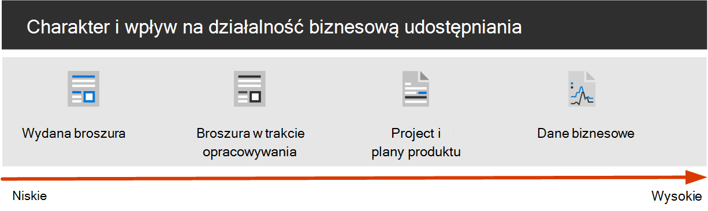

# Konfigurowanie bezpiecznego udostępniania plików i współpracy przy użyciu aplikacji Microsoft Teams

Możliwość łatwego udostępniania plików i dokumentów odpowiednim osobom, jednocześnie zapobiegające zasyłaniu treści, jest kluczem do sukcesu organizacji. Obejmuje to możliwość bezpiecznego udostępniania poufnych lub innych danych tylko osobom, które powinny mieć do nich dostęp. W zależności od projektu może to obejmować udostępnianie poufnych danych osobom spoza organizacji.

Te wskazówki dotyczące rozwiązania do współpracy zawierają dwa składniki, które pomogą Ci:

- Wdrażanie Teams z odpowiednim poziomem ochrony dla każdego projektu
- Konfigurowanie udostępniania zewnętrznego z odpowiednimi ustawieniami zabezpieczeń dla każdego projektu

Jeśli uniwersalne i łatwe w użyciu narzędzia do współpracy nad plikami nie są dostępne, użytkownicy często współpracują, wysyłając dokumenty pocztą e-mail. Jest to pracochłonna i podatne na błędy metoda współpracy, która może zwiększyć ryzyko nieodpowiedniego udostępniania informacji. Jeśli udostępnianie plików będzie zbyt trudne, można wrócić do korzystania z produktów dla klientów konsumenckich, które nie są objęte przepisami IT. Może to stanowić jeszcze większe ryzyko.

> [!VIDEO https://www.microsoft.com/videoplayer/embed/RWxMmL?autoplay=false]

Dzięki Microsoft 365 możesz wdrożyć Teams różnych konfiguracjach, które pomagają:

- Ochrona własności intelektualnej
- Umożliwianie łatwej współpracy z dokumentami i innymi plikami
- Utworzenie równowagi między zabezpieczeniami a użytecznością, która zwiększa zadowolenie użytkowników i zmniejsza ryzyko cieniowania it

Większość organizacji ma różne informacje, o różnych stopniach wrażliwości i różnych stopniach wpływu biznesowego, jeśli informacje są nieodpowiednie. W zależności od wrażliwości danego fragmentu informacji możesz zezwolić na udostępnianie:

- Wszyscy (bez uwierzytelniania)
- Osoby w organizacji
- Konkretne osoby w organizacji
- Konkretne osoby w organizacji i poza nią

Informacje, takie jak broszury marketingowe, są przeznaczone do szerokiego udostępniania poza organizacją. Informacje, takie jak menu kawiarni, nie są przeznaczone do udostępniania zewnętrznego, ale nie będą miały wpływu na działalność biznesową, jeśli zostały udostępnione zewnętrznie. Te typy informacji wymagają niewielkiej ochrony lub nie wymagają żadnej ochrony.

Te same broszury marketingowe mogą być udostępniane tylko w organizacji, podczas opracowywania. W takim przypadku domyślne ustawienia udostępniania w programie Teams być wystarczające.

Informacje o nowym produkcie, który jest w trakcie opracowywania, mogą być uznawane za poufne nawet w obrębie organizacji. W takim przypadku może być odpowiedni wyższy stopień ochrony. Możesz na przykład ograniczyć dostęp do tych informacji tylko do członków określonego zespołu. W zależności od projektu może być potrzebna współpraca z osobami spoza organizacji, takimi jak dostawca lub organizacja partnerska.

Informacje, które mają kluczowe znaczenie dla sukcesu Twojej organizacji, albo mają rygorystyczny poziom zabezpieczeń lub zgodności, mogą wymagać jeszcze większej ochrony.

We wszystkich scenariuszach wymienionych powyżej możesz korzystać z zespołów w Microsoft Teams, aby przechowywać, udostępniać i współpracować nad informacjami.

Aby skonfigurować bezpieczną współpracę, skorzystaj z tych Microsoft 365 i funkcji.

|Produkt lub składnik|Funkcja lub funkcja|Licencjonowanie|
|---|---|---|
|Usługa Microsoft Defender dla Office 365|Sejf załączników dla spo, OneDrive i Teams; Sejf dokumenty; Sejf linków dla Teams|Microsoft 365 E1, E3 i E5|
|SharePoint|Zasady udostępniania witryn i plików, Uprawnienia udostępniania witryn, Linki udostępniania, Żądania dostępu, Ustawienia udostępniania gości witryny|Microsoft 365 E1, E3 i E5|
|Microsoft Teams|Dostęp gościa, zespoły prywatne, kanały prywatne, kanały udostępnione|Microsoft 365 E1, E3 i E5|
|Microsoft 365 zgodności|Etykiety wrażliwości|Microsoft 365 E3 i E5|

## Struktura zarządzania współpracą w zakresie Teams i Microsoft 365

Microsoft 365 udostępnia wiele opcji dotyczących współpracy. Zalecamy korzystanie z tej zawartości wdrażania wraz z zawartością zarządzania [współpracą](collaboration-governance-overview.md) w celu utworzenia najlepszego rozwiązania do współpracy dla organizacji.

### Zabezpieczanie Teams danych poufnych i bardzo poufnych

Aby zarządzać dostępem do informacji o różnych sensownościach, opracowaliśmy trzy różne warstwy ochrony dla [Teams](configure-teams-three-tiers-protection.md). Dowolną z tych warstw możesz dostosować, aby lepiej dopasować się do potrzeb lub twojej firmy.

Te *warstwy —* podstawowa, *wrażliwa* i *wysoce* wrażliwa — stopniowo zwiększają ochronę, która zapobiega utracie możliwości wymiany informacji i potencjalnemu wyciekowi informacji, jak pokazano w poniższej tabeli.

|-|Warstwa planu bazowego|Warstwa poufnych|Warstwa o wysokiej czułości|
|---|---|---|---|
|Zespół publiczny lub prywatny|Albo|Prywatna|Prywatna|
|Udostępnianie bez uwierzytelniania|Zablokowane|Zablokowane|Zablokowane|
|Udostępnianie plików|Dozwolone|Dozwolone|Tylko właściciele zespołu mogą je udostępniać.|
|Członkostwo w zespole|Każdy może dołączyć do zespołów publicznych. Zatwierdzenie właściciela zespołu wymagane do dołączenia do zespołów prywatnych.|Zatwierdzenie właściciela zespołu wymagane do dołączenia.|Zatwierdzenie właściciela zespołu wymagane do dołączenia.|
|Szyfrowanie dokumentów|||Dostępne z etykietą wrażliwości|
|Udostępnianie gości|Dozwolone|Może być dozwolone lub blokowane|Może być dozwolone lub blokowane|
|Urządzenia niezamanektowane|Bez ograniczeń|Dostęp tylko do sieci Web|Zablokowane|

Konfigurowanie tych warstw obejmuje:

- Konfigurowanie ustawień w programie Teams dostępu gościa i kanałów prywatnych
- Konfigurowanie ustawień w skojarzonej witrynie zespołu na SharePoint udostępniania wewnętrznego i gościa, żądań dostępu i linków udostępniania
- W przypadku *warstw poufnych* *i bardzo poufnych* , konfigurowanie etykiet wrażliwości w celu klasyfikowania zespołów oraz kontrolowanie udostępniania gościa i dostępu z urządzeń niezamaniowanych
- W przypadku *bardzo poufnej* warstwy skonfigurowanie etykiety wrażliwości w celu zaszyfrowania dokumentów, do których jest stosowana

Zacznij od warstwy bazowej, a następnie dodaj zespoły, które używają poufnych i  wysoce poufnych warstw, jeśli są potrzebne, aby chronić informacje w organizacji. Aby rozpocząć, zobacz następujące zasoby:

- [Konfigurowanie zespołów przy użyciu ochrony linii bazowej](configure-teams-baseline-protection.md)
- [Konfigurowanie zespołów w celu ochrony danych poufnych](configure-teams-sensitive-protection.md)
- [Konfigurowanie zespołów z ochroną bardzo poufnych danych](configure-teams-highly-sensitive-protection.md)

Jeśli masz bardzo poufny projekt, który wymaga dodatkowej ochrony przed udostępnianiem nawet w twojej organizacji, możesz skonfigurować zespół, który ma własną etykietę wrażliwości, aby szyfrować pliki tak, aby tylko członkowie zespołu je odczytywali. Aby [uzyskać szczegółowe informacje, zobacz Konfigurowanie zespołu z izolacji](secure-teams-security-isolation.md) zabezpieczeń.

### Udostępnianie osobom spoza organizacji

Może być konieczne udostępnienie [informacji o poufnej treści osobom spoza organizacji](collaborate-with-people-outside-your-organization.md). Może to dotyczyć od udostępniania pojedynczego dokumentu jednej osobie do współpracy nad głównym projektem dużej organizacji partnerskiej lub autorom z całego świata. W Microsoft 365 tego zakresu udostępniania zewnętrznego można łatwo i z odpowiednimi zabezpieczeniami zabezpieczyć poufne informacje.

Poniższe zasoby pomogą Ci rozpocząć konfigurowanie środowiska do współpracy z osobami spoza organizacji:

- [Współpraca nad dokumentami](collaborate-on-documents.md) w celu udostępniania pojedynczych plików folderów.
- [Współpraca w witrynie w](collaborate-in-site.md) celu współpracy z gośćmi w SharePoint sieci Web.
- [Współpracuj jako zespół](collaborate-as-team.md) w celu współpracy z gośćmi w zespole.
- [Współpracuj z uczestnikami zewnętrznymi w kanale](/microsoft-365/solutions/collaborate-teams-direct-connect) w celu współpracy z osobami spoza organizacji w kanale udostępnionym.

W zależności od wrażliwości udostępnianych informacji możesz dodać zabezpieczenia, aby zapobiec zasypowieniu. Poniższe zasoby pomogą w skonfigurowaniu zabezpieczeń potrzebnych dla organizacji:

- [Najlepsze rozwiązania dotyczące udostępniania plików i folderów nieuwierzytanych użytkownikom](best-practices-anonymous-sharing.md)
- [Ograniczanie przypadkowego udostępnienia plików osobom spoza organizacji](share-limit-accidental-exposure.md)
- [Tworzenie bezpiecznego środowiska udostępniania gości](create-secure-guest-sharing-environment.md)

Jeśli masz ważny projekt z organizacją partnerską, możesz zarządzać osobami spoza  organizacji, z którymi chcesz współpracować, przy użyciu kanałów udostępnionych lub usługi [Azure Entitlement Management](b2b-extranet.md).

## Szkolenia dla administratorów

Te moduły szkoleniowe w witrynie Microsoft Learn mogą ułatwić naukę współpracy, zarządzania i funkcji tożsamości w programach Teams i SharePoint.

### Teams

|Szkolenie:|Zarządzanie współpracą w zespole za pomocą Microsoft Teams|
|---|---|
||Zarządzanie współpracą w zespole za Microsoft Teams zawiera wprowadzenie do funkcji programu Microsoft Teams, głównego centrum współpracy zespołowej w Microsoft 365. Dowiesz się, jak za pomocą programu Teams usprawnić pracę zespołową i komunikację w obrębie organizacji, zarówno lokalnie, jak i poza nią, na różnych urządzeniach — od komputerów stacjonarnych po tablety po telefony — a jednocześnie korzystać ze wszystkich funkcji aplikacji pakietu Office 365. Zyskasz wiedzę na temat tego, jak Teams kompleksowe i elastyczne środowisko do współpracy między aplikacjami i urządzeniami. Ta ścieżka nauki może ułatwić Ci przygotowanie się na certyfikat Microsoft 365: Teams skojarz certyfikacji administratora.
2 godz. 17 min - ścieżka Edukacja - 5 modułów|

> [!div class="nextstepaction"]
> [Rozpoczynanie >](/learn/modules/m365-teams-collab-prepare-deployment/introduction/)

### SharePoint

|Szkolenie:|Współpraca dzięki SharePoint w programie Microsoft 365|
|---|---|
||Zarządzanie zawartością udostępnioną w aplikacji Microsoft SharePoint zawiera wprowadzenie do funkcji i możliwości aplikacji SharePoint oraz sposób jej działania z Microsoft 365. Poznasz informacje na temat różnych typów witryn SharePoint, w tym witryn centrum, a także ochrony informacji, raportowania i monitorowania. Dowiesz się także, jak za pomocą udostępniania plików i folderów SharePoint zoptymalizować współpracę, jak udostępniać pliki zewnętrznie oraz jak zarządzać witrynami programu SharePoint w centrum administracyjnym usługi SharePoint. Ta ścieżka nauki może ułatwić Ci przygotowanie się do Microsoft 365 certyfikowane: Skojarz certyfikat administratora pracy zespołowej.
1 godz. 14 min - ścieżka Edukacja - 4 moduły|

> [!div class="nextstepaction"]
> [Rozpoczynanie >](/learn/modules/m365-teams-sharepoint-plan-sharepoint/introduction/)

### Ochrona informacji

|Szkolenie:|Ochrona informacji przedsiębiorstwa za pomocą Microsoft 365|
|---|---|
||Ochrona i zabezpieczanie informacji organizacji jest trudnym zadaniem niż kiedykolwiek wcześniej. W ścieżce nauki Ochrona informacji przedsiębiorstwa za pomocą etykiet Microsoft 365 omówiono, jak chronić poufne informacje przed przypadkowym usunięciem lub błędem, odnajdować i klasyfikować dane, jak je chronić etykietami wrażliwości, jak monitorować i analizować informacje poufne, aby chronić je przed ich utratą. Ta ścieżka nauki może ułatwić Ci przygotowanie się do Microsoft 365 certyfikatu: skojarzeń administratora zabezpieczeń i Microsoft 365 certyfikowanych: Enterprise certyfikacji eksperta administracji.
1 godz. — ścieżka Edukacja - 5 modułów|

> [!div class="nextstepaction"]
> [Rozpoczynanie >](/learn/modules/m365-security-info-overview/introduction/)

### Tożsamość i dostęp

|Szkolenie:|Ochrona tożsamości i dostępu za pomocą Azure Active Directory|
|---|---|
||Ścieżka nauki Tożsamości i programu Access obejmuje najnowsze technologie tożsamości i dostępu, narzędzia do wzmacniania uwierzytelniania oraz wskazówki dotyczące ochrony tożsamości w organizacji. Technologie dostępu i tożsamości firmy Microsoft umożliwiają zabezpieczanie tożsamości organizacji (zarówno lokalnie, jak i w chmurze) oraz zapewnianie użytkownikom możliwości bezpiecznej pracy z dowolnego miejsca. Ta ścieżka nauki może ułatwić Ci przygotowanie się do Microsoft 365 certyfikatu: skojarzeń administratora zabezpieczeń i Microsoft 365 certyfikowanych: Enterprise certyfikacji eksperta administracji.
2 godz. 52 min - ścieżka Edukacja - 6 modułów|

> [!div class="nextstepaction"]
> [Rozpoczynanie >](/learn/modules/m365-identity-overview/introduction/)

## Szkolenia dla użytkowników końcowych

Te moduły szkoleniowe mogą ułatwić użytkownikom współpracę w Teams, grupach i grupach oraz SharePoint w Microsoft 365.

|Teams|SharePoint|
|---|---|
| **[Konfigurowanie i dostosowywanie zespołu](https://support.microsoft.com/office/702a2977-e662-4038-bef5-bdf8ee47b17b)**| **[Udostępnianie i synchronizowanie](https://support.microsoft.com/office/98cb2ff2-c27e-42ea-b055-c2d895f8a5de)**|
| **[Upload i znajdowanie plików](https://support.microsoft.com/office/57b669db-678e-424e-b0a0-15d19215cb12)**||
| **[Współpraca w zespołach i kanałach](https://support.microsoft.com/office/c3d63c10-77d5-4204-a566-53ddcf723b46)**||

## Ilustracje

Ilustracje te pomogą Zrozumieć, jak grupy i zespoły współdziałają z innymi usługami firmy Microsoft 365 oraz jakie funkcje zarządzania i zgodności są dostępne, aby ułatwić zarządzanie tymi usługami w organizacji.

### Grupy dla Microsoft 365 it

Co indyjscy indyjscy muszą wiedzieć o grupach w Microsoft 365

|**Element**|**Opis**|
|---|---|
|   [PDF](https://github.com/MicrosoftDocs/microsoft-365-docs/raw/public/microsoft-365/downloads/msft-m365-groups.pdf) \| [Visio](https://github.com/MicrosoftDocs/OfficeDocs-Enterprise/raw/live/Enterprise/downloads/msft-m365-groups.vsdx)   Zaktualizowano w czerwcu 2019 r.|Na tych ilustracjach opisano różne typy grup, sposób ich tworzenia i zarządzania oraz kilka zaleceń dotyczących zarządzania.|

### Microsoft Teams i pokrewne usługi zwiększające produktywność Microsoft 365 dla architektów IT

Logiczna architektura usług biurowych w Microsoft 365, prowadząca z Microsoft Teams.

|**Element**|**Opis**|
|---|---|
|   [PDF](https://github.com/MicrosoftDocs/microsoft-365-docs/raw/public/microsoft-365/downloads/msft-m365-teams-logical-architecture.pdf) \| [Visio](https://github.com/MicrosoftDocs/OfficeDocs-Enterprise/raw/live/Enterprise/downloads/msft-m365-teams-logical-architecture.vsdx)   Zaktualizowano w kwietniu 2019 r.|Firma Microsoft oferuje pakiet usług biurowych, które współpracują ze sobą, aby zapewnić środowisko współpracy z możliwościami zarządzania danymi, zabezpieczeniami i zgodnością. 
Ta seria ilustracji przedstawia logiczną architekturę usług biurowych dla architektów przedsiębiorstwa, prowadzącą do Microsoft Teams.|

## Wdrażanie bezpiecznego rozwiązania do współpracy

Gdy wszystko będzie gotowe do wdrożenia tego rozwiązania, przejdź do poniższych kroków:

1. Skonfiguruj trzy [różne warstwy ochrony dla Teams](configure-teams-three-tiers-protection.md).
2. Konfigurowanie ustawień udostępniania [informacji o poufnej treści osobom spoza organizacji](collaborate-with-people-outside-your-organization.md).

## Zobacz też

[Dokumentacja zabezpieczeń platformy Microsoft 365](../security/index.yml)

[Microsoft 365 zgodności](../compliance/index.yml)

[Witamy w Microsoft Teams](/MicrosoftTeams/Teams-overview)
