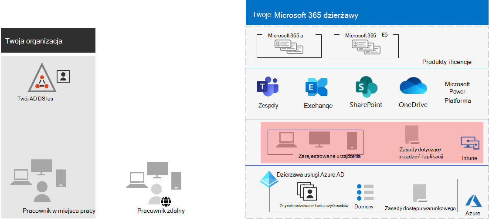

# Krok nr 5. Zarządzanie urządzeniami i aplikacją na Microsoft 365 dzierżawy przedsiębiorstwa

program Microsoft 365 dla przedsiębiorstwa zawiera funkcje, które ułatwiają zarządzanie urządzeniami i korzystanie z aplikacji na tych urządzeniach w organizacji za pomocą funkcji zarządzania urządzeniami przenośnymi (MDM) i zarządzania aplikacjami mobilnymi (MAM). Możesz zarządzać urządzeniami z systemami iOS, Android, macOS i Windows, aby chronić dostęp do zasobów organizacji, w tym do Twoich danych. Możesz na przykład zapobiec wysyłaniu wiadomości e-mail do osób spoza organizacji lub odizolować dane organizacji od danych osobistych na urządzeniach osobistych Twoich pracowników.

Oto przykład sprawdzania poprawności i zarządzania użytkownikami, ich urządzeniami oraz ich użyciem lokalnych i chmurowych aplikacji biurowych, takich jak Microsoft Teams.

Aby ułatwić zabezpieczanie i ochronę zasobów organizacji, aplikacja Microsoft 365 dla przedsiębiorstwa zawiera funkcje do zarządzania urządzeniami i ich dostępem do aplikacji. Istnieją dwie opcje zarządzania urządzeniami:

- Microsoft Intune to kompleksowe rozwiązanie do zarządzania urządzeniami i aplikacją dla przedsiębiorstw.
- Basic Mobility and Security, który jest podzestawem usług Intune dostępnych we wszystkich Microsoft 365 do zarządzania urządzeniami w Organizacji. Aby uzyskać więcej informacji, zobacz [Funkcje mobilności podstawowej i zabezpieczeń](../admin/basic-mobility-security/capabilities.md).

Jeśli masz usługę Microsoft 365 E3 lub E5, użyj usługi Intune.

## Microsoft Intune

Zarządzasz [dostępem Microsoft Intune](/mem/intune/fundamentals/planning-guide) organizacji za pomocą usługi MDM lub MAM. Funkcja MDM jest wtedy, gdy użytkownicy "rejestrują" swoje urządzenia w usłudze Intune. Po zarejestrowaniu urządzenia jest ono urządzeniem zarządzanym i może otrzymywać zasady, reguły i ustawienia organizacji. Możesz na przykład zainstalować określone aplikacje, utworzyć zasady dotyczące haseł, zainstalować połączenie VPN i nie tylko.

Użytkownicy z własnymi urządzeniami osobistymi mogą nie chcieć rejestrować swoich urządzeń lub być zarządzani przez usługę Intune i zasady Twojej organizacji. Nadal jednak musisz chronić zasoby i dane organizacji. W tym scenariuszu możesz chronić aplikacje za pomocą mam. Możesz na przykład użyć zasad MAM, które wymagają od użytkownika wprowadzenia numeru PIN podczas uzyskiwania dostępu SharePoint na urządzeniu.

Dowiesz się także, jak będziesz zarządzać urządzeniami osobistymi i urządzeniami należącymi do organizacji. Urządzenia można traktować inaczej w zależności od ich zastosowania.

## Konfiguracje tożsamości i dostępu do urządzeń

Firma Microsoft oferuje zestaw konfiguracji tożsamości i dostępu do [urządzeń, aby](../security/office-365-security/microsoft-365-policies-configurations.md) zapewnić bezpieczeństwo i produktywność pracowników. Te konfiguracje obejmują korzystanie z:

- Zasady dostępu warunkowego w usłudze Azure AD
- Microsoft Intune zgodności urządzeń i zasad ochrony aplikacji
- Zasady ryzyka użytkownika w usłudze Azure AD Identity Protection
- Dodatkowe zasady dotyczące aplikacji w chmurze

Oto przykład zastosowania tych ustawień i zasad w celu weryfikacji i ograniczenia użytkowników, ich urządzeń oraz używania lokalnych i chmurowych aplikacji biurowych, takich jak Microsoft Teams.

Konfiguracje w zakresie dostępu do urządzeń i zarządzania aplikacją można uzyskać za pomocą tych artykułów:

- [Wymagania wstępne](../security/office-365-security/identity-access-prerequisites.md)
- [Typowe zasady dostępu do urządzeń i tożsamości](../security/office-365-security/identity-access-policies.md)

## Wyniki kroku 5

W przypadku zarządzania urządzeniami i aplikacjami dla dzierżawy usługi Microsoft 365 określono zasady i ustawienia usługi Intune w celu weryfikacji i ograniczenia użytkowników, ich urządzeń oraz korzystania z aplikacji biurowych w chmurze i lokalnych.

Oto przykład dzierżawy z wyróżnionem zarządzaniem urządzeniami i aplikacją Intune.

Na poniższej ilustracji dzierżawa ma:

- Urządzenia należące do organizacji zarejestrowane w usłudze Intune.
- Zasady usługi Intune dotyczące urządzeń i aplikacji dla urządzeń zarejestrowanych i osobistych.

## Bieżąca konserwacja zarządzania urządzeniami i aplikacją

Na bieżąco może być konieczne: 

- Zarządzaj rejestracją urządzeń.
- Zmieniaj ustawienia i zasady, aby uzyskać informacje o dodatkowych aplikacjach, urządzeniach i wymaganiach dotyczących zabezpieczeń.