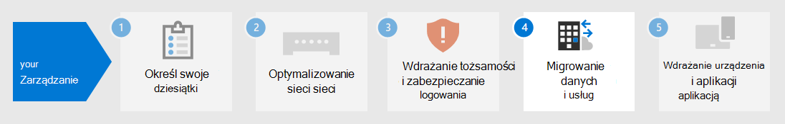

# Krok nr 3. Tożsamość dzierżawy Microsoft 365 przedsiębiorstwa

Dzierżawa Microsoft 365 obejmuje dzierżawę usługi Azure Active Directory (Azure AD) do zarządzania tożsamościami i uwierzytelnianiem dla logowania. Poprawne skonfigurowanie infrastruktury tożsamości jest niezbędne do zarządzania Microsoft 365 dostępu użytkowników i uprawnień dla organizacji.

## Tylko w chmurze a w środowiskach hybrydowych

Oto dwa typy modeli tożsamości oraz ich najlepsze dopasowanie i zalety.

| Model | Opis | Jak Microsoft 365 uwierzytelnia poświadczenia użytkownika | Najlepsze dla | Największa korzyść |
|:-------|:-----|:-----|:-----|:-----|
| Tylko w chmurze | Konto użytkownika istnieje tylko w dzierżawie usługi Azure AD dla Microsoft 365 dzierżawy usługi. | Dzierżawa usługi Azure AD dla Twojej dzierżawy usługi Microsoft 365 przeprowadza uwierzytelnianie za pomocą konta tożsamości w chmurze. | Organizacje, które nie mają lub nie potrzebują lokalnej usługi Active Directory. | Prosty w obsłudze. Nie są wymagane żadne dodatkowe narzędzia katalogowe ani serwery. |
| Hybrydowe |  Konto użytkownika istnieje w lokalnym programie Usługi domenowe w usłudze Active Directory (AD DS), a kopia jest również w dzierżawie usługi Azure AD dla Twojej Microsoft 365 dzierżawy usługi. Usługa Azure AD Połączenie działa na serwerze lokalnym w celu synchronizowania AD DS zmian w dzierżawie usługi Azure AD. Konto użytkownika w usłudze Azure AD może także zawierać skrótową wersję już AD DS hasła do konta użytkownika. | Dzierżawa usługi Azure AD dla Twojej dzierżawy usługi Microsoft 365 obsługuje proces uwierzytelniania lub przekierowuje użytkownika do innego dostawcy tożsamości. | Organizacje korzystające AD DS lub innego dostawcy tożsamości. | Użytkownicy mogą używać tych samych poświadczeń podczas uzyskiwania dostępu do zasobów lokalnych lub opartych na chmurze. |
||||||

Oto podstawowe składniki tożsamości tylko w chmurze.

Na poniższej ilustracji użytkownicy lokalni i zdalni logują się przy użyciu kont w dzierżawie usługi Azure AD Microsoft 365 dzierżawy.

Oto podstawowe składniki tożsamości hybrydowej.

Na poniższej ilustracji użytkownicy lokalni i zdalni logują się do swojej dzierżawy usługi Microsoft 365 za pomocą kont w dzierżawie usługi Azure AD, które zostały skopiowane z ich lokalnych kont AD DS.

## Synchronizowanie lokalnego AD DS

W zależności od potrzeb biznesowych i wymagań technicznych hybrydowy model tożsamości i synchronizacja katalogów są najpopularniejszym wyborem dla klientów korporacyjnych, którzy przyjmą Microsoft 365. Synchronizacja katalogów umożliwia zarządzanie tożsamościami w usłudze AD DS, AD DS wszystkie aktualizacje kont użytkowników, grup i kontaktów są synchronizowane z dzierżawą usługi Azure AD Dzierżawy usługi Microsoft 365 dzierżawy usługi.

> [!NOTE]
> Podczas AD DS użytkowników są synchronizowane po raz pierwszy, nie są one automatycznie przypisywane do nich licencję usługi Microsoft 365 i nie mogą uzyskać dostępu do Microsoft 365 usług, takich jak poczta e-mail. Musisz najpierw przypisać im lokalizację użytkowania. Następnie przypisz do tych kont użytkowników licencję, indywidualnie lub dynamicznie za pośrednictwem członkostwa w grupie.

Oto dwa typy uwierzytelniania podczas korzystania z modelu tożsamości hybrydowej.

| Typ uwierzytelniania | Opis |
|:-------|:-----|
| Uwierzytelnianie zarządzane | Usługa Azure AD obsługuje proces uwierzytelniania za pomocą lokalnie zapisanej wersji skrótu hasła lub wysyła poświadczenia do lokalnego agenta oprogramowania w celu uwierzytelnienia ich przez lokalnego AD DS.      Istnieją dwa typy uwierzytelniania zarządzanego: synchronizacja skrótów haseł (PHS) i uwierzytelnianie pass-through (PTA). Za pomocą phs usługa Azure AD wykonuje samo uwierzytelnianie. W przypadku usługi PTA usługa Azure AD AD DS przeprowadzić uwierzytelnianie. |
| Uwierzytelnianie federowane | Usługa Azure AD przekierowuje klienta żądające uwierzytelnienia do innego dostawcy tożsamości. |
|  |  |

Aby [dowiedzieć się więcej, zobacz Wybieranie odpowiedniej metody](/azure/active-directory/hybrid/choose-ad-authn) uwierzytelniania.

## Wymuszanie silnych logowania

Aby zwiększyć bezpieczeństwo logowania użytkowników, użyj funkcji i możliwości z poniższej tabeli.

| Funkcja | Opis | Więcej informacji | Wymagania dotyczące licencjonowania |
|:-------|:-----|:-----|:-----|:-----|
| Windows Hello dla firm | Zastępuje hasła silne uwierzytelnianie dwuskładnikowe podczas logowania się na Windows urządzeniu. Dwa czynniki to nowy typ poświadczeń użytkownika powiązany z urządzeniem i biometryczny lub numer PIN. | [Omówienie Windows Hello dla firm](/windows/security/identity-protection/hello-for-business/hello-overview) | Microsoft 365 E3 lub E5 |
| Ochrona hasłem w usłudze Azure AD | Wykrywa i blokuje znane słabe hasła i ich warianty, a także może blokować dodatkowe słabe terminy specyficzne dla Twojej organizacji. | [Konfigurowanie ochrony hasłem usługi Azure AD](/azure/active-directory/authentication/concept-password-ban-bad) | Microsoft 365 E3 lub E5 |
| Korzystanie z uwierzytelniania wieloskładnikowego | Uwierzytelniania wieloskładnikowego wymaga, aby logowanie użytkownika podlegało innej weryfikacji niż hasło do konta użytkownika, na przykład weryfikacji przy użyciu aplikacji na smartfonie lub wiadomości SMS wysyłanej na smartfon. Zobacz [ten klip wideo](https://support.microsoft.com/office/set-up-multi-factor-authentication-in-microsoft-365-business-a32541df-079c-420d-9395-9d59354f7225) , aby uzyskać instrukcje dotyczące sposobu skonfigurowania uwierzytelniania wieloskładnikowego. | [Uwierzytelniania wieloskładnikowego Microsoft 365 przedsiębiorstwa](../enterprise/microsoft-365-secure-sign-in.md#mfa) | Microsoft 365 E3 lub E5 |
| Konfiguracje tożsamości i dostępu do urządzeń | Ustawienia i zasady, które składają się z zalecanych funkcji wymagań wstępnych i ich ustawień w połączeniu z zasadami dostępu warunkowego, usługi Intune i usługi Azure AD Identity Protection, które określają, czy dane żądanie dostępu powinno zostać udzielone i na jakich warunkach.  | [Konfiguracje tożsamości i dostępu do urządzeń](../security/office-365-security/microsoft-365-policies-configurations.md) | Microsoft 365 E3 lub E5 |
| Azure AD Identity Protection | Ochrona przed naruszeniami zabezpieczeń poświadczeń w sytuacji, gdy atakujący określa nazwę konta użytkownika i hasło w celu uzyskania dostępu do usług i danych w chmurze organizacji. | [Azure AD Identity Protection](/azure/active-directory/active-directory-identityprotection) | Microsoft 365 E5 lub Microsoft 365 E3 za pomocą dodatku Identity & Threat Protection |
|  |  |  |

## Wyniki kroku 3

W celu ustalenia tożsamości Microsoft 365 dzierżawy usługi:

- Którego modelu tożsamości użyć.
- Sposób wymuszania silnego dostępu użytkowników i urządzeń.

Oto przykładowa dzierżawa z wyróżnieniami nowych elementów tożsamości hybrydowej.

Na poniższej ilustracji dzierżawa ma:

- Las AD DS, który jest synchronizowany z dzierżawą usługi Azure AD przy użyciu serwera synchronizacji katalogów i usługi Azure AD Połączenie.
- Kopia kont użytkowników AD DS i innych obiektów z lasu AD DS.
- Zestaw zasad dostępu warunkowego wymuszania bezpiecznego logowania użytkownika i dostępu na podstawie konta użytkownika.

## Bieżąca konserwacja tożsamości

Na bieżąco może być konieczne:

- Dodawanie lub modyfikowanie kont i grup użytkowników. W przypadku tożsamości opartej tylko na chmurze możesz utrzymywać użytkowników i grupy w chmurze za pomocą narzędzi usługi Azure AD, takich centrum administracyjne platformy Microsoft 365 lub PowerShell. W przypadku tożsamości hybrydowej lokalni użytkownicy i grupy są utrzymywani za pomocą AD DS narzędzi.
- Dodaj lub zmodyfikuj konfigurację tożsamości i dostępu do urządzenia, aby wymusić wymagania dotyczące zabezpieczeń logowania.

## Następny krok

Kontynuuj [migrację,](tenant-management-migration.md) aby przeprowadzić migrację lokalnych serwerów Office i ich danych do Microsoft 365.