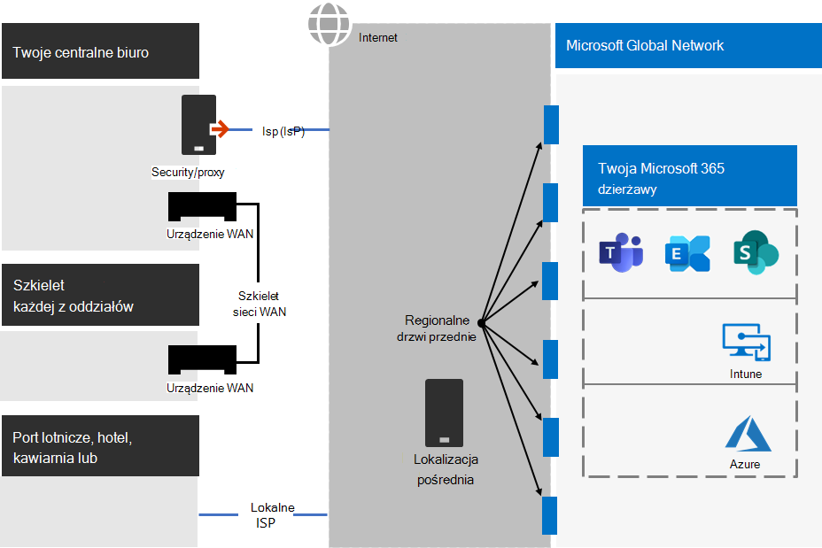

# Krok nr 2. Optymalna sieć dla Twojej Microsoft 365 dla dzierżaw w przedsiębiorstwie

Microsoft 365 przedsiębiorstwa obejmują aplikacje zwiększające produktywność w chmurze, takie jak Teams, Exchange Online i Microsoft Intune, oraz wiele usług tożsamości i zabezpieczeń firmy Microsoft Azure. Wszystkie te usługi w chmurze opierają się na zabezpieczeniach, wydajności i niezawodności połączeń z urządzeń klienckich w Twojej sieci lokalnej lub dowolnej lokalizacji w Internecie. 

Aby zoptymalizować dostęp sieciowy dla dzierżawy, musisz:

- Zoptymalizuj ścieżkę między użytkownikami lokalnymi a lokalizacją najbliższą globalnej sieci firmy Microsoft.
- Optymalizuj dostęp do globalnej sieci firmy Microsoft dla użytkowników zdalnych korzystających z rozwiązania VPN do dostępu zdalnego.
- Za pomocą Szczegółowe informacje sieci można zaprojektować obwód sieci dla lokalizacji biurowych.
- Optymalizuj dostęp do określonych zasobów hostowanych SharePoint witryn internetowych za pomocą Office 365 CDN.
- Skonfiguruj serwery proxy i urządzenia brzegowe sieci, aby pominąć przetwarzanie danych na Microsoft 365 zaufany ruch za pomocą listy punktów końcowych i zautomatyzować aktualizowanie listy w związku z zmianami.

## Enterprise pracowników lokalnych

W przypadku sieci przedsiębiorstw należy zoptymalizować środowisko użytkownika końcowego, włączając o najwyższej wydajności dostęp do sieci między klientami a najbliższymi Microsoft 365 końcowymi. Jakość działania użytkownika końcowego jest bezpośrednio związana z wydajnością i szybkością działania aplikacji, z których korzysta użytkownik. Na przykład Microsoft Teams z małych opóźnień, dzięki czemu rozmowy telefoniczne użytkowników, konferencje i współużytkowana współpraca na ekranie są bezpłatne.

Podstawowym celem projektu sieci powinno być zminimalizowanie opóźnień przez skrócenie czasu rundy (RTT, Round-trip time) z urządzeń klienckich do globalnej sieci firmy Microsoft — podstawowej sieci publicznej firmy Microsoft, która łączy wszystkie centra danych firmy Microsoft z małymi opóźnieniami, punktami wejścia aplikacji w chmurze o wysokiej dostępności, które są nazywane drzwiami frontowym, które rozciągają się na cały świat.

Oto przykład tradycyjnej sieci przedsiębiorstwa.

Na poniższej ilustracji oddziały firmy łączą się z oddziałami centralnymi za pośrednictwem urządzeń sieci WAN i sieci szkieletowej sieci WAN. Dostęp do Internetu jest zapewniany za pośrednictwem urządzenia zabezpieczającego lub proxy na krawędzi sieciowej biura centralnego oraz za pośrednictwem usługodawca internetowego (ISP). W Internecie, Microsoft Global Network ma serię front drzwi w regionach na całym świecie. Organizacje mogą również korzystać z lokalizacji pośrednich do dodatkowego przetwarzania pakietów i ochrony ruchu. Dzierżawa dzierżawy Microsoft 365 znajduje się w sieci globalnej firmy Microsoft.

Problemy z tą konfiguracją usług Microsoft 365 w chmurze są takie:

- W przypadku użytkowników w oddziałach firmy ruch jest wysyłany do nie local front drzwi, co zwiększa opóźnienie.
- Wysyłanie ruchu do lokalizacji pośrednich tworzy pinezki sieciowe, które wykonują zduplikowane przetwarzanie pakietów dla zaufanego ruchu, zwiększając opóźnienia.
- Urządzenia brzegowe sieci wykonują niepotrzebne i zduplikowane przetwarzanie pakietów dla zaufanego ruchu, zwiększając opóźnienia.

Optymalizowanie Microsoft 365 sieci nie musi być skomplikowane. Najlepszą możliwą wydajność można uzyskać, korzystając z kilku najważniejszych zasad:

- Zidentyfikuj Microsoft 365 sieciowy, który jest zaufanym ruchem przeznaczonym do usług firmy Microsoft w chmurze.
- Zezwalaj na ruch wychodzący z Microsoft 365 sieciowego do Internetu z każdej lokalizacji, w której użytkownicy nawiąż połączenie z Microsoft 365.
- Unikaj spinek sieciowych.
- Zezwalaj Microsoft 365 ruchu na pomijanie serwerów proxy i urządzeń do inspekcji pakietów.

Wdrożenie tych zasad umożliwia zoptymalizowanie sieci przedsiębiorstwa pod kątem Microsoft 365.

Na poniższej ilustracji oddziały oddziałów mają własne połączenie internetowe za pośrednictwem urządzenia SDWAN (software-defined WAN device), które wysyła zaufany ruch sieci Microsoft 365 do regionalnie najbliższych drzwi frontowych. W centralnym biurze zaufany serwer Microsoft 365 obejścia zabezpieczeń lub urządzenia proxy, a urządzenia pośrednie nie są już używane.

Zoptymalizowana konfiguracja rozwiązuje problemy z opóźnieniami w tradycyjnej sieci przedsiębiorstwa:

- Zaufany Microsoft 365 ruchu pominie szkielet sieci WAN i jest wysyłany do lokalnych drzwi front drzwiowych dla wszystkich biur, co zmniejsza opóźnienie.
- W przypadku zaufanego ruchu i zmniejszenia opóźnień pomijane są Microsoft 365 sieci, które wykonują zduplikowane przetwarzanie pakietów.
- Urządzenia brzegowe sieci, które wykonują niechętne i zduplikowane przetwarzanie pakietów, są pomijane w przypadku Microsoft 365 ruchu, malejących opóźnień.

Aby uzyskać więcej informacji, [zobacz Microsoft 365 przegląd łączności sieciowej](../enterprise/microsoft-365-networking-overview.md).

## Pracownicy zdalni

Jeśli twoi pracownicy zdalni uzyskają dostęp zdalny do sieci organizacji za pomocą tradycyjnego klienta VPN, upewnij się, że klient sieci VPN podzielił wsparcie techniczne. Bez rozdzielania rozdzielania cały ruch w pracy zdalnej jest przesyłany przez połączenie VPN, gdzie musi być przesyłany dalej do urządzeń brzegowych organizacji, przetwarzany, a następnie wysyłany w Internecie. Oto przykład.

Na poniższej ilustracji ruch sieciowy Microsoft 365 przekierowywowy przez Twoją organizację trasę pośrednią, która może być przekierowyowana do frontu sieci Microsoft Global Network daleko od fizycznej lokalizacji klienta VPN. Ta ścieżka pośrednia powoduje dodanie opóźnienia do ruchu sieciowego i zmniejszenie ogólnej wydajności. 

Dzięki rozdzielaniu rozdzielanym możesz skonfigurować klienta SIECI VPN tak, aby określone typy ruchu nie były wysyłane przez połączenie VPN do sieci organizacji.

Aby zoptymalizować dostęp do Microsoft 365 w chmurze, skonfiguruj rozdzielanych klientów SIECI VPN w celu wykluczenia ruchu w kategorii Optymalizuj Microsoft 365  punktów końcowych przez połączenie VPN. Aby uzyskać więcej informacji, [Office 365](../enterprise/microsoft-365-network-connectivity-principles.md#new-office-365-endpoint-categories) kategorie punktów końcowych i listy Optymalizowanie punktów końcowych kategorii pod kątem rozdzielania.

Oto wynikowy przepływ ruchu w przypadku rozdzielania rozdzielania, w którym większość ruchu do sieci Microsoft 365 w chmurze pomija połączenie VPN.

Na poniższej ilustracji klient sieci VPN wysyła i odbiera istotne wiadomości Microsoft 365 sieci w chmurze bezpośrednio przez Internet i do najbliższych frontoń do globalnej sieci firmy Microsoft.

Aby uzyskać więcej informacji i wskazówki, zobacz [Optymalizowanie Office 365 sieci zdalnej](../enterprise/microsoft-365-vpn-split-tunnel.md) dla użytkowników zdalnych korzystających z rozdzielania sieci VPN.

## Korzystanie z Szczegółowe informacje sieci (wersja zapoznawcza)

Szczegółowe informacje o sieci to metryki wydajności zbierane Microsoft 365 dzierżawy sieci, które ułatwiają projektowanie obwodów sieci dla lokalizacji biur. Każda informacja zawiera szczegółowe informacje na żywo dotyczące charakterystyk wydajności określonego problemu dla każdej lokalizacji geograficznej, w której użytkownicy lokalni mają dostęp do dzierżawy.

Istnieją dwa szczegółowe informacje o sieci na poziomie dzierżawy, które mogą być widoczne dla dzierżawy:

- [Exchange przykładowych połączeń, na które wpływają problemy z łącznością](../enterprise/office-365-network-mac-perf-insights.md#exchange-sampled-connections-affected-by-connectivity-issues)
- [SharePoint przykładowych połączeń, na które wpływają problemy z łącznością](../enterprise/office-365-network-mac-perf-insights.md#sharepoint-sampled-connections-affected-by-connectivity-issues)

Oto szczegółowe informacje o sieci dla każdej lokalizacji biura:

- [Backhauled network egress](../enterprise/office-365-network-mac-perf-insights.md#backhauled-network-egress)
- [Wykryto lepszą wydajność dla klientów w pobliżu](../enterprise/office-365-network-mac-perf-insights.md#better-performance-detected-for-customers-near-you)
- [Korzystanie z nieocenimowej Exchange Online frontowej serwisowej](../enterprise/office-365-network-mac-perf-insights.md#use-of-a-non-optimal-exchange-online-service-front-door)
- [Korzystanie z nieocenimowej SharePoint serwisowej online z przodu](../enterprise/office-365-network-mac-perf-insights.md#use-of-a-non-optimal-sharepoint-online-service-front-door)
- [Niska szybkość pobierania z SharePoint front door](../enterprise/office-365-network-mac-perf-insights.md#low-download-speed-from-sharepoint-front-door)
- [Optymalny ruch wychodzący do sieci dla użytkowników w Chinach](../enterprise/office-365-network-mac-perf-insights.md#china-user-optimal-network-egress)

> [!IMPORTANT]
> Szczegółowe informacje o sieci, zalecenia dotyczące wydajności i oceny w centrum Administracja Microsoft 365 są obecnie w stanie podglądu. Jest ona dostępna tylko Microsoft 365 dzierżaw, które zostały zarejestrowane w programie podglądu funkcji.

Aby uzyskać więcej informacji, [zobacz Microsoft 365 Network Szczegółowe informacje](../enterprise/office-365-network-mac-perf-insights.md).

## SharePoint wydajności dzięki Office 365 CDN

Chmurowa Content Delivery Network (CDN) pozwala skrócić czas ładowania, zaoszczędzić przepustowość i przyspieszyć czas reakcji. Plik CDN zwiększa wydajność, buforowanie elementów statycznych, takich jak pliki graficzne lub wideo, bliżej przeglądarek, które ich żądają, co pomaga przyspieszyć pobieranie i zmniejszyć opóźnienie. Za pomocą wbudowanego programu Office 365 Content Delivery Network (CDN) zawartego w programach SharePoint Microsoft 365 E3 i E5 można hostować statyczne zasoby w celu zapewnienia lepszej wydajności dla stron SharePoint.

Ten Office 365 CDN składa się z wielu sieci CDN, które umożliwiają hostowanie statycznych zasobów w wielu lokalizacjach lub pochodzeniech i obsługują je z globalnych sieci o wysokiej szybkości. W zależności od rodzaju zawartości, którą chcesz hostować w Office 365 CDN, możesz dodać pochodzenie **publiczne, pochodzenie** prywatne lub oba te źródła.

Po wdrożeniu i skonfigurowaniu zasoby są Office 365 CDN z pochodzenia publicznego i prywatnego oraz są udostępniane w celu szybkiego dostępu użytkownikom zlokalizowanym w Internecie.

Aby uzyskać więcej informacji, zobacz [Używanie Office 365 CDN z SharePoint Online](../enterprise/use-microsoft-365-cdn-with-spo.md).

## Zautomatyzowana lista punktów końcowych

Aby klienci lokalni, urządzenia brzegowe i usługi analizy pakietów w chmurze pominąły przetwarzanie zaufanego ruchu Microsoft 365, musisz je skonfigurować z zestawem punktów końcowych (zakresów adresów IP i nazw DNS) odpowiadających usługom firmy Microsoft 365. Te punkty końcowe można ręcznie skonfigurować w zaporach i innych urządzeniach zabezpieczeń brzegowych, pliki PAC dla komputerów klienckich z pominięciem serwerów proxy lub urządzeń SD-WAN w oddziałach oddziału. Jednak punkty końcowe zmieniają się z czasem, co wymaga ciągłej ręcznej konserwacji list punktów końcowych w tych lokalizacjach.

Aby zautomatyzować wyświetlanie i zarządzanie zmianami na Microsoft 365 końcowych w plikach PAC klienta i urządzeniach sieciowych, użyj usługi sieci Web opartej na adresie IP Office 365 i usłudze sieci Web opartej na adresie [URL](../enterprise/microsoft-365-ip-web-service.md). Ta usługa ułatwia identyfikowanie i odróżnianie Microsoft 365 sieciowego, co ułatwia ocenę, skonfigurowanie i pozostawanie na stanie bieżących zmian.

Za pomocą programu PowerShell, python lub innych języków możesz z czasem określać zmiany w punktach końcowych i konfigurować pliki PAC i urządzenia sieciowe brzegowe.

Podstawowy proces jest:

1. Użyj usługi Office 365 i adresu IP sieci Web oraz wybranego mechanizmu konfiguracji do konfigurowania plików PAC i urządzeń sieciowych przy użyciu bieżącego zestawu Microsoft 365 końcowych.
2. Uruchom dzienny cykliczny, aby sprawdzić zmiany w punktach końcowych lub użyć metody powiadomień.
3. Po wykryciu zmian ponownie generuj i ponownie redystrybuj plik PAC dla komputerów klienckich i wprowadzaj zmiany na urządzeniach sieciowych.

Aby uzyskać więcej informacji, zobacz [Office 365 adres IP i usługa sieci Web adresu URL](../enterprise/microsoft-365-ip-web-service.md).

## Wyniki kroku 2

Dla Twojej Microsoft 365 o optymalnej sieci ustalisz:

- Jak zoptymalizować wydajność sieci dla użytkowników lokalnych przez dodanie połączeń internetowych do wszystkich oddziałów firmy i wyeliminowanie spinek sieciowych.
- Jak zaimplementować zautomatyzowaną listę zaufanych punktów końcowych dla plików PAC opartych na klientach oraz urządzeń i usług sieciowych, w tym bieżących aktualizacji (najbardziej odpowiedniego dla sieci przedsiębiorstw).
- Jak obsługiwać dostęp pracowników zdalnych do zasobów lokalnych.
- Jak używać sieci Szczegółowe informacje
- Jak wdrożyć Office 365 CDN.

Oto przykład organizacji przedsiębiorstwa i jej dzierżawy z optymalną siecią.

[Zobacz większą wersję tego obrazu](https://github.com/MicrosoftDocs/microsoft-365-docs/raw/public/microsoft-365/media/tenant-management-overview/tenant-management-tenant-build-step2.png)

Na poniższej ilustracji dzierżawa tej organizacji przedsiębiorstwa ma:

- Lokalny dostęp do Internetu dla każdego oddziału firmy za pomocą urządzenia SDWAN, które przesyła zaufany Microsoft 365 ruchu do lokalnych drzwi frontu.
- Bez spinek sieci.
- Zabezpieczenia centrali centralnej oraz urządzenia brzegowe serwerów proxy, które Microsoft 365 zaufany ruch do lokalnych drzwi frontu.

## Bieżąca konserwacja w celu zapewnienia optymalnej sieci

Na bieżąco może być konieczne:

- Zaktualizuj urządzenia brzegowe i wdrażaj pliki PAC pod celu zmiany w punktach końcowych lub upewnij się, że zautomatyzowany proces działa poprawnie.
- Zarządzaj swoimi zasobami w Office 365 CDN.
- Zaktualizuj konfigurację rozdzielania rozdzielania w klientach VPN w celu zmiany punktów końcowych.

## Następny krok

Kontynuuj korzystanie [z tożsamości](tenant-management-identity.md) , aby synchronizować lokalne konta i grupy oraz wymuszać bezpieczne logowania użytkowników.
