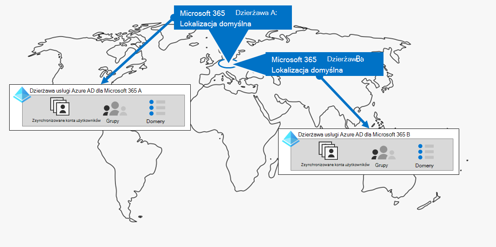
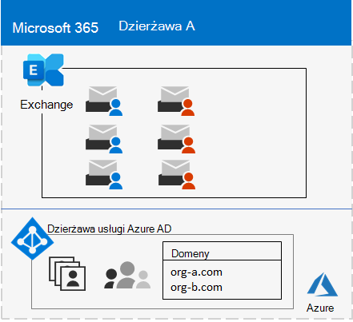

# Krok nr 1. Twoja Microsoft 365 dla dzierżaw w przedsiębiorstwie

Jedną z pierwszych decyzji dotyczących dzierżawy jest to, ilu ich jest. Każda Microsoft 365 jest odrębna, unikatowa i odrębna od wszystkich Microsoft 365 dzierżaw. Odpowiadająca jej dzierżawa usługi Azure AD jest również odrębna, unikatowa i odrębna od wszystkich Microsoft 365 dzierżaw.

## Jedna dzierżawa
Posiadanie jednej dzierżawy upraszcza wiele aspektów korzystania z usługi Microsoft 365. Jedna dzierżawa oznacza pojedynczą dzierżawę usługi Azure AD z pojedynczym zestawem kont, grup i zasad. Uprawnienia i udostępnianie zasobów w organizacji można wykonać za pośrednictwem tego centralnego dostawcy tożsamości.

Jedna dzierżawa oferuje użytkownikom najbardziej rozbudowane i uproszczone funkcje współpracy oraz zwiększające produktywność.

Oto przykład przedstawiający domyślną lokalizację i dzierżawę usługi Azure AD dzierżawy Microsoft 365 dzierżawy.

## Wiele dzierżaw

Istnieje wiele powodów, dla których Twoja organizacja może mieć wiele dzierżaw:

- Izolacji administracyjnej
- Scentralizowany system IT
- Decyzje historyczne
- Fuzje, pozyskiwanie lub zdobywanie danych
- Przejrzyste wyeksregowanie marki dla organizacji współmianingowych
- Dzierżawy przedprodukcji, testowania lub piaskownicy

Oto przykład organizacji, która ma dwie dzierżawy (dzierżawę A i dzierżawę B) w tym samym domyślnym geolokalizacji centrum danych. Każda dzierżawa jest osobną dzierżawą usługi Azure AD.

Jeśli masz wiele dzierżaw, istnieją ograniczenia i dodatkowe zagadnienia związane z zarządzaniem nimi i świadczeniem usług użytkownikom.

### Współpraca w ramach dzierżawy

Jeśli chcesz, aby użytkownicy współpracowali wydajniej w różnych dzierżawach usługi Microsoft 365 w bezpieczny sposób, opcje współpracy w ramach kilku dzierżaw obejmują korzystanie z centralnej lokalizacji dla plików i konwersacji, udostępnianie kalendarzy, korzystanie z wiadomości błyskawicznych, połączeń audio/wideo w celu komunikacji oraz zabezpieczanie dostępu do zasobów i aplikacji.

Aby uzyskać więcej informacji, Microsoft 365 [współpracę w ramach wielu dzierżaw](../enterprise/microsoft-365-inter-tenant-collaboration.md).

### Migracja skrzynek pocztowych między dzierżawami (wersja Preview)

Przed rozpoczęciem migracji skrzynek pocztowych między dzierżawami (w wersji Preview) podczas przenoszenia skrzynek pocztowych usługi Exchange Online między dzierżawami należy całkowicie usunąć skrzynkę pocztową użytkownika z bieżącej dzierżawy (dzierżawy źródłowej) do dzierżawy lokalnej, Exchange Online następnie do nowej dzierżawy (dzierżawy docelowej). Dzięki nowej funkcji migracji skrzynek pocztowych między dzierżawami administratorzy dzierżawy zarówno w dzierżawie źródłowej, jak i docelowej mogą przenosić skrzynki pocztowe między dzierżawami z minimalnymi zależnościami infrastruktury w ich systemach lokalnych. W ten sposób usuniesz konieczność przenoszenia się ze skrzynek pocztowych i do skrzynek pocztowych.

Oto dwie przykładowe dzierżawy i ich skrzynki pocztowe przed migracją skrzynek pocztowych między dzierżawami.

Na poniższej ilustracji dwie oddzielne dzierżawy mają własne domeny i zestaw skrzynek Exchange pocztowych.

Oto dzierżawa docelowa (dzierżawa A) po migracji skrzynek pocztowych między dzierżawami.

Na poniższej ilustracji jedna dzierżawa ma zarówno domeny, jak i oba zestawy skrzynek Exchange pocztowych.

Aby uzyskać więcej informacji, zobacz [Migracja skrzynek pocztowych między dzierżawami](../enterprise/cross-tenant-mailbox-migration.md).

### Migracje z dzierżawy do dzierżawy

Istnieje kilka metod architektury dla fuzji, nabyć, klientów i innych scenariuszy, które mogą doprowadzić do przeprowadzenia migracji istniejącej Microsoft 365 dzierżawy do nowej dzierżawy. 

Aby uzyskać szczegółowe wskazówki, [Microsoft 365 migrację z dzierżawy do dzierżawy](../enterprise/microsoft-365-tenant-to-tenant-migrations.md).

## Multi-Geo dla dzierżawy

Za pomocą usługi Microsoft 365 Multi-Geo możesz zapewniać i przechowywać dane w spoczynku w innych lokalizacjach geolokalizacji centrum danych wybranych w celu spełnienia wymagań dotyczących przechowywania danych, a jednocześnie odblokować globalne udostępnianie pracownikom nowoczesnego środowiska zwiększającego produktywność.

W środowisku z wieloma lokalizacjami geograficznymi dzierżawa usługi Microsoft 365 składa się z domyślnej lub centralnej lokalizacji, w której pierwotnie utworzono subskrypcję usługi Microsoft 365 oraz jedną lub więcej lokalizacji satelitarnych. W dzierżawie wielowymiarowej informacje o lokalizacjach geograficznych, grupach i informacjach o użytkownikach są mastered w globalnej dzierżawie usługi Azure AD. Ponieważ informacje o dzierżawie są centralnie opanujone i synchronizowane z każdą lokalizacją geograficzną, funkcje współpracy obejmujące wszystkie osoby z Twojej firmy są udostępniane w różnych lokalizacjach.

Oto przykład organizacji, która ma swoją domyślną lokalizację w Europie i lokalizację satelitarną w Ameryce Północnej. Obie lokalizacje współużytkuje tę samą globalną dzierżawę usługi Azure AD dla jednej Microsoft 365 dzierżawy.

Aby uzyskać więcej informacji, zobacz [Microsoft 365 Multi-Geo](../enterprise/microsoft-365-multi-geo.md).

## Przenoszenie podstawowych danych do nowego geolokalizacji centrum danych

Firma Microsoft nadal otwiera nowe lokalizacje geograficzne centrum danych dla Microsoft 365 danych. Te nowe lokalizacje geograficzne centrum danych dodają wydajność i oblicz zasoby, aby wspierać nasze bieżące zapotrzebowanie klientów i wzrost użycia. Ponadto nowe lokalizacje geolokalizacji centrum danych oferują lokalizację przechowywania danych w lokalizacji geograficznej na podstawowe dane klientów.

Otwarcie nowego geolokalizacji centrum danych nie ma wpływu na Ciebie i Twoje podstawowe dane przechowywane w istniejącej już lokalizacji geograficznej centrum danych, ale firma Microsoft umożliwia żądanie wczesnej migracji podstawowych danych klienta Twojej organizacji w spoczynku do nowego geolokalizacji centrum danych.

Oto przykład, w którym dzierżawa Microsoft 365 została przeniesiona z geolokalizacji centrum danych Unii Europejskiej do lokalizacji na terenie Zjednoczonego Królestwa.

Aby uzyskać więcej informacji, zobacz [Przenoszenie podstawowych danych do nowych Microsoft 365 lokalizacji geograficznych centrum danych](../enterprise/moving-data-to-new-datacenter-geos.md).

## Produkty i licencje dla dzierżawy

Dzierżawa Microsoft 365 zostanie utworzona podczas zakupu pierwszego produktu, na przykład Microsoft 365 E3. Wraz z produktem są również licencje, które są obciążone miesięczną lub roczną opłatą. Następnie administrator przypisuje dostępną licencję z jednego z produktów do konta użytkownika bezpośrednio lub za pośrednictwem członkostwa w grupie. W zależności od potrzeb biznesowych Twojej organizacji możesz mieć zestaw produktów z własną pulą licencji. 

Określanie zestawu produktów i liczby licencji dla każdego z nich wymaga planowania:

- Upewnij się, że masz wystarczającą ilość licencji dla kont użytkowników, które wymagają zaawansowanych funkcji.
- Zapobiegaj utracie licencji lub zbyt wielu nieprzypisanych licencji w zależności od zmian personelu w organizacji.

## Wyniki kroku 1

W przypadku Microsoft 365 dla dzierżaw w przedsiębiorstwie ustalisz:

- Ilu dzierżaw potrzebujesz.
- Dla każdej dzierżawy, które produkty i licencje muszą zostać kupione.
- Czy dzierżawa musi mieć wiele lokalizacji geograficznych, aby spełnić wymagania dotyczące przechowywania danych.
- Czy musisz skonfigurować współpracę w ramach dzierżawy?
- Czy konieczne jest przeprowadzenie migracji jednej dzierżawy do innej dzierżawy?
- Czy musisz przenieść podstawowe dane z jednego geolokalizacji centrum danych do nowego.

Oto przykład nowej dzierżawy.

Na poniższej ilustracji dzierżawa ma:

- Domyślna lokalizacja odpowiadająca lokalizacji geograficznej Microsoft 365 danych.
- Zestaw produktów i licencji.
- Zestaw aplikacji biurowych w chmurze, z których niektóre są specyficzne dla produktów.
- Dzierżawa usługi Azure AD zawierająca konta administratora globalnego i początkową nazwę domeny DNS.

W kolejnych krokach tego rozwiązania będziemy tworzyć tę liczbę.

## Bieżąca konserwacja dzierżaw

Na bieżąco może być konieczne:

- Dodaj nową dzierżawę.
- Dodaj nowe produkty do dzierżawy z początkową liczbą licencji.
- Zmień zestaw licencji dla produktu w dzierżawie, aby dostosować go do zmieniających się wymagań personelu.
- Przenieś podstawowe dane z dzierżawy do nowej lokalizacji geograficznej centrum danych.
- Dodaj multi-Geo na potrzeby wymagań dotyczących przechowywania danych.
- Konfigurowanie współpracy w ramach dzierżawy.

## Następny krok

Kontynuuj korzystanie [z sieci,](tenant-management-networking.md) aby zapewniać pracownikom optymalną sieć do Microsoft 365 w chmurze.
