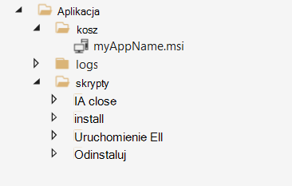
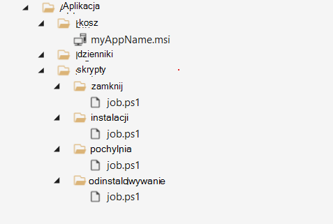
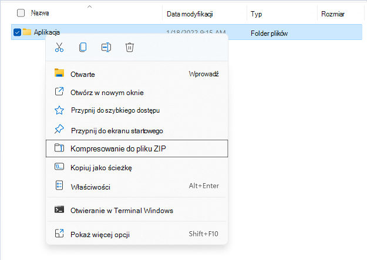

# <a name="build-a-package"></a>Tworzenie pakietu
Pakiet to plik pakietu .zip zawierający skrypty binarne i skrypty testowe aplikacji, co jest wymaganiem wstępnym dla używania bazy testowej. Ten przewodnik Szybki start poprowadzi Cię przez proces tworzenia pierwszego pakietu, za pomocą którego możesz przeprowadzać testowanie od początku w aplikacji. 
  
*    *Test **typu "Out-of-Box" (OOB)** wykonuje instalację, uruchamianie, zamykanie i odinstalowywanie aplikacji. Po zakończeniu instalacji procedura uruchamiania i zamykania jest powtarzana 30 razy, zanim zostanie uruchomione pojedyncze odinstalowanie. Test OOB udostępnia ustowalizowany telemetrię dla Twojego pakietu, która umożliwia porównanie Windows kompilacji.*  
    
Opcjonalnie możesz pobrać nasz [przykładowy pakiet referencyjny](https://aka.ms/testbase-sample-package) i zacząć od. 

## <a name="create-a-folder-structure"></a>Tworzenie struktury folderów 

Na komputerze lokalnym utwórz strukturę folderów w następujący sposób:<br> 


Są one używane:
* **App\bin**: zapisz binaria aplikacji i zależności.<br> 
* **App\scripts**: zapisz skrypty, aby zainstalować, uruchomić, zamknąć i odinstalować aplikację.<br> 
* **App\logs**: skrypty powinny wyprowadzać dzienniki do tego folderu, a następnie możesz pobierać i analizować dzienniki po zakończeniu testowania.<br> 

## <a name="copy-binary-files"></a>Kopiowanie plików binarnych
Skopiuj pliki instalacyjne aplikacji do **folderu Aplikacja\bin**. Jeśli aplikacja ma zależności, należy je najpierw zainstalować. Skopiuj też pliki instalacji zależności do folderu **App\bin**.<br> 


## <a name="add-powershell-scripts"></a>Dodawanie skryptów programu PowerShell
Aby wykonać test OOB, musisz dodać skrypty programu PowerShell w celu zainstalowania, uruchomienia, zamknięcia i odinstalowania aplikacji.
> [!NOTE]  
> *W przypadku testowania, instalowania, uruchamiania i zamykania skryptów OOB skrypty są wymagane, a odinstalowywanie jest opcjonalne*.
    
Skrypt powinien zostać dodany do folderu w następujący sposób:  


Skrypt zazwyczaj ma następujące zachowania:<br> 
-   **Uruchom polecenia, aby zainstalować/uruchomić/zamknąć/odinstalować aplikację**. Jeśli na przykład aplikacja jest plikiem MSI, uruchom [program msiexec](/windows-server/administration/windows-commands/msiexec) , aby go zainstalować. <br> 
-   **Sprawdź wynik operacji zainstaluj/uruchom/zamknij/odinstaluj**, zwróć zero kodu wyjścia, jeśli oczekiwany wynik jest oczekiwany. Test Base spowoduje oznaczenie uruchomienia skryptu jako awarii, jeśli zwraca niezerowy kod wyjścia.<br> 
-   **Zapisz odpowiednią ilość dzienników** i zapisz odpowiednie dzienniki do użycia w przyszłości.<br> 

Zapoznaj się z poniższymi przykładami. Możesz po prostu skopiować je do swoich plików i odpowiednio wprowadzić zmiany. <br>

**Przykład skryptu instalacji (App\scripts\install\job.ps1)**
```powershell
        push-location $PSScriptRoot
        $exit_code = 0
        $script_name = $myinvocation.mycommand.name
        $log_dir = "$PSScriptRoot\..\..\logs"
        $log_file = "$log_dir\$script_name.log"


        if(-not (test-path -path $log_dir )) {
            new-item -itemtype directory -path $log_dir
        }

        Function log {
           Param ([string]$log_string)
           write-host $log_string
           add-content $log_file -value $log_string
        }

        log("Installing TestBaseM365 Digital Clock")
        push-location "..\..\bin"
        if ([Environment]::Is64BitProcess) {
            $installer_name = "TestBaseM365DigitalClock.msi"
        }
        else {
            $installer_name = "TestBaseM365DigitalClock.msi"
        }
        $arguments = "/i "+$installer_name+" /quiet /L*v "+"$log_dir"+"\atp-client-installation.log"

        $installer = Start-Process msiexec.exe $arguments -wait -passthru
        pop-location

        if ($installer.exitcode -eq 0) {
            log("Installation succesful as $($installer.exitcode)")
        }
        else {
            log("Error: Installation failed as $($installer.exitcode)")
            $exit_code = $installer.exitcode
        }

        log("Installation script finished as $exit_code")
        pop-location
        exit $exit_code
```

**Przykład skryptu uruchamiania (App\scripts\launch\job.ps1)**
```powershell
        push-location $PSScriptRoot
        $exit_code = 0
        $script_name = $myinvocation.mycommand.name
        $log_dir = "$PSScriptRoot\..\..\logs"
        $log_file = "$log_dir\$script_name.log"

        if(-not (test-path -path $log_dir )) {
            new-item -itemtype directory -path $log_dir
        }

        Function log {
           Param ([string]$log_string)
           write-host $log_string
           add-content $log_file -value $log_string
        }

        log("Launch TestBaseM365 Digital Clock")

        $PROCESS_NAME = "DigitalClock"
        $exePath = "C:\Program Files\Test Base M365\DigitalClock\DigitalClock.exe"

        Start-Process -FilePath $exePath

         if (Get-Process -Name $PROCESS_NAME) {
                log("Launch successfully $PROCESS_NAME...") 
                $exit_code = 0
         }
         else {
            log("Not launched $PROCESS_NAME...") 
            $exit_code = 1
         }

        log("Launch script finished as $exit_code")
        pop-location
        exit $exit_code 
```

## <a name="compress-to-zip-file"></a>Kompresowanie do pliku zip
Gdy skrypty i pliki binarne będą przygotowane, przechodzisz do skompresowania folderu do pliku zip. Kliknij prawym przyciskiem myszy folder aplikacji, a następnie wybierz **pozycję Kompresuj do pliku ZIP**.<br>



## <a name="verify-your-package-locally-optional"></a>Zweryfikuj pakiet lokalnie (opcjonalnie)
Po sbudowania pakietu zip możesz przekazać go do konta Test Base. <br>
Jednak najlepszym rozwiązaniem jest uruchomienie testu lokalnie, aby przed przekazaniem upewnić się, że skrypty działają poprawnie. Test lokalny może szybko identyfikować problemy i przyspieszyć proces przekazywania. Aby zweryfikować lokalnie, wykonaj następujące czynności:<br>
1.  Przygotowywanie maszyny wirtualnej<br>
    Zalecamy użycie maszyny wirtualnej do tego lokalnego testu, ponieważ w tym Windows jest obecnie wymagane czyste środowisko maszyny wirtualnej. Tworzenie maszyny wirtualnej Windows na platformie Azure (Szybki start [: Windows](/azure/virtual-machines/windows/quick-create-portal) maszyny wirtualnej) jest łatwe. Można wybrać odpowiednią wersję maszyny wirtualnej Windows (obraz) do testu, na przykład *Windows 10 Pro w wersji 21H2.*<br>

2.  Kopiowanie pakietu do maszyny wirtualnej<br>
    Istnieje wiele sposobów kopiowania pliku pakietu do maszyny wirtualnej. Jeśli używasz maszyny wirtualnej platformy Azure, możesz wybrać:
     -  Kopiowanie pliku bezpośrednio w połączeniu z pulpitem zdalnym. <br>
     -  Korzystanie z funkcji azure file share ([Szybki start: tworzenie pliku platformy Azure i zarządzanie nimi](/azure/storage/files/storage-files-quick-create-use-windows))
    
    Możesz utworzyć konkretny folder dla tego testu i skopiować plik pakietu w tym folderze. np. *C:\TestBase*.<br>
3.  Przetestuj pakiet<br>
    Otwórz Windows PowerShell, przejdź do katalogu zawierającego pakiet, np. cd C:\TestBase i rozpocznij testowanie pakietu:<br>
    a.  Wyodrębnij plik pakietu.
     -  *Expand-Archive -LiteralPath C:\TestBase\App.zip -DestinationPath C:\TestBase*<br>
    
    b.  Uruchom skrypt instalacji.  
     -  *C:\TestBase\App\scripts\install\job.ps1*<br>
    
    c.  W razie potrzeby uruchom ponownie maszyny wirtualnej.<br>
    
    d.  Uruchom skrypt uruchamiania.
     -  *C:\TestBase\App\scripts\install\job.ps1*<br>
    
    e.  Uruchom skrypt zamykania.
     -  *C:\TestBase\App\scripts\close\job.ps1*<br>
    
    f.  Uruchom skrypt odinstalowywania (jeśli go masz).
     -  *C:\TestBase\App\scripts\uninstall\job.ps1*<br>
    
    Po każdym kroku możesz sprawdzić, czy nie występują jakieś problemy w skrypcie. Jeśli wszystkie skrypty działają zgodnie z oczekiwaniami, Twój pakiet jest gotowy do przesłania do Twojego konta Test Base.


## <a name="next-steps"></a>Następne kroki
[Upload pakietu](uploadApplication.md)
 
 
